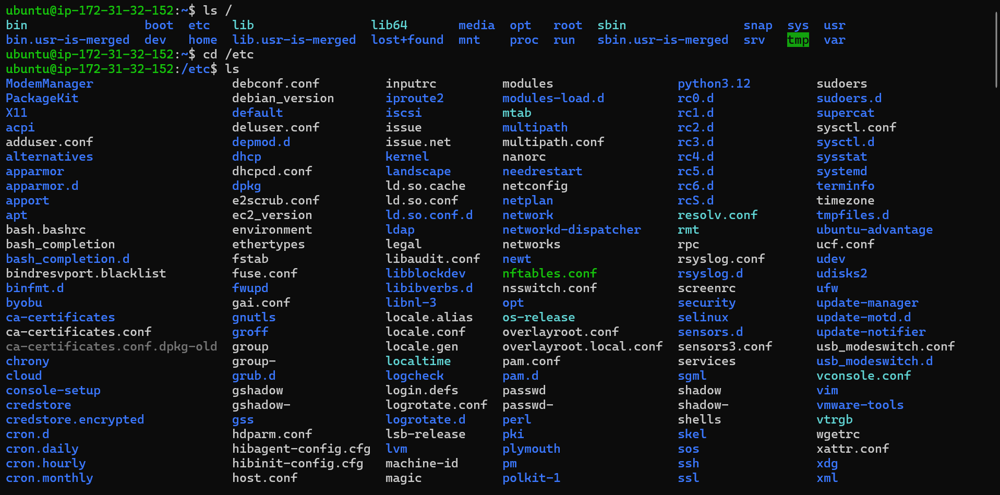
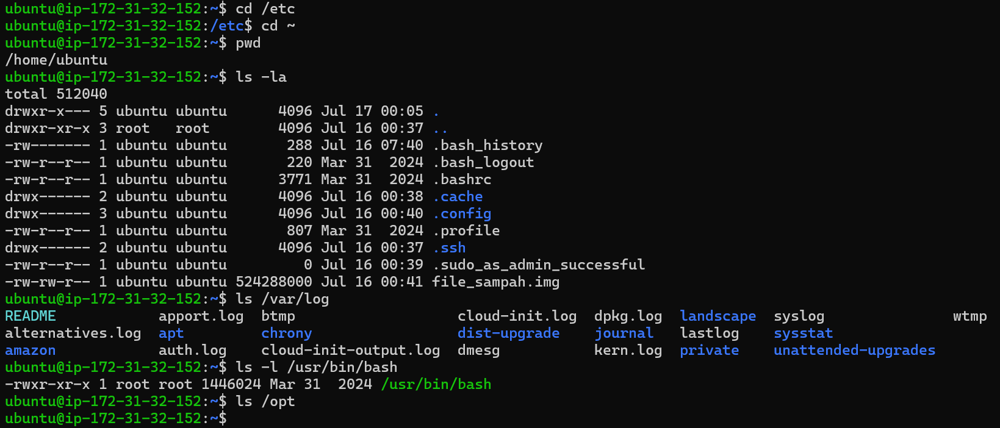
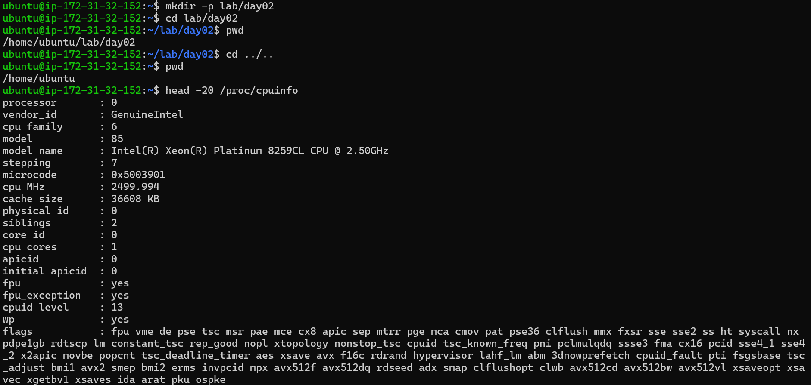
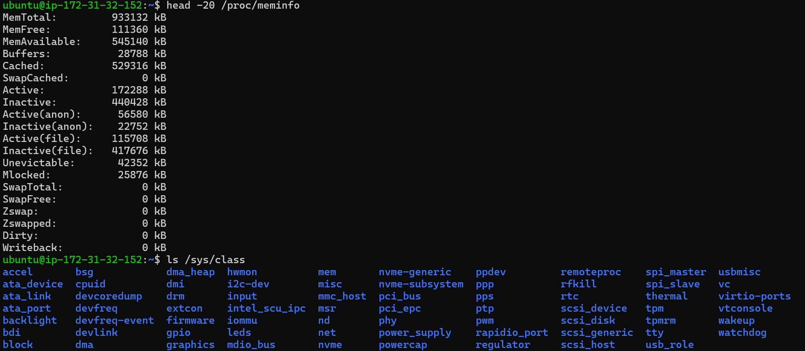

# 🚀 Cloud Engineer Learning Journey

Selamat datang di repository pembelajaran saya untuk menjadi **Cloud Engineer**, **DevOps Engineer**, dan **Cloud Security Engineer**.

Repository ini berisi dokumentasi hasil belajar, hands-on lab, challenge, dan mini project yang saya kerjakan secara bertahap dengan pendekatan praktik langsung menggunakan **AWS EC2** dan **Ubuntu Server**.

---

# 📚 Roadmap

- Phase 01 - Linux Foundation *(In Progress)*
- Phase 02 - Linux Administration
- Phase 03 - Networking Fundamentals
- Phase 04 - AWS Cloud
- Phase 05 - Infrastructure as Code (Terraform)
- Phase 06 - Docker
- Phase 07 - Kubernetes
- Phase 08 - CI/CD
- Phase 09 - Monitoring & Logging
- Phase 10 - DevSecOps

---

# 📁 Phase 01 - Linux Foundation

## 📅 Day 01 - Linux Fundamentals

Pada hari pertama saya mempelajari konsep dasar Linux sebagai fondasi sebelum mempelajari administrasi sistem, cloud computing, dan DevOps.

### Materi

- Operating System
- Linux
- Linux Kernel
- GNU/Linux
- Shell
- Linux Distribution
- CLI vs GUI
- Terminal vs Shell

### Dokumentasi

| Dokumen | Deskripsi |
|---------|-----------|
| hands-on-lab.md | Praktikum dasar Linux |
| challenge-lab.md | Investigasi sistem Linux |
| mini-project.md | Dokumentasi mini project Hari 1 |

### Screenshot

### Skills

- Linux CLI
- Bash
- Ubuntu Server
- AWS EC2
- Linux Architecture
- System Identification

**Status:** ✅ Completed

---

## 📅 Day 02 - Linux Filesystem (Filesystem Hierarchy Standard)

Pada hari kedua saya mempelajari struktur filesystem Linux berdasarkan **Filesystem Hierarchy Standard (FHS)** serta melakukan eksplorasi direktori utama Linux menggunakan AWS EC2 Ubuntu Server.

### Materi

- Filesystem Hierarchy Standard (FHS)
- Root Directory (`/`)
- `/etc`
- `/home`
- `/root`
- `/var`
- `/usr`
- `/opt`
- `/tmp`
- `/boot`
- `/dev`
- `/proc`
- `/sys`
- Absolute Path vs Relative Path
- Virtual File System (VFS)

### Dokumentasi

| Dokumen | Deskripsi |
|---------|-----------|
| hands-on-lab.md | Eksplorasi filesystem Linux |
| challenge-lab.md | Analisis Filesystem Hierarchy Standard |
| mini-project.md | Dokumentasi profesional Linux Filesystem |

### Screenshot

#### Root Directory & `/etc`

#### Home Directory, `/var/log`, `/usr/bin/bash`, `/opt`

#### Directory Navigation & `/proc/cpuinfo`

#### `/proc/meminfo` & `/sys/class`

### Skills

- Linux Filesystem
- Filesystem Hierarchy Standard (FHS)
- Virtual File System (VFS)
- Absolute Path
- Relative Path
- Linux Directory Structure
- Linux Administration Fundamentals

**Status:** ✅ Completed

---

# 🛠️ Environment

| Item | Value |
|------|-------|
| Cloud Provider | AWS |
| Service | EC2 |
| Operating System | Ubuntu Server 24.04.4 LTS |
| Shell | Bash |
| Documentation | Markdown |
| Version Control | Git & GitHub |

---

# 🎯 Learning Goals

- Menguasai administrasi Linux.
- Membangun fondasi Cloud Engineering.
- Mendalami DevOps dan DevSecOps.
- Membangun portofolio teknis yang terdokumentasi dengan baik di GitHub.

---

# 📌 Repository Status

| Phase | Status |
|-------|--------|
| Phase 01 - Linux Foundation | 🚧 In Progress |

---

> *"Learning by Building, Documenting, and Sharing."*