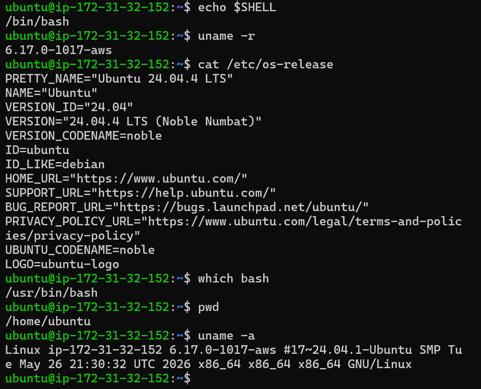

# Hands-on Lab - Hari 1
# Pengenalan Linux

## Tujuan

Melakukan identifikasi dasar terhadap sistem Linux yang digunakan untuk memahami informasi penting mengenai shell, kernel, distribusi Linux, lokasi executable Bash, dan direktori kerja saat ini. Informasi ini merupakan langkah awal yang selalu dilakukan oleh seorang Linux System Administrator atau Cloud Engineer ketika pertama kali mengakses sebuah server.

---

# Lingkungan Praktikum

| Komponen | Nilai |
|----------|--------|
| Platform | Amazon Web Services (AWS) EC2 |
| Sistem Operasi | Ubuntu Server 24.04.4 LTS |
| Kernel | Linux 6.17.0-1017-aws |
| User | ubuntu |
| Shell | Bash |

---

# 1. Menampilkan Shell

### Command

```bash
echo $SHELL
```

### Output

```text
/bin/bash
```

### Penjelasan

Perintah `echo $SHELL` digunakan untuk menampilkan shell login yang sedang digunakan oleh pengguna.

Output menunjukkan bahwa shell yang digunakan adalah **Bash (Bourne Again SHell)**.

Bash merupakan shell default pada sebagian besar distribusi Linux dan menjadi standar di banyak lingkungan server karena stabil, ringan, mendukung scripting, serta kompatibel dengan berbagai tools seperti Git, Docker, Kubernetes, Terraform, dan AWS CLI.

### Relevansi Operasional

Informasi mengenai shell penting diketahui karena setiap shell memiliki sintaks, fitur, dan perilaku yang dapat berbeda. Saat membuat script otomatisasi atau melakukan troubleshooting, engineer perlu memastikan shell yang digunakan sesuai dengan dokumentasi atau kebutuhan aplikasi.

---

# 2. Menampilkan Versi Kernel

### Command

```bash
uname -r
```

### Output

```text
6.17.0-1017-aws
```

### Penjelasan

Perintah `uname -r` digunakan untuk menampilkan versi Linux Kernel yang sedang dijalankan.

Output menunjukkan kernel:

```
6.17.0-1017-aws
```

Suffix **-aws** menunjukkan bahwa sistem menggunakan varian kernel Ubuntu yang dikonfigurasi dan dioptimalkan oleh Canonical untuk berjalan pada lingkungan Amazon Web Services (AWS).

### Relevansi Operasional

Mengetahui versi kernel sangat penting ketika:

- melakukan troubleshooting,
- memastikan kompatibilitas software,
- melakukan update keamanan,
- menganalisis bug,
- maupun saat membuka tiket support kepada vendor.

---

# 3. Menampilkan Informasi Sistem

### Command

```bash
uname -a
```

### Output

```text
Linux ip-172-31-32-152 6.17.0-1017-aws #17~24.04.1-Ubuntu SMP Tue May 26 21:30:32 UTC 2026 x86_64 x86_64 x86_64 GNU/Linux
```

### Penjelasan

Perintah `uname -a` menampilkan informasi sistem secara lengkap, meliputi:

- Nama Kernel
- Hostname
- Versi Kernel
- Build Kernel
- Arsitektur CPU
- Jenis Sistem Operasi

### Relevansi Operasional

Perintah ini sering digunakan oleh administrator sistem untuk:

- melakukan inventarisasi server,
- memastikan arsitektur CPU sebelum instalasi software,
- memverifikasi versi kernel,
- membantu proses troubleshooting,
- dan melengkapi informasi ketika melaporkan masalah kepada tim support.

---

# 4. Menampilkan Informasi Distribution

### Command

```bash
cat /etc/os-release
```

### Output

```text
PRETTY_NAME="Ubuntu 24.04.4 LTS"
VERSION_ID="24.04"
VERSION="24.04.4 LTS (Noble Numbat)"
```

### Penjelasan

Perintah ini membaca file `/etc/os-release` yang berisi identitas sistem operasi Linux.

Hasil menunjukkan bahwa server menggunakan **Ubuntu Server 24.04.4 LTS (Long Term Support)** dengan codename **Noble Numbat**.

Versi LTS dipilih karena mendapatkan pembaruan keamanan dalam jangka panjang sehingga lebih cocok digunakan pada lingkungan server produksi.

### Relevansi Operasional

Mengetahui distribution Linux membantu engineer menentukan:

- package manager yang digunakan,
- lokasi konfigurasi,
- dokumentasi resmi yang sesuai,
- serta kompatibilitas software yang akan diinstal.

---

# 5. Menampilkan Lokasi Executable Bash

### Command

```bash
which bash
```

### Output

```text
/usr/bin/bash
```

### Penjelasan

Perintah `which` digunakan untuk mencari lokasi executable suatu program berdasarkan variabel environment `PATH`.

Output menunjukkan bahwa executable Bash berada pada:

```text
/usr/bin/bash
```

Perlu diperhatikan bahwa hasil perintah `which` dapat berbeda pada setiap distribusi Linux atau konfigurasi sistem, tergantung isi variabel `PATH` dan lokasi instalasi program.

### Relevansi Operasional

Informasi ini penting ketika:

- membuat script,
- melakukan debugging,
- memverifikasi instalasi software,
- maupun memastikan executable yang dijalankan berasal dari lokasi yang benar.

---

# 6. Menampilkan Working Directory

### Command

```bash
pwd
```

### Output

```text
/home/ubuntu
```

### Penjelasan

Perintah `pwd` (*Print Working Directory*) digunakan untuk menampilkan direktori kerja saat ini.

Output menunjukkan bahwa pengguna sedang berada pada direktori:

```text
/home/ubuntu
```

Direktori tersebut merupakan **Home Directory** milik user `ubuntu`.

### Relevansi Operasional

Mengetahui lokasi direktori kerja sangat penting untuk menghindari kesalahan saat membuat, menghapus, atau memodifikasi file, terutama ketika bekerja pada server produksi.

---

# Screenshot Hasil Hands-on Lab



---

# Ringkasan Hasil

| Informasi | Hasil |
|-----------|--------|
| Platform | AWS EC2 |
| Distribution | Ubuntu Server 24.04.4 LTS |
| Kernel | Linux 6.17.0-1017-aws |
| Shell | Bash |
| Bash Location | /usr/bin/bash |
| Working Directory | /home/ubuntu |

---

# Lessons Learned

Setelah menyelesaikan praktikum ini, saya memahami bahwa langkah pertama ketika mengakses sebuah server Linux adalah melakukan identifikasi terhadap lingkungan sistem yang digunakan. Informasi seperti distribution, kernel, shell, dan working directory menjadi dasar sebelum melakukan konfigurasi, instalasi aplikasi, maupun troubleshooting.

Saya juga memahami bahwa Bash merupakan shell yang paling umum digunakan pada lingkungan server, sedangkan Linux Kernel bertanggung jawab mengelola seluruh sumber daya perangkat keras. Selain itu, saya mulai memahami pentingnya mengetahui identitas sistem sebelum melakukan perubahan apa pun agar setiap tindakan yang dilakukan sesuai dengan karakteristik server yang digunakan.

---

# Kesimpulan

Hands-on Lab ini berhasil memperkenalkan proses identifikasi dasar sebuah sistem Linux yang berjalan pada lingkungan **Amazon Web Services (AWS) EC2**. Informasi mengenai distribution, kernel, shell, executable, dan working directory berhasil diperoleh menggunakan perintah-perintah dasar Linux.

Meskipun perintah yang digunakan sederhana, informasi yang dihasilkan memiliki peran penting dalam administrasi server. Di dunia kerja, seorang Linux Administrator, Cloud Engineer, maupun DevOps Engineer hampir selalu melakukan identifikasi sistem sebelum melakukan deployment aplikasi, konfigurasi layanan, update sistem, ataupun proses troubleshooting. Oleh karena itu, praktikum ini menjadi fondasi penting untuk materi-materi selanjutnya seperti Linux Administration, Cloud Computing, Docker, Kubernetes, dan DevOps.