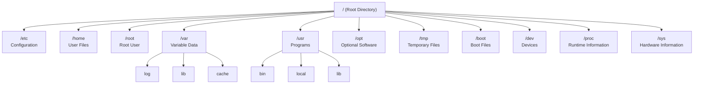

# Challenge Lab - Hari 2
# Investigasi Linux Filesystem Hierarchy Standard (FHS)

## Tujuan

Melakukan investigasi terhadap struktur **Filesystem Hierarchy Standard (FHS)** pada sistem operasi Linux untuk memahami fungsi setiap direktori utama, membandingkan direktori yang memiliki peran berbeda, serta menjelaskan pentingnya FHS dalam lingkungan Enterprise.

---

# Lingkungan Pengujian

| Komponen | Nilai |
|----------|--------|
| Platform | AWS EC2 |
| Operating System | Ubuntu Server 24.04.4 LTS |
| Kernel | Linux 6.17.0-1017-aws |
| Shell | Bash |
| User | ubuntu |

---

# Daftar Investigasi

1. Identifikasi Fungsi Direktori FHS
2. Perbedaan Root Directory (`/`) dan `/root`
3. Perbandingan `/proc` dan `/sys`
4. Perbandingan `/usr` dan `/opt`
5. Perbandingan `/home` dan `/root`
6. Demonstrasi Absolute Path dan Relative Path
7. Diagram Struktur Filesystem Linux
8. Pentingnya Filesystem Hierarchy Standard (FHS) pada Enterprise

---

# 1. Identifikasi Fungsi Direktori Utama FHS

Filesystem Hierarchy Standard (FHS) merupakan standar yang menentukan lokasi penyimpanan file dan direktori pada sistem Linux. Dengan adanya standar ini, administrator dapat mengelola berbagai distribusi Linux dengan cara yang konsisten.

| Direktori | Fungsi |
|-----------|--------|
| `/` | Root Directory, merupakan direktori paling atas dalam struktur filesystem Linux. Semua file dan direktori berada di bawah direktori ini. |
| `/etc` | Menyimpan file konfigurasi sistem dan konfigurasi berbagai layanan (service). |
| `/home` | Menyimpan Home Directory untuk pengguna biasa beserta file pribadi, project, dan konfigurasi aplikasi pengguna. |
| `/root` | Home Directory milik user **root** (administrator sistem). |
| `/var` | Menyimpan data yang sering berubah seperti log, cache, database, mail queue, dan spool. |
| `/usr` | Menyimpan executable, library, dokumentasi, dan aplikasi yang diinstal melalui package manager. |
| `/opt` | Digunakan untuk software tambahan atau aplikasi pihak ketiga (third-party software). |
| `/tmp` | Menyimpan file sementara (temporary files). |
| `/boot` | Menyimpan kernel Linux, bootloader, dan file yang diperlukan selama proses booting. |
| `/dev` | Menyediakan representasi perangkat keras dalam bentuk file (device files). |
| `/proc` | Virtual Filesystem yang menyediakan informasi runtime mengenai Kernel dan proses yang sedang berjalan. |
| `/sys` | Virtual Filesystem yang menyediakan informasi mengenai perangkat keras (hardware) dan device model Linux. |

---

# 2. Perbedaan Root Directory (`/`) dan `/root`

Walaupun memiliki nama yang hampir sama, Root Directory (`/`) dan direktori `/root` memiliki fungsi yang berbeda.

| Root Directory (`/`) | `/root` |
|----------------------|----------|
| Direktori paling atas pada Linux | Home Directory milik user root |
| Menjadi awal seluruh struktur filesystem | Berada di bawah Root Directory |
| Semua direktori lain berada di bawahnya | Digunakan untuk menyimpan file administrator |
| Bukan akun pengguna | Merupakan direktori milik akun administrator |

## Analisis

Kesalahan yang sering dilakukan oleh pengguna baru adalah menganggap bahwa `/` dan `/root` merupakan hal yang sama. Padahal, Root Directory (`/`) adalah akar dari seluruh filesystem Linux, sedangkan `/root` hanyalah direktori home khusus untuk user root.

---

# 3. Perbandingan `/proc` dan `/sys`

Kedua direktori ini sama-sama merupakan **Virtual Filesystem**, namun memiliki fungsi yang berbeda.

| `/proc` | `/sys` |
|----------|---------|
| Menyediakan informasi mengenai proses yang sedang berjalan | Menyediakan informasi mengenai perangkat keras dan driver |
| Berisi informasi runtime Kernel | Berisi representasi perangkat keras Linux |
| Contoh: `/proc/cpuinfo` | Contoh: `/sys/class` |
| Digunakan untuk monitoring sistem | Digunakan untuk manajemen perangkat keras |

## Analisis

Direktori `/proc` lebih berfokus pada informasi proses dan kondisi sistem saat ini, sedangkan `/sys` berfokus pada informasi perangkat keras yang dikenali oleh Kernel Linux.

---

# 4. Perbandingan `/usr` dan `/opt`

Walaupun keduanya sama-sama berkaitan dengan aplikasi, keduanya memiliki tujuan yang berbeda.

| `/usr` | `/opt` |
|---------|---------|
| Menyimpan software bawaan distribusi Linux | Menyimpan software tambahan dari pihak ketiga |
| Dikelola oleh package manager | Biasanya diinstal secara manual atau oleh vendor |
| Berisi executable, library, dan dokumentasi | Biasanya berisi struktur aplikasi secara lengkap |

## Analisis

Pada server yang diuji, direktori `/opt` masih kosong karena belum terdapat software tambahan yang diinstal secara manual. Hal ini umum ditemukan pada instalasi Ubuntu Server yang masih bersih.

---

# 5. Perbandingan `/home` dan `/root`

| `/home` | `/root` |
|----------|----------|
| Home Directory pengguna biasa | Home Directory administrator (root) |
| Contoh: `/home/ubuntu` | `/root` |
| Digunakan untuk menyimpan file pribadi pengguna | Digunakan untuk administrasi sistem |

## Analisis

Pengguna biasa sebaiknya bekerja di dalam Home Directory masing-masing dan hanya menggunakan hak akses root ketika benar-benar diperlukan. Hal ini sesuai dengan prinsip **Least Privilege** dalam keamanan sistem.

---

# 6. Demonstrasi Absolute Path dan Relative Path

## Absolute Path

Absolute Path selalu dimulai dari Root Directory (`/`) sehingga tidak bergantung pada lokasi direktori saat ini.

Contoh:

```bash
cd /home/ubuntu/lab/day02
```

## Relative Path

Relative Path bergantung pada direktori kerja saat ini.

Contoh:

```bash
cd lab/day02
```

Kembali ke Home Directory menggunakan Relative Path:

```bash
cd ../..
```

## Analisis

Penggunaan Absolute Path lebih disarankan pada script otomatisasi karena tidak bergantung pada lokasi direktori saat script dijalankan. Relative Path lebih praktis digunakan saat bekerja secara interaktif di terminal.

---

# 7. Diagram Struktur Filesystem Linux



---

# 8. Pentingnya Filesystem Hierarchy Standard (FHS) pada Enterprise

Filesystem Hierarchy Standard (FHS) memberikan standar penempatan file dan direktori pada sistem Linux sehingga administrator dapat dengan mudah menemukan konfigurasi, log, aplikasi, maupun data pengguna tanpa bergantung pada distribusi Linux tertentu.

Dalam lingkungan Enterprise, konsistensi ini memberikan berbagai keuntungan, antara lain:

- Mempermudah administrasi server.
- Mempermudah proses deployment aplikasi.
- Mendukung otomatisasi menggunakan Ansible, Terraform, dan Bash Script.
- Mempermudah proses backup dan restore.
- Mempermudah troubleshooting ketika terjadi gangguan.
- Memudahkan migrasi server antar distribusi Linux.
- Mengurangi risiko kesalahan konfigurasi.

Karena seluruh distribusi Linux modern mengikuti standar FHS, administrator yang berpindah dari Ubuntu ke Debian, Rocky Linux, AlmaLinux, maupun Red Hat tetap dapat bekerja dengan struktur filesystem yang hampir sama.

---

# Kesimpulan

Melalui Challenge Lab ini saya memahami bahwa Linux menggunakan **Filesystem Hierarchy Standard (FHS)** sebagai standar penempatan file dan direktori pada sistem operasi.

Saya juga memahami fungsi dari setiap direktori utama seperti `/etc`, `/home`, `/var`, `/usr`, `/opt`, `/boot`, `/dev`, `/proc`, dan `/sys`, serta mampu membedakan konsep Root Directory (`/`) dengan Home Directory milik administrator (`/root`).

Selain itu, saya memahami perbedaan antara Absolute Path dan Relative Path, serta mengetahui bahwa Virtual Filesystem seperti `/proc` dan `/sys` merupakan bagian penting dalam administrasi, monitoring, dan troubleshooting sistem Linux.

Pemahaman mengenai struktur filesystem ini menjadi fondasi penting sebelum mempelajari administrasi Linux, Cloud Computing, Docker, Kubernetes, DevOps, maupun Site Reliability Engineering (SRE).

---

# Lessons Learned

Selama menyelesaikan Challenge Lab ini saya memperoleh beberapa pembelajaran penting:

- Memahami struktur Filesystem Hierarchy Standard (FHS).
- Mengetahui fungsi setiap direktori utama Linux.
- Memahami perbedaan antara Root Directory (`/`) dan `/root`.
- Memahami fungsi Virtual Filesystem seperti `/proc` dan `/sys`.
- Memahami penggunaan Absolute Path dan Relative Path.
- Mengetahui pentingnya FHS dalam lingkungan Enterprise.
- Menyadari bahwa hampir seluruh aktivitas administrasi Linux bergantung pada pemahaman struktur filesystem.

---

# Enterprise Relevance

Pemahaman terhadap Filesystem Hierarchy Standard (FHS) merupakan kemampuan dasar yang wajib dimiliki oleh Linux Administrator, Cloud Engineer, DevOps Engineer, Platform Engineer, maupun Site Reliability Engineer (SRE).

Dalam lingkungan produksi (Production Environment), administrator harus mengetahui lokasi konfigurasi sistem, log aplikasi, executable, data pengguna, serta informasi Kernel agar proses deployment, monitoring, troubleshooting, backup, dan maintenance dapat dilakukan secara efisien dan sesuai dengan Best Practice industri.

---

# Referensi

- Linux Foundation - Filesystem Hierarchy Standard (FHS)
- Ubuntu Server Documentation
- Linux Kernel Documentation
- GNU Core Utilities Manual