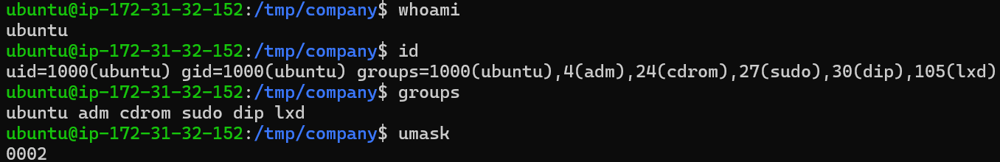
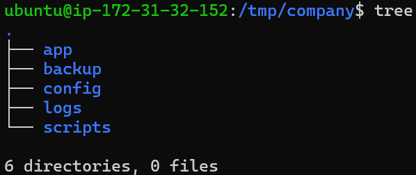
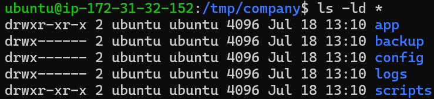
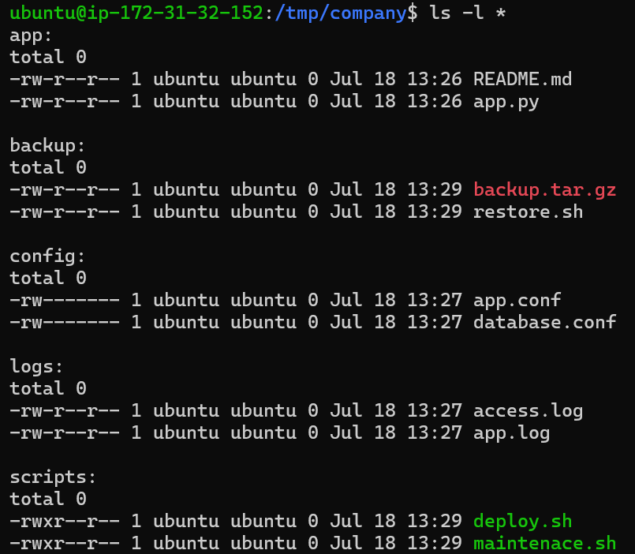
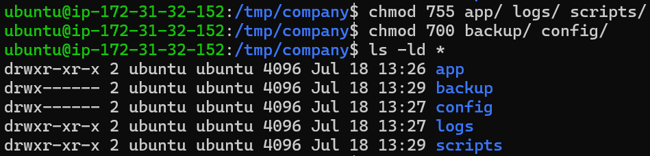
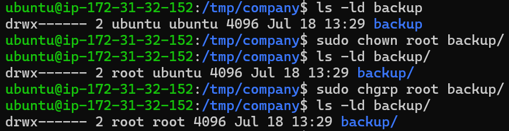
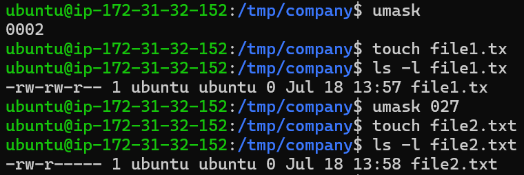
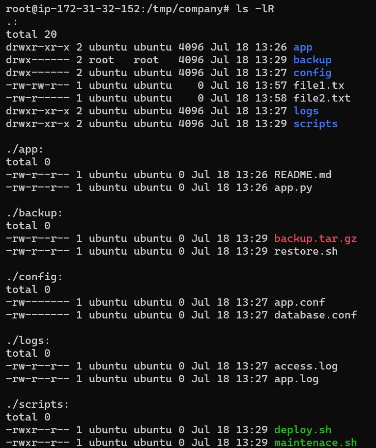

# Challenge Lab — Enterprise File Permission Management

> FASE 1 — Linux Foundation  
> Minggu 1 — Hari 3  
> Challenge Lab

---

# Enterprise File Permission Management

## Pendahuluan

Linux Permission merupakan salah satu fondasi utama dalam keamanan sistem operasi Linux. Seluruh layanan yang berjalan pada server Linux, seperti web server, database server, file server, container runtime, maupun platform cloud, bergantung pada konfigurasi permission yang benar.

Kesalahan dalam pemberian permission dapat menyebabkan berbagai masalah, mulai dari kegagalan aplikasi berjalan hingga kebocoran data yang berdampak pada keamanan perusahaan.

Pada Challenge Lab ini dilakukan simulasi sebagai seorang **Junior Linux Administrator** yang bertugas membangun struktur direktori perusahaan, mengatur ownership, group, permission, serta menguji pengaruh perubahan `umask` terhadap permission default file baru.

Seluruh proses dilakukan pada **Ubuntu Server 24.04 LTS** yang berjalan pada **Amazon EC2**.

---

# Tujuan

Challenge Lab ini bertujuan untuk melatih kemampuan dalam:

- Memahami struktur permission Linux.
- Membuat struktur direktori perusahaan.
- Mengelola ownership.
- Mengelola group.
- Mengatur permission menggunakan `chmod`.
- Mengubah ownership menggunakan `chown`.
- Mengubah group menggunakan `chgrp`.
- Menguji pengaruh `umask`.
- Menerapkan Principle of Least Privilege.
- Mendokumentasikan seluruh proses secara profesional.

---

# Learning Objectives

Setelah menyelesaikan Challenge Lab ini diharapkan mampu:

- Mengidentifikasi user Linux.
- Mengidentifikasi group Linux.
- Membaca permission menggunakan `ls -l`.
- Membaca permission directory menggunakan `ls -ld`.
- Menentukan permission yang sesuai untuk berbagai jenis direktori.
- Memahami hubungan ownership dan permission.
- Menjelaskan alasan keamanan di balik setiap konfigurasi.
- Melakukan troubleshooting sederhana terhadap Linux Permission.

---

# Environment

| Item | Value |
|------|-------|
| Operating System | Ubuntu Server 24.04 LTS |
| Cloud Platform | AWS EC2 |
| Shell | Bash |
| User | ubuntu |
| Filesystem | ext4 |
| Tools | chmod, chown, chgrp, ls, tree, touch, mkdir, umask |

---

# Studi Kasus

Sebuah perusahaan memiliki server aplikasi internal yang digunakan oleh beberapa tim.

Server tersebut memiliki beberapa kebutuhan berikut:

- Direktori aplikasi.
- Direktori konfigurasi.
- Direktori log.
- Direktori backup.
- Direktori script deployment.

Sebagai Linux Administrator, tugas utama adalah memastikan setiap direktori memiliki permission yang sesuai sehingga hanya pihak yang berwenang yang dapat melakukan perubahan.

Selain itu, seluruh konfigurasi harus mengikuti prinsip **Principle of Least Privilege**, yaitu hanya memberikan hak akses minimum yang benar-benar diperlukan.

---

# Struktur Direktori

Berikut struktur direktori yang dibuat selama Challenge Lab.

```text
company/

├── app
│   ├── README.md
│   └── app.py
│
├── config
│   ├── app.conf
│   └── database.conf
│
├── logs
│   ├── access.log
│   └── app.log
│
├── backup
│   ├── backup.tar.gz
│   └── restore.sh
│
└── scripts
    ├── deploy.sh
    └── maintenance.sh
```

---

# Langkah Praktikum

## 1. Verifikasi Identitas User

Tahap pertama adalah melakukan identifikasi user yang sedang digunakan pada server.

Tujuannya agar administrator mengetahui identitas user aktif sebelum melakukan perubahan permission maupun ownership.

Command yang digunakan antara lain:

- `whoami`
- `id`
- `groups`

Informasi yang diperoleh meliputi:

- Username
- UID
- GID
- Secondary Group

Hal ini penting karena Linux Kernel melakukan proses pengecekan permission berdasarkan UID dan GID, bukan berdasarkan nama user.

---

### Screenshot

> **Gambar 1 — Verifikasi User (whoami, id, groups)**



---

## Analisis

Hasil menunjukkan bahwa user yang sedang aktif adalah user `ubuntu`.

Selain berada pada group utama (`ubuntu`), user juga tergabung ke beberapa secondary group seperti:

- sudo
- adm
- cdrom
- dip
- lxd

Informasi tersebut menjadi dasar sebelum melakukan konfigurasi ownership maupun permission.

---

# 2. Membangun Struktur Direktori

Tahap berikutnya adalah membuat struktur direktori perusahaan.

Struktur tersebut dibagi menjadi beberapa bagian sesuai kebutuhan operasional.

Direktori yang dibuat meliputi:

- app
- config
- logs
- backup
- scripts

Masing-masing direktori memiliki fungsi berbeda sehingga nantinya akan diberikan permission yang berbeda pula.

---

### Screenshot

> **Gambar 2 — Struktur Direktori Menggunakan tree**



---

## Analisis

Struktur direktori berhasil dibuat sesuai rancangan.

Pemisahan direktori berdasarkan fungsi merupakan praktik umum dalam administrasi Linux karena mempermudah:

- manajemen file,
- keamanan,
- proses backup,
- troubleshooting,
- serta dokumentasi.

---

# 3. Pemeriksaan Permission Awal

Setelah struktur direktori selesai dibuat, dilakukan pemeriksaan permission awal menggunakan:

- `ls -l`
- `ls -ld`

Tujuannya adalah mengetahui permission default yang diberikan Linux setelah direktori dibuat.

---

### Screenshot

> **Gambar 3 — Permission Awal Menggunakan ls -l dan ls -ld**



---

## Analisis

Permission awal mengikuti nilai `umask` sistem.

Pada Ubuntu Server, permission default direktori umumnya masih memberikan hak akses baca dan eksekusi kepada group maupun other sehingga perlu disesuaikan kembali sesuai kebutuhan keamanan perusahaan.

---

# 4. Konfigurasi Permission

Tahap berikutnya adalah melakukan penyesuaian permission pada setiap direktori.

Setiap direktori diberikan permission yang berbeda sesuai fungsi dan tingkat sensitivitas data yang disimpan.

Contohnya:

- Direktori aplikasi.
- Direktori konfigurasi.
- Direktori log.
- Direktori backup.
- Direktori script.

Konfigurasi dilakukan berdasarkan kebutuhan operasional serta mempertimbangkan aspek keamanan.

---

### Screenshot

> **Gambar 4 — Hasil Perubahan Permission**



---

## Analisis

Setelah dilakukan perubahan permission, setiap direktori memiliki hak akses yang berbeda.

Pendekatan ini jauh lebih aman dibandingkan memberikan permission yang sama pada seluruh direktori.

Konsep ini merupakan implementasi langsung dari Principle of Least Privilege.

---

# 5. Konfigurasi Ownership dan Group

Tahap selanjutnya adalah melakukan perubahan ownership serta group pada beberapa file sebagai simulasi pengelolaan file di lingkungan enterprise.

Perubahan ownership dilakukan untuk menunjukkan bahwa administrator dapat memindahkan hak kepemilikan file kepada user tertentu.

Selain itu dilakukan pula perubahan group agar file dapat diakses oleh group yang sesuai dengan kebijakan perusahaan.

---

### Screenshot

> **Gambar 5 — Demonstrasi Perubahan Permission Menggunakan `chmod`**



---

## Analisis

Pada tahap ini dilakukan perubahan permission menggunakan perintah `chmod`.

Permission setiap direktori maupun file disesuaikan berdasarkan fungsi dan tingkat sensitivitasnya. Direktori yang menyimpan konfigurasi maupun data penting tidak diberikan hak akses yang sama dengan direktori yang digunakan untuk menjalankan aplikasi.

Pendekatan ini bertujuan untuk membatasi akses seminimal mungkin sehingga risiko perubahan yang tidak sah dapat dikurangi.

Konfigurasi tersebut merupakan implementasi dari **Principle of Least Privilege**, yaitu hanya memberikan hak akses yang benar-benar dibutuhkan oleh pengguna atau layanan.

---

# 6. Konfigurasi Ownership dan Group

Tahap berikutnya adalah melakukan perubahan **ownership** dan **group** pada beberapa file sebagai simulasi pengelolaan hak akses di lingkungan enterprise.

Ownership menentukan siapa pemilik utama suatu file atau direktori, sedangkan group digunakan untuk mengatur hak akses bersama bagi beberapa pengguna tanpa harus menjadikan seluruh pengguna sebagai pemilik file.

Dalam lingkungan produksi, administrator sering melakukan perubahan ownership maupun group ketika terjadi deployment aplikasi, pergantian service account, atau penyesuaian hak akses antar tim.

---

### Screenshot

> **Gambar 6 — Demonstrasi Perubahan Ownership (`chown`) dan Group (`chgrp`)**



---

## Analisis

Hasil praktikum menunjukkan bahwa ownership dan group berhasil diubah sesuai kebutuhan.

Perubahan ownership memastikan file dimiliki oleh user yang tepat, sedangkan perubahan group memungkinkan beberapa pengguna dalam satu kelompok dapat mengakses file sesuai permission yang diberikan.

Linux Kernel selalu melakukan pengecekan berdasarkan **UID** dan **GID** sebelum mengevaluasi permission file. Oleh karena itu, konfigurasi ownership dan group yang benar merupakan bagian penting dalam administrasi Linux.

Penggunaan `chown` dan `chgrp` juga mempermudah pengelolaan server ketika beberapa administrator bekerja pada sistem yang sama.

---

# 7. Pengujian Pengaruh `umask`

Tahap berikutnya adalah melakukan pengujian terhadap nilai `umask`.

Pengujian dilakukan dengan membuat file baru menggunakan nilai `umask` yang berbeda untuk mengamati bagaimana Linux menentukan permission default pada file yang baru dibuat.

Tujuan pengujian ini adalah memahami bahwa permission default tidak hanya dipengaruhi oleh command pembuatan file, tetapi juga oleh konfigurasi `umask` yang aktif pada shell.

---

### Screenshot

> **Gambar 7 — Demonstrasi Pengaruh `umask` terhadap Permission Default**



---

## Analisis

Hasil pengujian menunjukkan bahwa perubahan nilai `umask` menghasilkan permission default yang berbeda.

Ketika menggunakan nilai `umask` yang lebih ketat, file baru memiliki hak akses yang lebih terbatas sehingga lebih aman digunakan pada lingkungan produksi.

Konfigurasi `umask` yang tepat dapat membantu administrator menerapkan kebijakan keamanan secara konsisten tanpa harus selalu mengubah permission secara manual setelah file dibuat.

---

# 8. Verifikasi Akhir

Tahap terakhir adalah melakukan verifikasi terhadap seluruh struktur direktori, ownership, group, dan permission yang telah dikonfigurasi selama Challenge Lab.

Verifikasi dilakukan menggunakan beberapa perintah seperti `tree`, `ls -l`, dan `ls -ld` untuk memastikan seluruh perubahan telah diterapkan sesuai dengan rancangan awal.

Langkah ini merupakan bagian penting sebelum server digunakan pada lingkungan produksi.

---

### Screenshot

> **Gambar 8 — Verifikasi Akhir Struktur Direktori dan Permission**



---

## Analisis

Hasil verifikasi menunjukkan bahwa struktur direktori berhasil dibuat sesuai kebutuhan studi kasus.

Permission pada setiap direktori telah disesuaikan berdasarkan fungsi masing-masing, ownership dan group telah dikonfigurasi sesuai kebutuhan, serta pengaruh perubahan `umask` terhadap permission default berhasil dibuktikan melalui praktikum.

Secara keseluruhan, konfigurasi yang diterapkan telah mengikuti konsep dasar **Principle of Least Privilege**, yaitu memberikan hak akses seminimal mungkin sesuai kebutuhan operasional.