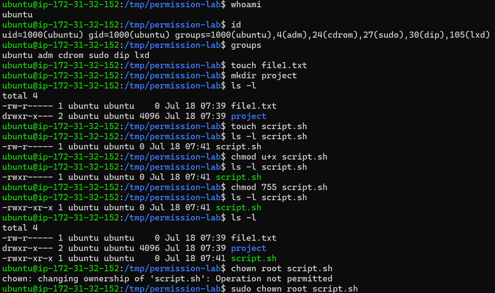
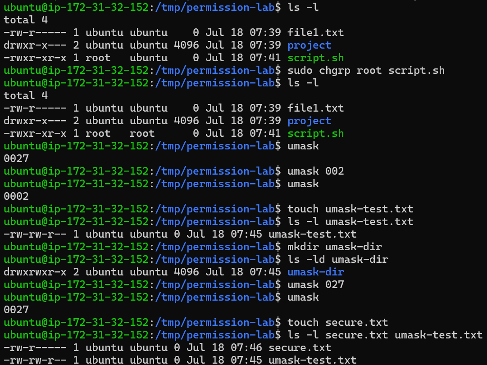

# Linux Permission Hands-on Lab


---

# Overview

Pada Hands-on Lab ini saya mempelajari bagaimana Linux mengelola hak akses (**Permission**) terhadap file dan direktori menggunakan model **User**, **Group**, dan **Other**.

Seluruh praktikum dilakukan pada **Ubuntu Server 24.04 LTS** yang berjalan di **Amazon Web Services (AWS) EC2** melalui koneksi SSH.

Materi Linux Permission merupakan salah satu fondasi terpenting dalam administrasi Linux karena hampir seluruh layanan seperti **Nginx**, **Apache**, **Docker**, **Kubernetes**, **CI/CD**, hingga layanan Cloud menggunakan mekanisme permission untuk mengontrol akses terhadap file dan direktori.

Selama praktikum ini saya mempelajari cara mengidentifikasi identitas user, membaca permission, mengubah ownership, mengelola group, memahami mekanisme `umask`, serta melakukan troubleshooting sederhana terhadap error permission.

---

# Learning Objectives

Setelah menyelesaikan Hands-on Lab ini saya mampu:

- Memahami identitas user pada Linux.
- Mengetahui UID, GID, dan Group Membership.
- Membaca ownership serta permission file menggunakan `ls -l`.
- Mengubah permission menggunakan `chmod`.
- Mengubah owner menggunakan `chown`.
- Mengubah group menggunakan `chgrp`.
- Memahami mekanisme default permission melalui `umask`.
- Melakukan troubleshooting dasar terhadap masalah permission.
- Memahami hubungan Linux Permission dengan administrasi server dan Cloud Computing.

---

# Lab Environment

| Item | Value |
|------|-------|
| Cloud Provider | AWS |
| Service | EC2 |
| Operating System | Ubuntu Server 24.04 LTS |
| Shell | Bash |
| Connection | SSH |
| Working Directory | `/tmp/permission-lab` |

---

# Prerequisites

Sebelum mengerjakan Hands-on Lab ini saya telah mempelajari:

- Linux Fundamentals
- Linux File System
- Filesystem Hierarchy Standard (FHS)
- Shell
- Terminal
- Absolute Path
- Relative Path

---

# Lab Structure

Praktikum terdiri dari delapan bagian:

| Lab | Materi |
|------|--------|
| Lab 1 | whoami |
| Lab 2 | id |
| Lab 3 | groups |
| Lab 4 | ls -l |
| Lab 5 | chmod |
| Lab 6 | chown |
| Lab 7 | chgrp |
| Lab 8 | umask |

---

# Lab 1 - Identifikasi User dengan `whoami`

## Objective

Mengetahui user yang sedang digunakan untuk menjalankan shell.

Memahami bahwa seluruh proses pada Linux selalu berjalan menggunakan identitas user tertentu.

---

## Command

```bash
whoami
```

---

## Output

```text
ubuntu
```

---

## Analysis

Command `whoami` menampilkan **effective username** dari shell yang sedang aktif.

Output menunjukkan bahwa saya sedang login menggunakan user:

```text
ubuntu
```

Seluruh file yang saya buat nantinya secara default akan dimiliki oleh user tersebut, kecuali menggunakan `sudo` atau mekanisme lain yang mengubah identitas proses.

---

## Enterprise Insight

Administrator Linux biasanya memverifikasi user aktif sebelum melakukan perubahan penting pada server produksi untuk menghindari kesalahan administrasi.

---

## Screenshot



---

# Lab 2 - Melihat Informasi User dengan `id`

## Objective

Menampilkan identitas lengkap user yang sedang aktif.

---

## Command

```bash
id
```

---

## Output

```text
uid=1000(ubuntu)
gid=1000(ubuntu)
groups=1000(ubuntu),4(adm),24(cdrom),27(sudo),30(dip),105(lxd)
```

---

## Analysis

Output menunjukkan bahwa user `ubuntu` memiliki:

| Item | Value |
|------|-------|
| UID | 1000 |
| Primary Group | ubuntu |
| Supplementary Groups | adm, cdrom, sudo, dip, lxd |

Linux Kernel tidak mengenali user berdasarkan nama, tetapi menggunakan **UID (User ID)** dan **GID (Group ID)** ketika melakukan pengecekan permission.

---

## Enterprise Insight

Saat melakukan troubleshooting pada server Linux, command `id` merupakan salah satu command pertama yang dijalankan untuk memastikan identitas proses yang sedang digunakan.

---

## Screenshot


---

# Lab 3 - Melihat Group Membership dengan `groups`

## Objective

Mengetahui seluruh group yang dimiliki user aktif.

---

## Command

```bash
groups
```

---

## Output

```text
ubuntu adm cdrom sudo dip lxd
```

---

## Analysis

User `ubuntu` merupakan anggota dari beberapa group, yaitu:

- ubuntu
- adm
- cdrom
- sudo
- dip
- lxd

Keanggotaan group memungkinkan user memperoleh akses terhadap resource tertentu tanpa harus menjadi owner dari file tersebut.

---

## Enterprise Insight

Pada lingkungan enterprise, administrator biasanya memberikan akses melalui **group** daripada memberikan permission secara langsung kepada setiap user.

Pendekatan ini mempermudah pengelolaan akses ketika jumlah pengguna bertambah.

---

## Screenshot


---

# Lab 4 - Membaca Ownership dan Permission dengan `ls -l`

## Objective

Memahami struktur output `ls -l` serta membaca owner, group, dan permission file maupun direktori.

---

## Persiapan

Membuat file dan direktori baru.

```bash
touch file1.txt
mkdir project
```

---

## Command

```bash
ls -l
```

---

## Output

```text
total 4
-rw-r----- 1 ubuntu ubuntu    0 Jul 18 07:39 file1.txt
drwxr-x--- 2 ubuntu ubuntu 4096 Jul 18 07:39 project
```

---

## Analysis

Output pertama menunjukkan file biasa:

```text
-rw-r-----
```

Artinya:

| Bagian | Arti |
|--------|------|
| - | Regular File |
| rw- | Owner memiliki Read dan Write |
| r-- | Group hanya memiliki Read |
| --- | Other tidak memiliki akses |

Output kedua menunjukkan direktori:

```text
drwxr-x---
```

Artinya:

| Bagian | Arti |
|--------|------|
| d | Directory |
| rwx | Owner memiliki akses penuh |
| r-x | Group dapat membaca dan masuk ke direktori |
| --- | Other tidak memiliki akses |

---

## Enterprise Insight

Command `ls -l` merupakan command yang hampir selalu digunakan oleh Linux Administrator ketika melakukan troubleshooting terhadap aplikasi yang mengalami masalah permission.

---

## Screenshot


---

# Lab 5 - Mengubah Permission Menggunakan `chmod`

## Objective

Memahami cara mengubah permission file menggunakan mode simbolik maupun numerik.

---

## Persiapan

```bash
touch script.sh
```

Melihat permission awal.

```bash
ls -l script.sh
```

Output:

```text
-rw-r----- 1 ubuntu ubuntu 0 Jul 18 07:41 script.sh
```

---

## Langkah 1

Memberikan permission Execute kepada Owner.

```bash
chmod u+x script.sh
```

Verifikasi:

```bash
ls -l script.sh
```

Output:

```text
-rwxr----- 1 ubuntu ubuntu 0 Jul 18 07:41 script.sh
```

---

## Langkah 2

Mengubah permission menggunakan mode numerik.

```bash
chmod 755 script.sh
```

Verifikasi kembali.

```bash
ls -l script.sh
```

Output:

```text
-rwxr-xr-x 1 ubuntu ubuntu 0 Jul 18 07:41 script.sh
```

---

## Analysis

Permission **755** berarti:

| User | Permission |
|------|------------|
| Owner | rwx |
| Group | r-x |
| Other | r-x |

Owner memiliki hak penuh, sedangkan Group dan Other hanya dapat membaca dan menjalankan file.

---

## Enterprise Insight

Permission 755 sering digunakan pada script atau direktori aplikasi yang memang perlu dijalankan tetapi tidak boleh diubah oleh semua user.

---

## Screenshot


---

> **Lanjutkan ke Bagian 2** untuk dokumentasi Lab 6 hingga Lab 8, Troubleshooting, Lessons Learned, Best Practices, dan References.


---

# Lab 6 - Mengubah Ownership Menggunakan `chown`

## Objective

Memahami cara mengubah kepemilikan (owner) sebuah file menggunakan command `chown`.

---

## Percobaan Pertama

Menjalankan command tanpa hak administrator.

```bash
chown root script.sh
```

---

## Output

```text
chown: changing ownership of 'script.sh': Operation not permitted
```

---

## Analysis

Linux menolak perubahan ownership karena user `ubuntu` bukan pemilik dengan hak istimewa (privileged user).

Mengubah owner file merupakan operasi administratif sehingga memerlukan hak akses **root** atau penggunaan **sudo**.

Error ini merupakan mekanisme keamanan Linux agar user biasa tidak dapat mengambil alih kepemilikan file secara sembarangan.

---

## Solusi

Menjalankan kembali command menggunakan `sudo`.

```bash
sudo chown root script.sh
```

Verifikasi perubahan.

```bash
ls -l
```

Output:

```text
-rwxr-xr-x 1 root ubuntu 0 Jul 18 07:41 script.sh
```

---

## Analysis

Owner berhasil berubah dari:

```text
ubuntu
```

menjadi

```text
root
```

Sedangkan group masih tetap:

```text
ubuntu
```

---

## Enterprise Insight

Pada lingkungan produksi, `chown` sering digunakan setelah proses deployment aplikasi.

Contohnya:

```bash
sudo chown -R www-data:www-data /var/www/html
```

Agar seluruh file aplikasi dimiliki oleh web server.

---

## Screenshot



---

# Lab 7 - Mengubah Group Menggunakan `chgrp`

## Objective

Memahami cara mengubah group dari sebuah file.

---

## Command

```bash
sudo chgrp root script.sh
```

Verifikasi.

```bash
ls -l
```

---

## Output

```text
-rwxr-xr-x 1 root root 0 Jul 18 07:41 script.sh
```

---

## Analysis

Perintah `chgrp` hanya mengubah **group**.

Owner tetap:

```text
root
```

Sedangkan group berubah dari:

```text
ubuntu
```

menjadi:

```text
root
```

Dengan mekanisme ini administrator dapat memberikan akses kepada sekelompok user tanpa mengubah owner file.

---

## Enterprise Insight

Pada perusahaan besar, file project biasanya dimiliki oleh satu owner tetapi diberikan kepada group tertentu agar seluruh anggota tim dapat mengakses resource tersebut.

---

## Screenshot


---

# Lab 8 - Memahami Default Permission Menggunakan `umask`

## Objective

Memahami bagaimana Linux menentukan permission default ketika file atau direktori baru dibuat.

---

## Melihat Nilai Umask

```bash
umask
```

Output:

```text
0027
```

---

## Analysis

Nilai `0027` menghasilkan:

File baru:

```text
640
```

Direktori baru:

```text
750
```

Artinya user lain (Other) tidak memperoleh hak akses sama sekali.

Konfigurasi ini lebih aman dibandingkan nilai `0022`.

---

## Percobaan Kedua

Mengubah sementara nilai umask.

```bash
umask 002
```

Verifikasi.

```bash
umask
```

Output:

```text
0002
```

---

## Membuat File Baru

```bash
touch umask-test.txt
```

Verifikasi.

```bash
ls -l umask-test.txt
```

Output:

```text
-rw-rw-r-- 1 ubuntu ubuntu 0 Jul 18 07:45 umask-test.txt
```

---

## Analysis

Dengan nilai `0002`, permission file baru menjadi:

```text
664
```

Owner dan Group memperoleh hak Read serta Write.

Other hanya memperoleh Read.

---

## Membuat Directory Baru

```bash
mkdir umask-dir
```

Verifikasi.

```bash
ls -ld umask-dir
```

Output:

```text
drwxrwxr-x
```

Permission direktori menjadi:

```text
775
```

---

## Percobaan Ketiga

Mengembalikan nilai umask menjadi:

```bash
umask 027
```

Verifikasi.

```bash
umask
```

Output:

```text
0027
```

---

## Membuat File Baru

```bash
touch secure.txt
```

Verifikasi.

```bash
ls -l secure.txt umask-test.txt
```

Output:

```text
-rw-r----- 1 ubuntu ubuntu 0 Jul 18 07:46 secure.txt
-rw-rw-r-- 1 ubuntu ubuntu 0 Jul 18 07:45 umask-test.txt
```

---

## Analysis

Perbedaan hasil menunjukkan bahwa nilai **umask** secara langsung memengaruhi permission awal file yang baru dibuat.

Semakin besar nilai masking, semakin sedikit permission yang diberikan secara default.

---

## Enterprise Insight

Sebagian besar server Linux menggunakan nilai umask yang lebih ketat untuk mengurangi risiko file sensitif dapat diakses oleh user lain.

---

## Screenshot


---

# Troubleshooting

## Kasus

Saat mencoba mengubah owner file, muncul pesan berikut.

```text
chown: changing ownership of 'script.sh': Operation not permitted
```

---

## Penyebab

User `ubuntu` tidak memiliki hak untuk mengubah ownership file menjadi user lain.

Operasi ini hanya dapat dilakukan oleh user dengan hak administrator (root).

---

## Investigasi

Memastikan user yang sedang aktif.

```bash
whoami
```

Memeriksa identitas user.

```bash
id
```

---

## Solusi

Menjalankan command menggunakan `sudo`.

```bash
sudo chown root script.sh
```

---

## Hasil

Owner berhasil berubah menjadi:

```text
root
```

---

# Lessons Learned

Melalui Hands-on Lab ini saya memahami bahwa:

- Linux menggunakan model keamanan berbasis User, Group, dan Other.
- Setiap file memiliki owner, group, dan permission.
- Command `ls -l` digunakan untuk membaca ownership serta permission.
- Permission dapat diubah menggunakan `chmod`.
- Ownership dapat diubah menggunakan `chown`.
- Group dapat diubah menggunakan `chgrp`.
- Nilai `umask` menentukan permission default ketika file baru dibuat.
- Linux membatasi perubahan ownership sebagai mekanisme keamanan.
- Error **Operation not permitted** merupakan bagian dari sistem keamanan Linux, bukan kesalahan sistem.

---

# Best Practices

- Hindari menggunakan permission `777` tanpa alasan yang jelas.
- Terapkan prinsip **Least Privilege** dengan hanya memberikan permission yang benar-benar dibutuhkan.
- Gunakan group untuk mengelola akses bersama.
- Gunakan `sudo` hanya ketika diperlukan.
- Selalu lakukan verifikasi menggunakan `ls -l` setelah mengubah permission atau ownership.
- Lakukan pengujian pada direktori khusus sebelum menerapkan perubahan pada server produksi.

---

# Conclusion

Hands-on Lab ini memberikan pemahaman praktis mengenai mekanisme permission pada Linux.

Saya berhasil mempelajari identitas user, ownership, group, permission, serta cara mengelola akses terhadap file menggunakan `chmod`, `chown`, `chgrp`, dan `umask`.

Materi ini menjadi fondasi penting sebelum mempelajari administrasi server yang lebih kompleks seperti Nginx, Docker, Kubernetes, CI/CD, dan Cloud Infrastructure.

---

# References

- Linux Manual Pages (`man chmod`)
- Linux Manual Pages (`man chown`)
- Linux Manual Pages (`man chgrp`)
- Linux Manual Pages (`man umask`)
- Ubuntu Server Documentation
- The Linux Documentation Project (TLDP)

---

**Author:** Kalikali Kali

**Phase:** Phase 01 - Linux Foundation

**Day:** Day 03 - Linux Permission

**Status:** ✅ Completed