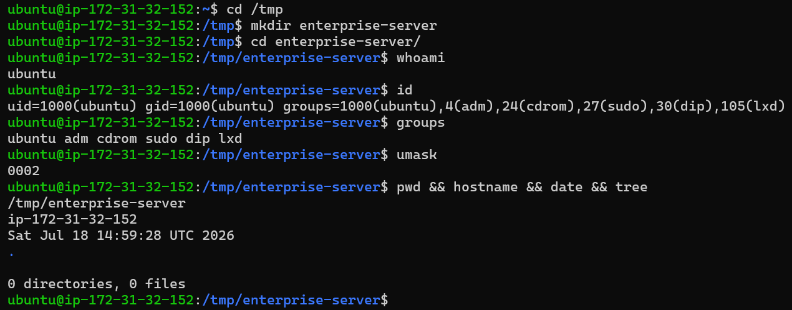
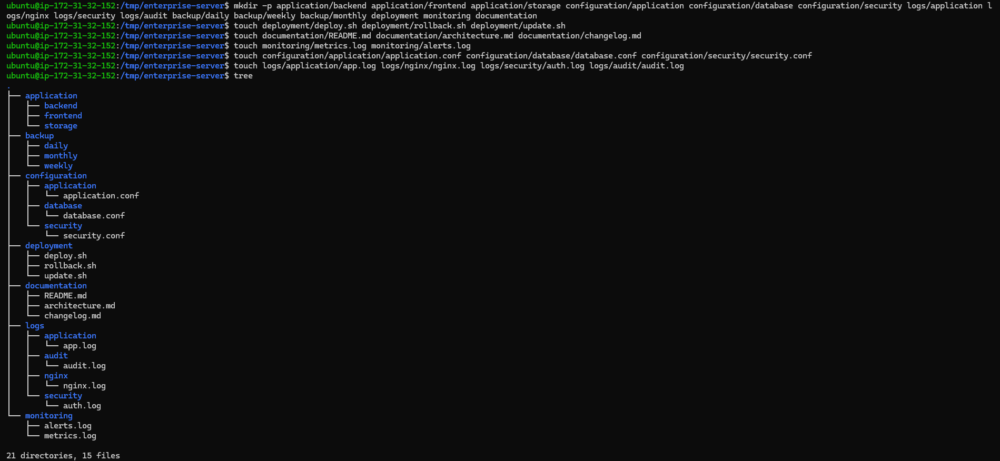
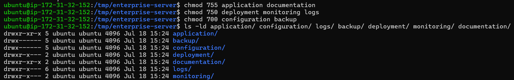
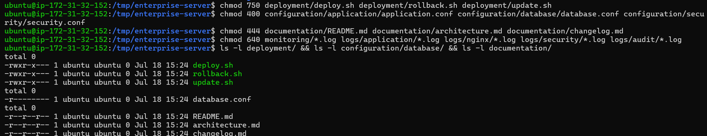
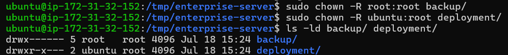
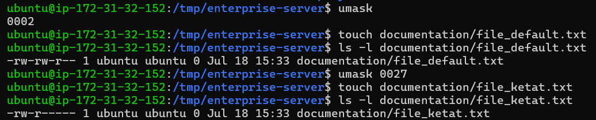
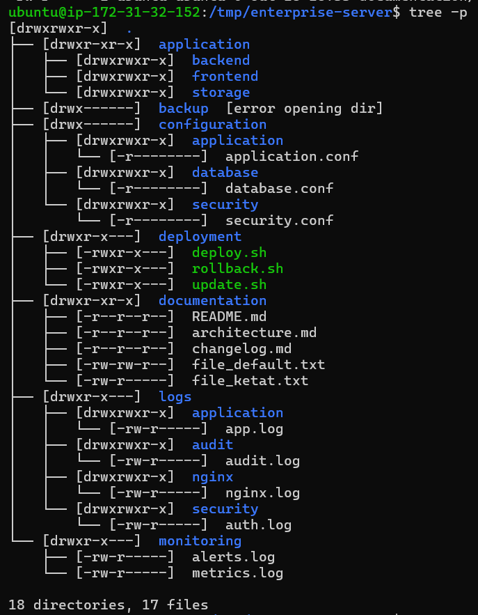
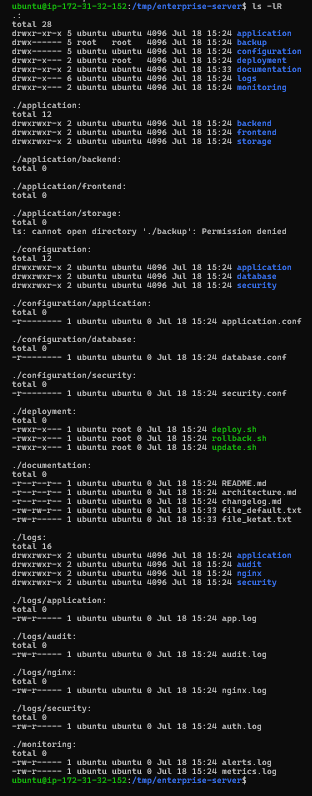

# Mini Project — Enterprise Server Permission Management

> FASE 1 — Linux Foundation  
> Minggu 1 — Hari 3  
> Mini Project

---

# Enterprise Server Permission Management

## Project Overview

Linux File Permission merupakan salah satu mekanisme keamanan paling fundamental dalam sistem operasi Linux. Seluruh layanan yang berjalan pada server Linux, seperti web server, database server, container runtime, file server, maupun layanan cloud modern, bergantung pada konfigurasi permission yang benar agar dapat beroperasi dengan aman.

Kesalahan dalam memberikan permission dapat menyebabkan berbagai permasalahan, mulai dari kegagalan aplikasi berjalan, akses tidak sah terhadap data sensitif, hingga kebocoran informasi perusahaan.

Pada mini project ini dilakukan simulasi pembangunan struktur direktori sebuah **Enterprise Server** beserta konfigurasi permission, ownership, group, dan `umask` sesuai dengan prinsip keamanan Linux.

Seluruh proses dilakukan menggunakan **Ubuntu Server 24.04 LTS** yang berjalan pada **Amazon EC2**, sehingga lingkungan yang digunakan menyerupai server Linux yang umum digunakan pada industri cloud computing.

Mini project ini dirancang sebagai implementasi materi Linux Permission yang telah dipelajari pada Hari ke-3 FASE Linux Foundation.

---

# Project Objectives

Mini Project ini bertujuan untuk:

- Mendesain struktur direktori server sederhana dengan pendekatan enterprise.
- Mengelompokkan direktori berdasarkan fungsi operasional.
- Menerapkan Linux File Permission menggunakan `chmod`.
- Mengelola ownership menggunakan `chown`.
- Mengelola group menggunakan `chgrp`.
- Memahami pengaruh `umask` terhadap permission default.
- Menerapkan konsep Principle of Least Privilege.
- Mendokumentasikan implementasi Linux Permission secara profesional.

---

# Learning Outcomes

Setelah menyelesaikan mini project ini diharapkan mampu:

- Mendesain struktur direktori server Linux.
- Menentukan permission yang sesuai untuk berbagai jenis direktori.
- Mengelola ownership dan group sesuai kebutuhan operasional.
- Memahami hubungan antara permission, ownership, dan group.
- Menjelaskan pengaruh `umask` terhadap file baru.
- Melakukan verifikasi konfigurasi menggunakan berbagai command Linux.
- Mendokumentasikan hasil implementasi sebagai bagian dari portfolio GitHub.

---

# Environment

| Item | Value |
|------|-------|
| Operating System | Ubuntu Server 24.04 LTS |
| Cloud Platform | Amazon EC2 |
| Distribution | Ubuntu |
| Shell | Bash |
| User | ubuntu |
| Filesystem | ext4 |
| Instance Type | AWS EC2 |
| Tools | mkdir, tree, touch, chmod, chown, chgrp, ls, umask |

---

# Enterprise Scenario

Sebuah perusahaan teknologi sedang membangun sebuah server internal yang akan digunakan sebagai pusat deployment aplikasi.

Server tersebut digunakan oleh beberapa tim, antara lain:

- Backend Developer
- Frontend Developer
- DevOps Engineer
- Linux Administrator
- Security Engineer

Masing-masing tim membutuhkan direktori dengan fungsi yang berbeda sehingga administrator harus mengatur struktur direktori, ownership, group, serta permission secara tepat agar keamanan server tetap terjaga.

Direktori yang dibangun pada mini project ini meliputi:

- Application
- Configuration
- Deployment
- Documentation
- Backup
- Logs
- Monitoring

Setiap direktori diberikan permission yang berbeda sesuai tingkat sensitivitas data yang disimpan.

Pendekatan ini mengikuti konsep **Principle of Least Privilege**, yaitu hanya memberikan hak akses minimum yang benar-benar diperlukan.

---

# Project Structure

Struktur direktori yang dibangun pada mini project ini adalah sebagai berikut.

```text
enterprise-server/

├── application
│   ├── backend
│   ├── frontend
│   └── storage
│
├── configuration
│   ├── application
│   ├── database
│   └── security
│
├── deployment
│   ├── deploy.sh
│   ├── rollback.sh
│   └── update.sh
│
├── documentation
│   ├── README.md
│   ├── architecture.md
│   └── changelog.md
│
├── backup
│   ├── daily
│   ├── weekly
│   └── monthly
│
├── logs
│   ├── application
│   ├── nginx
│   ├── security
│   └── audit
│
└── monitoring
    ├── metrics.log
    └── alerts.log
```

---

# Project Workflow

Mini project ini dikerjakan melalui beberapa tahapan berikut.

1. Melakukan identifikasi user Linux.
2. Membangun struktur direktori enterprise.
3. Mengatur permission direktori.
4. Mengatur permission file.
5. Mengelola ownership dan group.
6. Menguji pengaruh `umask`.
7. Melakukan verifikasi akhir terhadap seluruh struktur direktori.
8. Menyusun dokumentasi hasil implementasi.

---

# 1. Project Initialization

Tahap pertama adalah menyiapkan direktori kerja yang akan digunakan sebagai lingkungan simulasi.

Beberapa informasi dasar sistem seperti user aktif, UID, GID, group, serta nilai `umask` diperiksa terlebih dahulu sebelum konfigurasi dilakukan.

Selain itu dilakukan pula pengecekan lokasi direktori kerja, hostname server, tanggal sistem, serta kondisi awal direktori menggunakan command `tree`.

Langkah ini bertujuan memastikan seluruh proses dilakukan pada lingkungan yang benar sebelum implementasi dimulai.

---

### Screenshot

> **Gambar 1 — Project Overview dan Inisialisasi Lingkungan**



---

## Analisis

Hasil verifikasi menunjukkan bahwa proses implementasi dilakukan menggunakan user `ubuntu` pada Ubuntu Server 24.04 LTS yang berjalan di Amazon EC2.

Nilai `umask` awal masih menggunakan konfigurasi bawaan sistem (`0002`) sehingga file yang dibuat nantinya akan mengikuti permission default Linux sebelum dilakukan perubahan konfigurasi.

Tahap inisialisasi ini penting karena seluruh konfigurasi permission, ownership, dan group yang dilakukan pada tahap berikutnya bergantung pada identitas user yang sedang aktif.

# 2. Membangun Struktur Direktori Enterprise

Tahap pertama dalam implementasi adalah membangun struktur direktori yang akan digunakan sebagai simulasi sebuah server enterprise.

Struktur direktori dirancang agar setiap komponen aplikasi memiliki lokasi penyimpanan yang terpisah berdasarkan fungsi masing-masing. Pendekatan seperti ini umum digunakan pada lingkungan produksi karena mempermudah administrasi sistem, proses deployment, backup, monitoring, serta pengelolaan keamanan.

Direktori utama yang dibuat meliputi:

- Application
- Configuration
- Deployment
- Documentation
- Backup
- Logs
- Monitoring

Di dalam masing-masing direktori utama dibuat beberapa subdirektori maupun file sebagai simulasi komponen server yang umum digunakan pada lingkungan enterprise.

---

### Screenshot

> **Gambar 2 — Struktur Direktori Enterprise**



---

## Analisis

Hasil implementasi menunjukkan bahwa struktur direktori berhasil dibuat sesuai dengan rancangan awal.

Direktori aplikasi dipisahkan menjadi backend, frontend, dan storage agar setiap komponen aplikasi memiliki ruang kerja masing-masing.

Direktori configuration digunakan untuk menyimpan file konfigurasi aplikasi, database, serta konfigurasi keamanan. Pemisahan tersebut bertujuan agar konfigurasi lebih mudah dikelola dan tidak bercampur dengan source code aplikasi.

Direktori deployment berisi beberapa script otomatisasi sederhana yang mensimulasikan proses deployment aplikasi.

Direktori documentation digunakan sebagai tempat penyimpanan dokumentasi proyek sehingga seluruh informasi penting mengenai sistem dapat dikelola secara terpusat.

Direktori logs dan monitoring dipisahkan agar proses observasi sistem menjadi lebih terstruktur, sedangkan direktori backup disediakan sebagai lokasi penyimpanan cadangan data.

Pemisahan struktur seperti ini merupakan praktik umum dalam administrasi server Linux dan mempermudah proses maintenance pada lingkungan produksi.

---

# 3. Konfigurasi Permission Direktori

Setelah struktur direktori selesai dibuat, tahap berikutnya adalah melakukan konfigurasi permission pada setiap direktori.

Tidak seluruh direktori diberikan permission yang sama karena setiap direktori memiliki tingkat sensitivitas yang berbeda.

Direktori yang berisi data konfigurasi maupun backup diberikan permission yang lebih ketat dibandingkan direktori aplikasi maupun dokumentasi.

Konfigurasi permission dilakukan menggunakan perintah `chmod` sesuai kebutuhan masing-masing direktori.

---

### Screenshot

> **Gambar 3 — Konfigurasi Permission Direktori**



---

## Analisis

Permission direktori berhasil dikonfigurasi sesuai fungsi masing-masing.

Direktori `application` dan `documentation` menggunakan permission `755` sehingga dapat dibaca oleh pengguna lain namun hanya dapat dimodifikasi oleh pemiliknya.

Direktori `deployment`, `logs`, dan `monitoring` menggunakan permission `750` untuk membatasi akses pengguna di luar group yang berwenang.

Direktori `configuration` serta `backup` menggunakan permission `700` sehingga hanya pemilik direktori yang dapat mengakses isinya.

Pendekatan ini mengurangi kemungkinan akses tidak sah terhadap data penting serta mendukung implementasi Principle of Least Privilege.

---

# 4. Konfigurasi Permission File

Setelah permission direktori selesai dikonfigurasi, tahap berikutnya adalah mengatur permission pada berbagai file yang terdapat di dalam struktur proyek.

Jenis file yang digunakan pada mini project ini memiliki fungsi yang berbeda sehingga permission yang diterapkan juga berbeda.

Sebagai contoh:

- Script deployment harus dapat dieksekusi.
- File konfigurasi hanya boleh dibaca oleh administrator.
- Dokumentasi dapat dibaca oleh seluruh pengguna.
- File log hanya dapat diubah oleh proses yang berwenang.

Konfigurasi dilakukan menggunakan perintah `chmod` dengan nilai permission yang disesuaikan terhadap fungsi masing-masing file.

---

### Screenshot

> **Gambar 4 — Konfigurasi Permission File**



---

## Analisis

Permission file berhasil diterapkan sesuai kebutuhan operasional.

File deployment diberikan permission `750` sehingga dapat dijalankan oleh owner maupun group yang berwenang.

File konfigurasi diberikan permission `400` agar hanya dapat dibaca oleh pemilik file.

Dokumentasi diberikan permission `444` sehingga dapat dibaca oleh seluruh pengguna namun tidak dapat dimodifikasi secara langsung.

File log menggunakan permission `640` sehingga hanya owner yang dapat melakukan perubahan sedangkan anggota group hanya memperoleh hak baca.

Perbedaan permission tersebut menunjukkan bahwa keamanan sistem tidak hanya diterapkan pada tingkat direktori, tetapi juga pada setiap file berdasarkan tingkat sensitivitasnya.

---

# 5. Pengelolaan Ownership dan Group

Selain permission, Linux juga menggunakan konsep ownership dan group sebagai mekanisme utama dalam menentukan hak akses terhadap file maupun direktori.

Pada tahap ini dilakukan simulasi perubahan ownership dan group menggunakan perintah `chown`.

Perubahan ownership sering dilakukan ketika administrator melakukan deployment aplikasi, migrasi service account, maupun pemisahan hak akses antar tim.

Dalam mini project ini dilakukan simulasi perubahan ownership pada direktori backup dan deployment untuk menunjukkan bagaimana Linux mengelola kepemilikan sumber daya.

---

### Screenshot

> **Gambar 5 — Konfigurasi Ownership dan Group**



---

## Analisis

Ownership berhasil diubah sesuai skenario yang dirancang.

Direktori `backup` dimiliki oleh user `root` dengan group `root` sehingga hanya administrator sistem yang memiliki akses penuh terhadap isi direktori tersebut.

Sebaliknya, direktori `deployment` tetap dimiliki oleh user `ubuntu` namun menggunakan group `root` sebagai simulasi pembatasan akses pada lingkungan enterprise.

Konfigurasi seperti ini umum diterapkan pada server produksi untuk memastikan hanya pengguna tertentu yang memiliki hak melakukan perubahan terhadap file maupun direktori penting.

Ownership dan group menjadi lapisan keamanan tambahan selain permission sehingga administrator memiliki kontrol akses yang lebih fleksibel.

# 6. Demonstrasi Pengaruh `umask`

Linux menggunakan mekanisme `umask` untuk menentukan permission default ketika sebuah file atau direktori baru dibuat.

Nilai `umask` bekerja dengan cara mengurangi permission dasar (base permission) sehingga administrator dapat menerapkan kebijakan keamanan secara otomatis tanpa harus selalu menjalankan perintah `chmod` setelah membuat file baru.

Pada tahap ini dilakukan dua skenario pengujian.

Skenario pertama menggunakan nilai `umask` bawaan sistem (`0002`), sedangkan skenario kedua menggunakan nilai `0027` yang lebih ketat.

Kemudian dibuat dua buah file baru untuk membandingkan hasil permission default yang dihasilkan.

---

### Screenshot

> **Gambar 6 — Demonstrasi Pengaruh `umask`**



---

## Analisis

Hasil pengujian menunjukkan bahwa nilai `umask` memiliki pengaruh langsung terhadap permission file yang baru dibuat.

Ketika menggunakan nilai `0002`, file baru memperoleh permission yang lebih longgar sehingga masih memberikan hak tulis kepada group.

Setelah nilai `umask` diubah menjadi `0027`, file baru secara otomatis memiliki permission yang lebih ketat karena hak akses terhadap group dan other dibatasi.

Konfigurasi seperti ini sangat penting pada lingkungan enterprise untuk memastikan file baru tidak langsung dapat diakses oleh pengguna yang tidak memiliki kewenangan.

Dengan menggunakan `umask`, administrator dapat menerapkan kebijakan keamanan secara konsisten pada seluruh sistem.

---

# 7. Verifikasi Akhir

Tahap terakhir dalam implementasi adalah melakukan verifikasi terhadap seluruh konfigurasi yang telah diterapkan.

Verifikasi dilakukan menggunakan perintah `tree -p` sehingga seluruh struktur direktori beserta permission file dan direktori dapat ditampilkan dalam satu tampilan.

Tahap ini bertujuan memastikan bahwa seluruh konfigurasi telah sesuai dengan rancangan awal sebelum server dianggap siap digunakan.

---

### Screenshot

> **Gambar 7 — Verifikasi Akhir Struktur Direktori dan Permission**



---

## Analisis

Hasil verifikasi menunjukkan bahwa seluruh struktur direktori berhasil dibuat sesuai dengan desain proyek.

Permission pada direktori maupun file telah dikonfigurasi berdasarkan fungsi masing-masing.

Direktori yang bersifat sensitif seperti `configuration` dan `backup` memiliki permission yang lebih ketat dibandingkan direktori aplikasi maupun dokumentasi.

Ownership dan group juga telah diterapkan sesuai kebutuhan sehingga mekanisme kontrol akses Linux dapat berjalan sebagaimana mestinya.

Selain itu, hasil pengujian `umask` masih terlihat pada struktur dokumentasi sehingga perubahan permission default berhasil dibuktikan melalui implementasi secara langsung.

Seluruh konfigurasi berhasil diverifikasi tanpa ditemukan kesalahan yang memengaruhi keamanan maupun struktur proyek.

---

# 8. Project Summary

Tahap terakhir adalah menyusun ringkasan hasil implementasi sebagai dokumentasi akhir mini project.

Ringkasan ini memberikan gambaran umum mengenai seluruh konfigurasi yang telah diterapkan selama proses pembangunan Enterprise Server Permission Management.

---

### Screenshot

> **Gambar 8 — Ringkasan Mini Project**



---

## Hasil Implementasi

Mini Project berhasil menyelesaikan seluruh target implementasi yang telah direncanakan.

Seluruh direktori berhasil dibuat menggunakan struktur yang menyerupai lingkungan enterprise.

Permission direktori maupun file berhasil diterapkan sesuai tingkat sensitivitas masing-masing komponen.

Ownership dan group berhasil dikonfigurasi sebagai bagian dari mekanisme kontrol akses Linux.

Pengujian `umask` berhasil menunjukkan bagaimana Linux menentukan permission default pada file baru.

Seluruh konfigurasi kemudian diverifikasi kembali menggunakan berbagai command Linux sehingga implementasi dapat dipastikan berjalan sesuai rancangan.

---

# Security Analysis

Mini Project ini menerapkan beberapa konsep keamanan dasar Linux yang umum digunakan pada lingkungan produksi.

Beberapa implementasi keamanan yang berhasil diterapkan antara lain:

- Pemisahan struktur direktori berdasarkan fungsi.
- Pembatasan permission menggunakan `chmod`.
- Pengelolaan ownership menggunakan `chown`.
- Pengelolaan group menggunakan `chgrp`.
- Penggunaan `umask` untuk mengontrol permission default.
- Penerapan Principle of Least Privilege.
- Verifikasi konfigurasi menggunakan `tree`, `ls -l`, dan `ls -ld`.

Walaupun proyek ini masih bersifat simulasi, pendekatan yang digunakan telah mengikuti praktik administrasi Linux yang umum diterapkan pada server enterprise.

---

# Lessons Learned

Selama mengerjakan mini project ini terdapat beberapa hal penting yang dipelajari.

- Linux menggunakan kombinasi ownership, group, dan permission untuk menentukan hak akses terhadap file maupun direktori.
- Permission direktori dan permission file memiliki fungsi yang berbeda sehingga harus dikonfigurasi secara terpisah.
- Nilai `umask` sangat memengaruhi permission default ketika file baru dibuat.
- Ownership menjadi komponen penting dalam proses administrasi server.
- Dokumentasi yang baik mempermudah proses audit maupun troubleshooting.
- Struktur direktori yang rapi membuat server lebih mudah dikelola.
- Konfigurasi permission yang tepat dapat meningkatkan keamanan sistem secara signifikan.

---

# Future Improvements

Mini Project ini merupakan implementasi dasar Linux Permission.

Pada fase pembelajaran berikutnya, proyek ini dapat dikembangkan dengan menambahkan berbagai teknologi administrasi server, antara lain:

- Linux User Management
- Linux Group Management
- ACL (Access Control List)
- Bash Automation
- Nginx Web Server
- Systemd Service
- Log Rotation
- Firewall Management
- Docker
- Terraform
- Ansible
- AWS EC2 Deployment

Dengan pengembangan tersebut, struktur proyek ini dapat berkembang menjadi simulasi server enterprise yang lebih realistis.

---

# Conclusion

Mini Project **Enterprise Server Permission Management** berhasil diselesaikan sesuai dengan tujuan pembelajaran pada **FASE 1 — Linux Foundation, Minggu 1, Hari 3**.

Seluruh konfigurasi mulai dari pembangunan struktur direktori, pengaturan permission, ownership, group, hingga pengujian `umask` telah berhasil diimplementasikan dan diverifikasi menggunakan berbagai utilitas Linux.

Melalui mini project ini diperoleh pemahaman yang lebih mendalam mengenai bagaimana Linux mengelola hak akses terhadap file dan direktori, serta bagaimana administrator dapat menerapkan kebijakan keamanan menggunakan mekanisme bawaan sistem operasi.

Implementasi ini menjadi fondasi penting sebelum mempelajari materi Linux Administration yang lebih kompleks seperti User Management, Access Control List (ACL), Bash Automation, Service Management, Docker, Kubernetes, maupun Cloud Infrastructure.

---

# Technologies Used

- Ubuntu Server 24.04 LTS
- Amazon EC2
- Bash Shell
- Linux File Permission
- chmod
- chown
- chgrp
- umask
- tree
- mkdir
- touch
- ls

---

# Author

**Name :** fijaya samsudin

**Learning Path :**
Cloud Engineer • DevOps Engineer • Cloud Security Engineer

**Project :**
FASE 1 — Linux Foundation

**Week :**
Week 1

**Day :**
Day 3

**Mini Project :**
Enterprise Server Permission Management