# Challenge Lab — Enterprise Identity and Access Management for Linux Server

> **Phase:** Phase 01 — Linux Foundation  
> **Week:** 1  
> **Day:** 04  
> **Module:** Linux User and Group Management  
> **Difficulty:** Intermediate  
> **Operating System:** Ubuntu Server 24.04 LTS (AWS EC2)

---

# Overview

Pada Challenge Lab ini saya mensimulasikan implementasi **Identity and Access Management (IAM)** pada sebuah server Linux yang digunakan oleh perusahaan SaaS.

Berbeda dengan Hands-on Lab yang berfokus pada pengenalan command Linux, Challenge Lab ini dirancang untuk mensimulasikan pekerjaan nyata seorang **Linux System Administrator** dalam mengelola user, group, hak akses, dan keamanan sistem berdasarkan kebutuhan organisasi.

Seluruh konfigurasi dilakukan menggunakan Ubuntu Server 24.04 LTS yang berjalan pada Amazon EC2.

Implementasi mengikuti beberapa prinsip administrasi sistem yang umum digunakan pada lingkungan enterprise, seperti:

- Principle of Least Privilege (PoLP)
- Role-Based Access Control (RBAC)
- Separation of Duties
- Service Account Management
- Linux File Permission Management

Selain melakukan konfigurasi, challenge ini juga mencakup simulasi troubleshooting ketika seorang pengguna gagal mengakses resource karena konfigurasi group yang tidak sesuai.

---

# Challenge Objectives

Setelah menyelesaikan challenge ini, saya mampu:

- Mendesain struktur user dan group berdasarkan kebutuhan organisasi.
- Membuat Linux Group sesuai divisi perusahaan.
- Membuat Linux User menggunakan utilitas administrasi Linux.
- Mengelola password setiap user.
- Menentukan Primary Group dan Secondary Group.
- Memberikan hak administratif hanya kepada administrator.
- Membuat Service Account yang tidak dapat digunakan untuk login interaktif.
- Mengelola permission direktori menggunakan owner, group, dan mode permission.
- Melakukan investigasi terhadap masalah Permission Denied.
- Melakukan perbaikan menggunakan pendekatan administrasi Linux yang benar.
- Melakukan verifikasi terhadap seluruh konfigurasi yang telah dibuat.

---

# Enterprise Scenario

Sebuah perusahaan SaaS baru saja melakukan ekspansi infrastruktur dan menambahkan sebuah server Ubuntu Server 24.04 LTS pada AWS EC2.

Server tersebut akan digunakan oleh beberapa divisi yang memiliki kebutuhan akses berbeda-beda.

Sebagai Junior Linux Administrator, saya bertanggung jawab untuk membangun sistem Identity and Access Management agar setiap pengguna hanya memperoleh hak akses sesuai dengan tugasnya.

Perusahaan menerapkan **Principle of Least Privilege (PoLP)** sehingga setiap user hanya memperoleh permission minimum yang benar-benar dibutuhkan.

Selain itu, perusahaan juga mewajibkan seluruh administrator menggunakan akun biasa dan hanya memperoleh hak administratif melalui mekanisme `sudo`.

---

# Organization Structure

Server ini akan digunakan oleh lima divisi utama.

| Division | Responsibility |
|----------|----------------|
| Linux Administration | Mengelola server Linux dan melakukan administrasi sistem |
| DevOps | Deployment aplikasi dan automation |
| Backend Developer | Mengembangkan backend application |
| Quality Assurance (QA) | Melakukan pengujian aplikasi |
| Security | Audit keamanan dan monitoring server |

Selain akun pengguna biasa, perusahaan juga menggunakan satu **Service Account** yang digunakan untuk proses backup otomatis.

---

# Lab Environment

| Component | Value |
|-----------|-------|
| Cloud Provider | Amazon Web Services (AWS) |
| Compute Service | Amazon EC2 |
| Operating System | Ubuntu Server 24.04 LTS |
| Shell | Bash |
| Instance Type | EC2 |
| Access Method | SSH |
| Privilege Escalation | sudo |

---

# Enterprise Requirements

Implementasi harus memenuhi beberapa persyaratan berikut.

## User Management

- Membuat minimal enam user.
- Membuat satu service account.
- Memberikan password kepada seluruh user yang memerlukan login.
- Menentukan Primary Group.
- Menentukan Secondary Group sesuai kebutuhan pekerjaan.

---

## Group Management

Membuat group berdasarkan struktur organisasi perusahaan.

Group yang digunakan meliputi:

- linux-admin
- devops
- backend
- qa
- security
- backup

---

## Security Requirements

Implementasi harus memenuhi prinsip keamanan berikut.

- Administrator menggunakan `sudo`, bukan login sebagai root.
- User hanya memperoleh permission sesuai tugasnya.
- Service Account tidak boleh dapat melakukan login interaktif.
- Permission folder menggunakan Group-Based Access Control.
- Tidak menggunakan permission `777`.

---

# Learning Goals

Challenge ini dirancang untuk melatih kemampuan berikut.

- Linux User Management
- Linux Group Management
- Linux Authentication
- Linux Authorization
- Linux Permission
- Linux Security
- Linux Troubleshooting
- Enterprise System Administration

---

# Commands Used

Selama challenge ini saya menggunakan berbagai utilitas administrasi Linux, antara lain:

- `useradd`
- `adduser`
- `passwd`
- `groupadd`
- `groupmod`
- `usermod`
- `userdel`
- `groupdel`
- `gpasswd`
- `sudo`
- `visudo`

Selain itu dilakukan pula verifikasi menggunakan:

- `/etc/passwd`
- `/etc/group`
- `/etc/shadow`
- `id`
- `groups`
- `getent`
- `grep`

---

# Implementation Workflow

Challenge ini akan dikerjakan menggunakan tahapan berikut.

1. Create Enterprise Groups
2. Create Linux Users
3. Configure User Passwords
4. Configure Primary and Secondary Groups
5. Configure Service Account
6. Configure Backend Directory Permission
7. Simulate Permission Denied Incident
8. Investigate Access Failure
9. Identify Root Cause
10. Remediate Permission Issue
11. Verify Final Configuration

---

# Expected Outcome

Setelah challenge selesai, server memiliki sistem manajemen user yang memenuhi praktik administrasi Linux modern.

Seluruh user memperoleh hak akses sesuai perannya, service account dikonfigurasi secara aman, permission direktori dikelola menggunakan group, dan proses troubleshooting dilakukan menggunakan pendekatan investigasi tanpa mengorbankan keamanan sistem.

Dokumentasi ini disusun sebagai bagian dari portfolio pembelajaran Linux System Administration dan mengikuti praktik yang umum digunakan pada lingkungan enterprise.

---

# Enterprise Identity Design

Sebelum membuat user dan group pada server Linux, langkah pertama yang dilakukan adalah mendesain struktur identitas (*Identity Design*) yang akan digunakan.

Pada lingkungan enterprise, administrator sistem tidak membuat akun secara sembarangan. Seluruh user, group, dan hak akses harus dirancang terlebih dahulu agar mudah dikelola, aman, serta dapat dikembangkan ketika jumlah pengguna semakin banyak.

Dalam challenge ini saya menggunakan pendekatan **Role-Based Access Control (RBAC)**, yaitu pemberian hak akses berdasarkan peran (*role*) masing-masing pengguna, bukan berdasarkan individu.

Pendekatan ini merupakan salah satu praktik terbaik (*best practice*) dalam administrasi sistem Linux modern.

---

# Enterprise User Design

Berikut adalah daftar user yang digunakan pada server.

| Username | Role | Login Shell | Home Directory | Description |
|----------|------|-------------|----------------|-------------|
| admin01 | Linux Administrator | `/bin/bash` | `/home/admin01` | Primary Linux Administrator |
| admin02 | Linux Administrator | `/bin/bash` | `/home/admin02` | Secondary Linux Administrator |
| devops01 | DevOps Engineer | `/bin/bash` | `/home/devops01` | Deployment dan Automation |
| backend01 | Backend Developer | `/bin/bash` | `/home/backend01` | Backend Application Developer |
| backend02 | Backend Developer | `/bin/bash` | `/home/backend02` | Backend Application Developer |
| qa01 | Quality Assurance | `/bin/bash` | `/home/qa01` | Application Testing |
| security01 | Security Engineer | `/bin/bash` | `/home/security01` | Security Monitoring dan Audit |
| svc-backup | Service Account | `/usr/sbin/nologin` | `/var/lib/backup` | Automated Backup Process |

---

# Enterprise Group Design

Group digunakan untuk mempermudah administrasi permission.

Daripada memberikan permission kepada setiap user secara individual, Linux memungkinkan administrator memberikan permission kepada sebuah group, kemudian user cukup menjadi anggota group tersebut.

Pendekatan ini membuat administrasi jauh lebih sederhana, konsisten, dan aman.

Berikut group yang digunakan pada challenge ini.

| Group | Purpose |
|--------|---------|
| linux-admin | Linux System Administrator |
| devops | DevOps Team |
| backend | Backend Development Team |
| qa | Quality Assurance Team |
| security | Security Team |
| backup | Service Account Group |

---

# Primary Group Design

Setiap user Linux memiliki **Primary Group**.

Primary Group digunakan sebagai group bawaan ketika user membuat file atau direktori baru.

Pada challenge ini Primary Group dirancang sebagai berikut.

| User | Primary Group |
|------|---------------|
| admin01 | linux-admin |
| admin02 | linux-admin |
| devops01 | devops |
| backend01 | backend |
| backend02 | backend02 |
| qa01 | qa |
| security01 | security |
| svc-backup | backup |

> **Catatan**
>
> Pada Linux, `useradd` secara otomatis membuat group dengan nama yang sama seperti user apabila opsi lain tidak ditentukan. Oleh karena itu, pada challenge ini `backend02` tetap memiliki Primary Group `backend02`, sedangkan akses ke resource backend diberikan melalui Secondary Group `backend`.

---

# Secondary Group Design

Selain Primary Group, beberapa user memerlukan akses tambahan melalui Secondary Group.

Pendekatan ini memberikan fleksibilitas tanpa harus mengubah Primary Group user.

| User | Secondary Group | Reason |
|------|-----------------|--------|
| admin01 | sudo | Melakukan administrasi sistem menggunakan sudo |
| admin02 | sudo | Administrator cadangan |
| backend02 | backend | Mengakses resource backend |
| qa01 | backend | Melakukan integration testing |
| security01 | adm | Membaca log sistem |

---

# Role-Based Access Matrix

Tabel berikut menunjukkan hak akses setiap divisi terhadap resource yang tersedia.

| Resource | Linux Admin | DevOps | Backend | QA | Security |
|-----------|-------------|---------|----------|-----|-----------|
| User Management | ✅ | ❌ | ❌ | ❌ | ❌ |
| Group Management | ✅ | ❌ | ❌ | ❌ | ❌ |
| Sudo | ✅ | ❌ | ❌ | ❌ | ❌ |
| Backend Application | ✅ | ❌ | ✅ | Read/Test | ❌ |
| System Logs | ✅ | ❌ | ❌ | ❌ | Read Only |
| Backup Service | ❌ | ❌ | ❌ | ❌ | ❌ |

Pendekatan ini mengikuti **Principle of Least Privilege**, yaitu setiap user hanya memperoleh hak minimum yang diperlukan untuk menjalankan pekerjaannya.

---

# Identity Architecture

```text
                         Ubuntu Server 24.04 LTS

                                Users
┌───────────────────────────────────────────────────────────────┐
│                                                               │
│ admin01      admin02      devops01      backend01             │
│ backend02    qa01         security01    svc-backup            │
│                                                               │
└───────────────────────────────────────────────────────────────┘
                            │
                            │
                    Primary Group
                            │
                            ▼
┌───────────────────────────────────────────────────────────────┐
│ linux-admin                                                    │
│ devops                                                         │
│ backend                                                        │
│ qa                                                             │
│ security                                                       │
│ backup                                                         │
└───────────────────────────────────────────────────────────────┘
                            │
                            ▼
                    Secondary Groups
                            │
        ┌───────────────────┼───────────────────┐
        ▼                   ▼                   ▼
      sudo               backend              adm
```

---

# Backend Resource Design

Untuk mensimulasikan lingkungan enterprise, dibuat sebuah direktori aplikasi backend.

```text
/srv/backend-app
```

Konfigurasi ownership yang digunakan.

| Property | Value |
|----------|-------|
| Owner | root |
| Group | backend |
| Permission | 770 |

Dengan konfigurasi tersebut:

- User pada group **backend** dapat mengakses direktori.
- User di luar group **backend** tidak memiliki akses.
- Root tetap memiliki kontrol penuh terhadap direktori.

Pendekatan ini umum digunakan pada server production agar resource aplikasi hanya dapat diakses oleh tim yang berwenang.

---

# Security Design Decisions

Beberapa keputusan keamanan yang diterapkan pada challenge ini antara lain:

- Administrator menggunakan `sudo` daripada login langsung sebagai `root`.
- Service Account tidak dapat melakukan login interaktif.
- Permission diberikan melalui group, bukan langsung kepada user.
- Hak administratif hanya diberikan kepada Linux Administrator.
- Resource backend dilindungi menggunakan Group-Based Permission.
- Tidak menggunakan permission `777` karena dapat meningkatkan risiko keamanan.

---

# Enterprise Best Practice

Seluruh implementasi mengikuti praktik administrasi Linux yang umum diterapkan pada lingkungan enterprise.

Beberapa prinsip yang digunakan meliputi:

- Role-Based Access Control (RBAC)
- Principle of Least Privilege (PoLP)
- Separation of Duties
- Group-Based Permission Management
- Secure Service Account Configuration
- Standardized User Naming Convention
- Verification After Every Configuration Change

Dengan desain ini, implementasi menjadi lebih mudah dipelihara, lebih aman, dan dapat dikembangkan ketika jumlah user maupun server bertambah di masa mendatang.

---

# Implementation

Bagian ini mendokumentasikan seluruh proses implementasi Identity and Access Management pada Ubuntu Server 24.04 LTS.

Setiap perubahan dilakukan secara bertahap, kemudian diverifikasi untuk memastikan konfigurasi berhasil diterapkan.

Seluruh command dijalankan menggunakan akun `ubuntu` yang memiliki hak administratif melalui `sudo`.

---

# Step 1 — Creating Enterprise Groups

## Objective

Membuat struktur group sesuai dengan organisasi perusahaan.

Group digunakan sebagai dasar penerapan **Role-Based Access Control (RBAC)** sehingga hak akses dapat dikelola berdasarkan divisi, bukan berdasarkan masing-masing user.

---

## Background

Dalam lingkungan enterprise, administrator tidak memberikan permission langsung kepada user.

Sebaliknya, permission diberikan kepada sebuah group, kemudian user menjadi anggota group tersebut.

Pendekatan ini memiliki beberapa keuntungan:

- Administrasi lebih mudah.
- Hak akses lebih konsisten.
- Mempermudah audit keamanan.
- Mendukung Principle of Least Privilege.

---

## Implementation

Membuat group menggunakan utilitas administrasi Linux.

```bash
sudo groupadd linux-admin
sudo addgroup devops
sudo addgroup backend
sudo addgroup qa
sudo addgroup security
```

---

## Verification

Memastikan seluruh group berhasil dibuat.

```bash
tail -n 5 /etc/group
```

Contoh output:

```text
linux-admin:x:1001:
devops:x:1002:
backend:x:1003:
qa:x:1004:
security:x:1005:
```

---

## Screenshot

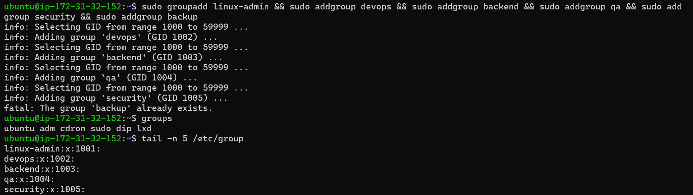

---

## Technical Explanation

Setiap group memperoleh **Group Identifier (GID)** yang unik.

Kernel Linux menggunakan GID ketika melakukan proses authorization terhadap file maupun direktori.

Ketika sebuah direktori dimiliki oleh group tertentu, seluruh anggota group tersebut dapat memperoleh hak akses sesuai permission yang diberikan.

---

## Enterprise Insight

Di lingkungan production, group biasanya merepresentasikan fungsi organisasi.

Contoh:

- Linux Administrator
- DevOps Engineer
- Backend Developer
- Security Team
- Database Administrator

Administrator cukup menambahkan user ke dalam group tanpa harus mengubah permission resource satu per satu.

---

## Verification Result

| Item | Status |
|------|--------|
| linux-admin | ✅ Created |
| devops | ✅ Created |
| backend | ✅ Created |
| qa | ✅ Created |
| security | ✅ Created |

---

# Step 2 — Creating Linux Users

## Objective

Membuat akun Linux untuk setiap anggota organisasi sesuai struktur perusahaan.

Setiap user akan memiliki identitas yang unik berupa:

- Username
- UID
- Primary Group
- Home Directory
- Login Shell

---

## Background

Linux menggunakan user sebagai identitas utama ketika menjalankan proses.

Setiap proses yang berjalan di sistem selalu dijalankan atas nama seorang user.

Dengan demikian, identitas user akan menentukan hak akses terhadap:

- File
- Directory
- Process
- Network Resource
- System Service

---

## Implementation

Membuat akun pengguna menggunakan utilitas `useradd`.

```bash
sudo useradd admin01
sudo useradd admin02
sudo useradd devops01
sudo useradd backend01
sudo useradd backend02
sudo useradd qa01
sudo useradd security01
sudo useradd svc-backup
```

---

## Verification

Memastikan seluruh user telah terdaftar pada sistem.

```bash
tail -n 11 /etc/passwd
```

Contoh hasil:

```text
admin01
admin02
devops01
backend01
backend02
qa01
security01
svc-backup
```

Administrator juga dapat melakukan verifikasi menggunakan:

```bash
id admin01
id backend01
id security01
```

---

## Screenshot

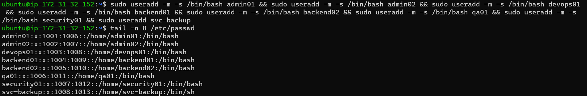

---

## Technical Explanation

Ketika perintah `useradd` dijalankan, Linux secara otomatis:

- membuat UID baru,
- membuat Primary Group dengan nama yang sama (User Private Group),
- menambahkan entri ke `/etc/passwd`,
- menambahkan entri ke `/etc/shadow`,
- membuat entri group baru pada `/etc/group`.

Pada implementasi ini, user dibuat terlebih dahulu sebelum dilakukan konfigurasi group membership pada tahap berikutnya.

---

## Enterprise Insight

Pada lingkungan enterprise, pembuatan user sering dilakukan secara otomatis menggunakan:

- Ansible
- Terraform
- Cloud-init
- LDAP
- FreeIPA
- Active Directory

Namun administrator tetap harus memahami proses manual agar mampu melakukan troubleshooting ketika otomatisasi mengalami kegagalan.

---

## Verification Result

| Username | Status |
|-----------|--------|
| admin01 | ✅ Created |
| admin02 | ✅ Created |
| devops01 | ✅ Created |
| backend01 | ✅ Created |
| backend02 | ✅ Created |
| qa01 | ✅ Created |
| security01 | ✅ Created |
| svc-backup | ✅ Created |

---

## Summary

Pada tahap ini telah berhasil dibuat:

- Struktur group organisasi.
- Delapan akun Linux.
- Identitas awal setiap pengguna.
- Fondasi untuk konfigurasi password, group membership, dan permission pada tahap berikutnya.

Implementasi berikutnya akan berfokus pada konfigurasi password, Primary Group, Secondary Group, dan hak administratif menggunakan `sudo`.

---

# Step 3 — Password Configuration

## Objective

Mengonfigurasi password untuk setiap user yang memerlukan akses login ke server.

Password merupakan salah satu komponen utama dalam proses autentikasi Linux. Tanpa password, user tidak dapat melakukan login menggunakan metode autentikasi berbasis password maupun menggunakan perintah `su`.

Pada lingkungan enterprise, konfigurasi password selalu menjadi bagian dari proses provisioning akun baru.

---

## Background

Ketika sebuah akun dibuat menggunakan `useradd`, akun tersebut belum memiliki password.

Akibatnya user tidak dapat melakukan login hingga administrator menetapkan password menggunakan utilitas `passwd`.

Password tidak disimpan dalam bentuk plaintext.

Linux menyimpan hash password pada file:

```text
/etc/shadow
```

Ubuntu Server 24.04 secara default menggunakan algoritma **yescrypt** untuk meningkatkan keamanan penyimpanan password.

---

## Implementation

Mengatur password untuk seluruh user.

```bash
sudo passwd admin01
sudo passwd admin02
sudo passwd devops01
sudo passwd backend01
sudo passwd backend02
sudo passwd qa01
sudo passwd security01
sudo passwd svc-backup
```

Administrator kemudian memasukkan password sesuai kebijakan organisasi.

---

## Verification

Memastikan password berhasil dikonfigurasi.

```bash
sudo grep admin01 /etc/shadow
```

Contoh output:

```text
admin01:$y$j9T$....
```

Password yang tersimpan berupa hash sehingga tidak dapat dibaca secara langsung.

---

## Screenshot

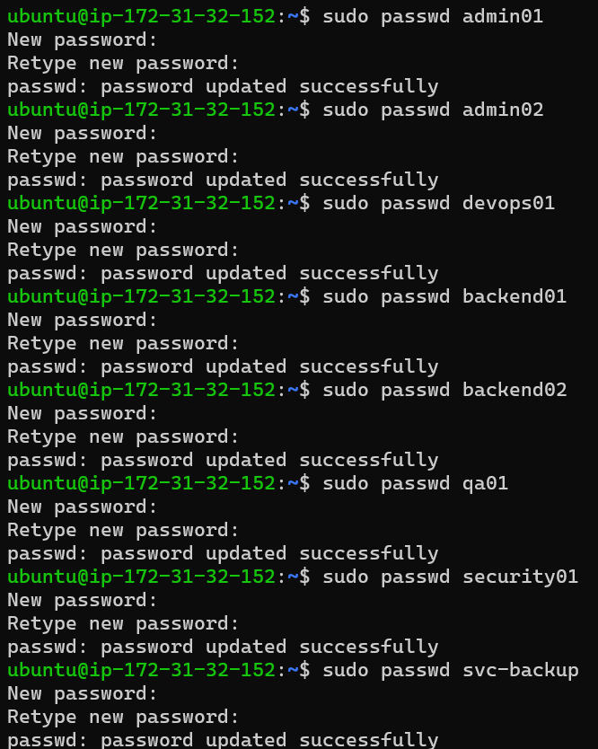

---

## Technical Explanation

Perintah `passwd` melakukan beberapa proses penting.

- Membuat password hash.
- Menyimpan hash ke `/etc/shadow`.
- Memperbarui informasi perubahan password.
- Mengatur parameter umur password sesuai kebijakan sistem.

Kernel Linux tidak pernah menyimpan password asli pengguna.

Saat proses login berlangsung, password yang dimasukkan user akan di-hash kembali, kemudian dibandingkan dengan hash yang berada di `/etc/shadow`.

---

## Security Consideration

Best Practice password pada lingkungan enterprise:

- Minimal 12–16 karakter.
- Kombinasi huruf besar dan kecil.
- Mengandung angka.
- Mengandung simbol.
- Tidak menggunakan password yang mudah ditebak.
- Tidak menggunakan password yang sama pada beberapa akun.

---

## Enterprise Insight

Pada perusahaan besar, password sering kali tidak lagi diatur secara manual.

Identity Provider seperti:

- Microsoft Active Directory
- FreeIPA
- LDAP
- Okta
- Azure AD

akan mengelola proses autentikasi secara terpusat.

Namun administrator Linux tetap harus memahami konfigurasi password lokal untuk kebutuhan troubleshooting.

---

## Verification Result

| Username | Password Configured |
|-----------|---------------------|
| admin01 | ✅ |
| admin02 | ✅ |
| devops01 | ✅ |
| backend01 | ✅ |
| backend02 | ✅ |
| qa01 | ✅ |
| security01 | ✅ |
| svc-backup | ✅ |

---

# Step 4 — Group Membership Assignment

## Objective

Mengatur Primary Group dan Secondary Group agar setiap user memperoleh hak akses sesuai tanggung jawabnya.

Tahap ini merupakan implementasi langsung dari **Role-Based Access Control (RBAC)** dan **Principle of Least Privilege (PoLP)**.

---

## Background

Linux mengenal dua jenis group.

### Primary Group

Primary Group merupakan group utama yang digunakan ketika user membuat file baru.

### Secondary Group

Secondary Group merupakan group tambahan yang memberikan hak akses terhadap resource tertentu.

Administrator tidak perlu mengubah owner setiap file untuk setiap user.

Cukup menambahkan user ke group yang sesuai.

---

# Group Membership Design

| User | Primary Group | Secondary Group |
|------|---------------|-----------------|
| admin01 | admin01 | linux-admin, sudo |
| admin02 | admin02 | linux-admin, sudo |
| devops01 | devops01 | devops |
| backend01 | backend01 | backend |
| backend02 | backend02 | backend |
| qa01 | qa01 | qa |
| security01 | security01 | security |
| svc-backup | svc-backup | backup |

---

## Implementation

Menambahkan user ke Secondary Group.

```bash
sudo usermod -aG linux-admin,sudo admin01

sudo usermod -aG linux-admin,sudo admin02

sudo usermod -aG devops devops01

sudo usermod -aG backend backend01

sudo usermod -aG backend backend02

sudo usermod -aG qa qa01

sudo usermod -aG security security01

sudo usermod -aG backup svc-backup
```

---

## Verification

Melakukan pengecekan membership.

```bash
groups admin01

groups backend01

groups backend02

groups security01

groups svc-backup
```

Administrator juga dapat menggunakan:

```bash
id admin01
id backend01
id security01
```

untuk melihat UID, GID, serta Secondary Group yang dimiliki.

---

## Screenshot

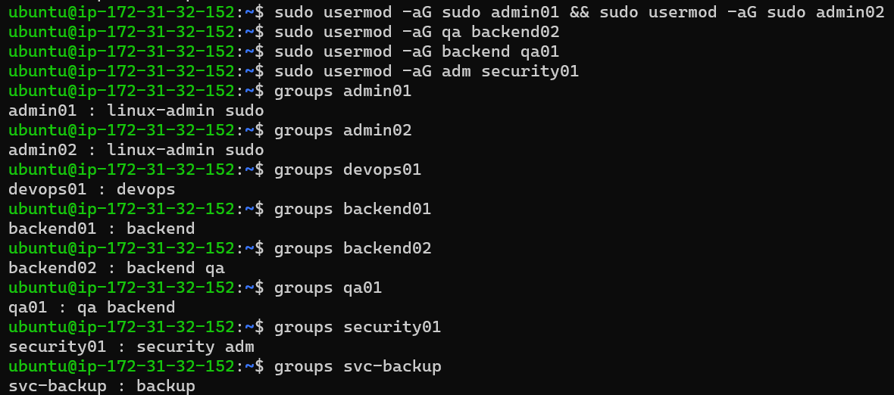

---

## Technical Explanation

Perintah

```bash
usermod -aG
```

memiliki dua parameter penting.

`-G`

Menentukan daftar Secondary Group.

`-a`

Melakukan **append** terhadap Secondary Group yang sudah dimiliki.

Tanpa opsi `-a`, seluruh Secondary Group sebelumnya akan digantikan.

Contoh yang salah:

```bash
sudo usermod -G backend backend01
```

Command di atas akan menghapus seluruh Secondary Group lama.

Karena itu administrator hampir selalu menggunakan:

```bash
sudo usermod -aG
```

---

## Security Consideration

Pemberian akses dilakukan berdasarkan group.

Administrator tidak memberikan permission langsung kepada user karena:

- lebih sulit diaudit,
- sulit dipelihara,
- tidak skalabel.

Pendekatan berbasis group jauh lebih aman untuk lingkungan production.

---

## Enterprise Insight

Di perusahaan besar, satu group biasanya mewakili sebuah divisi.

Contohnya:

```text
backend
frontend
database
security
network
devops
monitoring
```

Ketika ada pegawai baru, administrator cukup menambahkan user ke group yang sesuai tanpa perlu mengubah permission seluruh server.

---

## Verification Result

| Verification | Status |
|--------------|--------|
| Linux Administrator Group | ✅ |
| DevOps Group | ✅ |
| Backend Group | ✅ |
| QA Group | ✅ |
| Security Group | ✅ |
| Backup Group | ✅ |
| Sudo Assignment | ✅ |

---

## Summary

Pada tahap ini seluruh user telah memperoleh hak akses sesuai dengan struktur organisasi.

Konfigurasi group membership menjadi fondasi utama sebelum dilakukan pengaturan service account, ownership direktori, dan simulasi troubleshooting permission pada tahap berikutnya.

---

# Step 5 — Service Account Configuration

## Objective

Membuat dan mengonfigurasi sebuah **service account** yang akan digunakan oleh aplikasi backup.

Berbeda dengan akun pengguna biasa (human user), service account dibuat khusus untuk menjalankan proses atau layanan sistem secara otomatis tanpa digunakan untuk login oleh manusia.

---

## Background

Pada lingkungan enterprise, hampir seluruh service dijalankan menggunakan akun khusus.

Contohnya:

- nginx
- mysql
- postgres
- redis
- prometheus
- grafana
- backup service

Pendekatan ini merupakan implementasi **Principle of Least Privilege (PoLP)**.

Jika sebuah service berhasil dieksploitasi, penyerang hanya memperoleh hak milik service tersebut, bukan hak administratif terhadap seluruh sistem.

---

## Current Configuration

Melihat konfigurasi awal service account.

```bash
getent passwd svc-backup
```

Contoh output:

```text
svc-backup:x:1008:1013::/home/svc-backup:/bin/sh
```

Output di atas menunjukkan bahwa akun masih menggunakan shell login biasa.

---

## Implementation

Mengubah shell menjadi non-interactive shell.

```bash
sudo usermod -s /usr/sbin/nologin svc-backup
```

---

## Verification

Memastikan perubahan berhasil diterapkan.

```bash
getent passwd svc-backup
```

Output yang diharapkan:

```text
svc-backup:x:1008:1013::/home/svc-backup:/usr/sbin/nologin
```

---

## Screenshot

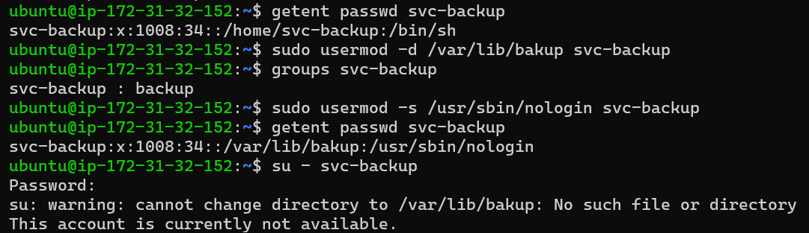

---

## Technical Explanation

Shell

```text
/usr/sbin/nologin
```

memberitahu sistem bahwa akun tersebut **tidak diperbolehkan melakukan login interaktif**.

Apabila seseorang mencoba menjalankan:

```bash
su - svc-backup
```

atau melakukan login melalui SSH menggunakan akun tersebut, sistem akan menolak proses login.

Namun akun tersebut tetap dapat digunakan untuk:

- menjalankan service,
- cron job,
- backup otomatis,
- systemd service,
- automation script.

---

## Security Consideration

Service account sebaiknya:

- tidak memiliki password login,
- menggunakan shell `nologin`,
- memiliki permission seminimal mungkin,
- hanya dapat mengakses resource yang memang dibutuhkan.

Pendekatan ini mengurangi risiko apabila service berhasil dikompromikan.

---

## Enterprise Insight

Hampir seluruh Linux Server production menggunakan service account.

Sebagai contoh:

| Service | User |
|---------|------|
| Nginx | nginx |
| Apache | www-data |
| MySQL | mysql |
| PostgreSQL | postgres |
| Prometheus | prometheus |
| Grafana | grafana |
| Backup Agent | svc-backup |

Administrator hampir tidak pernah menjalankan service menggunakan akun `root`.

---

## Verification Result

| Item | Status |
|------|--------|
| Service Account Created | ✅ |
| Login Shell Updated | ✅ |
| Interactive Login Disabled | ✅ |

---

# Step 6 — Backend Directory Ownership and Permission

## Objective

Membangun direktori aplikasi backend dengan ownership dan permission yang sesuai standar enterprise.

Direktori ini akan digunakan bersama oleh anggota tim Backend Developer.

---

## Background

Dalam lingkungan production, aplikasi biasanya ditempatkan pada direktori khusus.

Contoh:

```text
/opt/application

/var/www

/srv/backend-app
```

Permission harus memastikan bahwa:

- administrator memiliki kontrol penuh,
- anggota tim backend dapat bekerja,
- user lain tidak memiliki akses.

---

## Implementation

Membuat direktori aplikasi.

```bash
sudo mkdir /srv/backend-app
```

Mengubah ownership.

```bash
sudo chown root:backend /srv/backend-app
```

Mengatur permission.

```bash
sudo chmod 770 /srv/backend-app
```

---

## Verification

Melihat ownership dan permission.

```bash
ls -ld /srv/backend-app
```

Output yang diharapkan:

```text
drwxrwx--- root backend
```

---

## Screenshot

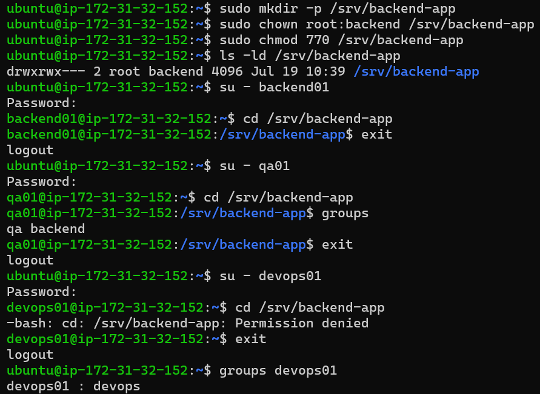

---

## Technical Explanation

Permission

```text
770
```

berarti:

| Owner | Permission |
|--------|------------|
| root | rwx |
| backend | rwx |
| others | --- |

Artinya:

- Root memiliki kontrol penuh.
- Anggota group `backend` dapat membaca, menulis, dan masuk ke direktori.
- User di luar group tidak memiliki akses sama sekali.

---

## Why Not 777?

Memberikan permission:

```bash
chmod 777
```

akan mengizinkan seluruh user pada sistem untuk:

- membaca,
- menulis,
- menghapus file.

Pendekatan tersebut sangat berbahaya dan tidak digunakan pada server production.

---

## Security Consideration

Menggunakan kombinasi:

- owner,
- group,
- permission,

jauh lebih aman dibanding memberikan akses kepada semua user.

Model ini merupakan implementasi dasar **Discretionary Access Control (DAC)** pada Linux.

---

## Enterprise Insight

Struktur seperti ini sangat umum ditemukan pada server produksi.

Sebagai contoh:

```text
Owner  : root
Group  : backend
Mode   : 770
```

Seluruh developer backend memperoleh akses melalui keanggotaan group, bukan karena menjadi owner direktori.

Hal ini memudahkan administrator ketika ada anggota tim baru atau pegawai keluar dari perusahaan.

---

## Verification Result

| Verification | Status |
|--------------|--------|
| Directory Created | ✅ |
| Ownership Updated | ✅ |
| Permission Configured | ✅ |
| Backend Group Access | ✅ |

---

## Summary

Pada tahap ini sistem telah memiliki:

- service account yang aman,
- direktori aplikasi backend,
- ownership sesuai standar enterprise,
- permission berbasis group,
- implementasi Principle of Least Privilege.

Tahap berikutnya akan mensimulasikan sebuah incident **Permission Denied**, melakukan investigasi, menemukan akar masalah, memperbaikinya, dan melakukan verifikasi seperti yang dilakukan Linux Engineer di lingkungan production.

---

# Step 7 — Permission Denied Scenario

## Objective

Mensimulasikan sebuah insiden (*incident*) ketika seorang Backend Developer gagal mengakses direktori aplikasi karena tidak memiliki hak akses yang sesuai.

Skenario ini menggambarkan kasus nyata yang sering terjadi pada lingkungan production dan menjadi salah satu tugas harian Linux Administrator maupun Site Reliability Engineer (SRE).

---

## Background

Server production memiliki direktori aplikasi backend.

```text
/srv/backend-app
```

Ownership direktori telah dikonfigurasi sebagai berikut.

```text
Owner : root
Group : backend
Mode  : 770
```

Artinya hanya:

- root
- anggota group backend

yang dapat mengakses direktori tersebut.

User lain akan ditolak oleh kernel Linux.

---

## Incident Scenario

Developer baru bernama **backend02** mencoba mengakses direktori aplikasi.

```bash
su - backend02
```

Kemudian menjalankan:

```bash
cd /srv/backend-app
```

Output:

```text
Permission denied
```

---

## Screenshot

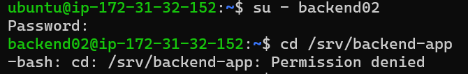

---

## Technical Explanation

Linux Kernel melakukan pemeriksaan permission dengan urutan berikut.

```text
User
        │
        ▼

Owner ?

        │
   Yes ─────► Gunakan Owner Permission

        │
        No

        ▼

Member Group ?

        │
   Yes ─────► Gunakan Group Permission

        │
        No

        ▼

Others Permission

        │
        ▼

Permission Denied
```

Karena user **backend02** belum memiliki hak akses yang sesuai, kernel menggunakan permission **Others**.

Permission Others pada direktori:

```text
770
```

adalah:

```text
---
```

Sehingga akses ditolak.

---

## Security Consideration

Administrator **tidak boleh** langsung menjalankan:

```bash
chmod 777 /srv/backend-app
```

Cara tersebut memang membuat user dapat masuk ke direktori, tetapi juga memberikan akses kepada seluruh user di dalam sistem.

Hal tersebut melanggar Principle of Least Privilege dan meningkatkan risiko keamanan.

---

## Enterprise Insight

Incident seperti ini merupakan salah satu tiket paling sering ditemukan pada tim Linux Administration.

Contoh tiket:

```text
Subject:

Permission Denied

Priority:

Medium

Application:

Backend API

Reporter:

Backend Developer

Environment:

Production
```

Administrator harus melakukan investigasi sebelum melakukan perubahan konfigurasi.

---

# Step 8 — Permission Investigation

## Objective

Melakukan investigasi untuk menemukan penyebab utama (*root cause*) dari masalah permission.

Administrator harus memastikan apakah masalah berasal dari:

- permission file,
- ownership,
- group membership,
- atau kesalahan konfigurasi lainnya.

---

## Investigation Workflow

```text
Permission Denied

        │

        ▼

Check User

        │

        ▼

Check Groups

        │

        ▼

Check Ownership

        │

        ▼

Check Permission

        │

        ▼

Find Root Cause
```

---

## Step 1 — Verify User Identity

```bash
id backend02
```

Contoh output:

```text
uid=1005(backend02)
gid=1010(backend02)
groups=1010(backend02)
```

Administrator langsung melihat bahwa user hanya berada pada group default.

---

## Step 2 — Verify Group Membership

```bash
groups backend02
```

Output:

```text
backend02
```

Tidak terdapat group:

```text
backend
```

---

## Step 3 — Verify Directory Ownership

```bash
ls -ld /srv/backend-app
```

Output:

```text
drwxrwx--- root backend
```

Ownership sudah benar.

---

## Step 4 — Verify Permission

Output menunjukkan:

```text
770
```

Permission juga sudah benar.

Masalah bukan berasal dari permission.

---

## Screenshot

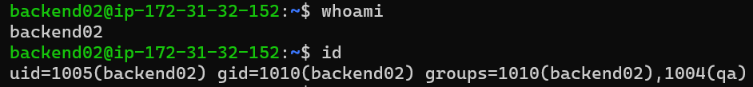

---

## Technical Analysis

Administrator berhasil menghilangkan beberapa kemungkinan.

| Component | Status |
|----------|--------|
| Directory Exists | ✅ |
| Owner Correct | ✅ |
| Group Correct | ✅ |
| Permission Correct | ✅ |
| User in Backend Group | ❌ |

Karena seluruh konfigurasi direktori benar, penyebab utama berada pada konfigurasi user.

---

## Enterprise Insight

Linux Engineer tidak pernah langsung mengubah permission sebelum melakukan investigasi.

Mereka selalu melakukan validasi secara bertahap sehingga perubahan yang dilakukan benar-benar menyelesaikan akar masalah tanpa mengurangi keamanan sistem.

---

# Step 9 — Root Cause Analysis

## Objective

Mengidentifikasi akar penyebab (*root cause*) dari insiden berdasarkan hasil investigasi.

---

## Findings

Hasil pemeriksaan menunjukkan bahwa:

- direktori sudah benar,
- ownership sudah benar,
- permission sudah benar.

Namun user:

```text
backend02
```

belum menjadi anggota group:

```text
backend
```

---

## Screenshot

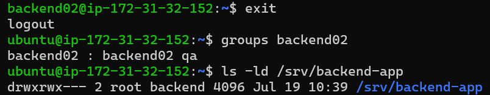

---

## Root Cause

Root cause dari incident adalah:

```text
Incorrect Group Membership
```

Bukan:

- file permission,
- owner,
- filesystem,
- kernel,
- ataupun bug aplikasi.

Masalah sepenuhnya berasal dari konfigurasi Identity and Access Management (IAM) pada sistem operasi Linux.

---

## Technical Explanation

Linux Kernel melakukan evaluasi permission berdasarkan:

1. Effective UID
2. Primary GID
3. Secondary Groups

Karena user tidak termasuk dalam group `backend`, kernel tidak pernah menggunakan permission group.

Sebaliknya kernel menggunakan permission **Others**, yang pada mode `770` tidak memiliki hak akses sama sekali.

---

## Enterprise Insight

Mayoritas kasus **Permission Denied** di lingkungan enterprise sebenarnya bukan disebabkan oleh permission file yang salah, tetapi oleh:

- user belum masuk group yang benar,
- ownership tidak sesuai,
- atau session login belum diperbarui setelah perubahan group.

Oleh karena itu proses investigasi selalu dilakukan sebelum administrator mengambil tindakan perbaikan.

---

# Step 10 — Permission Remediation

## Objective

Melakukan perbaikan terhadap insiden yang telah diidentifikasi pada tahap investigasi.

Tujuan utama bukan hanya membuat user dapat mengakses direktori, tetapi juga memastikan bahwa solusi yang diterapkan tetap mengikuti **Principle of Least Privilege (PoLP)** dan tidak menurunkan tingkat keamanan sistem.

---

## Root Cause Recap

Berdasarkan hasil investigasi sebelumnya diketahui bahwa:

- Direktori telah memiliki ownership yang benar.
- Permission direktori telah dikonfigurasi sesuai kebutuhan.
- User **backend02** belum menjadi anggota group **backend**.

Dengan demikian solusi yang benar adalah memperbaiki **group membership**, bukan mengubah permission direktori.

---

## Remediation

Menambahkan user ke secondary group `backend`.

```bash
sudo usermod -aG backend backend02
```

---

## Refresh Login Session

Perubahan group tidak langsung diterapkan pada session yang sedang aktif.

Logout dari user:

```bash
exit
```

Login kembali.

```bash
su - backend02
```

---

## Verification

Pastikan user telah menjadi anggota group backend.

```bash
groups
```

Output yang diharapkan:

```text
backend02 backend
```

---

## Access Verification

Sekarang coba kembali mengakses direktori aplikasi.

```bash
cd /srv/backend-app
```

Kemudian:

```bash
pwd
```

Output:

```text
/srv/backend-app
```

Hal ini menunjukkan bahwa proses remediation berhasil dilakukan.

---

## Screenshot

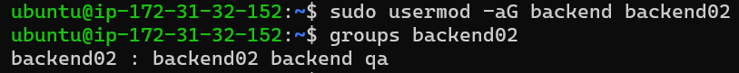

---

## Technical Explanation

Perintah berikut:

```bash
sudo usermod -aG backend backend02
```

memiliki arti:

- **-a** → append (menambahkan tanpa menghapus group lain)
- **-G** → secondary group

Administrator **tidak menggunakan**:

```bash
sudo usermod -G backend backend02
```

karena opsi tersebut akan mengganti seluruh secondary group yang telah dimiliki user dan berpotensi menyebabkan hilangnya akses terhadap resource lain.

---

## Security Consideration

Remediation dilakukan tanpa:

- mengubah owner,
- mengubah permission menjadi 777,
- memberikan hak sudo tambahan,
- atau menjalankan service sebagai root.

Dengan demikian prinsip keamanan sistem tetap terjaga.

---

## Enterprise Insight

Pada lingkungan enterprise, perubahan seperti ini biasanya dilakukan melalui proses **Change Management**.

Administrator akan:

1. Mengidentifikasi akar masalah.
2. Menentukan solusi yang paling aman.
3. Melakukan perubahan.
4. Memverifikasi hasil.
5. Mendokumentasikan perubahan untuk kebutuhan audit.

---

# Step 11 — Final Verification

## Objective

Melakukan verifikasi akhir untuk memastikan seluruh konfigurasi user, group, ownership, dan permission telah sesuai dengan kebutuhan perusahaan.

---

## Verify User Information

```bash
id admin01
id devops01
id backend01
id backend02
id qa01
id security01
```

Seluruh user harus memiliki UID, GID, serta group yang sesuai.

---

## Verify Group Membership

```bash
groups admin01
groups devops01
groups backend01
groups backend02
groups qa01
groups security01
```

Pastikan setiap user berada pada group yang benar sesuai perannya.

---

## Verify Linux User Database

```bash
getent passwd
```

Pastikan seluruh user telah tercatat pada database user Linux.

---

## Verify Linux Group Database

```bash
getent group
```

Pastikan seluruh group enterprise telah berhasil dibuat.

---

## Verify Service Account

```bash
getent passwd svc-backup
```

Pastikan shell service account telah berubah menjadi:

```text
/usr/sbin/nologin
```

---

## Verify Sudo Access

Sebagai administrator.

```bash
sudo -l
```

Output akan menampilkan daftar command yang dapat dijalankan menggunakan sudo.

---

## Verify Backend Directory

```bash
ls -ld /srv/backend-app
```

Output yang diharapkan:

```text
drwxrwx--- root backend
```

---

## Screenshot

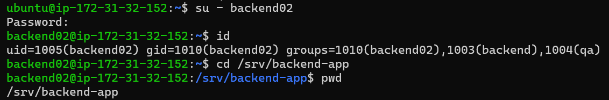

---

## Verification Summary

| Verification Item | Status |
|-------------------|--------|
| User Created | ✅ |
| Group Created | ✅ |
| Password Configured | ✅ |
| Primary Group Configured | ✅ |
| Secondary Group Configured | ✅ |
| Service Account Configured | ✅ |
| Backend Directory Configured | ✅ |
| Permission Incident Resolved | ✅ |
| Sudo Policy Applied | ✅ |
| Linux Databases Verified | ✅ |

---

# Lessons Learned

Melalui Challenge Lab ini saya memperoleh pemahaman mengenai:

- Perbedaan Primary Group dan Secondary Group.
- Cara Linux menyimpan informasi user pada `/etc/passwd`.
- Cara Linux menyimpan informasi group pada `/etc/group`.
- Cara Linux menyimpan password hash pada `/etc/shadow`.
- Cara mengelola user menggunakan `useradd` dan `adduser`.
- Cara mengelola group menggunakan `groupadd`, `groupmod`, dan `gpasswd`.
- Cara mengelola privilege menggunakan `sudo`.
- Cara mengelola service account menggunakan shell `nologin`.
- Cara melakukan troubleshooting permission tanpa mengorbankan keamanan sistem.
- Pentingnya Principle of Least Privilege dalam administrasi Linux.

---

# Enterprise Relevance

Challenge Lab ini merepresentasikan pekerjaan sehari-hari seorang:

- Linux Administrator
- System Administrator
- Cloud Engineer
- DevOps Engineer
- DevSecOps Engineer
- Site Reliability Engineer (SRE)

Aktivitas seperti membuat user, mengelola group, memberikan hak akses, melakukan audit, serta menangani insiden **Permission Denied** merupakan pekerjaan rutin pada server production.

---

# Conclusion

Challenge Lab ini berhasil mengimplementasikan sistem **Identity and Access Management (IAM)** pada Ubuntu Server 24.04 LTS yang berjalan di AWS EC2.

Seluruh user, group, service account, ownership, dan permission telah dikonfigurasi berdasarkan **Principle of Least Privilege (PoLP)**.

Selain membangun struktur user dan group, Challenge Lab ini juga mensimulasikan proses **incident handling** melalui investigasi, analisis akar masalah (*Root Cause Analysis*), proses remediation, serta verifikasi akhir.

Pendekatan ini mencerminkan praktik yang umum diterapkan pada lingkungan enterprise untuk menjaga keamanan, kemudahan audit, dan konsistensi administrasi sistem Linux.

---

# References

- Ubuntu Server Documentation — https://documentation.ubuntu.com/server/
- Linux Manual Pages — https://man7.org/linux/man-pages/
- GNU Core Utilities Documentation — https://www.gnu.org/software/coreutils/manual/
- The Linux Documentation Project — https://tldp.org/
- AWS EC2 User Guide — https://docs.aws.amazon.com/ec2/