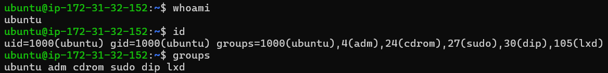
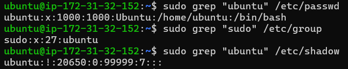
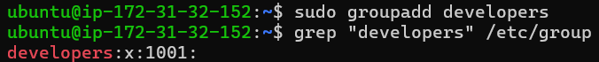
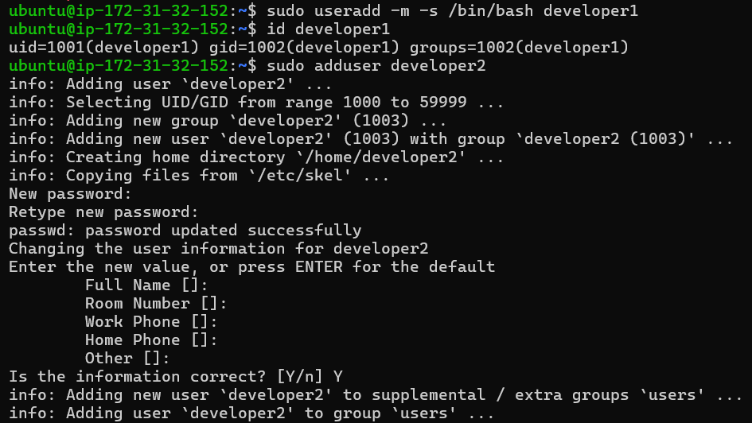
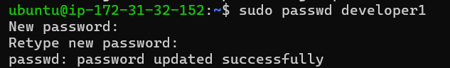

# Hands-on Lab

# Linux User and Group Management

## Phase 01 — Linux Foundation

### Week 1 — Day 4

---

# Overview

Linux User and Group Management merupakan salah satu fondasi utama dalam administrasi sistem Linux. Hampir seluruh layanan yang berjalan pada server Linux—mulai dari web server, database server, container runtime, hingga platform Kubernetes—bergantung pada mekanisme identitas pengguna (*identity*) dan pengelompokan hak akses (*authorization*).

Setiap proses (*process*) yang berjalan di Linux selalu dijalankan atas nama seorang pengguna (*user*) dan sebuah grup (*group*). Informasi tersebut digunakan oleh Linux Kernel untuk menentukan apakah suatu proses memiliki hak untuk membaca, menulis, atau mengeksekusi file maupun direktori tertentu.

Pada praktikum ini dilakukan serangkaian aktivitas administrasi user yang umum dijumpai dalam lingkungan enterprise, seperti membuat user baru, membuat group, mengelola password, memberikan hak administratif menggunakan `sudo`, menguji proses login, serta melakukan proses pembersihan (*cleanup*) setelah pekerjaan selesai.

Seluruh praktikum dilakukan menggunakan **Ubuntu Server 24.04 LTS** yang berjalan pada **Amazon EC2** sehingga lingkungan yang digunakan menyerupai server Linux yang umum dijumpai di dunia industri.

Dokumentasi ini tidak hanya berfokus pada cara menjalankan perintah (*how*), tetapi juga menjelaskan alasan penggunaan (*why*), analisis teknis, implikasi keamanan (*security consideration*), serta implementasi nyata pada lingkungan enterprise.

---

# Learning Objectives

Setelah menyelesaikan Hands-on Lab ini, diharapkan mampu:

- Memahami konsep Linux User dan Group.
- Mengidentifikasi identitas user menggunakan `whoami`, `id`, dan `groups`.
- Memahami struktur database user Linux pada `/etc/passwd`.
- Memahami fungsi database group pada `/etc/group`.
- Memahami penyimpanan password hash pada `/etc/shadow`.
- Membuat group baru menggunakan `groupadd`.
- Membuat user menggunakan `useradd` dan `adduser`.
- Mengelola password menggunakan `passwd`.
- Menambahkan Secondary Group menggunakan `usermod`.
- Menguji proses login menggunakan `su`.
- Memberikan hak administratif menggunakan `sudo`.
- Memahami fungsi `visudo`.
- Menghapus user dan group secara aman.
- Menghubungkan konsep User Management dengan Linux Administration, AWS, Docker, Kubernetes, DevOps, dan Cloud Security.

---

# Prerequisites

Sebelum memulai praktikum ini, beberapa prasyarat berikut telah dipenuhi:

- Telah menyelesaikan materi Linux Foundation Hari 1 sampai Hari 3.
- Memiliki akses ke Ubuntu Server 24.04 LTS.
- Terhubung ke server menggunakan SSH.
- Memiliki akun dengan hak akses `sudo`.
- Memahami dasar Linux Permission dan Ownership.

---

# Environment

| Item | Value |
|------|-------|
| Operating System | Ubuntu Server 24.04 LTS |
| Cloud Platform | Amazon Web Services (AWS) EC2 |
| Architecture | x86_64 |
| Shell | GNU Bash |
| Login User | ubuntu |
| Privilege | sudo |
| Connection Method | SSH |
| Documentation Format | Markdown |
| Version Control | Git & GitHub |

---

# Lab Topology

```text
                    AWS Cloud
                         │
                         │
                  Ubuntu EC2 Instance
                         │
                         ▼
                 Login User : ubuntu
                         │
                  Member of sudo Group
                         │
      ┌──────────────────┴──────────────────┐
      │                                     │
      ▼                                     ▼
Create Group                         Create Users
developers                  developer1 / developer2
      │                                     │
      └──────────────────┬──────────────────┘
                         │
                         ▼
              User & Group Management
                         │
                         ▼
          /etc/passwd   /etc/group   /etc/shadow
                         │
                         ▼
                 Authentication & Authorization
                         │
                         ▼
                    Linux Kernel
```

---

# Lab Workflow

Seluruh praktikum mengikuti alur administrasi user yang umum digunakan oleh Linux Administrator di lingkungan produksi.

```text
Start
  │
  ▼
Identify Current User
  │
  ▼
Read User Information
  │
  ▼
Read Linux User Database
  │
  ▼
Create New Group
  │
  ▼
Create New Users
  │
  ▼
Configure Password
  │
  ▼
Modify Group Membership
  │
  ▼
Verify Login
  │
  ▼
Grant Administrative Privileges
  │
  ▼
Verify sudo Access
  │
  ▼
Cleanup User & Group
  │
  ▼
Final Verification
```

Workflow di atas menggambarkan siklus sederhana manajemen identitas (*Identity Lifecycle*) yang biasa dilakukan administrator sistem. Dalam lingkungan enterprise, proses tersebut biasanya dilakukan melalui otomasi menggunakan Ansible, Terraform, LDAP, Microsoft Active Directory, atau layanan Identity and Access Management (IAM). Namun, memahami proses manual tetap menjadi fondasi penting sebelum menggunakan solusi otomasi.

---

# Security Considerations

Selama praktikum ini diterapkan beberapa prinsip keamanan yang umum digunakan dalam administrasi Linux.

- Menggunakan akun `ubuntu` sebagai administrator sehari-hari dengan bantuan `sudo`, bukan login langsung sebagai `root`.
- Memberikan hak administratif hanya kepada user yang benar-benar membutuhkan.
- Mengelola hak akses menggunakan group agar lebih mudah diaudit.
- Menghapus akun yang sudah tidak digunakan untuk mengurangi risiko penyalahgunaan (*orphan account*).
- Menggunakan utilitas `visudo` saat mengelola konfigurasi `sudo`.
- Tidak melakukan perubahan langsung terhadap file `/etc/passwd`, `/etc/group`, maupun `/etc/shadow`.

Pendekatan ini mengikuti prinsip **Principle of Least Privilege (PoLP)**, yaitu memberikan hak akses seminimal mungkin sesuai kebutuhan pengguna.

---

# Enterprise Relevance

Konsep User dan Group Management merupakan salah satu kemampuan dasar yang wajib dimiliki oleh Linux Administrator, Cloud Engineer, DevOps Engineer, Site Reliability Engineer (SRE), maupun Cloud Security Engineer.

Dalam implementasi nyata, konsep yang dipraktikkan pada lab ini digunakan pada berbagai teknologi, di antaranya:

- **AWS EC2** untuk mengelola akun administrator server.
- **Docker** untuk menentukan UID dan GID pada container serta volume.
- **Kubernetes** melalui pengaturan `runAsUser`, `runAsGroup`, dan `fsGroup`.
- **CI/CD Pipeline** untuk menjalankan proses build menggunakan service account khusus.
- **Web Server** seperti Nginx atau Apache yang berjalan menggunakan akun layanan (`www-data`).
- **Database Server** seperti MySQL dan PostgreSQL yang memiliki service account tersendiri.
- **Cloud Security** dalam penerapan Identity and Access Management (IAM) dan Principle of Least Privilege.

Pemahaman terhadap materi ini menjadi dasar sebelum mempelajari Service Management, SSH Hardening, Docker, Kubernetes, Infrastructure as Code (Terraform), serta Platform Engineering pada fase-fase pembelajaran berikutnya.

---

# Hands-on Lab Sections

Dokumentasi praktikum ini dibagi menjadi beberapa bagian agar mudah dipelajari dan direferensikan.

| Lab | Materi |
|------|--------|
| Lab 1 | Identifikasi User Saat Ini |
| Lab 2 | Melihat UID, GID, dan Group |
| Lab 3 | Menampilkan Semua Group |
| Lab 4 | Membaca `/etc/passwd` |
| Lab 5 | Membaca `/etc/group` |
| Lab 6 | Membaca `/etc/shadow` |
| Lab 7 | Membuat Group Baru |
| Lab 8 | Membuat User Menggunakan `useradd` |
| Lab 9 | Membuat User Menggunakan `adduser` |
| Lab 10 | Mengelola Password |
| Lab 11 | Menambahkan Secondary Group |
| Lab 12 | Menguji Login Menggunakan `su` |
| Lab 13 | Memberikan Hak `sudo` |
| Lab 14 | Memahami `visudo` |
| Lab 15 | Cleanup User dan Group |

---

> **Selanjutnya:** Bagian berikutnya akan mendokumentasikan setiap Hands-on Lab secara rinci, mencakup tujuan, perintah yang dijalankan, penjelasan teknis, output yang diharapkan, analisis, *enterprise insight*, serta screenshot hasil praktikum.

---

# Lab 1 — Identifikasi User yang Sedang Login

## Objective

Memastikan identitas user yang sedang aktif sebelum melakukan perubahan administratif pada sistem Linux.

Verifikasi identitas pengguna merupakan langkah awal yang sangat penting karena seluruh aktivitas administrasi, seperti pembuatan user, perubahan group, maupun pengelolaan permission, bergantung pada hak akses (*privilege*) yang dimiliki oleh user yang sedang login.

---

## Background

Di lingkungan enterprise, administrator hampir selalu memverifikasi identitas akun sebelum menjalankan perintah administratif.

Kesalahan menggunakan akun yang salah dapat menyebabkan:

- Perubahan konfigurasi pada akun yang tidak sesuai.
- Gagal menjalankan command karena hak akses tidak mencukupi.
- Kesalahan audit karena aktivitas tercatat atas nama user yang berbeda.

Oleh karena itu, command `whoami` sering menjadi command pertama yang dijalankan sebelum melakukan administrasi server.

---

## Command

```bash
whoami
```

---

## Command Explanation

Command `whoami` digunakan untuk menampilkan **effective username**, yaitu nama user yang saat ini digunakan oleh shell.

Command ini tidak menampilkan:

- UID
- Group
- Permission
- Owner file

Melainkan hanya menampilkan identitas user aktif.

---

## Output

```text
ubuntu
```

---

## Analysis

Output menunjukkan bahwa sesi SSH saat ini menggunakan user **ubuntu**.

Pada Ubuntu Server di AWS EC2, user `ubuntu` merupakan akun administrator bawaan yang telah menjadi anggota group `sudo`, sehingga mampu menjalankan command administratif menggunakan `sudo`.

Seluruh command yang membutuhkan hak administratif pada praktikum ini akan dijalankan melalui akun tersebut.

---

## Cloud & DevOps Relevance

Pada server cloud seperti AWS EC2, administrator hampir selalu login menggunakan akun standar seperti:

- ubuntu
- ec2-user
- debian
- rocky
- azureuser

Kemudian menggunakan `sudo` ketika membutuhkan hak administratif.

Pendekatan ini lebih aman dibanding login langsung menggunakan akun `root`.

---

## Enterprise Insight

Dalam lingkungan production, administrator biasanya melakukan pengecekan berikut sebelum melakukan maintenance:

```bash
whoami
hostname
pwd
```

Langkah sederhana ini membantu memastikan bahwa administrator berada pada server dan akun yang benar.

---

## Screenshot



---

## Verification Checklist

- [x] Command berhasil dijalankan
- [x] User aktif berhasil diidentifikasi
- [x] Output sesuai harapan

---

# Lab 2 — Melihat UID, GID, dan Group User

## Objective

Menampilkan identitas lengkap user yang sedang login.

---

## Background

Linux Kernel tidak mengenali username sebagai identitas utama.

Kernel menggunakan:

- UID (User Identifier)
- GID (Group Identifier)

untuk menentukan hak akses terhadap file, direktori, maupun resource sistem.

Oleh karena itu, administrator harus memahami hubungan antara username dengan UID dan GID.

---

## Command

```bash
id
```

---

## Command Explanation

Command `id` menampilkan informasi identitas lengkap user, meliputi:

- UID
- Primary Group (GID)
- Secondary Group
- Nama group

Informasi ini sangat penting ketika melakukan troubleshooting permission.

---

## Output

```text
uid=1000(ubuntu)
gid=1000(ubuntu)
groups=1000(ubuntu),4(adm),24(cdrom),27(sudo),30(dip),105(lxd)
```

---

## Analysis

Berdasarkan output di atas:

| Field | Value |
|--------|-------|
| Username | ubuntu |
| UID | 1000 |
| Primary Group | ubuntu |
| Secondary Groups | adm, cdrom, sudo, dip, lxd |

Linux Kernel akan menggunakan informasi tersebut ketika mengevaluasi permission file dan direktori.

Misalnya ketika user mengakses sebuah file, kernel akan membandingkan UID dan GID user terhadap ownership file tersebut sebelum menentukan apakah akses diberikan atau ditolak.

---

## Cloud & DevOps Relevance

UID dan GID menjadi konsep penting pada:

- Docker Volume Mount
- Kubernetes Security Context
- NFS
- Samba
- Shared Storage
- CI/CD Runner

Perbedaan UID/GID sering menjadi penyebab munculnya error **Permission denied** pada container maupun shared storage.

---

## Enterprise Insight

Saat melakukan troubleshooting permission, command pertama yang biasanya dijalankan administrator adalah:

```bash
id
```

karena sebagian besar masalah akses disebabkan oleh user yang berada pada group yang tidak sesuai.

---

## Screenshot


---

## Verification Checklist

- [x] UID berhasil ditampilkan
- [x] GID berhasil ditampilkan
- [x] Secondary Group berhasil ditampilkan

---

# Lab 3 — Menampilkan Seluruh Group User

## Objective

Mengetahui seluruh group yang dimiliki oleh user aktif.

---

## Background

Linux menggunakan mekanisme group untuk mengelola hak akses secara kolektif.

Dibanding memberikan permission kepada setiap user satu per satu, administrator biasanya cukup menambahkan user ke group tertentu.

Pendekatan ini jauh lebih mudah dikelola, terutama pada lingkungan enterprise dengan ratusan hingga ribuan pengguna.

---

## Command

```bash
groups
```

---

## Command Explanation

Command `groups` menampilkan seluruh group yang menjadi anggota user.

Output biasanya mencakup:

- Primary Group
- Secondary Group

---

## Output

```text
ubuntu adm cdrom sudo dip lxd
```

---

## Analysis

Output menunjukkan bahwa user `ubuntu` merupakan anggota beberapa group sistem.

Contohnya:

- **sudo** → memberikan hak administratif melalui `sudo`.
- **adm** → akses terhadap beberapa log sistem.
- **lxd** → akses terhadap layanan LXD apabila digunakan.

Setiap group memiliki fungsi dan hak akses yang berbeda.

---

## Cloud & DevOps Relevance

Pada server production, pemberian akses hampir selalu dilakukan menggunakan group.

Contohnya:

- docker
- www-data
- mysql
- postgres
- developers
- devops
- security

Dengan pendekatan ini, administrator cukup menambahkan atau menghapus user dari group tanpa perlu mengubah permission file satu per satu.

---

## Enterprise Insight

Pengelolaan akses berbasis group merupakan implementasi nyata dari prinsip **Role-Based Access Control (RBAC)** yang juga digunakan pada:

- Kubernetes RBAC
- AWS IAM Groups
- Azure Active Directory
- LDAP
- Microsoft Active Directory

---

## Screenshot


---

## Verification Checklist

- [x] Group berhasil ditampilkan
- [x] Membership berhasil diverifikasi
- [x] Output sesuai dengan konfigurasi sistem

---

# Lab 4 — Membaca Database User Linux (`/etc/passwd`)

## Objective

Memahami struktur database user lokal Linux.

---

## Background

Seluruh informasi dasar mengenai user lokal disimpan pada file:

```text
/etc/passwd
```

File ini digunakan oleh berbagai layanan sistem untuk mengetahui identitas pengguna, home directory, login shell, serta informasi dasar lainnya.

---

## Command

```bash
sudo grep "ubuntu" /etc/passwd
```

---

## Command Explanation

Command di atas hanya menampilkan baris milik user `ubuntu`, sehingga output lebih ringkas dibanding menampilkan seluruh isi file.

---

## Output

```text
ubuntu:x:1000:1000:Ubuntu:/home/ubuntu:/bin/bash
```

---

## Analysis

Struktur field pada `/etc/passwd` terdiri dari:

| Field | Keterangan |
|--------|------------|
| Username | Nama akun |
| Password Placeholder | Biasanya `x` |
| UID | User Identifier |
| GID | Primary Group |
| Comment | Informasi pengguna |
| Home Directory | Direktori home |
| Login Shell | Shell default |

File ini **tidak lagi menyimpan password** karena password telah dipindahkan ke `/etc/shadow` demi meningkatkan keamanan sistem.

---

## Enterprise Insight

Administrator lebih sering menggunakan:

```bash
getent passwd
```

karena command tersebut mampu membaca user lokal maupun user dari layanan identitas seperti LDAP atau Active Directory.

---

## Screenshot



---

# Lab 5 — Membaca Database Group (`/etc/group`)

## Objective

Memahami struktur database group Linux.

---

## Command

```bash
sudo grep "sudo" /etc/group
```

---

## Command Explanation

Command menggunakan `grep` agar hanya menampilkan informasi group `sudo`, sehingga output lebih fokus dan mudah dianalisis.

---

## Output

```text
sudo:x:27:ubuntu
```

---

## Analysis

Format file `/etc/group` terdiri dari:

| Field | Keterangan |
|--------|------------|
| Group Name | Nama group |
| Password Placeholder | Biasanya `x` |
| GID | Group Identifier |
| Members | Daftar anggota group |

Pada output di atas, terlihat bahwa user `ubuntu` merupakan anggota group `sudo`, sehingga memiliki hak untuk menjalankan perintah administratif menggunakan `sudo`.

---

## Enterprise Insight

Di lingkungan enterprise, administrator hampir tidak pernah memberikan akses berdasarkan user secara langsung. Sebaliknya, akses diberikan melalui group agar lebih mudah dikelola, diaudit, dan dipelihara.

Sebagai contoh:

- Tim DevOps → `devops`
- Tim Developer → `developers`
- Tim Database → `dba`
- Tim Security → `security`

Pendekatan ini memudahkan proses onboarding maupun offboarding pengguna.

---

## Screenshot


---

> **Selanjutnya:** Bagian 3 akan membahas Lab 6 sampai Lab 10, meliputi pembacaan `/etc/shadow`, pembuatan group, pembuatan user dengan `useradd` dan `adduser`, serta pengelolaan password menggunakan `passwd`.

---

# Lab 6 — Membaca Database Password (`/etc/shadow`)

## Objective

Memahami lokasi penyimpanan informasi password pengguna pada sistem Linux serta mengetahui mengapa file tersebut memiliki perlindungan akses yang sangat ketat.

---

## Background

Pada sistem Linux modern, password **tidak lagi disimpan** di file `/etc/passwd`.

Seluruh informasi autentikasi pengguna dipindahkan ke file:

```text
/etc/shadow
```

Langkah ini dilakukan untuk meningkatkan keamanan sistem karena hanya user `root` yang diperbolehkan membaca file tersebut.

Selain password hash, file ini juga menyimpan informasi mengenai:

- Password aging
- Masa berlaku password
- Tanggal perubahan password terakhir
- Status akun

---

## Command

```bash
sudo grep "ubuntu" /etc/shadow
```

---

## Command Explanation

Command menggunakan `sudo` karena file `/etc/shadow` hanya dapat diakses oleh user dengan hak administratif.

Penggunaan `grep` bertujuan menampilkan hanya informasi milik user `ubuntu`, sehingga output lebih ringkas dan mudah dipahami.

---

## Output

```text
ubuntu:!:20650:0:99999:7:::
```

---

## Analysis

Struktur umum file `/etc/shadow` terdiri dari beberapa field:

| Field | Keterangan |
|--------|------------|
| Username | Nama akun |
| Password Hash | Hash password atau status akun |
| Last Password Change | Hari sejak 1 Januari 1970 |
| Minimum Password Age | Batas minimal perubahan password |
| Maximum Password Age | Masa berlaku password |
| Warning Period | Peringatan sebelum password kedaluwarsa |
| Inactive Period | Masa nonaktif akun |
| Expiration Date | Tanggal kedaluwarsa akun |

Pada output di atas, karakter `!` menunjukkan bahwa akun `ubuntu` **tidak menggunakan autentikasi password lokal**, sehingga login dilakukan menggunakan metode lain, seperti **SSH Key Authentication**.

Hal ini merupakan konfigurasi bawaan pada Ubuntu Server di AWS EC2.

---

## Security Best Practice

- Jangan pernah mengedit `/etc/shadow` secara manual.
- Gunakan command resmi seperti:
  - `passwd`
  - `usermod`
  - `chage`
- Batasi akses hanya kepada user `root`.

---

## Cloud & DevOps Relevance

Sebagian besar instance cloud modern, termasuk AWS EC2, Azure VM, dan Google Compute Engine, menggunakan **SSH Key Authentication** sehingga akun administrator bawaan biasanya tidak memiliki password aktif.

Pendekatan ini jauh lebih aman dibandingkan autentikasi berbasis password.

---

## Enterprise Insight

Audit keamanan pada server production sering memeriksa informasi di `/etc/shadow` untuk mendeteksi:

- Password yang sudah kedaluwarsa.
- Akun tanpa password.
- Akun yang terkunci.
- Kebijakan rotasi password.

---

## Screenshot


---

## Verification Checklist

- [x] File berhasil diakses menggunakan sudo
- [x] Informasi user berhasil ditampilkan
- [x] Memahami fungsi `/etc/shadow`

---

# Lab 7 — Membuat Group Baru

## Objective

Membuat group baru sebagai dasar pengelolaan hak akses berbasis kelompok (*group-based access control*).

---

## Background

Linux menggunakan **group** untuk mengelola hak akses secara kolektif.

Pendekatan ini jauh lebih efisien dibandingkan memberikan permission kepada setiap user secara individual.

Pada lingkungan enterprise, satu group biasanya mewakili satu tim atau satu fungsi pekerjaan.

Contohnya:

- developers
- devops
- security
- database
- qa

---

## Command

```bash
sudo groupadd developers
```

---

## Verification Command

```bash
grep "developers" /etc/group
```

---

## Output

```text
developers:x:1001:
```

---

## Command Explanation

Command `groupadd` digunakan untuk membuat group baru.

Linux secara otomatis akan memberikan **Group Identifier (GID)** yang belum digunakan.

Kemudian command `grep` digunakan untuk memastikan bahwa group berhasil ditambahkan ke database group Linux.

---

## Analysis

Output menunjukkan bahwa group `developers` berhasil dibuat dengan GID **1001**.

Saat pertama kali dibuat, group belum memiliki anggota.

Keanggotaan group akan ditambahkan pada langkah berikutnya menggunakan command `usermod`.

---

## Security Best Practice

Menggunakan group sebagai dasar pemberian hak akses merupakan implementasi dari prinsip:

> **Role-Based Access Control (RBAC)**

Dengan pendekatan ini administrator cukup menambahkan atau menghapus user dari group tanpa harus mengubah permission file satu per satu.

---

## Cloud & DevOps Relevance

Konsep group Linux memiliki kemiripan dengan:

- AWS IAM Group
- Azure AD Group
- Kubernetes RBAC Group
- LDAP Group

Semua menggunakan pendekatan yang sama, yaitu mengelompokkan pengguna berdasarkan peran.

---

## Enterprise Insight

Pada perusahaan besar, administrator hampir selalu mengelola akses melalui group karena lebih mudah diaudit dan lebih sederhana saat proses onboarding maupun offboarding karyawan.

---

## Screenshot



---

## Verification Checklist

- [x] Group berhasil dibuat
- [x] GID berhasil diverifikasi
- [x] Group muncul pada `/etc/group`

---

# Lab 8 — Membuat User Baru Menggunakan `useradd`

## Objective

Membuat akun pengguna baru menggunakan utilitas standar Linux yang umum digunakan pada proses otomasi server.

---

## Background

Linux menyediakan beberapa utilitas untuk membuat user.

Dua yang paling umum adalah:

- `useradd`
- `adduser`

Command `useradd` merupakan utilitas tingkat rendah (*low-level utility*) yang banyak digunakan oleh script otomatis seperti:

- Cloud-init
- Terraform
- Ansible
- Bash Automation

Karena sifatnya yang sederhana dan mudah dipanggil oleh program lain.

---

## Command

```bash
sudo useradd -m -s /bin/bash developer1
```

---

## Verification Command

```bash
id developer1
```

---

## Output

```text
uid=1001(developer1) gid=1002(developer1) groups=1002(developer1)
```

---

## Command Explanation

Parameter yang digunakan:

| Parameter | Fungsi |
|-----------|--------|
| `-m` | Membuat home directory |
| `-s /bin/bash` | Menentukan login shell |

Setelah user dibuat, command `id` digunakan untuk memastikan bahwa akun berhasil ditambahkan ke sistem.

---

## Analysis

Output menunjukkan bahwa:

- Username berhasil dibuat.
- Linux memberikan UID baru secara otomatis.
- Linux juga membuat **Primary Group** dengan nama yang sama seperti username.

Pada tahap ini user belum memiliki password sehingga belum dapat melakukan login menggunakan autentikasi password.

Password akan ditambahkan pada langkah berikutnya.

---

## Security Best Practice

Saat membuat user baru, administrator sebaiknya selalu menentukan:

- Home Directory
- Login Shell
- Password
- Group
- Hak sudo (jika diperlukan)

Hal ini menghindari konfigurasi akun yang tidak lengkap.

---

## Cloud & DevOps Relevance

Dalam otomatisasi infrastruktur menggunakan Terraform, Ansible, atau Cloud-init, pembuatan user hampir selalu dilakukan menggunakan konsep yang setara dengan `useradd`.

Oleh karena itu, memahami command ini menjadi dasar penting sebelum mempelajari Infrastructure as Code (IaC).

---

## Enterprise Insight

Administrator production lebih sering menggunakan `useradd` dibandingkan `adduser` pada proses otomatisasi karena utilitas ini lebih sederhana, konsisten, dan mudah diintegrasikan ke dalam script deployment.

---

## Screenshot



---

## Verification Checklist

- [x] User berhasil dibuat
- [x] Home directory berhasil dibuat
- [x] Login shell berhasil ditentukan
- [x] UID dan GID berhasil diverifikasi

---

> **Selanjutnya:** Bagian **3B** akan membahas:
>
> - Lab 9 — Membuat User dengan `adduser`
> - Lab 10 — Mengelola Password dengan `passwd`
> - lengkap dengan analisis, security best practice, cloud relevance, enterprise insight, dan dokumentasi GitHub profesional.

---

# Lab 9 — Membuat User Baru Menggunakan `adduser`

## Objective

Memahami perbedaan antara utilitas `useradd` dan `adduser`, serta mengetahui kapan masing-masing lebih tepat digunakan.

---

## Background

Berbeda dengan `useradd`, command `adduser` merupakan utilitas tingkat tinggi (*high-level utility*) yang dirancang agar lebih mudah digunakan oleh administrator.

Command ini akan memandu proses pembuatan user secara interaktif, termasuk:

- Membuat home directory.
- Menentukan password.
- Membuat primary group.
- Mengisi informasi pengguna.
- Menambahkan user ke group bawaan (jika dikonfigurasi).

---

## Command

```bash
sudo adduser developer2
```

---

## Output

Contoh output:

```text
info: Adding user `developer2' ...
Creating home directory `/home/developer2' ...
New password:
Retype new password:
passwd: password updated successfully
```

---

## Command Explanation

Selama proses ini, sistem akan meminta beberapa informasi seperti:

- Password
- Full Name
- Room Number
- Work Phone
- Home Phone
- Other

Seluruh field selain password bersifat opsional.

---

## Analysis

Berbeda dengan `useradd`, command `adduser` secara otomatis melakukan beberapa konfigurasi tambahan sehingga lebih nyaman digunakan untuk administrasi manual sehari-hari.

Pada praktikum ini, user `developer2` berhasil dibuat beserta:

- Home Directory
- Primary Group
- Password
- Informasi akun

---

## Security Best Practice

Gunakan password yang:

- Minimal 12 karakter.
- Memiliki kombinasi huruf besar, huruf kecil, angka, dan simbol.
- Tidak menggunakan informasi pribadi.
- Tidak digunakan ulang pada akun lain.

---

## Cloud & DevOps Relevance

Walaupun administrator sering menggunakan `adduser` secara manual, tool otomatisasi seperti Terraform, Ansible, dan Cloud-init lebih banyak menggunakan pendekatan setara dengan `useradd`.

Karena itu, seorang Linux Administrator sebaiknya memahami keduanya.

---

## Enterprise Insight

Dalam operasional harian, banyak administrator Ubuntu memilih `adduser` karena lebih cepat dan mengurangi kemungkinan lupa membuat home directory atau menentukan login shell.

---

## Screenshot


---

## Verification Checklist

- [x] User berhasil dibuat
- [x] Home directory berhasil dibuat
- [x] Password berhasil ditentukan
- [x] Primary group otomatis dibuat

---

# Lab 10 — Mengelola Password Pengguna

## Objective

Mengubah password user menggunakan utilitas resmi Linux.

---

## Background

Linux menyediakan command `passwd` untuk mengelola password pengguna.

Administrator tidak perlu mengedit `/etc/shadow` secara manual.

Semua perubahan password akan diproses secara aman oleh sistem.

---

## Command

```bash
sudo passwd developer1
```

---

## Output

```text
New password:
Retype new password:
passwd: password updated successfully
```

---

## Command Explanation

Setelah password dimasukkan dua kali, sistem akan menghasilkan password hash baru dan menyimpannya ke dalam file `/etc/shadow`.

Password asli tidak pernah disimpan dalam bentuk plain text.

---

## Analysis

Pada tahap ini, user `developer1` sudah dapat melakukan login menggunakan autentikasi password.

Sebelumnya akun hanya dibuat tanpa password sehingga belum dapat digunakan untuk login berbasis password.

---

## Security Best Practice

Gunakan kebijakan password yang kuat, misalnya:

- Minimal 12–16 karakter.
- Hindari password sederhana seperti `123456` atau `password`.
- Lakukan rotasi password sesuai kebijakan organisasi.
- Jangan membagikan password melalui media yang tidak aman.

---

## Cloud & DevOps Relevance

Pada server cloud modern seperti AWS EC2, administrator lebih sering menggunakan SSH Key Authentication dibandingkan password.

Namun, memahami `passwd` tetap penting karena banyak service account atau server internal masih menggunakan autentikasi password.

---

## Enterprise Insight

Sebagian besar organisasi menerapkan kebijakan password yang dikombinasikan dengan:

- Password Expiration
- Multi-Factor Authentication (MFA)
- SSH Key Authentication
- Identity Provider (LDAP/Active Directory)

---

## Screenshot



---

## Verification Checklist

- [x] Password berhasil diubah
- [x] Password tersimpan ke `/etc/shadow`
- [x] User siap digunakan untuk login

---

# Ringkasan Bagian 3B

Pada bagian ini telah dipraktikkan:

- Membuat user menggunakan `adduser`.
- Memahami perbedaan `adduser` dan `useradd`.
- Mengelola password menggunakan `passwd`.
- Memahami penyimpanan password pada `/etc/shadow`.
- Mengenal praktik keamanan pengelolaan password di lingkungan Linux.

