# Enterprise Linux Identity Management System

> **FASE 1 — Linux Foundation**  
> **Minggu 1 — Hari 4**  
> **Mini Project**

---

# Project Information

| Information | Details |
|------------|---------|
| Project | Enterprise Linux Identity Management System |
| Phase | FASE 1 — Linux Foundation |
| Week | Week 1 |
| Day | Day 4 |
| Category | Mini Project |
| Operating System | Ubuntu Server 24.04.4 LTS |
| Cloud Platform | Amazon Web Services (AWS EC2) |
| Shell | Bash |
| Architecture | Enterprise Role-Based Access Control (RBAC) |
| Author | Kalikali Kali |

---

# Project Overview

Pada mini project ini saya membangun sebuah **Enterprise Linux Identity Management System** pada **Ubuntu Server 24.04 LTS** yang berjalan di **AWS EC2**.

Implementasi ini mensimulasikan bagaimana sebuah perusahaan mengelola identitas pengguna (*Identity Management*), hak akses (*Authorization*), autentikasi (*Authentication*), serta kebijakan keamanan (*Security Policy*) pada server Linux yang digunakan sebagai infrastruktur produksi.

Berbeda dengan latihan sederhana yang hanya berfokus pada penggunaan command Linux, proyek ini dirancang menggunakan pendekatan **Enterprise Linux Administration** sehingga seluruh konfigurasi mengikuti praktik yang umum diterapkan pada lingkungan profesional.

Fokus utama proyek ini meliputi:

- Perancangan struktur user berdasarkan divisi perusahaan.
- Implementasi Role-Based Access Control (RBAC).
- Pengelolaan Primary Group dan Secondary Group.
- Konfigurasi akun administrator menggunakan `sudo`.
- Implementasi Service Account yang aman.
- Verifikasi seluruh konfigurasi melalui database sistem Linux.
- Audit hak akses menggunakan mekanisme Linux Administration.
- Dokumentasi implementasi secara profesional sebagai portofolio GitHub.

---

# Project Goals

Mini project ini bertujuan untuk mensimulasikan proses implementasi **Identity and Access Management (IAM)** pada sistem operasi Linux sebagaimana dilakukan oleh Linux System Administrator di lingkungan enterprise.

Target utama yang ingin dicapai adalah:

- Mendesain struktur user dan group yang terorganisir.
- Mengimplementasikan Principle of Least Privilege (PoLP).
- Memisahkan Human Account dan Service Account.
- Mengelola autentikasi menggunakan password Linux.
- Mengimplementasikan kebijakan sudo secara aman.
- Melakukan audit terhadap database user Linux.
- Memverifikasi seluruh konfigurasi menggunakan command Linux Administration.
- Mendokumentasikan implementasi secara profesional.

---

# Enterprise Scenario

Mini project ini menggunakan studi kasus sebuah perusahaan SaaS yang sedang melakukan ekspansi infrastruktur cloud.

Perusahaan membutuhkan sebuah server Ubuntu yang berjalan di AWS EC2 untuk mendukung berbagai aktivitas operasional.

Beberapa divisi yang menggunakan server tersebut adalah:

- Linux Administration
- DevOps
- Backend Development
- Quality Assurance (QA)
- Security

Setiap divisi memiliki kebutuhan akses yang berbeda sehingga diperlukan mekanisme pengelolaan user dan group yang terstruktur menggunakan konsep **Role-Based Access Control (RBAC)**.

Administrator bertanggung jawab memastikan bahwa setiap pengguna hanya memperoleh hak akses sesuai dengan tugasnya masing-masing sehingga keamanan sistem tetap terjaga.

---

# Learning Objectives

Setelah menyelesaikan mini project ini, saya mampu:

- Membuat dan mengelola user Linux.
- Membuat dan mengelola Linux Group.
- Mengatur Primary Group dan Secondary Group.
- Mengelola password pengguna.
- Mengimplementasikan akun administrator menggunakan sudo.
- Membuat Service Account yang tidak dapat digunakan untuk login interaktif.
- Memahami struktur database identitas Linux.
- Melakukan audit terhadap hak akses pengguna.
- Memahami implementasi Principle of Least Privilege.
- Menghubungkan Linux User Management dengan kebutuhan infrastruktur enterprise.

---

# Technologies Used

Mini project ini menggunakan teknologi berikut.

| Technology | Purpose |
|------------|---------|
| Ubuntu Server 24.04.4 LTS | Operating System |
| AWS EC2 | Cloud Compute Platform |
| Bash Shell | Command Line Interface |
| Linux User Management | Identity Management |
| Linux Group Management | Role Management |
| sudo | Privilege Escalation |
| Shadow Password | Authentication |
| RBAC | Authorization Model |

---

# Environment Information

| Component | Value |
|----------|-------|
| Operating System | Ubuntu Server 24.04.4 LTS |
| Distribution | Ubuntu |
| Release | Noble Numbat |
| Kernel | 6.17.0-1017-aws |
| Platform | AWS EC2 |
| Shell | Bash |
| Architecture | x86_64 |

---

# Skills Covered

Mini project ini mengimplementasikan berbagai keterampilan dasar Linux Administration yang menjadi fondasi untuk pembelajaran cloud dan DevOps.

Beberapa kompetensi yang diterapkan antara lain:

- Linux User Management
- Linux Group Management
- User Authentication
- Password Management
- Service Account Configuration
- Role-Based Access Control (RBAC)
- Linux Authorization
- Linux Security Best Practice
- Linux Administration
- Identity Verification
- Security Validation
- Enterprise Documentation

---

# Project Deliverables

Output utama dari mini project ini meliputi:

- Enterprise User Management Design
- Enterprise Group Structure
- Human User Configuration
- Service Account Configuration
- Primary Group Configuration
- Secondary Group Configuration
- Password Policy Implementation
- Sudo Policy Configuration
- Identity Verification
- Authentication Verification
- Authorization Audit
- Service Account Validation
- Final Enterprise Validation
- Professional Documentation
- GitHub Portfolio Ready

---

# Repository Structure

```text
phase-01-linux/
└── day-04/
    ├── assets/
    │   └── screenshots/
    │       └── mini-project/
    ├── hands-on-lab.md
    ├── challenge-lab.md
    └── mini-project.md
```

---

# Project Workflow

Mini project ini dikerjakan menggunakan alur implementasi yang menyerupai proses deployment pada lingkungan enterprise.

```text
Environment Preparation
        │
        ▼
Enterprise Design
        │
        ▼
Group Provisioning
        │
        ▼
User Provisioning
        │
        ▼
Identity Configuration
        │
        ▼
Access Management
        │
        ▼
Security Configuration
        │
        ▼
Verification
        │
        ▼
Audit
        │
        ▼
Enterprise Validation
```

---

> **Selanjutnya:** Bagian 2 akan membahas **Enterprise Design**, termasuk desain Role-Based Access Control (RBAC), struktur departemen, desain user, group, service account, serta alasan teknis di balik setiap keputusan desain sebelum implementasi dimulai.

---

# Enterprise Design

Sebelum melakukan implementasi, langkah pertama yang dilakukan oleh seorang Linux System Administrator adalah menyusun desain identitas (*Identity Design*) dan kebijakan hak akses (*Access Control Policy*).

Pada lingkungan enterprise, administrator tidak langsung membuat user menggunakan command Linux, tetapi terlebih dahulu menentukan:

- Struktur organisasi.
- Pembagian divisi.
- Role-Based Access Control (RBAC).
- Kebijakan hak akses.
- Service Account.
- Administrator Account.
- Prinsip keamanan yang akan diterapkan.

Pendekatan ini membantu menjaga konsistensi konfigurasi, memudahkan proses audit, serta mengurangi risiko kesalahan konfigurasi pada lingkungan produksi.

---

# Enterprise Architecture

Mini project ini menggunakan simulasi perusahaan SaaS yang memiliki beberapa departemen dengan kebutuhan akses yang berbeda.

```text
                        Company Infrastructure

                               Linux Server
                                     │
        ┌────────────────────────────┼────────────────────────────┐
        │                            │                            │
        ▼                            ▼                            ▼
 Linux Administration            DevOps Team              Backend Team
        │                            │                            │
        ▼                            ▼                            ▼
   admin01                     devops01                    backend01
   admin02                                                  backend02

        ┌────────────────────────────┼────────────────────────────┐
        │                            │
        ▼                            ▼
   QA Team                    Security Team
        │                            │
        ▼                            ▼
      qa01                     security01

                                     │
                                     ▼
                           Service Account
                                     │
                                     ▼
                              svc-backup
```

Diagram di atas menunjukkan bahwa setiap pengguna memiliki peran (*role*) yang berbeda sesuai dengan kebutuhan operasional masing-masing divisi.

Pendekatan ini mengikuti konsep **Role-Based Access Control (RBAC)** yang banyak digunakan pada perusahaan berskala enterprise.

---

# Department Structure

Pada simulasi ini perusahaan memiliki lima divisi utama.

| Department | Responsibility |
|------------|----------------|
| Linux Administration | Administrasi server, konfigurasi sistem, manajemen user, troubleshooting |
| DevOps | Deployment aplikasi, otomatisasi, CI/CD, integrasi layanan |
| Backend Development | Pengembangan aplikasi backend |
| Quality Assurance (QA) | Pengujian aplikasi sebelum produksi |
| Security | Audit keamanan, hardening, dan monitoring keamanan |

Selain akun pengguna (*Human User*), sistem juga memiliki satu **Service Account** yang digunakan untuk proses backup otomatis.

---

# User Design

Setiap pegawai memperoleh akun Linux pribadi.

Pendekatan ini dipilih karena memiliki beberapa keuntungan.

- Aktivitas setiap pengguna dapat diaudit.
- Riwayat penggunaan sudo dapat ditelusuri.
- Hak akses dapat diberikan secara individual.
- Mempermudah proses investigasi apabila terjadi insiden keamanan.

Daftar akun yang digunakan pada mini project ini adalah sebagai berikut.

| Username | Department | Account Type |
|----------|------------|--------------|
| admin01 | Linux Administration | Human User |
| admin02 | Linux Administration | Human User |
| devops01 | DevOps | Human User |
| backend01 | Backend | Human User |
| backend02 | Backend | Human User |
| qa01 | QA | Human User |
| security01 | Security | Human User |
| svc-backup | Backup Service | Service Account |

---

# Group Design

Linux Group digunakan untuk mengelompokkan pengguna berdasarkan fungsi pekerjaannya.

Dengan menggunakan group, administrator tidak perlu memberikan permission kepada setiap user secara satu per satu.

Struktur group yang digunakan pada proyek ini adalah sebagai berikut.

| Linux Group | Purpose |
|------------|---------|
| linux-admin | Administrator Server |
| devops | DevOps Engineer |
| backend | Backend Developer |
| qa | Quality Assurance |
| security | Security Engineer |
| backup | Service Account |

Setiap group merepresentasikan sebuah peran (*role*) di dalam organisasi.

---

# Role-Based Access Control (RBAC)

Mini project ini menggunakan pendekatan **Role-Based Access Control (RBAC)**.

Artinya, hak akses tidak diberikan berdasarkan nama pengguna, tetapi berdasarkan peran yang dimiliki.

```text
                    Linux Groups

          linux-admin
                 │
       admin01
       admin02

────────────────────────────────────

             devops
                 │
            devops01

────────────────────────────────────

            backend
          │           │
     backend01    backend02

────────────────────────────────────

               qa
               │
             qa01

────────────────────────────────────

            security
                │
          security01

────────────────────────────────────

             backup
                │
          svc-backup
```

Dengan pendekatan ini, administrator hanya perlu mengelola group.

Apabila terdapat pegawai baru, administrator cukup menambahkan user tersebut ke dalam group yang sesuai tanpa harus mengubah konfigurasi permission secara keseluruhan.

---

# Primary Group Design

Setiap Human User memiliki satu **Primary Group**.

Primary Group digunakan sebagai group utama yang akan dimiliki oleh file atau direktori baru yang dibuat oleh user tersebut.

Konfigurasi Primary Group pada proyek ini dirancang sebagai berikut.

| User | Primary Group |
|------|---------------|
| admin01 | linux-admin |
| admin02 | linux-admin |
| devops01 | devops |
| backend01 | backend |
| backend02 | backend |
| qa01 | qa |
| security01 | security |
| svc-backup | backup |

Pendekatan ini membuat kepemilikan file menjadi lebih konsisten sesuai dengan fungsi masing-masing pengguna.

---

# Secondary Group Design

Selain Primary Group, beberapa pengguna juga memperoleh Secondary Group untuk mendukung kolaborasi lintas divisi.

Konfigurasi yang digunakan pada mini project ini adalah sebagai berikut.

| User | Secondary Group | Purpose |
|------|-----------------|---------|
| admin01 | sudo | Administrasi Server |
| admin02 | sudo | Administrasi Server |
| devops01 | backend | Deployment Application |
| qa01 | backend | Testing Application |
| security01 | linux-admin | Security Audit |

Pendekatan ini memberikan fleksibilitas tanpa harus mengubah Primary Group pengguna.

---

# Service Account Design

Mini project ini juga menggunakan satu Service Account.

```text
Username

svc-backup
```

Service Account ini memiliki karakteristik berikut.

- Tidak digunakan oleh manusia.
- Tidak memiliki shell interaktif.
- Digunakan untuk proses otomatis.
- Menggunakan shell `/usr/sbin/nologin`.
- Menjadi anggota group `backup`.

Pendekatan ini merupakan praktik umum pada lingkungan Linux Production.

---

# Principle of Least Privilege (PoLP)

Seluruh desain hak akses mengikuti prinsip **Principle of Least Privilege (PoLP)**.

Artinya, setiap akun hanya memperoleh hak minimum yang diperlukan untuk menjalankan tugasnya.

Contohnya:

- Administrator memperoleh hak sudo.
- Backend Developer tidak memperoleh hak sudo.
- QA hanya memperoleh akses yang dibutuhkan untuk pengujian.
- Security memperoleh akses audit tanpa menjadi administrator penuh.
- Service Account tidak dapat melakukan login interaktif.

Pendekatan ini membantu mengurangi risiko penyalahgunaan hak akses apabila salah satu akun berhasil dikompromikan.

---

# Security Design

Beberapa kebijakan keamanan yang diterapkan pada mini project ini meliputi:

- Menggunakan akun individual untuk setiap pengguna.
- Memisahkan Human User dan Service Account.
- Menggunakan Linux Group sebagai mekanisme Role-Based Access Control.
- Menghindari penggunaan akun root untuk aktivitas sehari-hari.
- Memberikan hak sudo hanya kepada administrator.
- Menggunakan shell `/usr/sbin/nologin` pada Service Account.
- Melakukan audit identitas menggunakan database sistem Linux.
- Memverifikasi konfigurasi sebelum sistem dinyatakan siap digunakan.

---

# Enterprise Insight

Pada perusahaan berskala besar, administrator tidak mengelola permission berdasarkan nama pengguna, tetapi berdasarkan **Role**.

Sebagai contoh, ketika terdapat pegawai baru pada tim Backend, administrator cukup:

1. Membuat akun Linux baru.
2. Menetapkan Primary Group ke `backend`.
3. Menambahkan Secondary Group apabila diperlukan.
4. Menetapkan password.
5. Melakukan verifikasi menggunakan command Linux.

Pendekatan ini membuat sistem jauh lebih mudah dipelihara dibandingkan memberikan permission secara individual kepada setiap user.

---

> **Selanjutnya:** Bagian 3 akan memasuki tahap implementasi dengan melakukan identifikasi lingkungan server (*Environment Preparation*) serta pembuatan struktur Linux Group yang menjadi fondasi dari seluruh sistem Identity Management.

---

# Environment Preparation

Sebelum melakukan konfigurasi Identity Management, langkah pertama yang dilakukan adalah melakukan identifikasi terhadap lingkungan sistem (*Environment Assessment*).

Tahap ini bertujuan untuk memastikan bahwa administrator bekerja pada server yang benar, mengetahui informasi sistem operasi yang digunakan, serta memahami identitas pengguna yang sedang aktif.

Pada lingkungan enterprise, proses ini merupakan salah satu langkah awal yang selalu dilakukan sebelum melakukan perubahan konfigurasi terhadap server produksi.

---

# Objective

Tahapan ini bertujuan untuk:

- Memastikan administrator berada pada server yang benar.
- Mengidentifikasi sistem operasi yang digunakan.
- Memverifikasi kernel Linux.
- Mengetahui identitas pengguna yang sedang login.
- Mendokumentasikan informasi lingkungan kerja sebelum implementasi dimulai.

---

# Screenshot

**File:**

```text
assets/screenshots/mini-project/01-environment-information.png
```

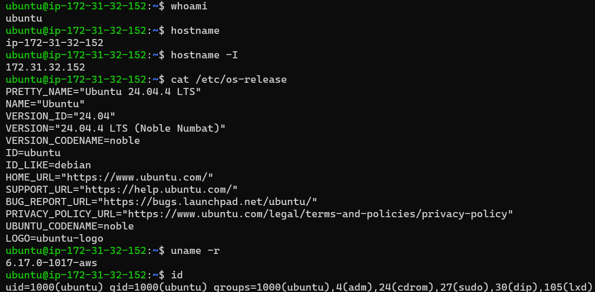

---

# Environment Information

Hasil identifikasi menunjukkan bahwa mini project ini dijalankan pada lingkungan berikut.

| Component | Information |
|-----------|-------------|
| Operating System | Ubuntu Server 24.04.4 LTS |
| Distribution | Ubuntu |
| Release | Noble Numbat |
| Kernel | 6.17.0-1017-aws |
| Platform | AWS EC2 |
| Default User | ubuntu |
| Shell | Bash |

---

# Commands Used

```bash
whoami

hostname

hostname -I

cat /etc/os-release

uname -r

id
```

---

# Technical Explanation

Beberapa command digunakan untuk memperoleh informasi dasar mengenai sistem.

### `whoami`

Menampilkan nama pengguna (*current user*) yang sedang aktif pada terminal.

Command ini penting untuk memastikan bahwa administrator bekerja menggunakan akun yang benar sebelum melakukan perubahan terhadap sistem.

---

### `hostname`

Menampilkan nama host (*hostname*) dari server Linux.

Hostname digunakan sebagai identitas server di dalam jaringan sehingga administrator dapat memastikan bahwa konfigurasi dilakukan pada instance yang tepat.

---

### `hostname -I`

Menampilkan alamat IP yang dimiliki oleh server.

Informasi ini berguna untuk:

- Verifikasi konektivitas.
- Dokumentasi jaringan.
- Troubleshooting.
- Administrasi server.

---

### `cat /etc/os-release`

Menampilkan informasi lengkap mengenai distribusi Linux yang digunakan.

File ini berisi informasi seperti:

- Nama distribusi.
- Versi sistem operasi.
- Codename.
- Vendor Linux.

Administrator biasanya menggunakan informasi ini sebelum melakukan instalasi paket maupun konfigurasi tertentu.

---

### `uname -r`

Menampilkan versi kernel Linux yang sedang digunakan.

Kernel merupakan inti dari sistem operasi Linux dan bertanggung jawab terhadap:

- Process Management
- Memory Management
- Device Driver
- File System
- Networking

Mengetahui versi kernel sangat penting terutama ketika melakukan troubleshooting maupun audit keamanan.

---

### `id`

Menampilkan informasi identitas pengguna yang sedang aktif.

Output command ini meliputi:

- User ID (UID)
- Primary Group (GID)
- Secondary Group
- Group Membership

Command `id` merupakan salah satu command yang paling sering digunakan oleh Linux Administrator.

---

# Enterprise Insight

Pada lingkungan produksi, administrator hampir selalu melakukan identifikasi server sebelum melakukan perubahan konfigurasi.

Hal ini bertujuan untuk menghindari kesalahan seperti:

- Melakukan konfigurasi pada server yang salah.
- Mengubah sistem produksi ketika seharusnya bekerja pada server staging.
- Menggunakan akun yang tidak memiliki hak administratif.
- Melakukan troubleshooting pada host yang tidak sesuai.

Dengan melakukan validasi lingkungan kerja di awal, risiko kesalahan operasional dapat dikurangi secara signifikan.

---

# Security Note

Melakukan identifikasi lingkungan sebelum implementasi merupakan bagian dari praktik keamanan operasional (*Operational Security*).

Administrator sebaiknya selalu memastikan:

- Server yang sedang digunakan benar.
- Identitas pengguna sesuai.
- Hak akses administrator tersedia.
- Sistem operasi sesuai dengan dokumentasi proyek.

Langkah sederhana ini dapat mencegah kesalahan konfigurasi yang berpotensi berdampak besar pada lingkungan produksi.

---

# Enterprise Group Provisioning

Setelah lingkungan sistem berhasil diverifikasi, langkah berikutnya adalah membangun struktur Linux Group.

Linux Group merupakan fondasi utama dalam implementasi **Role-Based Access Control (RBAC)** karena seluruh mekanisme pemberian hak akses akan didasarkan pada group, bukan pada nama pengguna.

Pendekatan ini membuat administrasi server menjadi lebih sederhana, mudah diaudit, dan lebih aman.

---

# Objective

Tahap ini bertujuan untuk:

- Membuat struktur group sesuai organisasi perusahaan.
- Menerapkan konsep Role-Based Access Control.
- Menyiapkan Primary Group bagi setiap departemen.
- Menyiapkan fondasi untuk konfigurasi permission pada tahap berikutnya.

---

# Screenshot

**File:**

```text
assets/screenshots/mini-project/02-enterprise-group-creation.png
```

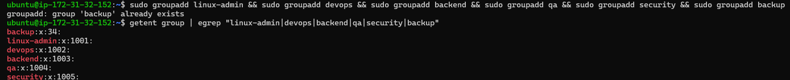

---

# Commands Used

```bash
sudo groupadd linux-admin

sudo groupadd devops

sudo groupadd backend

sudo groupadd qa

sudo groupadd security

sudo groupadd backup

getent group | egrep "linux-admin|devops|backend|qa|security|backup"
```

---

# Technical Explanation

Pada tahap ini dibuat enam Linux Group yang merepresentasikan struktur organisasi perusahaan.

| Group | Purpose |
|--------|----------|
| linux-admin | Administrator Server |
| devops | DevOps Engineer |
| backend | Backend Developer |
| qa | Quality Assurance |
| security | Security Engineer |
| backup | Service Account |

Setelah seluruh group berhasil dibuat, konfigurasi diverifikasi menggunakan command `getent group`.

Berbeda dengan membaca file `/etc/group` secara langsung, command `getent` mengambil data melalui mekanisme **Name Service Switch (NSS)** sehingga hasil yang diperoleh tetap konsisten apabila sistem di kemudian hari menggunakan LDAP, Active Directory, atau FreeIPA.

Oleh karena itu, `getent` lebih direkomendasikan pada lingkungan enterprise.

---

# Enterprise Insight

Pada perusahaan berskala besar, administrator tidak membuat permission berdasarkan nama pengguna.

Sebaliknya, permission diberikan kepada group, kemudian pengguna dimasukkan ke dalam group tersebut sesuai dengan tanggung jawab pekerjaannya.

Pendekatan ini membuat proses administrasi menjadi lebih efisien karena ketika terdapat pegawai baru, administrator hanya perlu menambahkan akun tersebut ke group yang sesuai tanpa harus mengubah konfigurasi permission secara keseluruhan.

---

# Security Note

Menggunakan Linux Group sebagai dasar pengelolaan hak akses membantu menerapkan **Principle of Least Privilege (PoLP)**.

Dengan pendekatan ini:

- Permission lebih mudah diaudit.
- Risiko kesalahan konfigurasi berkurang.
- Hak akses dapat dikelola secara terpusat.
- Administrasi menjadi lebih konsisten pada lingkungan enterprise.

---

> **Selanjutnya:** Bagian 4 akan membahas proses **Identity Provisioning**, yaitu pembuatan Human User, Service Account, serta konfigurasi Primary Group yang menjadi inti dari sistem Identity Management.

---

# Identity Provisioning

Setelah struktur Linux Group berhasil dibuat, langkah berikutnya adalah melakukan proses **Identity Provisioning**.

Identity Provisioning merupakan proses pembuatan identitas digital yang akan digunakan oleh pengguna maupun layanan (*service*) untuk mengakses sistem Linux.

Pada lingkungan enterprise, proses ini tidak hanya membuat akun baru, tetapi juga memastikan bahwa setiap akun memiliki:

- Username yang konsisten.
- Home Directory.
- Login Shell yang sesuai.
- Primary Group.
- Kebijakan keamanan yang jelas.

Dengan pendekatan ini, setiap akun memiliki identitas yang terstruktur sehingga administrasi sistem menjadi lebih mudah dilakukan.

---

# Human User Creation

Tahap pertama adalah membuat akun pengguna (*Human User*) yang mewakili setiap departemen di dalam perusahaan.

Seluruh akun dibuat menggunakan command `useradd` dengan opsi `-m` untuk membuat Home Directory dan `-s /bin/bash` untuk menetapkan Bash sebagai Login Shell.

Pendekatan ini mengikuti praktik umum pada sistem Linux karena setiap pengguna membutuhkan lingkungan kerja (*working environment*) sendiri.

---

# Objective

Tahap ini bertujuan untuk:

- Membuat akun untuk setiap pegawai.
- Menyediakan Home Directory secara otomatis.
- Menentukan Login Shell.
- Menyiapkan identitas dasar sebelum konfigurasi hak akses dilakukan.

---

# Screenshot

**File:**

```text
assets/screenshots/mini-project/03-human-user-creation.png
```

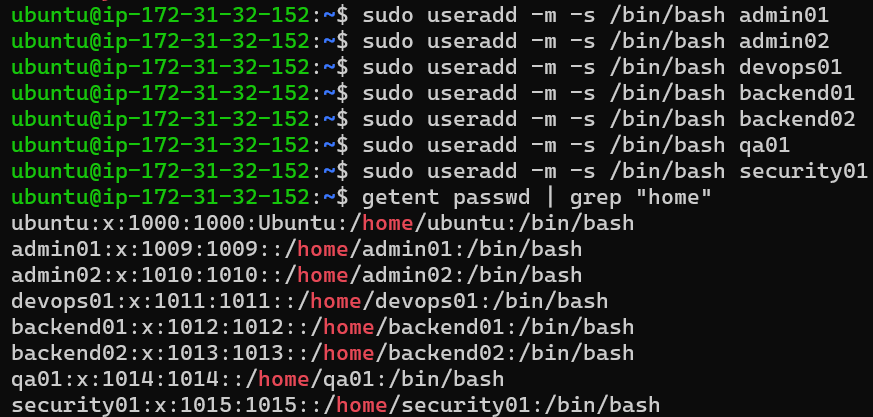

---

# Commands Used

```bash
sudo useradd -m -s /bin/bash admin01

sudo useradd -m -s /bin/bash admin02

sudo useradd -m -s /bin/bash devops01

sudo useradd -m -s /bin/bash backend01

sudo useradd -m -s /bin/bash backend02

sudo useradd -m -s /bin/bash qa01

sudo useradd -m -s /bin/bash security01

getent passwd | grep "/home"
```

---

# Technical Explanation

Opsi `-m` membuat Home Directory secara otomatis pada direktori `/home`.

Sebagai contoh:

```text
/home/admin01
/home/backend01
/home/security01
```

Home Directory digunakan sebagai lokasi penyimpanan file pribadi pengguna, konfigurasi shell, SSH Key, dan berbagai data lainnya.

Sedangkan opsi:

```bash
-s /bin/bash
```

menentukan Bash sebagai Login Shell.

Dengan demikian setiap pengguna memperoleh lingkungan kerja interaktif yang lengkap.

---

# Enterprise Insight

Pada perusahaan besar, setiap engineer selalu memiliki akun Linux sendiri.

Administrator tidak menggunakan akun bersama (*shared account*) karena:

- Sulit diaudit.
- Tidak memenuhi standar keamanan.
- Sulit mengetahui siapa yang melakukan perubahan terhadap sistem.

Penggunaan akun individual membuat setiap aktivitas dapat ditelusuri melalui log sistem.

---

# Security Note

Memberikan satu akun untuk setiap pengguna merupakan bagian dari kontrol keamanan (*Accountability*).

Apabila terjadi insiden keamanan, administrator dapat mengetahui pengguna yang melakukan aktivitas tertentu melalui audit log.

---

# Service Account Creation

Selain Human User, server Linux juga memerlukan akun khusus yang digunakan oleh aplikasi maupun proses otomatis.

Akun ini disebut sebagai **Service Account**.

Berbeda dengan Human User, Service Account tidak digunakan untuk login secara interaktif.

---

# Objective

Tahap ini bertujuan untuk:

- Membuat akun khusus layanan.
- Mencegah login interaktif.
- Mengikuti praktik keamanan Linux Production.

---

# Screenshot

**File:**

```text
assets/screenshots/mini-project/04-service-account-creation.png
```

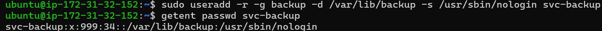

---

# Commands Used

```bash
sudo useradd \
-r \
-g backup \
-d /var/lib/backup \
-s /usr/sbin/nologin \
svc-backup

getent passwd svc-backup
```

---

# Technical Explanation

Beberapa parameter penting yang digunakan antara lain:

| Option | Function |
|---------|----------|
| `-r` | Membuat System Account |
| `-g backup` | Menentukan Primary Group |
| `-d` | Menentukan Home Directory |
| `-s /usr/sbin/nologin` | Menonaktifkan Login Shell |

Hasil verifikasi menunjukkan bahwa akun `svc-backup` menggunakan shell:

```text
/usr/sbin/nologin
```

Artinya akun tersebut tidak dapat digunakan untuk login secara interaktif.

Akun hanya digunakan oleh service atau proses otomatis.

---

# Enterprise Insight

Hampir seluruh aplikasi Linux menggunakan Service Account.

Contohnya:

- nginx
- mysql
- postgres
- redis
- prometheus
- grafana
- chrony

Pendekatan ini membuat setiap service berjalan menggunakan identitas yang terpisah sehingga apabila salah satu service mengalami kompromi, dampaknya dapat dibatasi.

---

# Security Note

Menjalankan service menggunakan akun non-root merupakan salah satu praktik keamanan paling penting pada Linux Administration.

Dengan membatasi hak akses service, administrator dapat mengurangi dampak apabila aplikasi berhasil dieksploitasi oleh penyerang.

---

# Primary Group Configuration

Setelah seluruh akun berhasil dibuat, langkah berikutnya adalah menentukan **Primary Group** untuk setiap pengguna.

Primary Group merupakan group utama yang akan digunakan Linux ketika pengguna membuat file atau direktori baru.

Konfigurasi Primary Group dilakukan agar struktur kepemilikan file mengikuti departemen masing-masing.

---

# Objective

Tahap ini bertujuan untuk:

- Menentukan Primary Group setiap pengguna.
- Menyesuaikan struktur organisasi perusahaan.
- Menyiapkan fondasi permission pada tahap berikutnya.

---

# Screenshot

**File:**

```text
assets/screenshots/mini-project/05-primary-group-configuration.png
```

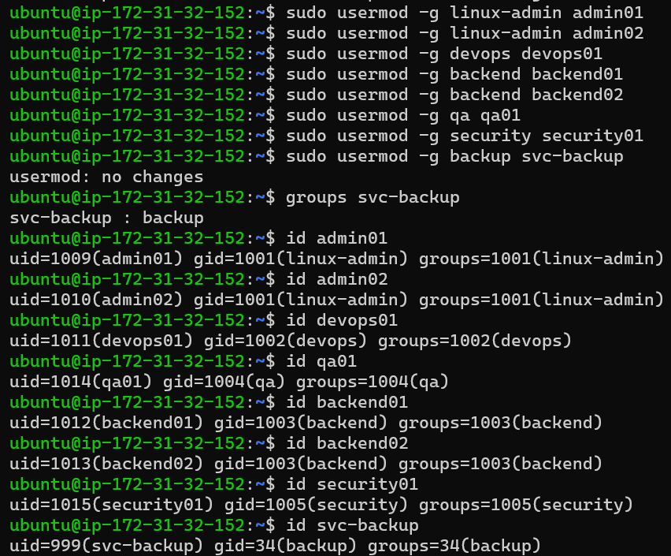

---

# Commands Used

```bash
sudo usermod -g linux-admin admin01

sudo usermod -g linux-admin admin02

sudo usermod -g devops devops01

sudo usermod -g backend backend01

sudo usermod -g backend backend02

sudo usermod -g qa qa01

sudo usermod -g security security01

id admin01
id admin02
id devops01
id backend01
id backend02
id qa01
id security01
id svc-backup
```

---

# Technical Explanation

Command `usermod -g` digunakan untuk mengubah Primary Group pengguna.

Sebagai contoh:

```text
admin01
↓

linux-admin
```

Ketika `admin01` membuat file baru, file tersebut secara otomatis akan memiliki group:

```text
linux-admin
```

Hal yang sama berlaku untuk seluruh pengguna lainnya sesuai dengan departemen masing-masing.

Konfigurasi ini membantu menjaga konsistensi kepemilikan file pada lingkungan enterprise.

---

# Enterprise Insight

Primary Group sering digunakan sebagai dasar pengaturan permission terhadap:

- Shared Directory
- Project Repository
- Deployment Folder
- Configuration File
- Application Data

Dengan demikian administrator tidak perlu mengubah permission setiap kali pengguna baru bergabung ke dalam tim.

---

# Security Note

Menentukan Primary Group yang sesuai membantu menerapkan Role-Based Access Control (RBAC) secara konsisten.

Setiap file baru secara otomatis akan memiliki kepemilikan group yang sesuai dengan fungsi pengguna sehingga risiko kesalahan permission dapat diminimalkan.

---

> **Selanjutnya:** Bagian 5 akan membahas konfigurasi **Secondary Group**, implementasi **Password Policy**, serta **Sudo Policy** untuk membangun mekanisme akses administratif yang aman sesuai praktik Linux Enterprise.

---

# Access Management

Setelah seluruh identitas pengguna berhasil dibuat, tahap berikutnya adalah mengelola hak akses (*Access Management*).

Pada Linux, hak akses tidak hanya ditentukan oleh keberadaan akun pengguna, tetapi juga oleh hubungan antara user, group, password, dan privilege.

Tahapan ini meliputi:

- Konfigurasi Secondary Group.
- Konfigurasi Password.
- Implementasi kebijakan sudo.
- Verifikasi hak administratif.

Pendekatan ini memastikan bahwa setiap pengguna memperoleh hak akses sesuai dengan tanggung jawabnya tanpa melanggar **Principle of Least Privilege (PoLP)**.

---

# Secondary Group Configuration

Primary Group digunakan sebagai identitas utama pengguna, sedangkan **Secondary Group** memberikan hak akses tambahan apabila pengguna membutuhkan kolaborasi dengan departemen lain.

Konsep ini sangat umum digunakan pada perusahaan yang menerapkan **Role-Based Access Control (RBAC)**.

---

# Objective

Tahap ini bertujuan untuk:

- Memberikan hak akses tambahan kepada user tertentu.
- Mendukung kolaborasi lintas divisi.
- Menghindari perubahan Primary Group.
- Mempermudah administrasi hak akses.

---

# Screenshot

**File:**

```text
assets/screenshots/mini-project/06-secondary-group-configuration.png
```

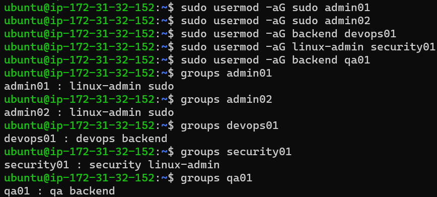

---

# Commands Used

```bash
sudo usermod -aG sudo admin01

sudo usermod -aG sudo admin02

sudo usermod -aG backend devops01

sudo usermod -aG linux-admin security01

sudo usermod -aG backend qa01

groups admin01

groups admin02

groups devops01

groups security01

groups qa01
```

---

# Technical Explanation

Perintah `usermod -aG` digunakan untuk menambahkan pengguna ke **Secondary Group** tanpa menghapus group lain yang telah dimiliki.

Opsi `-a` (*append*) sangat penting karena memastikan keanggotaan group sebelumnya tetap dipertahankan.

Sedangkan opsi `-G` digunakan untuk menentukan daftar Secondary Group yang akan ditambahkan.

Hasil implementasi pada mini project ini adalah sebagai berikut.

| User | Primary Group | Secondary Group |
|------|---------------|-----------------|
| admin01 | linux-admin | sudo |
| admin02 | linux-admin | sudo |
| devops01 | devops | backend |
| qa01 | qa | backend |
| security01 | security | linux-admin |

Dengan konfigurasi tersebut, setiap pengguna memperoleh hak tambahan sesuai dengan kebutuhan pekerjaannya tanpa mengubah identitas utama yang dimiliki.

---

# Enterprise Insight

Secondary Group merupakan mekanisme yang sangat sering digunakan pada lingkungan enterprise.

Sebagai contoh:

- DevOps Engineer dapat memperoleh akses ke direktori aplikasi Backend.
- QA Engineer dapat membaca hasil build aplikasi.
- Security Engineer dapat melakukan audit terhadap konfigurasi administrator.
- Linux Administrator memperoleh hak administratif melalui group `sudo`.

Pendekatan ini jauh lebih fleksibel dibandingkan memberikan permission secara individual kepada setiap pengguna.

---

# Security Note

Selalu gunakan:

```bash
usermod -aG
```

dan hindari penggunaan:

```bash
usermod -G
```

tanpa opsi `-a`, karena perintah tersebut akan mengganti seluruh Secondary Group yang dimiliki pengguna dan dapat menyebabkan hilangnya hak akses yang diperlukan.

---

# Password Policy Configuration

Setelah akun berhasil dibuat, setiap pengguna harus memiliki password yang digunakan sebagai mekanisme autentikasi.

Linux menyimpan password dalam bentuk **hash** sehingga password asli tidak pernah disimpan secara langsung di dalam sistem.

---

# Objective

Tahap ini bertujuan untuk:

- Mengaktifkan autentikasi pengguna.
- Menyiapkan akun agar dapat digunakan untuk login.
- Mengikuti praktik keamanan Linux.

---

# Screenshot

**File:**

```text
assets/screenshots/mini-project/07-password-policy.png
```

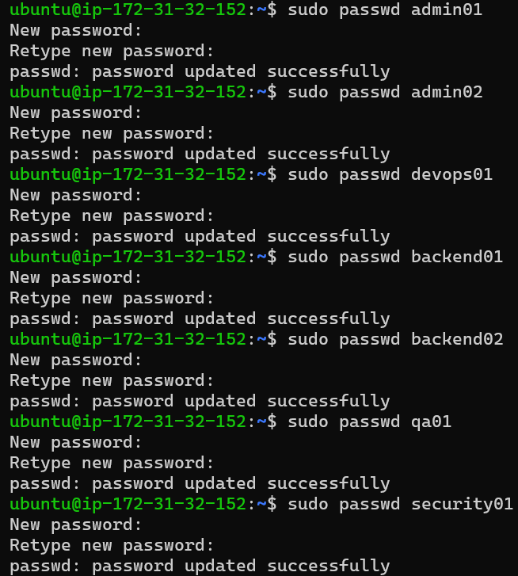

---

# Commands Used

```bash
sudo passwd admin01

sudo passwd admin02

sudo passwd devops01

sudo passwd backend01

sudo passwd backend02

sudo passwd qa01

sudo passwd security01
```

---

# Technical Explanation

Command `passwd` digunakan untuk menetapkan atau mengubah password pengguna.

Ketika password dibuat, Linux tidak menyimpan password dalam bentuk teks biasa (*plain text*).

Sebaliknya, sistem akan menghasilkan **hash password** yang kemudian disimpan di dalam file:

```text
/etc/shadow
```

Pendekatan ini membuat password jauh lebih aman karena hash tidak dapat langsung dikembalikan menjadi password asli.

---

# Enterprise Insight

Pada perusahaan besar, password biasanya mengikuti kebijakan keamanan seperti:

- Minimal 12 karakter.
- Menggunakan huruf besar dan huruf kecil.
- Menggunakan angka.
- Menggunakan simbol.
- Memiliki masa berlaku tertentu.
- Tidak boleh menggunakan password lama.

Saat ini banyak organisasi juga mengombinasikan password dengan **Multi-Factor Authentication (MFA)** untuk meningkatkan keamanan.

---

# Security Note

Administrator tidak boleh mengetahui ataupun menyimpan password pengguna.

Tugas administrator hanya menetapkan password awal atau melakukan reset password apabila diperlukan.

Selanjutnya pengguna bertanggung jawab mengganti password tersebut sesuai kebijakan perusahaan.

---

# Sudo Policy Verification

Tidak semua pengguna diperbolehkan melakukan administrasi sistem.

Pada mini project ini hanya akun administrator yang memperoleh hak untuk menjalankan command menggunakan `sudo`.

Pendekatan ini mengikuti **Principle of Least Privilege (PoLP)**.

---

# Objective

Tahap ini bertujuan untuk:

- Memastikan hanya administrator yang memperoleh hak administratif.
- Memverifikasi implementasi sudo.
- Membuktikan bahwa pengguna biasa tidak memiliki akses administrator.

---

# Screenshot

**File:**

```text
assets/screenshots/mini-project/08-sudo-policy-verification.png
```

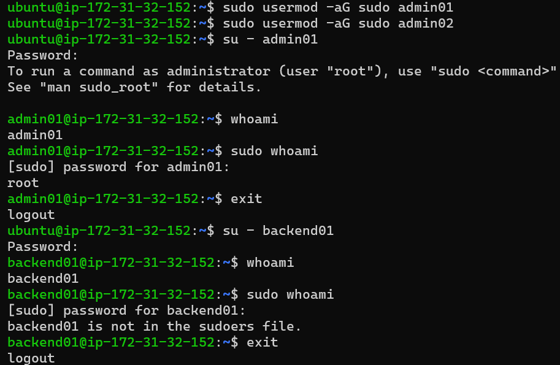

---

# Commands Used

```bash
su - admin01

whoami

sudo whoami

exit

su - backend01

whoami

sudo whoami

exit
```

---

# Technical Explanation

Pengujian dilakukan terhadap dua jenis akun.

### Administrator

Akun `admin01` berhasil menjalankan:

```bash
sudo whoami
```

dan menghasilkan output:

```text
root
```

Hal ini menunjukkan bahwa akun tersebut memiliki hak administratif melalui group `sudo`.

---

### Regular User

Akun `backend01` mencoba menjalankan command yang sama.

Namun sistem menampilkan pesan:

```text
backend01 is not in the sudoers file.
```

Hal ini menunjukkan bahwa kebijakan akses telah diterapkan dengan benar.

---

# Enterprise Insight

Memberikan hak sudo kepada seluruh pengguna merupakan praktik yang sangat tidak disarankan.

Pada lingkungan enterprise, hanya administrator tertentu yang memperoleh hak administratif.

Seluruh aktivitas `sudo` juga dicatat ke dalam log sehingga dapat diaudit apabila terjadi insiden keamanan.

---

# Security Note

Pemberian hak sudo harus dilakukan secara selektif.

Semakin sedikit pengguna yang memiliki hak administratif, semakin kecil pula risiko eskalasi hak akses (*Privilege Escalation*) apabila salah satu akun berhasil dikompromikan.

Pendekatan ini merupakan implementasi langsung dari **Principle of Least Privilege (PoLP)**.

---

> **Selanjutnya:** Bagian 6 akan membahas proses **Identity Verification**, yaitu melakukan audit terhadap database identitas Linux menggunakan `/etc/passwd`, `/etc/group`, `/etc/shadow`, serta memverifikasi UID, GID, dan keanggotaan group setiap pengguna.

---

# Identity Verification and Security Audit

Setelah seluruh akun pengguna berhasil dibuat dan kebijakan hak akses diterapkan, langkah berikutnya adalah melakukan **Identity Verification**.

Tahap ini bertujuan untuk memastikan bahwa seluruh konfigurasi benar-benar tersimpan pada database identitas Linux serta sesuai dengan desain yang telah dibuat sebelumnya.

Pada lingkungan enterprise, administrator tidak menganggap implementasi selesai sebelum seluruh konfigurasi berhasil diverifikasi.

Verifikasi dilakukan terhadap:

- Database User
- Database Group
- Password Database
- Membership Group
- UID
- GID
- Login Shell
- Home Directory

---

# User Database Verification

Database user Linux disimpan pada file:

```text
/etc/passwd
```

Namun pada lingkungan enterprise, administrator lebih sering menggunakan command `getent` dibanding membaca file secara langsung.

Hal ini karena `getent` tetap dapat bekerja apabila sistem menggunakan LDAP, Active Directory, maupun FreeIPA.

---

# Objective

Tahap ini bertujuan untuk:

- Memastikan seluruh akun berhasil dibuat.
- Memastikan Home Directory benar.
- Memastikan Login Shell sesuai.
- Memastikan UID dan GID telah terdaftar.

---

# Screenshot

**File**

```text
assets/screenshots/mini-project/09-user-database-verification.png
```

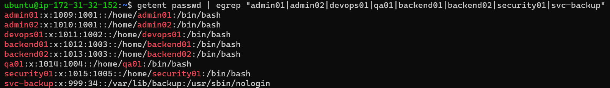

---

# Commands Used

```bash
getent passwd | egrep "admin01|admin02|devops01|qa01|backend01|backend02|security01|svc-backup"
```

---

# Technical Explanation

Command `getent passwd` digunakan untuk mengambil informasi user dari database identitas Linux.

Output yang dihasilkan memperlihatkan beberapa informasi penting.

- Username
- UID
- Primary GID
- Home Directory
- Login Shell

Sebagai contoh:

```text
admin01:x:1009:1001::/home/admin01:/bin/bash
```

Artinya:

| Field | Value |
|------|-------|
| Username | admin01 |
| UID | 1009 |
| Primary GID | 1001 |
| Home Directory | /home/admin01 |
| Login Shell | /bin/bash |

Informasi tersebut menunjukkan bahwa akun berhasil dibuat sesuai dengan rancangan sistem.

---

# Enterprise Insight

Pada perusahaan besar, proses audit user hampir selalu menggunakan:

```bash
getent passwd
```

bukan:

```bash
cat /etc/passwd
```

Karena command tersebut tetap dapat bekerja pada sistem yang menggunakan identitas terpusat seperti:

- LDAP
- Active Directory
- FreeIPA
- SSSD

---

# Security Note

Verifikasi database user membantu administrator mendeteksi berbagai masalah seperti:

- Home Directory yang salah.
- Login Shell yang tidak sesuai.
- UID yang bertabrakan.
- Akun yang tidak semestinya masih aktif.

---

# Group Database Verification

Selain akun pengguna, administrator juga harus memastikan bahwa seluruh Linux Group telah dibuat dengan benar.

Seluruh group akan digunakan sebagai dasar implementasi Role-Based Access Control (RBAC).

---

# Objective

Tahap ini bertujuan untuk:

- Memastikan seluruh Linux Group tersedia.
- Memastikan anggota Secondary Group benar.
- Memverifikasi Primary Group setiap user.

---

# Screenshot

**File**

```text
assets/screenshots/mini-project/10-group-database-verification.png
```

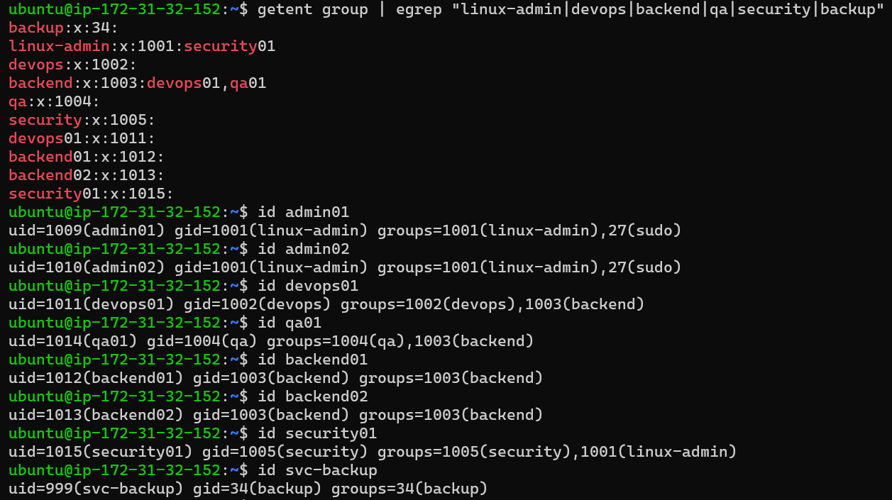

---

# Commands Used

```bash
getent group | egrep "linux-admin|devops|backend|qa|security|backup"

id admin01

id admin02

id devops01

id backend01

id backend02

id qa01

id security01

id svc-backup
```

---

# Technical Explanation

Command:

```bash
getent group
```

digunakan untuk melihat database Linux Group.

Sedangkan:

```bash
id
```

digunakan untuk melihat identitas lengkap pengguna.

Output `id` memperlihatkan:

- UID
- Primary GID
- Secondary Group
- Membership

Sebagai contoh:

```text
uid=1011(devops01)
gid=1002(devops)
groups=1002(devops),1003(backend)
```

Artinya:

- Primary Group adalah `devops`.
- Secondary Group adalah `backend`.

Konfigurasi tersebut sesuai dengan desain RBAC yang telah dibuat sebelumnya.

---

# Enterprise Insight

Command `id` merupakan salah satu command yang paling sering digunakan oleh Linux Administrator.

Ketika terjadi laporan seperti:

> "Saya tidak bisa mengakses folder."

Administrator hampir selalu memulai investigasi menggunakan:

```bash
id username
```

Command ini memberikan gambaran lengkap mengenai identitas dan keanggotaan group pengguna.

---

# Security Note

Melakukan audit group secara berkala membantu mendeteksi:

- User yang memiliki group berlebihan.
- Group yang sudah tidak digunakan.
- Kesalahan konfigurasi RBAC.
- Potensi privilege escalation.

---

# Password Database Verification

Linux tidak menyimpan password dalam bentuk teks biasa.

Seluruh password disimpan dalam bentuk hash pada database:

```text
/etc/shadow
```

File ini hanya dapat dibaca oleh pengguna dengan hak administratif.

---

# Objective

Tahap ini bertujuan untuk:

- Memastikan password berhasil dibuat.
- Memastikan Service Account tidak memiliki password login.
- Memverifikasi keamanan database autentikasi.

---

# Screenshot

**File**

```text
assets/screenshots/mini-project/11-shadow-verification.png
```

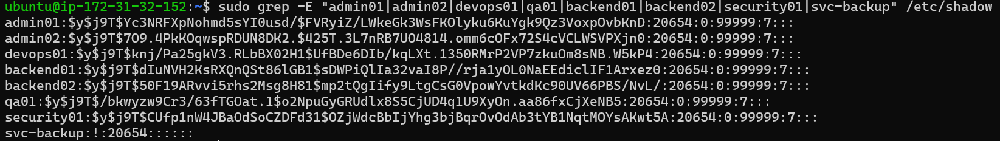

---

# Commands Used

```bash
sudo grep -E "admin01|admin02|devops01|backend01|backend02|qa01|security01|svc-backup" /etc/shadow
```

---

# Technical Explanation

Output memperlihatkan bahwa seluruh Human User memiliki hash password.

Sebagai contoh:

```text
admin01:$y$j9T$...
```

Karakter:

```text
$y$
```

menunjukkan bahwa Ubuntu menggunakan algoritma hashing modern **yescrypt**.

Sedangkan Service Account menghasilkan:

```text
svc-backup:!
```

Karakter:

```text
!
```

menunjukkan bahwa akun tersebut **tidak dapat digunakan untuk login menggunakan password**.

Ini merupakan konfigurasi yang direkomendasikan untuk akun layanan.

---

# Enterprise Insight

Administrator hampir tidak pernah mengetahui password pengguna.

Yang mereka audit hanyalah:

- apakah password tersedia,
- apakah password dikunci,
- apakah akun aktif,
- apakah kebijakan autentikasi sudah sesuai.

Dengan demikian keamanan password pengguna tetap terjaga.

---

# Security Note

File `/etc/shadow` merupakan salah satu file paling sensitif pada sistem Linux.

Hak akses terhadap file ini harus dibatasi hanya untuk administrator karena file tersebut menyimpan informasi autentikasi seluruh pengguna.

---

# Group Membership Verification

Tahap terakhir pada proses Identity Verification adalah memastikan bahwa seluruh pengguna telah menjadi anggota group yang sesuai dengan desain sistem.

Verifikasi ini memastikan implementasi Role-Based Access Control (RBAC) berjalan dengan benar.

---

# Objective

Tahap ini bertujuan untuk:

- Memastikan Primary Group benar.
- Memastikan Secondary Group benar.
- Memastikan seluruh user memiliki hak akses sesuai perannya.

---

# Screenshot

**File**

```text
assets/screenshots/mini-project/12-group-membership-verification.png
```

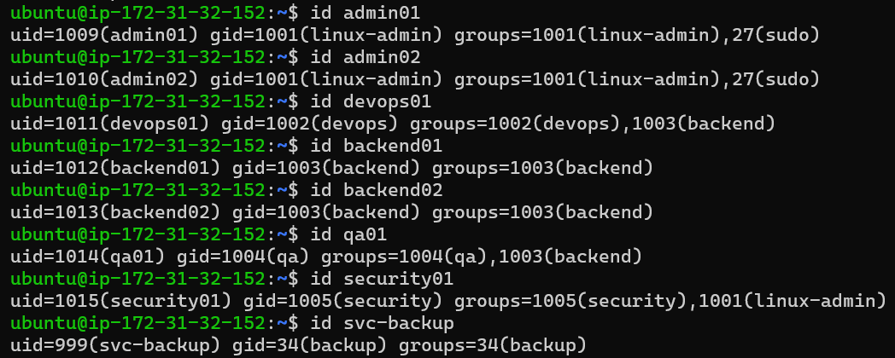

---

# Commands Used

```bash
id admin01

id admin02

id devops01

id backend01

id backend02

id qa01

id security01

id svc-backup
```

---

# Technical Explanation

Command `id` digunakan kembali sebagai proses validasi akhir.

Hasil audit menunjukkan bahwa:

- Administrator memiliki group `linux-admin` dan `sudo`.
- DevOps memiliki akses tambahan ke `backend`.
- QA memiliki akses tambahan ke `backend`.
- Security memiliki akses audit melalui `linux-admin`.
- Service Account hanya berada pada group `backup`.

Konfigurasi ini sesuai dengan desain Enterprise RBAC yang telah dirancang pada awal proyek.

---

# Enterprise Insight

Pada perusahaan besar, proses audit seperti ini biasanya dilakukan secara berkala menggunakan automation maupun configuration management tools seperti:

- Ansible
- Puppet
- Chef
- SaltStack

Tujuannya adalah memastikan tidak ada perubahan hak akses yang dilakukan tanpa persetujuan administrator.

---

# Security Note

Audit keanggotaan group merupakan salah satu aktivitas rutin Linux Administrator untuk menjaga keamanan sistem.

Dengan melakukan audit secara berkala, administrator dapat memastikan bahwa setiap pengguna hanya memiliki hak akses yang benar-benar diperlukan sesuai dengan tanggung jawabnya.

---

> **Selanjutnya:** Bagian 7 akan membahas **Security Validation**, termasuk audit kebijakan `sudo`, validasi Service Account, serta Final Enterprise Validation sebagai tahap penutupan implementasi.

---

# Security Validation and Final Audit

Seluruh proses implementasi Identity Management telah selesai dilakukan.

Tahap terakhir adalah melakukan **Security Validation** dan **Final Enterprise Audit**.

Pada lingkungan production, administrator tidak langsung menyerahkan server kepada tim lain setelah konfigurasi selesai.

Sebaliknya, seluruh konfigurasi akan melalui proses validasi untuk memastikan bahwa:

- Kebijakan keamanan telah diterapkan.
- Hak akses sesuai desain.
- Tidak ada privilege yang berlebihan.
- Service Account telah dikonfigurasi dengan aman.
- Sistem siap digunakan.

Tahap ini merupakan bagian penting dari proses **Hardening**, **Compliance**, dan **Operational Readiness**.

---

# Sudo Policy Audit

Hak administratif merupakan salah satu hak akses paling sensitif pada sistem Linux.

Oleh karena itu, administrator perlu memastikan bahwa hanya pengguna tertentu yang memiliki hak menggunakan `sudo`.

Audit dilakukan dengan memeriksa daftar command yang dapat dijalankan oleh masing-masing pengguna.

---

# Objective

Tahap ini bertujuan untuk:

- Memastikan hanya administrator yang memiliki hak sudo.
- Memastikan pengguna biasa tidak memperoleh privilege administratif.
- Memverifikasi implementasi Principle of Least Privilege.

---

# Screenshot

**File**

```text
assets/screenshots/mini-project/13-sudo-policy-audit.png
```

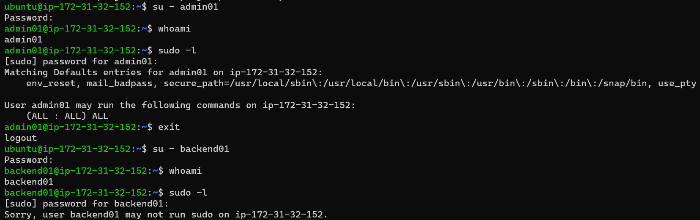

---

# Commands Used

```bash
su - admin01

sudo -l

exit

su - backend01

sudo -l
```

---

# Technical Explanation

Administrator menggunakan command:

```bash
sudo -l
```

untuk melihat daftar command yang diizinkan oleh konfigurasi `sudoers`.

Hasil audit menunjukkan bahwa:

### admin01

```text
User admin01 may run the following commands:

(ALL : ALL) ALL
```

Artinya:

- memiliki hak administratif,
- dapat menggunakan sudo,
- sesuai dengan kebijakan perusahaan.

Sedangkan pada akun:

```text
backend01
```

menghasilkan:

```text
Sorry, user backend01 may not run sudo
```

Hal ini membuktikan bahwa pengguna biasa tidak memperoleh hak administratif.

---

# Enterprise Insight

Pada perusahaan besar, audit seperti ini dilakukan secara berkala.

Administrator akan memeriksa:

- anggota group sudo,
- konfigurasi sudoers,
- hak sudo sementara,
- akun administrator yang sudah tidak aktif.

Tujuannya adalah mengurangi risiko **Privilege Escalation**.

---

# Security Note

Jumlah administrator sebaiknya dijaga seminimal mungkin.

Semakin sedikit akun yang memiliki hak administratif, semakin kecil pula kemungkinan terjadinya penyalahgunaan hak akses maupun kompromi sistem.

Pendekatan ini merupakan implementasi langsung dari **Principle of Least Privilege (PoLP)**.

---

# Service Account Validation

Service Account merupakan akun yang digunakan oleh aplikasi maupun proses otomatis.

Akun ini **tidak boleh digunakan sebagai akun login manusia**.

Oleh karena itu dilakukan pengujian untuk memastikan bahwa akun `svc-backup` benar-benar tidak dapat melakukan login interaktif.

---

# Objective

Tahap ini bertujuan untuk:

- Memastikan Service Account tidak dapat login.
- Memverifikasi konfigurasi `/usr/sbin/nologin`.
- Mengurangi risiko penyalahgunaan akun layanan.

---

# Screenshot

**File**

```text
assets/screenshots/mini-project/14-service-account-validation.png
```

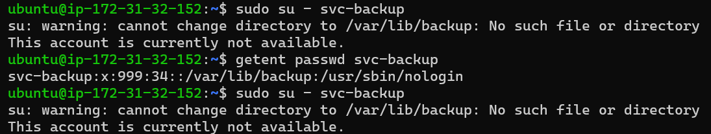

---

# Commands Used

```bash
sudo su - svc-backup
```

---

# Technical Explanation

Hasil pengujian menunjukkan output:

```text
This account is currently not available.
```

Pesan tersebut muncul karena akun menggunakan Login Shell:

```text
/usr/sbin/nologin
```

Dengan konfigurasi tersebut, Service Account tetap dapat digunakan oleh aplikasi atau proses otomatis, tetapi tidak dapat digunakan oleh manusia untuk login ke sistem.

Konfigurasi ini merupakan praktik keamanan yang direkomendasikan pada lingkungan Linux Production.

---

# Enterprise Insight

Sebagian besar layanan Linux menggunakan pendekatan yang sama.

Contohnya:

- nginx
- mysql
- redis
- postgres
- prometheus
- grafana
- chrony

Seluruh service tersebut menggunakan akun khusus yang tidak dapat digunakan untuk login secara interaktif.

---

# Security Note

Service Account sebaiknya:

- tidak memiliki shell interaktif,
- tidak memiliki password login,
- hanya memiliki permission yang diperlukan,
- digunakan khusus oleh aplikasi atau automation.

Pendekatan ini mengurangi kemungkinan penyalahgunaan akun apabila terjadi kompromi pada aplikasi.

---

# Final Enterprise Validation

Tahap terakhir adalah melakukan validasi menyeluruh terhadap seluruh konfigurasi yang telah diterapkan.

Validasi ini memastikan bahwa implementasi Identity Management telah sesuai dengan desain awal dan siap digunakan pada lingkungan simulasi enterprise.

---

# Objective

Tahap ini bertujuan untuk:

- Memastikan seluruh konfigurasi berhasil diterapkan.
- Memastikan seluruh user dan group telah terdaftar.
- Memastikan kebijakan sudo berjalan dengan benar.
- Memastikan Service Account aman.
- Menyatakan implementasi selesai.

---

# Screenshot

**File**

```text
assets/screenshots/mini-project/15-final-enterprise-validation.png
```

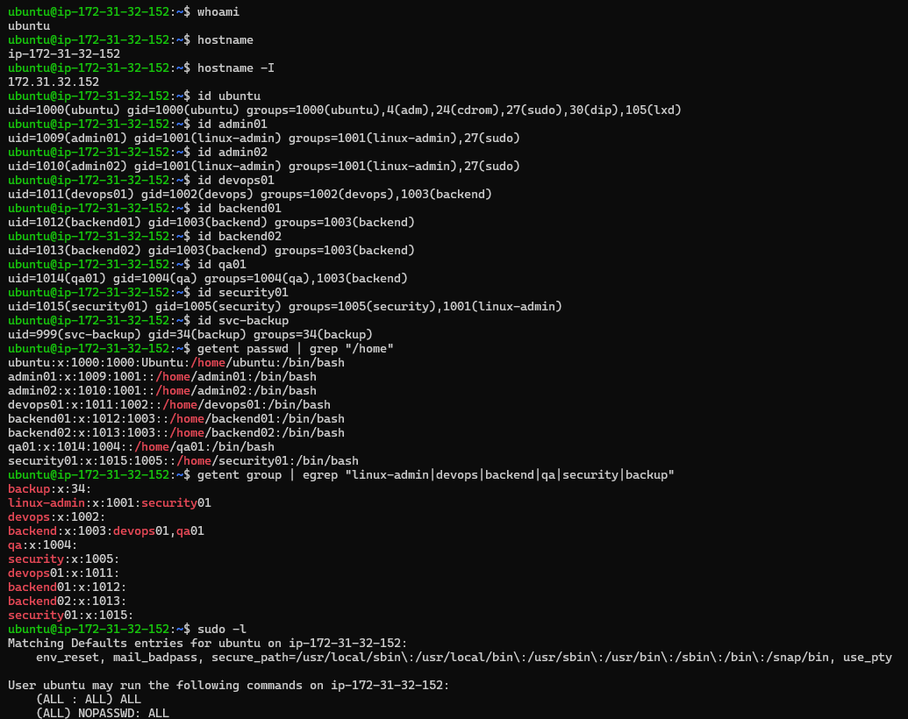

---

# Commands Used

```bash
whoami

hostname

hostname -I

id ubuntu

id admin01

id admin02

id devops01

id backend01

id backend02

id qa01

id security01

id svc-backup

getent passwd | grep "/home"

getent group | egrep "linux-admin|devops|backend|qa|security|backup"

sudo -l
```

---

# Technical Explanation

Proses validasi akhir dilakukan terhadap seluruh komponen utama sistem Identity Management.

Hasil audit menunjukkan bahwa:

- Seluruh Human User berhasil dibuat.
- Seluruh Linux Group berhasil dibuat.
- Primary Group telah sesuai dengan desain.
- Secondary Group berhasil diterapkan.
- Administrator memiliki hak sudo.
- Pengguna biasa tidak memiliki hak administratif.
- Service Account menggunakan shell `/usr/sbin/nologin`.
- Database identitas Linux konsisten dengan hasil implementasi.

Dengan demikian seluruh konfigurasi berhasil diterapkan sesuai dengan kebutuhan mini project.

---

# Enterprise Insight

Tahapan validasi akhir seperti ini umum dilakukan sebelum server:

- diserahkan kepada tim DevOps,
- digunakan oleh tim Developer,
- masuk ke lingkungan Production,
- dijadikan template deployment baru.

Dokumentasi hasil validasi juga menjadi bagian penting dalam proses audit dan compliance perusahaan.

---

# Security Best Practices Applied

Selama mini project ini, beberapa praktik keamanan berhasil diterapkan.

- Menggunakan akun individual untuk setiap pengguna.
- Memisahkan Human User dan Service Account.
- Menerapkan Role-Based Access Control (RBAC).
- Menggunakan Primary Group dan Secondary Group secara tepat.
- Memberikan hak sudo hanya kepada administrator.
- Menggunakan Service Account non-interaktif.
- Melakukan audit terhadap database identitas Linux.
- Melakukan verifikasi terhadap seluruh konfigurasi sebelum implementasi dinyatakan selesai.

Seluruh praktik tersebut mengikuti prinsip **Principle of Least Privilege (PoLP)** yang menjadi salah satu dasar keamanan pada sistem Linux modern.

---

# Project Status

| Item | Status |
|------|--------|
| Enterprise Design | ✅ Completed |
| Linux Group Configuration | ✅ Completed |
| Human User Provisioning | ✅ Completed |
| Service Account Configuration | ✅ Completed |
| Primary Group Configuration | ✅ Completed |
| Secondary Group Configuration | ✅ Completed |
| Password Configuration | ✅ Completed |
| Sudo Policy | ✅ Completed |
| User Verification | ✅ Completed |
| Group Verification | ✅ Completed |
| Shadow Verification | ✅ Completed |
| Service Account Validation | ✅ Completed |
| Final Enterprise Audit | ✅ Completed |

---

> **Selanjutnya:** Bagian 8 akan menjadi penutup mini project yang berisi **Analysis**, **Lessons Learned**, **Enterprise Relevance**, **Conclusion**, **Skills Acquired**, dan **Official References**. Bagian ini akan merangkum seluruh implementasi serta menghubungkannya dengan pekerjaan Linux Administrator, DevOps Engineer, Cloud Engineer, dan Cloud Security Engineer.

---

# Project Analysis

Mini Project ini dirancang untuk mensimulasikan implementasi **Enterprise Linux Identity Management** pada sebuah server Ubuntu Server 24.04 LTS yang berjalan di atas AWS EC2.

Implementasi dilakukan dengan mengikuti prinsip-prinsip administrasi sistem Linux modern yang umum diterapkan pada perusahaan berskala kecil hingga enterprise.

Seluruh konfigurasi difokuskan pada pengelolaan identitas pengguna (*Identity Management*) dan pengendalian hak akses (*Access Management*) menggunakan fitur bawaan Linux.

Arsitektur yang dibangun terdiri dari beberapa komponen utama, yaitu:

- Linux Group sebagai representasi departemen.
- Human User untuk setiap karyawan.
- Service Account untuk proses otomatis.
- Primary Group sebagai identitas utama pengguna.
- Secondary Group untuk kolaborasi lintas divisi.
- Sudo Policy sebagai mekanisme pemberian hak administratif.
- Verifikasi database identitas Linux.
- Audit keamanan terhadap konfigurasi yang telah diterapkan.

Pendekatan ini menghasilkan struktur yang lebih mudah dikelola, mudah diaudit, serta mengikuti konsep **Role-Based Access Control (RBAC)**.

---

# Design Analysis

Struktur organisasi yang digunakan terdiri dari lima departemen utama.

| Department | Linux Group |
|------------|-------------|
| Linux Administration | linux-admin |
| DevOps | devops |
| Backend Development | backend |
| Quality Assurance | qa |
| Security | security |

Selain itu dibuat satu Service Group:

```text
backup
```

yang digunakan oleh Service Account:

```text
svc-backup
```

Dengan desain ini, seluruh hak akses diberikan berdasarkan **group**, bukan berdasarkan nama pengguna.

Pendekatan tersebut membuat proses administrasi jauh lebih sederhana ketika jumlah pengguna bertambah.

---

# Identity Management Analysis

Seluruh Human User dibuat menggunakan:

```bash
useradd -m -s /bin/bash
```

Pendekatan ini memberikan:

- Home Directory.
- Login Shell Bash.
- UID unik.
- Primary Group.

Sedangkan Service Account dibuat menggunakan:

```bash
useradd -r \
-g backup \
-d /var/lib/backup \
-s /usr/sbin/nologin
```

Perbedaan ini menunjukkan bahwa akun manusia dan akun layanan memiliki kebutuhan keamanan yang berbeda.

---

# Access Control Analysis

Mini Project ini menerapkan dua jenis Linux Group.

## Primary Group

Primary Group digunakan sebagai identitas utama pengguna.

Contoh:

```text
backend01

↓

backend
```

Ketika pengguna membuat file baru, file tersebut secara otomatis memiliki group:

```text
backend
```

Hal ini mempermudah kolaborasi dalam satu departemen.

---

## Secondary Group

Secondary Group digunakan untuk memberikan akses tambahan.

Contoh implementasi:

| User | Secondary Group |
|------|-----------------|
| admin01 | sudo |
| admin02 | sudo |
| devops01 | backend |
| qa01 | backend |
| security01 | linux-admin |

Pendekatan ini memungkinkan kolaborasi lintas divisi tanpa mengubah identitas utama pengguna.

---

# Security Analysis

Beberapa praktik keamanan berhasil diterapkan selama implementasi.

## Principle of Least Privilege (PoLP)

Hak administratif hanya diberikan kepada:

- admin01
- admin02

Pengguna lain tidak memperoleh akses `sudo`.

Hal ini mengurangi risiko penyalahgunaan hak administratif.

---

## Role-Based Access Control (RBAC)

Hak akses diberikan kepada Linux Group.

Bukan kepada nama pengguna.

Pendekatan ini:

- lebih mudah dikelola,
- mudah diaudit,
- mudah dikembangkan.

---

## Service Account Isolation

Service Account:

```text
svc-backup
```

menggunakan:

```text
/usr/sbin/nologin
```

sehingga tidak dapat digunakan untuk login interaktif.

Pendekatan ini mengurangi attack surface server.

---

## Password Security

Seluruh password berhasil disimpan pada:

```text
/etc/shadow
```

dalam bentuk hash menggunakan algoritma **yescrypt**, sehingga password asli tidak pernah tersimpan dalam bentuk teks biasa.

---

# Enterprise Relevance

Walaupun proyek ini berjalan pada satu Ubuntu Server di AWS EC2, konsep yang diterapkan sama dengan yang digunakan pada lingkungan enterprise.

## Linux Administration

Linux Administrator setiap hari melakukan pekerjaan seperti:

- membuat user,
- menghapus user,
- mengelola group,
- reset password,
- audit akun,
- mengelola sudo,
- membuat Service Account.

Seluruh aktivitas tersebut telah dipraktikkan pada mini project ini.

---

## AWS Cloud

Pada AWS EC2, Identity Management Linux tetap diperlukan.

AWS IAM hanya mengontrol siapa yang dapat mengakses instance.

Setelah berhasil login ke sistem operasi, autentikasi dan otorisasi tetap menggunakan mekanisme Linux seperti:

- UID,
- GID,
- Linux Group,
- Permission,
- sudo.

---

## Docker

Container modern sebaiknya tidak dijalankan sebagai root.

Sebagai gantinya digunakan akun non-root, misalnya:

```dockerfile
USER app
```

Konsep ini identik dengan penggunaan Service Account pada mini project ini.

---

## Kubernetes

Pada Kubernetes, Pod dapat dijalankan menggunakan identitas pengguna tertentu melalui:

```yaml
securityContext:
  runAsUser: 1000
  runAsGroup: 1000
  fsGroup: 1000
```

Konsep tersebut memiliki dasar yang sama dengan UID dan GID pada Linux.

---

## DevOps

Pipeline CI/CD biasanya menggunakan Service Account seperti:

- jenkins
- gitlab-runner
- github-actions
- argo

Mini project ini memberikan gambaran bagaimana akun layanan dibuat dengan hak akses yang terbatas.

---

## DevSecOps

DevSecOps menambahkan kontrol keamanan terhadap Identity Management seperti:

- audit user,
- audit sudo,
- rotasi password,
- monitoring login,
- pembatasan privilege.

Seluruh konsep tersebut berkaitan langsung dengan implementasi yang dilakukan pada proyek ini.

---

## Site Reliability Engineering (SRE)

Tim SRE mengelola banyak akun otomatis untuk deployment, monitoring, backup, dan observability.

Service Account seperti:

```text
svc-backup
```

merupakan contoh sederhana dari akun otomatis yang umum digunakan pada lingkungan produksi.

---

# Lessons Learned

Melalui mini project ini saya memperoleh pemahaman mengenai:

- Perbedaan Human User dan Service Account.
- Cara membuat dan mengelola Linux Group.
- Konfigurasi Primary Group dan Secondary Group.
- Implementasi Role-Based Access Control (RBAC).
- Konfigurasi sudo menggunakan Principle of Least Privilege.
- Struktur database identitas Linux.
- Proses audit menggunakan `getent`, `id`, dan `sudo -l`.
- Pentingnya verifikasi setelah implementasi selesai.
- Praktik keamanan dasar dalam Linux Administration.

Selain itu saya juga memahami bahwa administrasi Linux tidak hanya berfokus pada menjalankan command, tetapi juga pada proses perencanaan, implementasi, verifikasi, dokumentasi, dan audit.

---

# Skills Acquired

Setelah menyelesaikan mini project ini, keterampilan yang berhasil diperoleh meliputi:

- Linux User Management
- Linux Group Management
- Identity Management
- Access Management
- Linux Authentication
- Linux Authorization
- Linux RBAC
- Service Account Management
- Sudo Administration
- Security Verification
- Linux Identity Audit
- Enterprise Documentation
- Technical Documentation
- Linux Troubleshooting

---

# Conclusion

Mini Project **Enterprise Linux Identity Management System** berhasil diimplementasikan sesuai dengan tujuan yang telah ditetapkan.

Seluruh pengguna, group, Service Account, kebijakan sudo, serta mekanisme verifikasi berhasil dikonfigurasi dan diuji menggunakan fitur bawaan Ubuntu Server 24.04 LTS.

Melalui proyek ini, saya tidak hanya mempelajari penggunaan command Linux, tetapi juga memahami bagaimana Identity Management diterapkan pada lingkungan enterprise dengan mengikuti praktik terbaik di industri.

Mini project ini menjadi fondasi penting sebelum mempelajari topik yang lebih lanjut seperti Linux Permission Management, SSH Hardening, Access Control List (ACL), IAM pada Cloud Platform, Docker, Kubernetes, DevSecOps, dan Site Reliability Engineering (SRE).

---

# Official References

- Linux Foundation
- Ubuntu Server Documentation
- Red Hat Enterprise Linux Documentation
- GNU Coreutils Documentation
- POSIX Documentation
- `man useradd`
- `man usermod`
- `man userdel`
- `man groupadd`
- `man groupmod`
- `man groupdel`
- `man gpasswd`
- `man passwd`
- `man sudo`
- `man visudo`

---

# Final Result

| Item | Status |
|------|--------|
| Enterprise Design | ✅ Completed |
| Group Management | ✅ Completed |
| User Management | ✅ Completed |
| Service Account | ✅ Completed |
| Primary Group | ✅ Completed |
| Secondary Group | ✅ Completed |
| Password Configuration | ✅ Completed |
| Sudo Configuration | ✅ Completed |
| Identity Verification | ✅ Completed |
| Security Audit | ✅ Completed |
| Enterprise Validation | ✅ Completed |
| Documentation | ✅ Completed |

---

> **Mini Project Status:** ✅ **Completed Successfully**

> **Phase:** FASE 1 — Linux Foundation

> **Week:** 1

> **Day:** 4

> **Project:** Enterprise Linux Identity Management System