# Challenge 1 — Ticket #001

## Informasi Challenge

| Item | Value |
|------|-------|
| Ticket ID | #001 |
| Waktu | 08.30 |
| Prioritas | High |
| Role | Junior Linux Administrator |
| Environment | AWS EC2 Ubuntu Server 24.04 LTS |

---

# Studi Kasus

Developer melaporkan bahwa mereka tidak dapat melakukan login ke server menggunakan SSH.

Senior Linux Engineer meminta dilakukan investigasi awal untuk memastikan apakah service SSH berjalan dengan normal tanpa melakukan perubahan pada sistem production.

---

# Tujuan

Melakukan identifikasi terhadap service SSH menggunakan berbagai utilitas Linux serta memahami hubungan antara process, parent process, dan service yang dijalankan oleh systemd.

---

# Command yang Digunakan

```bash
ps -ef | grep ssh

pstree -p

pgrep ssh

pidof sshd

systemctl status ssh
```

---

# Screenshot

### Process SSH

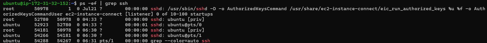

---

### Process Tree

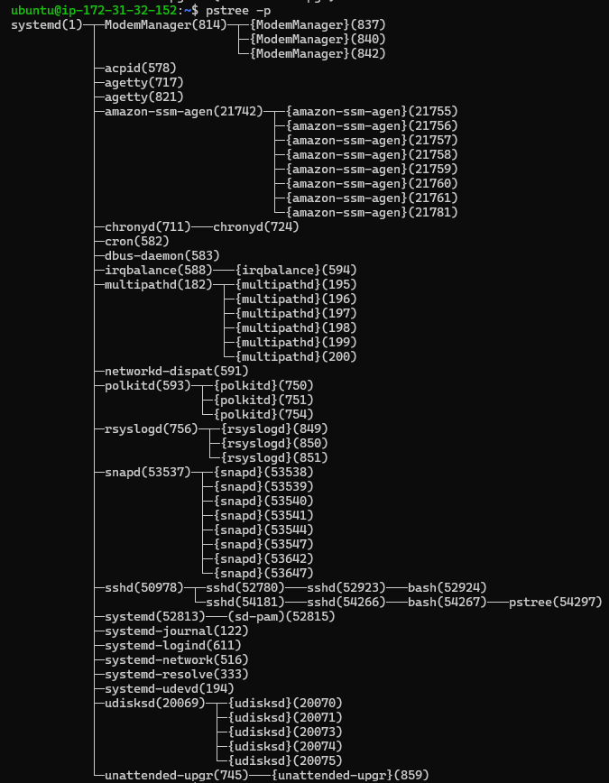

---

### Pencarian PID Menggunakan pgrep

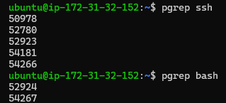

---

### PID Service SSH


---

### Status Service SSH

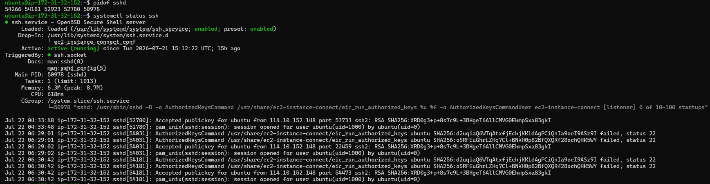

---

# Analisis

Investigasi dimulai dengan memastikan bahwa service SSH memang berjalan pada sistem. Output `ps -ef` menunjukkan beberapa proses `sshd` yang aktif, menandakan daemon SSH sedang menerima koneksi dan membuat child process untuk setiap sesi login.

Melalui `pstree -p` terlihat bahwa seluruh proses SSH berasal dari parent process `systemd` (PID 1). Setelah autentikasi berhasil, `sshd` membuat child process berupa shell `bash` yang digunakan oleh pengguna untuk menjalankan perintah.

Perintah `pgrep` dan `pidof` digunakan untuk memperoleh PID service dengan cepat. Kedua utilitas menghasilkan informasi yang serupa, namun `pidof` hanya menampilkan PID dari executable `sshd`, sedangkan `pgrep` lebih fleksibel karena dapat melakukan pencarian berdasarkan pola nama proses.

Status service kemudian diverifikasi menggunakan `systemctl status ssh`. Hasil menunjukkan bahwa service berada pada status **active (running)**, telah dimuat (loaded) dengan benar, dan dikelola oleh `systemd`.

---

# Hasil Investigasi

- Service SSH berjalan normal.
- Service berada pada status **active (running)**.
- Parent process berasal dari **systemd (PID 1)**.
- Tidak ditemukan indikasi kegagalan service.
- Dugaan awal bahwa masalah login disebabkan oleh service SSH **tidak terbukti**.

---

# Lessons Learned

Melakukan investigasi tidak boleh langsung berasumsi bahwa service mengalami kegagalan. Langkah pertama yang benar adalah memastikan status service, hubungan parent-child process, serta PID yang sedang aktif sebelum melakukan tindakan lebih lanjut.

---

# Enterprise Insight

Pada lingkungan production, proses investigasi seperti ini merupakan langkah standar sebelum melakukan restart service. Engineer harus mengumpulkan bukti terlebih dahulu agar tidak melakukan tindakan yang berpotensi mengganggu layanan yang sedang berjalan.

# Challenge 2 — Ticket #002

## Informasi Challenge

| Item | Value |
|------|-------|
| Ticket ID | #002 |
| Waktu | 09.15 |
| Prioritas | Medium |
| Role | Junior Linux Administrator |

---

# Studi Kasus

Developer melaporkan bahwa server terasa lebih lambat dari biasanya. Manager meminta dilakukan pengecekan apakah terjadi peningkatan penggunaan resource pada server.

---

# Tujuan

Melakukan monitoring penggunaan CPU, memory, load average, dan proses yang sedang berjalan untuk mengetahui kondisi aktual server.

---

# Command yang Digunakan

```bash
top

htop

ps aux --sort=-%cpu | head

ps aux --sort=-%mem | head

uptime
```

---

# Screenshot

### top

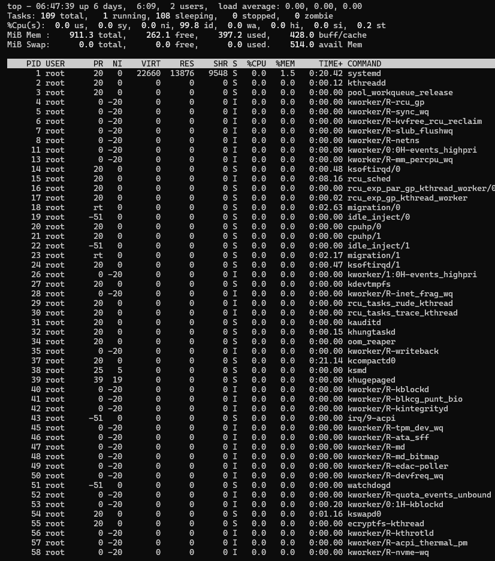

---

### htop

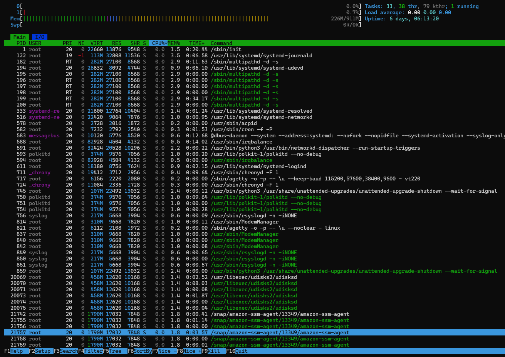

---

### CPU Usage

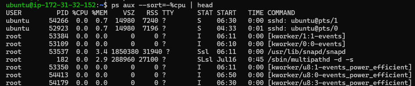

---

### Memory Usage

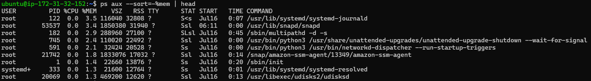

---

### Load Average


---

# Analisis

Monitoring dilakukan menggunakan `top` dan `htop` untuk memperoleh gambaran kondisi server secara real-time. Hasil menunjukkan bahwa CPU berada pada kondisi idle dengan persentase penggunaan yang sangat rendah, sedangkan penggunaan memori masih berada dalam batas normal.

Perintah `ps aux --sort=-%cpu` dan `ps aux --sort=-%mem` digunakan untuk mengidentifikasi proses yang paling banyak menggunakan resource. Tidak ditemukan proses yang menggunakan CPU atau memori secara berlebihan.

Nilai load average juga berada pada tingkat rendah, menunjukkan bahwa server tidak mengalami antrean proses yang signifikan.

---

# Hasil Investigasi

- CPU berada pada kondisi normal.
- Memory masih memiliki ruang yang cukup.
- Load Average rendah.
- Tidak ditemukan indikasi overload.
- Dugaan bahwa server lambat disebabkan oleh resource exhaustion tidak terbukti.

---

# Lessons Learned

Sebelum menyimpulkan penyebab suatu masalah, administrator harus membandingkan kondisi CPU, memory, dan load average secara bersamaan. Penggunaan CPU yang rendah tidak selalu berarti server sehat apabila load average tinggi, begitu pula sebaliknya.

---

# Enterprise Insight

Monitoring resource merupakan langkah awal yang wajib dilakukan sebelum mengambil keputusan seperti restart service atau reboot server. Keputusan tersebut harus didasarkan pada data, bukan asumsi.

# Challenge 3 — Ticket #003

## Informasi Challenge

| Item | Value |
|------|-------|
| Ticket ID | #003 |
| Waktu | 09.40 |
| Prioritas | Medium |

---

# Studi Kasus

Developer melaporkan bahwa proses deployment berhenti ketika koneksi SSH terputus. Senior Linux Engineer meminta dilakukan simulasi untuk memahami mekanisme foreground, background, dan penggunaan `nohup`.

---

# Tujuan

Memahami Job Control pada Bash serta mengetahui cara mempertahankan proses agar tetap berjalan meskipun terminal ditutup.

---

# Command yang Digunakan

```bash
sleep 300

CTRL + Z

jobs

bg %1

fg %1

nohup sleep 300 &

pgrep sleep
```

---

# Screenshot

### Foreground Process


---

### Job Stopped

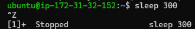

---

### Jobs

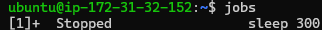

---

### Background Process

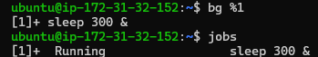

---

### Foreground Kembali

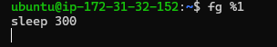

---

### nohup

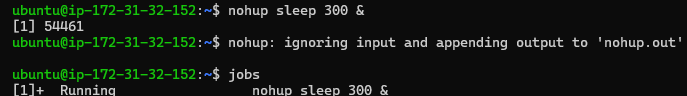

---

### Verifikasi Process

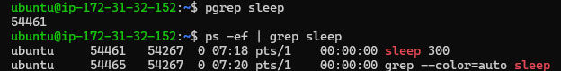

---

# Analisis

Proses `sleep` pertama dijalankan pada foreground sehingga terminal tidak dapat digunakan untuk menjalankan perintah lain. Setelah menerima sinyal SIGTSTP melalui kombinasi `CTRL + Z`, proses dihentikan sementara dan muncul sebagai job dengan status **Stopped**.

Perintah `bg` digunakan untuk melanjutkan proses di background, sedangkan `fg` mengembalikannya ke foreground. Selanjutnya dilakukan simulasi menggunakan `nohup` agar proses tetap berjalan walaupun sesi SSH ditutup.

Verifikasi menggunakan `pgrep` menunjukkan bahwa proses masih aktif setelah dijalankan menggunakan `nohup`.

---

# Hasil Investigasi

- Job Control Bash bekerja sesuai harapan.
- Background process tetap berjalan selama shell aktif.
- `nohup` memungkinkan proses tetap berjalan setelah terminal ditutup.
- Deployment production sebaiknya menggunakan mekanisme yang lebih andal seperti `systemd`, bukan hanya `nohup`.

---

# Lessons Learned

Foreground process hanya cocok untuk pekerjaan interaktif. Untuk proses jangka panjang, administrator harus menggunakan mekanisme yang mampu mempertahankan proses ketika sesi SSH berakhir.

---

# Enterprise Insight

Pada lingkungan production modern, aplikasi umumnya dijalankan sebagai service `systemd`, container Docker, atau workload Kubernetes sehingga memiliki kemampuan restart otomatis dan monitoring yang lebih baik dibandingkan menggunakan `nohup`.

# Challenge 4 — Ticket #004

## Informasi Challenge

| Item | Value |
|------|-------|
| Ticket ID | #004 |
| Waktu | 10.15 |
| Prioritas | Medium |

---

# Studi Kasus

Sebuah proses pengujian masih berjalan setelah proses testing selesai. Senior Linux Engineer meminta proses tersebut dihentikan dengan cara yang aman tanpa mengganggu stabilitas sistem.

---

# Tujuan

Memahami penggunaan Linux Signal untuk menghentikan proses secara bertahap sesuai best practice.

---

# Command yang Digunakan

```bash
kill PID

kill -15 PID

kill -9 PID
```

---

# Screenshot

### SIGTERM


---

### SIGKILL

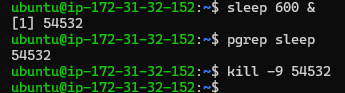

---

# Analisis

Proses dihentikan menggunakan `kill` yang secara default mengirimkan sinyal **SIGTERM (15)**. Sinyal ini memberikan kesempatan kepada aplikasi untuk menutup file, menyimpan data, dan melakukan proses shutdown secara normal.

Sebagai perbandingan, dilakukan simulasi menggunakan **SIGKILL (9)** yang menghentikan proses secara paksa tanpa memberikan kesempatan kepada aplikasi melakukan cleanup.

Pendekatan bertahap ini merupakan praktik yang umum digunakan pada lingkungan production untuk mengurangi risiko kehilangan data atau kerusakan state aplikasi.

---

# Hasil Investigasi

- SIGTERM berhasil menghentikan proses secara normal.
- SIGKILL menghentikan proses secara paksa.
- Tidak ditemukan kendala selama simulasi.
- Penggunaan SIGTERM lebih direkomendasikan untuk administrasi sehari-hari.

---

# Lessons Learned

Tidak semua proses harus dihentikan menggunakan SIGKILL. Administrator perlu memahami karakteristik setiap sinyal agar dapat memilih metode penghentian yang paling aman sesuai kondisi.

---

# Enterprise Insight

Pada server production, penggunaan `kill -9` hanya dilakukan apabila proses benar-benar tidak merespons terhadap SIGTERM. Pendekatan ini membantu menjaga integritas data serta mengurangi risiko gangguan terhadap layanan yang sedang berjalan.

---

# Challenge 5 — Service Investigation

## Ticket #005 — SSH Service Tiba-Tiba Tidak Merespons

### Studi Kasus

Pukul **11.00 WIB**, tim Developer melaporkan bahwa mereka tidak dapat melakukan koneksi SSH ke server production. Senior Linux Engineer meminta saya melakukan investigasi awal untuk memastikan apakah service SSH masih berjalan dengan normal sebelum dilakukan tindakan lebih lanjut.

---

## Tujuan

Melakukan investigasi terhadap kondisi service SSH menggunakan `systemd` untuk memastikan status service, PID utama, serta konfigurasi startup service.

---

## Command yang Digunakan

```bash
systemctl status ssh

systemctl is-active ssh

systemctl is-enabled ssh

systemctl show ssh --property=MainPID
```

---

## Screenshot

### Status Service SSH

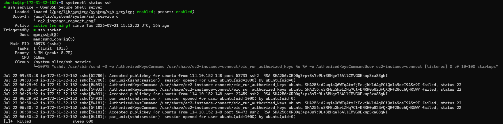

---

### Status Active

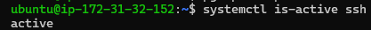

---

### Status Enabled


---

### Main PID

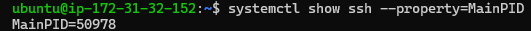

---

## Analisis

Hasil investigasi menunjukkan bahwa service **OpenSSH Server (`ssh.service`)** berada pada kondisi **active (running)**. Artinya service masih berjalan dan siap menerima koneksi dari client.

Perintah `systemctl is-active` mengembalikan nilai **active**, yang mengonfirmasi bahwa service sedang aktif pada saat investigasi dilakukan.

Selanjutnya, `systemctl is-enabled` menghasilkan nilai **enabled**, yang menunjukkan bahwa service akan otomatis dijalankan setiap kali sistem melakukan proses booting.

Melalui `systemctl show ssh --property=MainPID`, diperoleh informasi mengenai **Main PID** dari service SSH. PID tersebut merupakan proses utama (`sshd`) yang dikelola langsung oleh systemd sebagai init system.

Secara keseluruhan tidak ditemukan indikasi bahwa service SSH mengalami kegagalan ataupun berada pada status inactive.

---

## Hasil Investigasi

- Service SSH berada pada status **running**.
- Service dikonfigurasi **enabled** saat boot.
- Main PID berhasil diidentifikasi.
- Tidak ditemukan indikasi kegagalan service.

---

## Root Cause Analysis (RCA)

Berdasarkan hasil pemeriksaan, laporan bahwa "SSH tidak dapat diakses" **tidak disebabkan oleh service SSH yang berhenti**.

Kemungkinan penyebab lain yang perlu diperiksa antara lain:

- Security Group AWS
- Network ACL
- Firewall (UFW atau nftables)
- Routing jaringan
- Masalah koneksi internet client

---

## Best Practice

Dalam lingkungan production, sebelum melakukan restart service, administrator harus memastikan terlebih dahulu:

- Status service
- Main PID
- Startup configuration
- Riwayat log service

Pendekatan ini membantu menghindari tindakan yang tidak diperlukan dan meminimalkan risiko downtime.

---

## Lessons Learned

Melalui challenge ini saya memahami bahwa investigasi service tidak cukup hanya melihat apakah service berjalan atau tidak, tetapi juga harus memastikan status startup, Main PID, serta bagaimana service dikelola oleh systemd.


---

# Challenge 6 — Journal Investigation

## Ticket #006 — Investigasi Log Service SSH

### Studi Kasus

Pukul **11.30 WIB**, Senior Linux Engineer meminta saya melakukan investigasi terhadap log service SSH setelah dilakukan proses restart service beberapa saat sebelumnya.

Tujuannya adalah memastikan bahwa tidak terdapat error maupun warning yang dapat memengaruhi operasional server.

---

## Tujuan

Melakukan analisis log menggunakan `journalctl` untuk memahami aktivitas service SSH serta mengidentifikasi kemungkinan warning maupun error.

---

## Command yang Digunakan

```bash
journalctl -u ssh

journalctl -u ssh --since "30 minutes ago"

journalctl -xe
```

---

## Screenshot

### Journal Service SSH

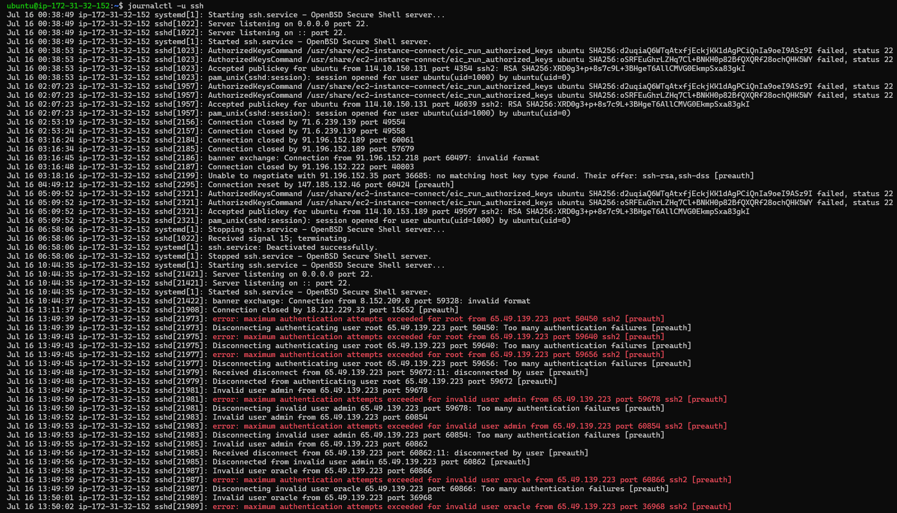

---

### Recent Journal

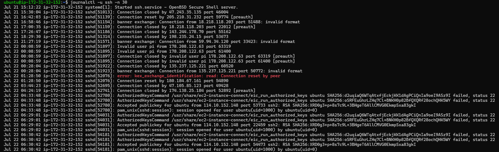

---

### Extended Journal

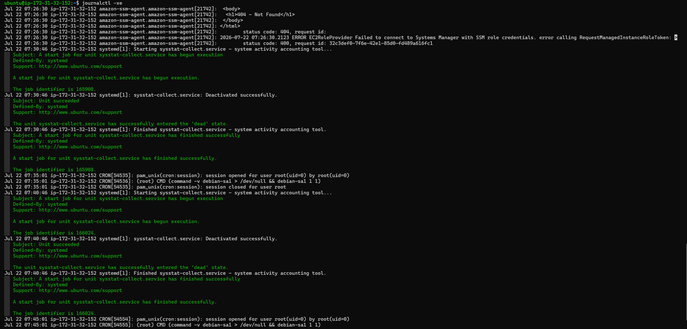

---

## Analisis

Output `journalctl -u ssh` memperlihatkan riwayat aktivitas service SSH sejak server dijalankan, termasuk proses start, restart, serta koneksi pengguna melalui SSH.

Melalui `journalctl -u ssh --since "30 minutes ago"`, log difokuskan hanya pada aktivitas terbaru sehingga proses investigasi menjadi lebih efisien.

Perintah `journalctl -xe` digunakan untuk melihat event sistem secara lebih rinci. Pada hasil pengamatan tidak ditemukan error kritis yang berkaitan dengan service SSH. Seluruh proses restart service berhasil diselesaikan tanpa kegagalan.

---

## Hasil Investigasi

- Service berhasil melakukan proses restart.
- Tidak ditemukan error pada service SSH.
- Tidak ditemukan warning yang memerlukan tindakan lanjutan.
- Aktivitas service tercatat dengan baik pada systemd journal.

---

## Root Cause Analysis (RCA)

Berdasarkan hasil investigasi log, tidak ditemukan bukti bahwa service SSH mengalami kegagalan.

Laporan sebelumnya kemungkinan disebabkan oleh faktor di luar service, seperti:

- gangguan jaringan,
- perubahan Security Group,
- atau masalah koneksi dari sisi client.

---

## Best Practice

Pada lingkungan production, administrator sebaiknya selalu memeriksa log menggunakan `journalctl` sebelum melakukan restart service maupun perubahan konfigurasi.

Log merupakan sumber informasi utama dalam proses troubleshooting karena menyediakan kronologi lengkap aktivitas service.

---

## Lessons Learned

Melalui challenge ini saya memahami pentingnya log systemd sebagai dasar dalam melakukan investigasi dan pengambilan keputusan ketika menangani gangguan service pada server Linux.


---

# Challenge 7 — Production Troubleshooting

## Ticket #007 — Website Production Terasa Lambat

### Studi Kasus

Pukul **13.00 WIB**, tim Developer melaporkan bahwa website production terasa lebih lambat dari biasanya.

Manager meminta agar **server tidak langsung direstart**, sehingga investigasi awal harus dilakukan terlebih dahulu untuk mencari kemungkinan penyebab sebelum mengambil tindakan.

---

## Tujuan

Melakukan investigasi awal terhadap kondisi server menggunakan berbagai utilitas Linux dan mendokumentasikan alur berpikir seorang Linux Administrator ketika melakukan troubleshooting pada lingkungan production.

---

## Alur Investigasi

```text
top
   ↓
ps
   ↓
pgrep
   ↓
pstree
   ↓
journalctl
   ↓
systemctl
```

---

## Analisis Investigasi

### 1. Monitoring Resource

Investigasi dimulai menggunakan `top` untuk melihat kondisi CPU, Memory, Swap, Load Average, serta process yang sedang berjalan.

Hasil menunjukkan bahwa penggunaan CPU berada pada kondisi normal dengan nilai idle yang sangat tinggi. Load Average juga berada pada angka rendah sehingga tidak menunjukkan adanya beban kerja yang berlebihan.

---

### 2. Pemeriksaan Process

Selanjutnya dilakukan pemeriksaan menggunakan `ps` untuk memastikan tidak terdapat process yang menggunakan CPU maupun memori secara tidak normal.

Hasil observasi tidak menunjukkan adanya process yang mendominasi penggunaan resource server.

---

### 3. Identifikasi Service

Melalui `pgrep` dan `pstree`, dilakukan pemeriksaan terhadap process penting seperti `sshd` beserta hubungan parent-child process.

Seluruh process utama berjalan sesuai struktur yang dikelola oleh `systemd`.

---

### 4. Pemeriksaan Log

Log service diperiksa menggunakan `journalctl` untuk memastikan tidak terdapat error maupun warning yang berkaitan dengan service utama.

Tidak ditemukan indikasi kegagalan service.

---

### 5. Verifikasi Service

Langkah terakhir dilakukan menggunakan `systemctl` untuk memastikan service SSH tetap berada pada kondisi aktif.

Service berada pada status **active (running)**.

---

## Root Cause Analysis (RCA)

Berdasarkan seluruh hasil investigasi:

- CPU berada pada kondisi normal.
- Memory masih tersedia dalam jumlah cukup.
- Load Average rendah.
- Tidak ditemukan process abnormal.
- Tidak terdapat error pada log service.
- Service utama berjalan normal.

Dengan demikian, laporan bahwa website terasa lambat **tidak dapat dibuktikan berasal dari sisi sistem operasi maupun service SSH**.

Kemungkinan penyebab lain yang perlu dilakukan investigasi lanjutan antara lain:

- aplikasi web,
- database,
- latency jaringan,
- DNS,
- AWS Load Balancer,
- atau layanan eksternal lainnya.

---

## Kesimpulan

Investigasi awal berhasil dilakukan tanpa melakukan restart server maupun menghentikan process yang sedang berjalan.

Pendekatan ini sesuai dengan praktik troubleshooting pada lingkungan production, yaitu mengumpulkan bukti terlebih dahulu sebelum mengambil tindakan yang berpotensi menimbulkan downtime.

---

## Best Practice

Administrator tidak boleh langsung melakukan restart server hanya berdasarkan laporan pengguna.

Investigasi harus dilakukan secara sistematis dengan mengumpulkan data dari monitoring resource, process, service, dan log agar keputusan yang diambil memiliki dasar teknis yang kuat.

---

## Lessons Learned

Challenge ini mengajarkan pentingnya pola pikir troubleshooting yang sistematis. Seorang Linux Administrator harus mampu membedakan antara asumsi dan bukti teknis sebelum menentukan akar penyebab suatu masalah pada server production.
