# Hands-on Lab — Linux Process Management

## Informasi Lab

| Item | Value |
|------|-------|
| Phase | Phase 01 — Linux Foundation |
| Week | Week 1 |
| Day | Day 5 |
| Environment | AWS EC2 |
| Operating System | Ubuntu Server 24.04.4 LTS |
| Kernel | Linux 6.17.0-1017-aws |
| Shell | Bash |
| Init System | systemd |
| User | ubuntu |

---

# LAB 1 — Environment Verification

## Objective

Memastikan environment Linux telah sesuai sebelum melakukan administrasi process dan service.

---

## Commands

```bash
whoami

hostnamectl

uname -r

ps -p 1

systemd --version

pwd
```

---

## Screenshot

### Host Information

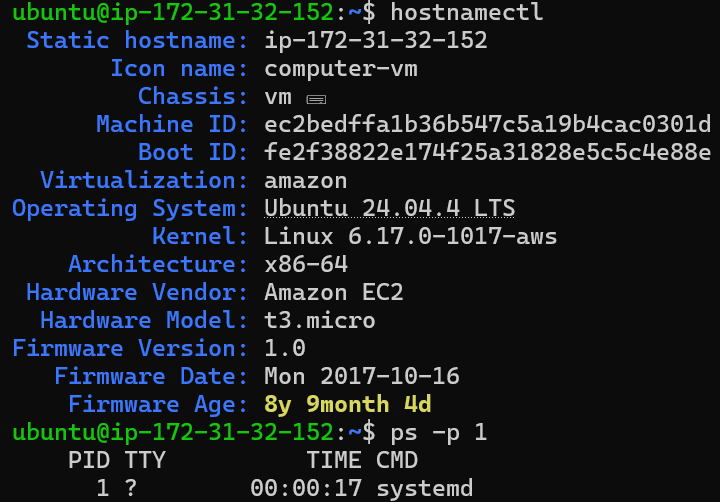

---

### Init System

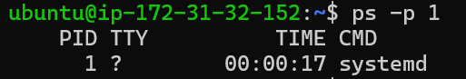

---

### systemd Version

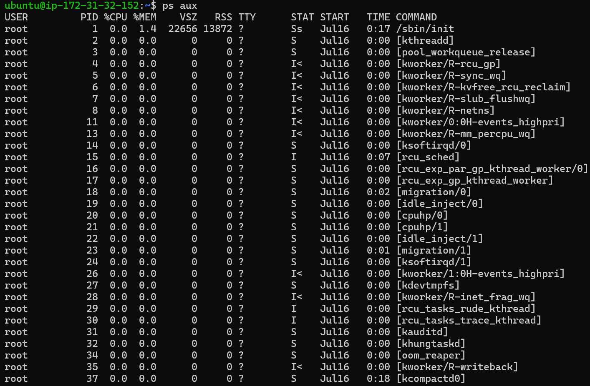

---

## Analysis

Hasil verifikasi menunjukkan bahwa server berjalan pada lingkungan Amazon EC2 dengan sistem operasi Ubuntu Server 24.04.4 LTS. Kernel yang digunakan adalah Linux 6.17.0-1017-aws yang merupakan kernel bawaan AWS.

Output `ps -p 1` memperlihatkan bahwa Process ID 1 adalah **systemd**. Hal ini menunjukkan bahwa seluruh service pada server dikelola menggunakan systemd sebagai init system.

Versi systemd yang digunakan adalah **255**, yaitu versi default pada Ubuntu 24.04 LTS yang mendukung manajemen service modern melalui `systemctl` dan `journalctl`.

---

## Key Findings

- Operating System berhasil teridentifikasi.
- Kernel menggunakan versi AWS.
- Init system menggunakan systemd.
- Environment sesuai dengan requirement Hands-on Lab.

---

# LAB 2 — Process Monitoring

## Objective

Melakukan monitoring process menggunakan berbagai utilitas Linux dan memahami informasi dasar setiap process.

---

## Commands

```bash
ps aux

ps -ef

top

htop
```

---

## Screenshot

### ps aux

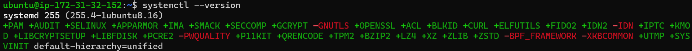

---

### ps -ef

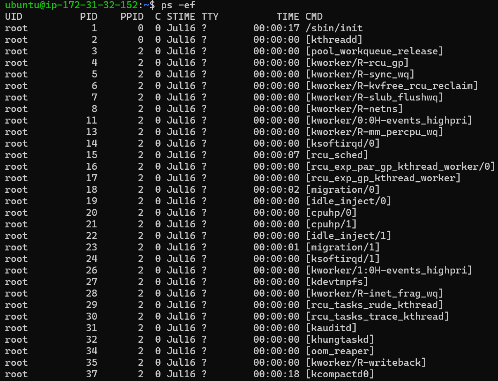

---

### top

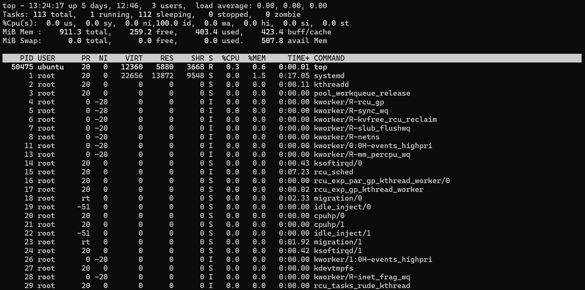

---

### htop

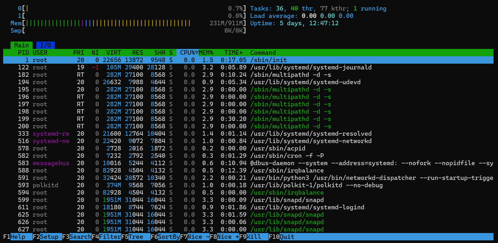

---

## Analysis

Monitoring process dilakukan menggunakan empat utilitas yang memiliki karakteristik berbeda.

Perintah `ps aux` memberikan snapshot seluruh process yang sedang berjalan beserta informasi owner, PID, penggunaan CPU, penggunaan memori, dan command yang dijalankan.

Perintah `ps -ef` menampilkan hubungan Parent Process ID (PPID) sehingga lebih mudah digunakan untuk menganalisis struktur process.

Tool `top` memberikan monitoring secara real-time terhadap penggunaan resource server. Pada saat pengujian diperoleh kondisi sebagai berikut:

- Load Average : 0.00 0.00 0.00
- CPU Idle : sekitar 99.8%
- Total Memory : 911 MiB
- Process Running : 1
- Process Sleeping : 110

Kondisi tersebut menunjukkan bahwa instance EC2 berada dalam keadaan idle dan tidak mengalami beban kerja yang tinggi.

Tool `htop` memberikan tampilan monitoring yang lebih interaktif dibandingkan `top`. Dari hasil pengamatan terlihat beberapa service utama seperti:

- systemd
- systemd-journald
- systemd-networkd
- snapd
- sshd
- rsyslogd
- cron
- chronyd

Seluruh service berjalan normal tanpa indikasi penggunaan CPU yang berlebihan.

---

## Key Findings

- Server berada pada kondisi idle.
- CPU hampir seluruhnya berada pada status idle.
- Tidak ditemukan process dengan penggunaan CPU yang tinggi.
- Penggunaan memori masih berada dalam batas normal.
- Process systemd menjadi parent bagi sebagian besar service system.

---

## Best Practice

Dalam administrasi Linux, setiap tool memiliki fungsi yang berbeda.

- `ps aux` digunakan untuk mengambil snapshot process.
- `ps -ef` digunakan untuk melihat hubungan parent-child process.
- `top` digunakan ketika melakukan monitoring resource secara real-time.
- `htop` digunakan ketika diperlukan monitoring interaktif yang lebih mudah dibaca.

Penggunaan tool yang tepat akan mempercepat proses troubleshooting pada server production.

---

# LAB 3 — Process Tree

## Tujuan

Pada lab ini saya mempelajari bagaimana Linux menyusun proses secara hierarkis menggunakan hubungan **Parent Process (PPID)** dan **Child Process (PID)**. Pemahaman terhadap process tree sangat penting ketika melakukan troubleshooting karena sebagian besar service Linux akan membuat proses turunan (child process) untuk menjalankan tugas tertentu.

---

## Command yang Digunakan

```bash
pstree

pstree -p
```

---

## Screenshot

### Process Tree

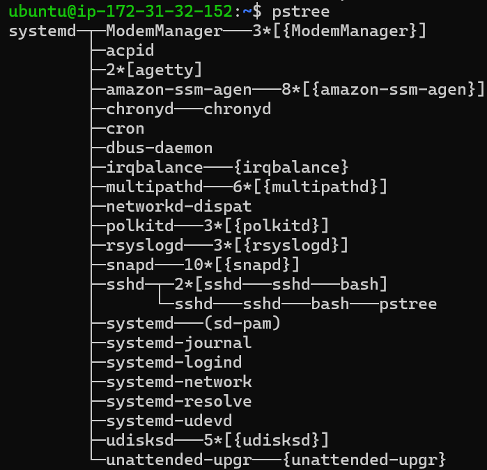

### Process Tree dengan PID

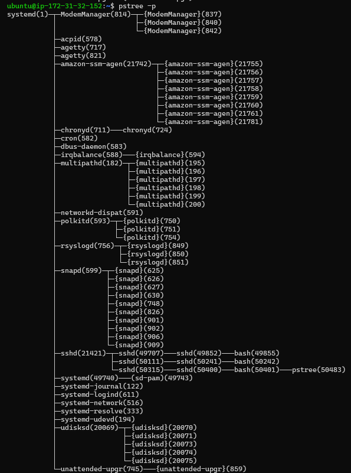

---

## Analisis

Hasil `pstree` menunjukkan bahwa seluruh service pada sistem berasal dari proses induk **systemd**, yang memiliki **PID 1** sebagai init system pada Ubuntu 24.04 LTS.

Pada environment AWS EC2 terlihat beberapa service penting yang aktif, di antaranya:

- amazon-ssm-agent
- sshd
- cron
- systemd-networkd
- systemd-resolved
- rsyslogd
- snapd
- ModemManager
- udisksd

Hubungan proses SSH juga terlihat dengan jelas:

```text
systemd
 └── sshd
      └── sshd
           └── bash
                └── pstree
```

Artinya:

- `systemd` menjalankan service SSH.
- `sshd` menerima koneksi SSH dari client.
- Setelah login berhasil, `sshd` membuat shell `bash`.
- Seluruh command yang dijalankan berasal dari shell tersebut.

Pada output `pstree -p`, setiap proses juga menampilkan PID sehingga hubungan Parent Process dan Child Process dapat diidentifikasi secara akurat.

---

## Hasil

✔ Berhasil memahami struktur process tree Linux.

✔ Berhasil mengidentifikasi hubungan antara systemd, sshd, bash, dan command yang sedang dijalankan.

✔ Memahami bagaimana Linux membuat child process ketika user login melalui SSH.

---

## Best Practice

Pada lingkungan production, `pstree` sangat membantu untuk:

- Melihat hubungan antar process.
- Menentukan parent process sebelum menghentikan suatu process.
- Melakukan Root Cause Analysis ketika terjadi process yang tidak normal.
- Memahami bagaimana sebuah service membuat child process.

---

---

# LAB 4 — Process Search

## Tujuan

Pada lab ini saya mempelajari cara mencari proses tertentu menggunakan PID sehingga proses dapat dikelola dengan lebih mudah ketika melakukan administrasi server maupun troubleshooting.

---

## Command yang Digunakan

```bash
pgrep ssh

pidof sshd

pgrep systemd

pgrep bash
```

---

## Screenshot

### pgrep

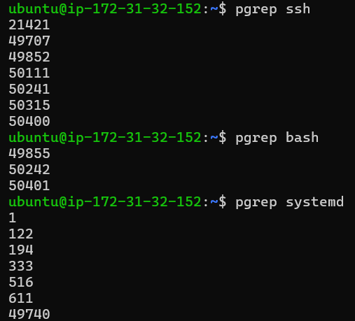

### pidof

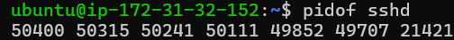

---

## Analisis

Perintah `pgrep` mencari proses berdasarkan nama process.

Hasil yang diperoleh:

### SSH

```text
50315
50400
50845
```

Hal ini menunjukkan bahwa terdapat beberapa proses `ssh` yang sedang berjalan pada server.

Selanjutnya dilakukan pencarian shell aktif.

```text
50401
```

PID tersebut merupakan shell `bash` yang saya gunakan selama sesi SSH berlangsung.

Kemudian saya melakukan pencarian seluruh process `systemd`.

Output menunjukkan beberapa PID karena systemd tidak hanya berjalan sebagai PID 1, tetapi juga memiliki beberapa daemon pendukung seperti:

- systemd-journald
- systemd-networkd
- systemd-resolved
- systemd-logind

Sedangkan `pidof sshd` menghasilkan:

```text
50845 50400 50315
```

Perintah `pidof` hanya mengembalikan PID dari executable `sshd`, sehingga hasilnya sedikit berbeda dibanding `pgrep`.

---

## Hasil

✔ Berhasil mencari process berdasarkan nama.

✔ Berhasil mengetahui PID service SSH.

✔ Memahami perbedaan penggunaan `pgrep` dan `pidof`.

---

## Best Practice

Dalam Bash Script, penggunaan `pgrep` lebih fleksibel karena dapat dikombinasikan dengan berbagai parameter untuk melakukan otomatisasi monitoring process.

Sedangkan `pidof` lebih cocok ketika hanya membutuhkan PID dari executable tertentu.

---

---

# LAB 5 — Foreground & Background Process

## Tujuan

Pada lab ini saya mempelajari mekanisme Job Control pada Bash, yaitu bagaimana memindahkan proses dari foreground ke background, kemudian mengembalikannya kembali ke foreground.

---

## Command yang Digunakan

```bash
sleep 300

CTRL + Z

jobs

bg %1

jobs

fg %1

CTRL + C
```

---

## Screenshot

### Menjalankan Sleep pada Foreground

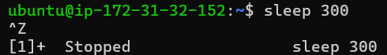

### Melihat Job

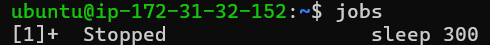

### Memindahkan ke Background

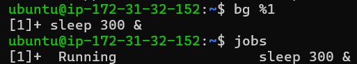

### Mengembalikan ke Foreground


---

## Analisis

Saya menjalankan process:

```bash
sleep 300
```

Karena dijalankan tanpa karakter `&`, process berjalan pada **foreground**, sehingga terminal tidak dapat digunakan untuk menjalankan command lain.

Selanjutnya saya menekan:

```text
CTRL + Z
```

Shell mengirimkan signal **SIGTSTP** sehingga process dihentikan sementara.

Output:

```text
Stopped
```

Kemudian saya menjalankan:

```bash
jobs
```

Shell menampilkan daftar job yang sedang berada pada status **Stopped**.

Selanjutnya process dipindahkan ke background menggunakan:

```bash
bg %1
```

Status process berubah menjadi:

```text
Running
```

Meskipun process masih berjalan, terminal sudah dapat digunakan kembali.

Terakhir saya mengembalikan process ke foreground menggunakan:

```bash
fg %1
```

Kemudian process dihentikan menggunakan:

```text
CTRL + C
```

yang mengirimkan signal **SIGINT** sehingga process berhenti secara normal.

---

## Hasil

✔ Berhasil menjalankan process pada foreground.

✔ Berhasil menghentikan sementara process menggunakan SIGTSTP.

✔ Berhasil menjalankan process di background menggunakan `bg`.

✔ Berhasil mengembalikan process ke foreground menggunakan `fg`.

✔ Memahami mekanisme Job Control pada Bash.

---

## Best Practice

Job Control sangat berguna ketika bekerja pada terminal interaktif.

Namun pada lingkungan production, service sebaiknya tidak dijalankan menggunakan Job Control, melainkan dikelola oleh **systemd** agar memiliki kemampuan restart otomatis, monitoring, logging, dan dependency management.

---

# Lab 06 — Menghentikan Process dengan kill

## Tujuan

Belajar menghentikan process menggunakan PID.

---

## Membuat Process

```bash
sleep 500 &
```

Output:


---

## Melihat PID

```bash
pgrep sleep
```

Output:


PID:

```
50547
```

---

## Menghentikan Process

```bash
kill 50547
```

Output:


---

## Verifikasi

```bash
jobs -l
```

Output:


Terlihat process sudah **Terminated**.

---

## Hal yang Dipelajari

✔ kill

✔ PID

✔ Terminated Process

✔ Process Lifecycle

---

# Lab 07 — Restart Service menggunakan systemctl

## Tujuan

Belajar mengelola Linux Service menggunakan systemd.

---

## Mengecek Status SSH

```bash
systemctl status ssh
```

Output:


Service dalam kondisi:

```
active (running)
```

---

## Restart Service

```bash
sudo systemctl restart ssh
```

Output:


---

## Verifikasi

```bash
systemctl status ssh
```

Output:


Terlihat Main PID berubah menandakan service berhasil direstart.

---

## Hal yang Dipelajari

✔ systemctl

✔ restart

✔ service management

✔ systemd

---

# Lab 08 — Membaca Log menggunakan journalctl

## Tujuan

Belajar membaca log system menggunakan journalctl.

---

## Log SSH

```bash
journalctl -u ssh
```

Output:


Terlihat:

- Login user
- Restart service
- Koneksi SSH
- Error koneksi dari Internet

---

## Log Boot

```bash
journalctl -b
```

Output:


Menampilkan seluruh proses booting Linux sejak startup.

---

## Log Error

```bash
journalctl -xe
```

Output:


Menampilkan log terbaru beserta informasi error dan aktivitas system.

---

## Hal yang Dipelajari

✔ journalctl

✔ Boot Log

✔ Service Log

✔ System Log

✔ Troubleshooting

---

# Lab 09 — Mini Investigation Linux Server

## Tujuan

Melakukan investigasi sederhana terhadap kondisi server Linux.

---

## Mengecek Resource

```bash
top
```

Output:


Analisis:

- CPU Idle sekitar 99%
- Memory masih cukup longgar
- Tidak ada process yang membebani server
- Load Average sangat rendah

Server dalam kondisi sehat.

---

## Mengecek Status SSH

```bash
systemctl status ssh
```

Output:


Status:

```
active (running)
```

Service berjalan normal.

---

## Mengecek Log SSH

```bash
journalctl -u ssh
```

Output:


Log menunjukkan:

- Login user
- Restart service
- Aktivitas SSH
- Riwayat koneksi

---

# Kesimpulan Day 05

Pada Hands-on Lab hari kelima saya berhasil mempelajari:

- Monitoring Process
- Process Tree
- PID Management
- Background Process
- Foreground Process
- Job Control
- Kill Process
- Linux Service Management
- Systemd
- Journal Log
- Basic Linux Troubleshooting
- Investigasi kondisi server

Seluruh percobaan berhasil dilakukan pada **Ubuntu Server 24.04 LTS** yang berjalan di **AWS EC2**, sehingga memberikan pengalaman langsung dalam mengelola process, service, dan log sebagaimana dilakukan oleh Linux System Administrator, DevOps Engineer, maupun Cloud Engineer.