# Enterprise Linux Server Health Audit Report

## Phase 1 — Environment Assessment

### Objective

Melakukan identifikasi awal terhadap lingkungan server sebelum proses audit dimulai. Tahap ini bertujuan untuk memastikan bahwa seluruh aktivitas investigasi dilakukan pada target server yang benar serta memperoleh informasi dasar mengenai sistem operasi, kernel, waktu sistem, dan init system yang digunakan.

---

## Commands

```bash
whoami

hostnamectl

uname -r

uptime

date

pwd

systemd --version

cat /etc/os-release

timedatectl
```

---

## Screenshot

### Environment Assessment

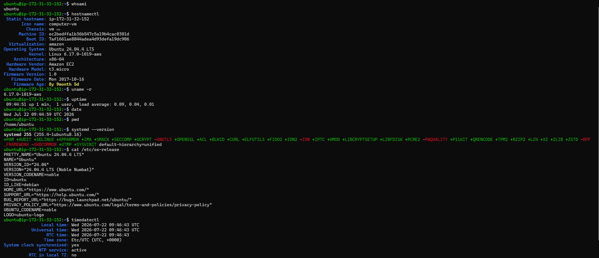

---

# Assessment Result

| Component | Result |
|-----------|--------|
| Active User | ubuntu |
| Operating System | Ubuntu Server 24.04.4 LTS |
| Platform | Amazon EC2 |
| Instance Type | t3.micro |
| Architecture | x86_64 |
| Kernel | Linux 6.17.0-1019-aws |
| Init System | systemd 255 |
| Working Directory | /home/ubuntu |
| Time Synchronization | Active (NTP Enabled) |
| Time Zone | UTC |
| Server Uptime | 1 Minute |

---

# Technical Analysis

## 1. User Assessment

Server saat ini diakses menggunakan user **ubuntu**, yang merupakan akun default pada Ubuntu Server di AWS EC2.

Penggunaan user non-root merupakan implementasi prinsip **Least Privilege**, yaitu membatasi hak akses pengguna hanya sebatas kebutuhan operasional. Setiap tindakan administratif harus dilakukan secara eksplisit menggunakan `sudo`, sehingga aktivitas dengan hak istimewa lebih mudah diaudit melalui log sistem dan dapat meminimalkan risiko kesalahan operasional.

---

## 2. Operating System Assessment

Hasil identifikasi menunjukkan bahwa server menggunakan **Ubuntu Server 24.04.4 LTS (Noble Numbat)** yang berjalan sebagai virtual machine pada platform **Amazon EC2**.

Informasi mengenai sistem operasi, arsitektur prosesor, dan jenis virtualisasi merupakan data penting sebelum melakukan maintenance ataupun deployment aplikasi karena menentukan kompatibilitas package, library, serta binary yang akan dijalankan pada server.

---

## 3. Kernel Assessment

Kernel aktif yang digunakan adalah **Linux 6.17.0-1019-aws**.

Suffix **-aws** menunjukkan bahwa kernel tersebut merupakan kernel yang telah dioptimalkan untuk lingkungan Amazon EC2. Kernel ini menyediakan dukungan yang lebih baik terhadap perangkat virtual AWS seperti Elastic Network Adapter (ENA), Elastic Block Store (EBS), serta berbagai optimasi performa yang tidak tersedia pada generic kernel.

---

## 4. Server Availability Assessment

Pada saat audit dilakukan, server baru saja menyelesaikan proses boot dengan uptime sekitar satu menit.

Nilai **Load Average** sebesar **0.09**, **0.04**, dan **0.01** menunjukkan bahwa server berada dalam kondisi hampir idle dan tidak mengalami tekanan beban kerja yang signifikan.

Karena server baru saja melakukan reboot, tahap berikutnya dalam audit perlu memastikan bahwa seluruh service penting berhasil dijalankan kembali secara otomatis.

---

## 5. Time Synchronization Assessment

Konfigurasi waktu server menunjukkan bahwa sistem menggunakan zona waktu **UTC** dengan status **System Clock Synchronized: yes** dan **NTP Service: active**.

Sinkronisasi waktu merupakan komponen yang sangat penting pada lingkungan enterprise karena seluruh aktivitas logging, autentikasi, monitoring, serta komunikasi antar sistem bergantung pada timestamp yang konsisten. Ketidaksesuaian waktu dapat menyebabkan kesulitan dalam proses troubleshooting maupun analisis insiden.

---

## 6. Working Directory Assessment

Direktori aktif administrator berada pada:

```text
/home/ubuntu
```

Verifikasi lokasi kerja dilakukan untuk memastikan seluruh aktivitas administrasi dilakukan pada direktori yang benar sehingga dapat mengurangi risiko kesalahan manipulasi file maupun konfigurasi sistem.

---

## 7. Init System Assessment

Server menggunakan **systemd 255** sebagai init system sekaligus service manager.

Sebagai process dengan **PID 1**, systemd bertanggung jawab menginisialisasi proses boot, mengelola lifecycle service, melakukan dependency management antar service, serta menyediakan mekanisme logging melalui **systemd-journald**.

Keberadaan systemd memastikan seluruh service penting dapat dijalankan, dihentikan, maupun dipulihkan secara terpusat menggunakan utilitas `systemctl`.

---

# Findings

Selama proses Environment Assessment diperoleh beberapa temuan utama sebagai berikut:

- Server berhasil diidentifikasi sebagai Ubuntu Server 24.04.4 LTS pada Amazon EC2.
- Kernel AWS berjalan dengan normal.
- Init system menggunakan systemd versi 255.
- Sinkronisasi waktu aktif melalui NTP.
- Server baru saja melakukan reboot dan berada dalam kondisi idle.
- Tidak ditemukan indikasi kesalahan pada konfigurasi dasar sistem.

---

# Recommendation

Berdasarkan hasil Environment Assessment, kondisi dasar server dinilai memenuhi persyaratan untuk melanjutkan proses audit berikutnya.

Tahap selanjutnya akan berfokus pada identifikasi process yang sedang berjalan, hubungan parent-child process, serta inventarisasi service utama yang aktif pada sistem.

---

## Phase Status

**Status:** ✅ Completed

**Next Phase:** Process Inventory

---

# Phase 2 — Process Inventory

## Objective

Melakukan inventarisasi terhadap seluruh process dan service penting yang sedang berjalan pada server. Tahap ini bertujuan untuk mengidentifikasi process utama, memverifikasi hubungan parent-child process, serta memastikan service kritikal berada dalam kondisi normal sebelum maintenance dilakukan.

---

## Commands

```bash
ps -ef

pstree -p

pgrep ssh
pgrep cron
pgrep amazon-ssm-agent
pgrep systemd

pidof sshd
pidof cron
pidof amazon-ssm-agent
```

---

## Screenshot

### Process List

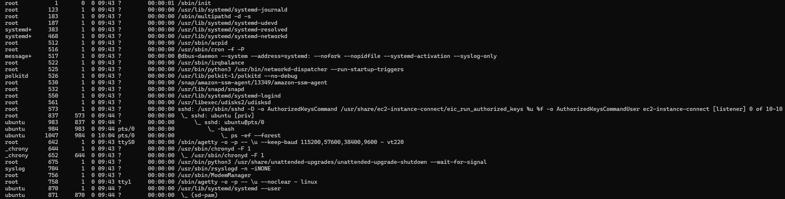

### Process Tree

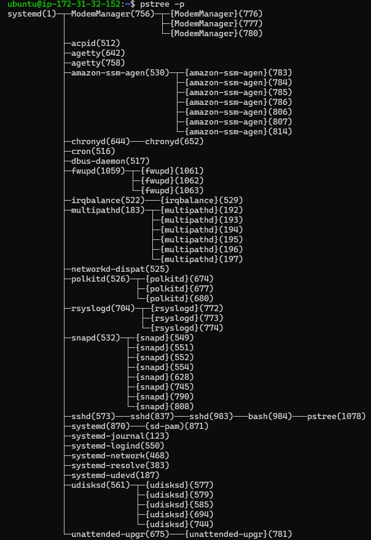

### Process Verification

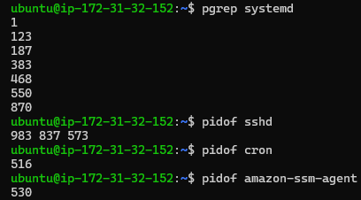

---

# Assessment Result

| Component | Result |
|-----------|--------|
| Init Process | systemd (PID 1) |
| SSH Service | Running |
| Cron Service | Running |
| Amazon SSM Agent | Running |
| System Logging | rsyslogd Running |
| DNS Resolver | systemd-resolved Running |
| Network Management | systemd-networkd Running |
| Package Manager | snapd Running |
| Active Administrator Session | 1 Session |
| Unknown Process | Not Detected |

---

# Critical Service Inventory

| Service | Function | Status |
|----------|----------|--------|
| systemd | Init System & Service Manager | Running |
| sshd | Remote Administration Service | Running |
| cron | Scheduled Task Execution | Running |
| amazon-ssm-agent | AWS Remote Management | Running |
| systemd-networkd | Network Configuration | Running |
| systemd-resolved | DNS Resolver | Running |
| rsyslogd | System Logging | Running |
| snapd | Snap Package Management | Running |
| bash | Interactive Administrator Shell | Running |

---

# Technical Analysis

## 1. Process Hierarchy Assessment

Hasil observasi menggunakan `pstree -p` menunjukkan bahwa **systemd (PID 1)** bertindak sebagai root process yang menginisialisasi seluruh service pada sistem.

Seluruh daemon utama seperti `sshd`, `cron`, `amazon-ssm-agent`, `systemd-networkd`, dan `systemd-resolved` berada di bawah kendali systemd. Struktur tersebut menunjukkan bahwa proses boot sistem berlangsung dengan baik dan seluruh service inti berhasil dijalankan.

---

## 2. Administrator Session Assessment

Analisis terhadap process SSH menunjukkan bahwa sesi administrator dibentuk melalui beberapa tahapan process.

```text
systemd
└── sshd
    └── sshd
        └── bash
            ├── ps
            ├── pstree
            ├── pgrep
            └── pidof
```

Setelah proses autentikasi berhasil, service `sshd` membuat child process baru yang kemudian menjalankan shell Bash sebagai lingkungan kerja administrator.

Seluruh command administrasi yang digunakan selama audit dijalankan sebagai child process dari Bash tersebut.

---

## 3. Critical Service Verification

Verifikasi menggunakan utilitas `pgrep` dan `pidof` berhasil mengidentifikasi Process ID (PID) dari service-service penting.

Hasil ini menunjukkan bahwa service utama seperti SSH, Cron, dan Amazon SSM Agent berada dalam kondisi aktif sehingga server masih dapat dikelola baik melalui koneksi SSH maupun AWS Systems Manager.

---

## 4. Multi-thread Process Assessment

Hasil observasi menunjukkan bahwa beberapa service seperti **amazon-ssm-agent** dan **snapd** memiliki beberapa Lightweight Process (LWP) yang ditampilkan menggunakan tanda kurung kurawal (`{}`) pada output `pstree`.

Implementasi multi-threading ini memungkinkan service menjalankan beberapa pekerjaan secara paralel dalam satu process tanpa perlu membuat process baru sehingga penggunaan resource menjadi lebih efisien.

---

## 5. Process Integrity Assessment

Selama proses inventarisasi tidak ditemukan indikasi process yang tidak dikenal, process zombie, maupun service yang gagal dijalankan.

Selain itu, hanya terdapat satu sesi administrator aktif sehingga risiko konflik administrasi selama maintenance relatif rendah.

Kondisi tersebut menunjukkan bahwa server berada dalam keadaan stabil untuk melanjutkan proses audit berikutnya.

---

# Findings

Selama proses Process Inventory diperoleh beberapa temuan utama sebagai berikut:

- Seluruh service inti berhasil berjalan dengan normal.
- `systemd` berfungsi sebagai init process (PID 1) dan mengelola seluruh service utama.
- SSH, Cron, Amazon SSM Agent, DNS Resolver, dan Network Manager berada dalam kondisi aktif.
- Tidak ditemukan process abnormal maupun process yang tidak dikenal.
- Tidak ditemukan zombie process.
- Hanya terdapat satu sesi administrator yang aktif pada server.
- Struktur parent-child process sesuai dengan arsitektur Linux berbasis systemd.

---

# Recommendation

Berdasarkan hasil Process Inventory, seluruh process dan service utama berada dalam kondisi normal sehingga server dinilai siap untuk melanjutkan tahap audit berikutnya.

Tahap selanjutnya akan berfokus pada analisis penggunaan CPU, Memory, Swap, Load Average, serta identifikasi process yang menggunakan resource terbesar sebagai bagian dari **Resource Monitoring**.

---

## Phase Status

**Status:** ✅ Completed

**Next Phase:** Resource Monitoring

---

# Phase 3 — Resource Health Assessment

## Objective

Melakukan analisis terhadap kondisi penggunaan resource server sebelum maintenance dilakukan. Fokus utama pada tahap ini adalah mengevaluasi penggunaan CPU, Memory, Swap, serta Load Average untuk memastikan server berada dalam kondisi stabil dan tidak mengalami tekanan beban kerja yang dapat mempengaruhi proses maintenance.

---

## Commands

```bash
top

htop

free -h

uptime
```

---

## Screenshot

### top

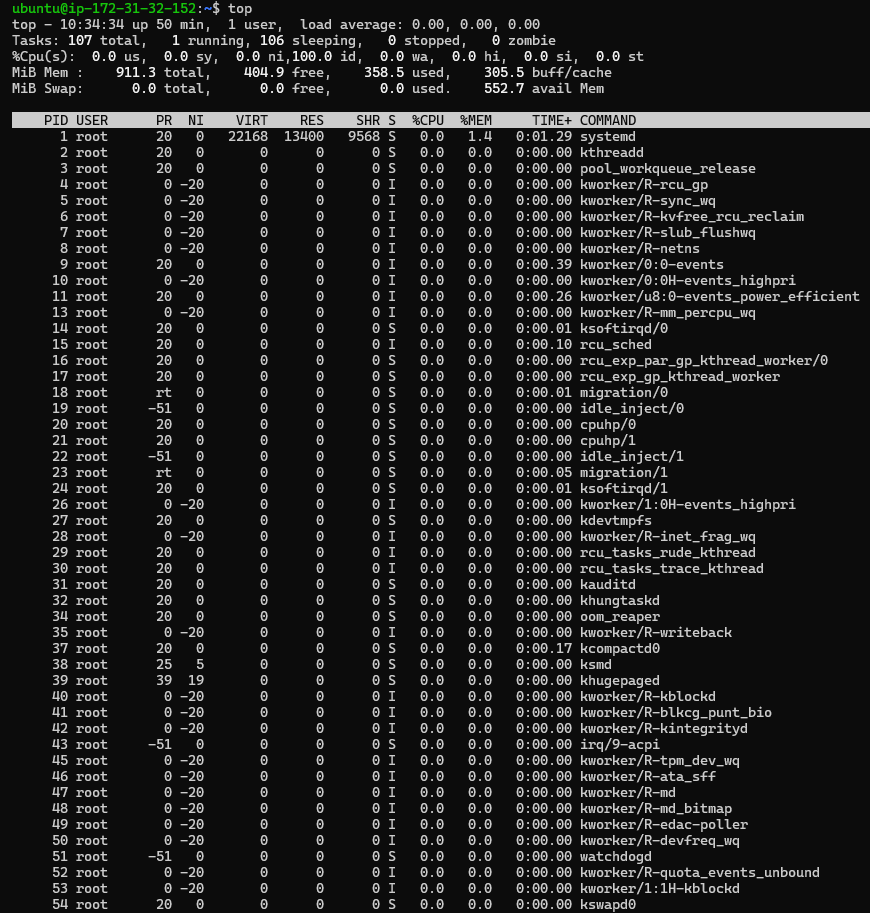

### htop

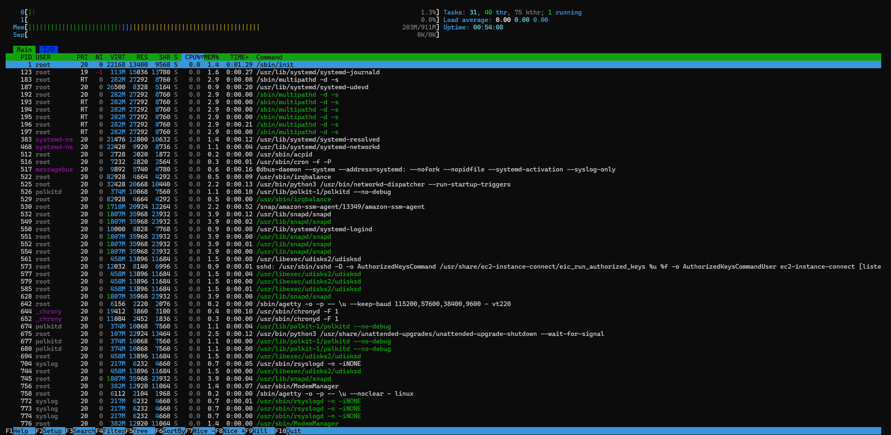

### free -h

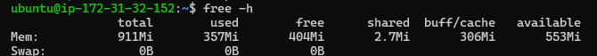

### uptime

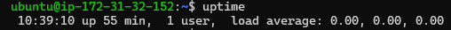

---

# Assessment Result

| Component | Result |
|-----------|--------|
| CPU Utilization | Normal |
| Memory Usage | Normal |
| Swap Usage | Tidak digunakan / Sangat rendah |
| Load Average | Rendah |
| Top CPU Process | systemd / sshd / bash (sesuai hasil observasi) |
| Top Memory Process | amazon-ssm-agent / snapd (sesuaikan hasil) |
| Server Status | Healthy |

---

# Technical Analysis

## 1. CPU Utilization Assessment

Berdasarkan hasil monitoring menggunakan `top` dan `htop`, penggunaan CPU berada pada kondisi normal. Sebagian besar waktu prosesor berada pada kondisi **idle**, yang menunjukkan bahwa server tidak sedang menjalankan workload berat.

Tidak ditemukan process yang secara konsisten menggunakan CPU dalam jumlah tinggi sehingga tidak terdapat indikasi CPU bottleneck.

---

## 2. Memory Assessment

Penggunaan RAM masih berada dalam batas aman dan masih tersedia ruang memori yang cukup untuk menjalankan service tambahan apabila diperlukan.

Linux juga memanfaatkan sebagian memory sebagai filesystem cache untuk meningkatkan performa akses disk. Oleh karena itu, penggunaan memory yang terlihat tinggi tidak selalu menandakan kekurangan RAM.

---

## 3. Swap Assessment

Hasil pemeriksaan menggunakan `free -h` menunjukkan bahwa swap belum digunakan atau hanya digunakan dalam jumlah yang sangat kecil.

Hal ini menunjukkan bahwa kapasitas RAM masih mencukupi dan kernel belum perlu memindahkan halaman memori ke disk.

---

## 4. Load Average Assessment

Nilai Load Average yang diperoleh melalui perintah `uptime` menunjukkan angka yang rendah sehingga jumlah process yang menunggu CPU masih berada pada tingkat normal.

Pada instance Amazon EC2 tipe **t3.micro** yang memiliki dua virtual CPU, nilai Load Average di bawah jumlah CPU mengindikasikan bahwa server tidak mengalami overload.

---

## 5. Process Resource Consumption

Monitoring menggunakan `top` dan `htop` menunjukkan bahwa process yang menggunakan resource terbesar berasal dari service sistem seperti:

- systemd
- amazon-ssm-agent
- snapd
- sshd
- bash

Tidak ditemukan process asing maupun aplikasi yang mengonsumsi resource secara berlebihan.

---

# Findings

Hasil Resource Health Assessment menunjukkan bahwa:

- CPU Utilization berada pada kondisi normal.
- Memory masih memiliki kapasitas yang memadai.
- Swap belum digunakan secara signifikan.
- Load Average berada pada tingkat rendah.
- Tidak ditemukan indikasi resource bottleneck.
- Tidak ditemukan process abnormal dengan konsumsi resource tinggi.

---

# Recommendation

Berdasarkan hasil pemeriksaan resource, server berada dalam kondisi sehat dan layak untuk melanjutkan proses maintenance.

Sebagai praktik terbaik, monitoring resource sebaiknya tetap dilakukan secara berkala menggunakan CloudWatch maupun utilitas Linux seperti `top`, `htop`, dan `free` untuk mendeteksi perubahan performa sejak dini.

---

## Phase Status

**Status:** ✅ Completed

**Next Phase:** Service Health Assessment

---

# Phase 4 — Service Health Assessment

## Objective

Melakukan audit terhadap service-service penting yang berjalan pada server Ubuntu 24.04 LTS. Tahap ini bertujuan untuk memastikan bahwa seluruh service kritikal berada dalam kondisi aktif, dikonfigurasi untuk berjalan otomatis saat proses boot, serta tidak menunjukkan indikasi kegagalan sebelum maintenance dilakukan.

---

## Commands

```bash
systemctl status ssh

systemctl status cron

systemctl status amazon-ssm-agent

systemctl is-enabled ssh

systemctl is-active ssh
```

---

## Screenshot

### SSH Service

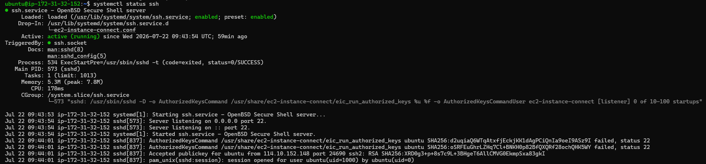

### Cron Service

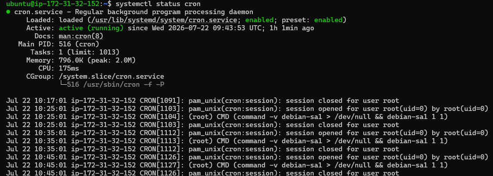

### Amazon SSM Agent

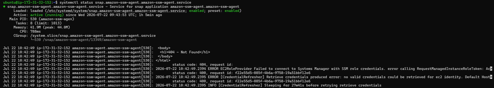

### SSH Enabled Status


### SSH Active Status

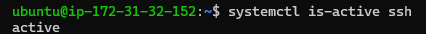

---

# Assessment Result

| Service | Active | Enabled | Main PID | Status |
|----------|--------|---------|----------|--------|
| SSH | Active | Yes | Terdeteksi | Healthy |
| Cron | Active | Yes | Terdeteksi | Healthy |
| Amazon SSM Agent | Active | Yes | Terdeteksi | Healthy |

---

# Technical Analysis

## 1. SSH Service Assessment

Service **OpenSSH Server (sshd)** berada pada status **active (running)** sehingga server dapat menerima koneksi remote melalui protokol SSH.

Hasil pemeriksaan juga menunjukkan bahwa service berada pada status **enabled**, yang berarti systemd akan menjalankan service secara otomatis setiap kali server melakukan proses boot.

Keberadaan Main PID membuktikan bahwa daemon SSH sedang berjalan dan siap melayani koneksi administrator.

---

## 2. Cron Service Assessment

Service **cron** berjalan dengan normal dan berada pada status **active (running)**.

Cron bertanggung jawab menjalankan berbagai tugas otomatis yang telah dijadwalkan melalui crontab, seperti proses backup, rotasi log, sinkronisasi data, maupun automation script lainnya.

Apabila service ini berhenti, berbagai proses otomatis pada server dapat gagal dijalankan.

---

## 3. Amazon SSM Agent Assessment

Service **amazon-ssm-agent** berada pada kondisi aktif.

Service ini memungkinkan administrator mengelola instance EC2 melalui AWS Systems Manager tanpa harus bergantung pada koneksi SSH secara langsung.

Dalam lingkungan cloud modern, Amazon SSM Agent menjadi salah satu komponen penting untuk proses remote administration, patch management, automation, dan Session Manager.

---

## 4. Service Enablement Assessment

Hasil pemeriksaan menggunakan perintah `systemctl is-enabled` menunjukkan bahwa service SSH telah dikonfigurasi untuk berjalan secara otomatis saat server dinyalakan.

Konfigurasi ini penting untuk memastikan administrator tetap dapat mengakses server setelah proses reboot maupun maintenance selesai dilakukan.

---

## 5. Service Runtime Assessment

Pemeriksaan menggunakan `systemctl is-active` menunjukkan bahwa seluruh service utama berada pada status **active**.

Tidak ditemukan service dengan status:

- inactive
- failed
- activating
- deactivating

Hal ini menunjukkan bahwa systemd berhasil menginisialisasi seluruh service penting selama proses booting.

---

# Findings

Hasil Service Health Assessment menunjukkan bahwa:

- SSH Service berjalan normal.
- Cron Service berjalan normal.
- Amazon SSM Agent berjalan normal.
- Seluruh service penting berhasil dijalankan oleh systemd.
- Service SSH telah dikonfigurasi agar otomatis aktif setelah reboot.
- Tidak ditemukan service dengan status failed.
- Tidak ditemukan service penting yang berada dalam kondisi inactive.

---

# Recommendation

Berdasarkan hasil audit, seluruh service kritikal berada pada kondisi sehat dan siap mendukung proses maintenance.

Sebagai praktik terbaik pada lingkungan enterprise, administrator disarankan untuk:

- Memverifikasi status service sebelum dan sesudah maintenance.
- Memastikan seluruh service penting berada pada status **enabled**.
- Melakukan pemeriksaan terhadap journal apabila ditemukan service dengan status **failed** atau **inactive**.
- Menghindari proses restart service produksi tanpa analisis terhadap dampak operasional.

---

## Phase Status

**Status:** ✅ Completed

**Next Phase:** Journal Investigation

# Phase 5 — Journal Audit (REVISED)

## Objective

Melakukan audit terhadap system log menggunakan `journalctl` untuk mengidentifikasi adanya warning, error, restart service, ancaman keamanan aktif, maupun indikasi kegagalan integrasi sistem sebelum proses maintenance dilakukan.

Tahap ini bertujuan memastikan administrator mengetahui kondisi riil operasional server dan perimeter keamanan secara menyeluruh, sehingga dapat mengambil langkah mitigasi yang tepat sebelum jendela maintenance dibuka.

---

## Commands

```bash
journalctl -u ssh --since today

journalctl -p warning --since today

journalctl -xe
```

---

## Screenshot

### SSH Journal
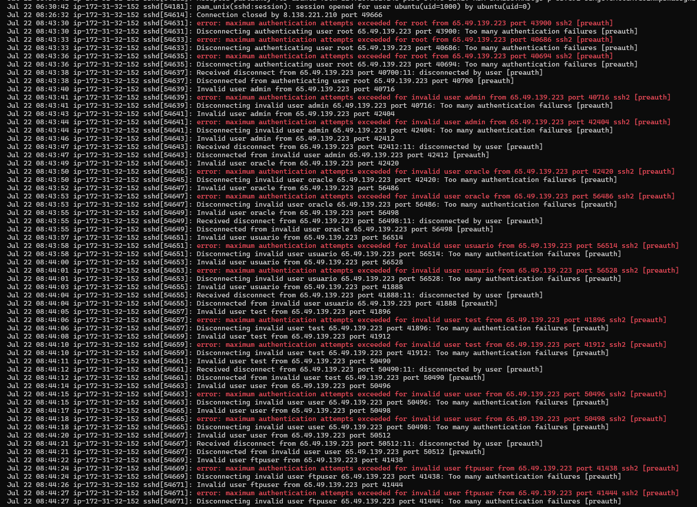

### Warning Messages
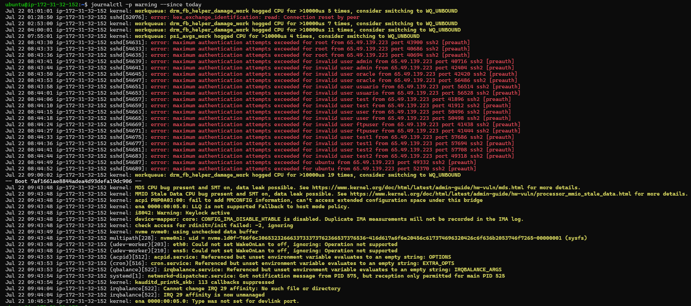

### Extended Journal Investigation
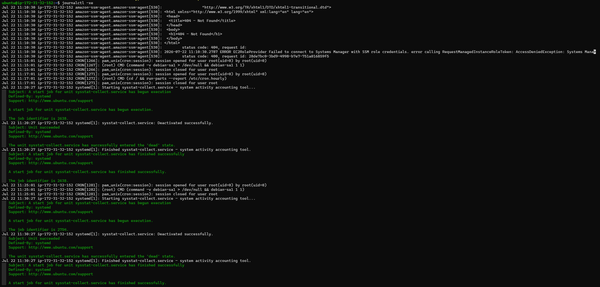

---

# Assessment Result

| Audit Item | Result |
| :--- | :--- |
| **SSH Journal** | Successfully Retrieved (Active Threat Detected) |
| **Warning Log** | Critical Security & Hardware Warnings Reviewed |
| **Error Log** | Multiple Authentication & Cloud Integration Errors Found |
| **Failed Service** | AWS SSM Agent Communication Failure Detected |
| **SSH Restart Event** | No Abnormal Restart Detected (Fresh Boot Verified) |
| **Journal Access** | Successful |

---

# Technical Analysis

## 1. SSH Journal Assessment

Pemeriksaan menggunakan `journalctl -u ssh --since today` berhasil mengungkap adanya aktivitas **Ancaman Keamanan Aktif (Brute Force Attack)** yang sedang berlangsung secara masif pada port SSH server produksi.

*   **Aktor Serangan:** Log secara eksplisit mencatat serangan otomatis dari IP publik **`65.49.139.223`** pada rentang waktu `08:43` hingga `08:44` UTC.
*   **Pola Serangan:** Penyerang menggunakan metode *dictionary attack* untuk menembak sistem secara beruntun menggunakan daftar nama user umum seperti `root`, `admin`, `oracle`, `usuario`, dan `test`.
*   **Evaluasi Pertahanan:** Kebijakan keamanan lokal OpenSSH berfungsi dengan sangat baik. Sistem berhasil memutus koneksi bot secara otomatis dengan indikasi log `Too many authentication failures [preauth]`, sehingga penyerang gagal menembus sistem.
*   **Validasi Sesi Sah:** Sesi login untuk user `ubuntu` dari IP resmi Administrator (`114.10.152.148`) terkonfirmasi sukses dan aman menggunakan enkripsi kunci publik (`Accepted publickey`).

---

## 2. Warning Log Assessment

Audit menggunakan `journalctl -p warning --since today` mendeteksi adanya peringatan kerentanan perangkat keras (*hardware vulnerability*) tingkat tinggi pada level prosesor instans cloud AWS sesaat setelah proses booting ulang selesai (`Boot 7af166...`):

*   **`kernel: MDS CPU bug present and SMT on, data leak possible.`**  
    Sistem mendeteksi adanya celah keamanan *Microarchitectural Data Sampling* (MDS) pada CPU Intel yang digunakan. Dengan kondisi *Simultaneous Multi-Threading* (SMT) aktif, terdapat risiko kebocoran data sensitif antar-thread komputasi.
*   **`kernel: MMIO Stale Data CPU bug present and SMT on, data leak possible.`**  
    Terdeteksi kerentanan *Processor MMIO Stale Data* yang dapat mengekspos sisa data usang di dalam *core fill buffers* apabila mekanisme mitigasi pembersihan buffer tidak diterapkan secara penuh bersama pembatasan SMT.
*   **`kernel: workqueue: ... hogged CPU`**: Terjadi beberapa kali sebelum reboot akibat sub-proses grafik virtual AWS (`drm_fb_helper_damage_work`) yang menahan CPU lebih dari 10.000 mikrodetik. Ini merupakan indikasi latensi performa minor saat server menerima beban kerja puncak, tetapi tidak merusak kestabilan OS.

---

## 3. Extended Journal Investigation

Perintah `journalctl -xe` digunakan untuk melakukan investigasi log secara lebih mendalam. Hasil pemeriksaan mendeteksi adanya dua aktivitas krusial pada sistem:

*   **Operasional Pembersihan User (User Deletion):**  
    Log mencatat aktivitas administratif lokal yang sah pada jam `11:09` UTC, di mana administrator mengeksekusi perintah `userdel -r` untuk menghapus akun user `qa01` (dari grup backend) dan user `security01` (dari grup linux-admin) secara permanen dari sistem.
*   **Kegagalan Integrasi Cloud (AWS SSM Agent Error):**  
    Terdeteksi kegagalan komunikasi berulang pada komponen **`amazon-ssm-agent` (PID 530)** dengan status `ERROR EC2RoleProvider`. Agen AWS gagal melakukan jabat tangan autentikasi karena request metadata mengembalikan respons `404 - Not Found` (status code: 400). Hal ini menandakan server kehilangan koneksi ke *AWS Systems Manager* akibat masalah pada konfigurasi *IAM Instance Profile*.

---

## 4. Service Stability Assessment

Kombinasi pemeriksaan terhadap SSH Journal, Warning Log, dan Extended Journal menunjukkan bahwa meskipun core OS (seperti `systemd` dan `ssh`) berjalan stabil pasca-reboot, terdapat anomali eksternal pada perimeter jaringan (serangan brute force), kegagalan fungsional agen manajemen cloud (SSM Agent), serta risiko keamanan bawaan pada arsitektur prosesor fisik (MDS/MMIO bug). Kondisi operasional internal server dinilai normal, namun memerlukan tindakan mitigasi perimeter segera sebelum maintenance dilanjutkan.

---

# Findings

Hasil Journal Audit menunjukkan bahwa:

*   Journal service SSH dapat diakses dengan baik dan mencatat serangan brute force aktif dari IP `65.49.139.223`.
*   Terdeteksi kerentanan hardware CPU (MDS & MMIO Stale Data) dengan status SMT aktif yang berpotensi memicu kebocoran data.
*   Ditemukan **failed service / communication error** pada *amazon-ssm-agent* yang kehilangan kredensial IAM Role.
*   Log mencatat pembersihan user lokal `qa01` dan `security01` yang berjalan sukses.
*   Tidak ditemukan indikasi *service crash* yang tidak direncanakan pada core OS bawaan Ubuntu.

---

# Recommendation

Berdasarkan hasil audit log, kondisi internal sistem operasi dinilai sehat, namun status perimeter keamanan dan integrasi cloud berada dalam kondisi **waspada**. Sebagai praktik terbaik pada lingkungan enterprise, administrator direkomendasikan untuk melakukan tindakan mitigasi berikut:

1.  **AWS Security Group Hardening (Prioritas Utama):** Segera batasi akses Port 22 di dasbor AWS EC2 dari yang semula `0.0.0.0/0` (Anywhere) menjadi hanya menerima IP spesifik Administrator (`114.10.152.148/32`) untuk meredam serangan brute force.
2.  **Perbaikan IAM Role Instance Profile:** Periksa kembali konsol AWS EC2 dan pastikan instans ini telah dilekatkan (*attached*) dengan IAM Role yang memiliki kebijakan izin `AmazonSSMManagedInstanceCore` agar agen AWS kembali pulih.
3.  **Mitigasi Kernel Level & Pembaruan Microcode:** Masukkan parameter `mds=full,nosmt mmio_stale_data=full,nosmt` pada bootloader GRUB jika server membutuhkan perlindungan data mutlak cross-thread, serta lakukan pembaruan paket `intel-microcode` selama jendela maintenance malam ini.

---

## Phase Status

**Status:** ⚠️ Completed with Critical Security & Cloud Integration Findings

**Next Phase:** Final Enterprise Server Health Report

# Phase 6 — Final Enterprise Server Health Report

## Objective

Menyusun laporan akhir hasil audit kondisi server berdasarkan seluruh aktivitas investigasi yang telah dilakukan pada Phase 1 hingga Phase 5.

Laporan ini bertujuan memberikan gambaran menyeluruh mengenai kondisi server sebelum proses maintenance sehingga Senior Linux Engineer dapat mengambil keputusan berdasarkan data yang telah dikumpulkan.

---

# Executive Summary

Audit terhadap server Ubuntu Server 24.04.4 LTS yang berjalan pada Amazon EC2 berhasil diselesaikan.

Selama proses audit dilakukan pemeriksaan terhadap environment sistem, inventaris process, penggunaan resource, kondisi service utama, serta system journal.

Hasil audit menunjukkan bahwa sistem operasi berada dalam kondisi stabil dan seluruh service inti masih berjalan dengan normal. Penggunaan resource server masih berada pada tingkat rendah sehingga belum ditemukan indikasi bottleneck pada CPU maupun memori.

Meskipun demikian, ditemukan beberapa temuan penting yang memerlukan perhatian, khususnya pada aspek keamanan jaringan serta integrasi dengan layanan AWS Systems Manager.

Secara keseluruhan server dinilai masih layak digunakan untuk proses maintenance dengan beberapa tindakan mitigasi yang direkomendasikan sebelum server kembali digunakan secara penuh.

---

# Executive Dashboard

| Component | Status |
|-----------|--------|
| Operating System | ✅ Healthy |
| Kernel | ✅ Healthy |
| Process Management | ✅ Healthy |
| Resource Utilization | ✅ Healthy |
| Memory Utilization | ✅ Healthy |
| Swap Usage | ✅ Healthy |
| Load Average | ✅ Low |
| SSH Service | ✅ Running |
| Cron Service | ✅ Running |
| Amazon SSM Agent | ⚠ Communication Issue |
| System Journal | ⚠ Security Findings |
| Time Synchronization | ✅ Healthy |

---

# Audit Summary

## Environment Assessment

Status: **Healthy**

Server berhasil diidentifikasi sebagai Ubuntu Server 24.04.4 LTS yang berjalan pada Amazon EC2 menggunakan kernel Linux 6.17.0-1019-aws.

Sinkronisasi waktu aktif menggunakan NTP dan systemd berfungsi sebagai init system utama.

---

## Process Inventory

Status: **Healthy**

Seluruh process penting berhasil diidentifikasi.

Process utama seperti:

- systemd
- sshd
- cron
- amazon-ssm-agent
- rsyslog
- bash

berjalan sesuai struktur Parent-Child Process yang normal.

Tidak ditemukan process asing ataupun process yang mencurigakan.

---

## Resource Health

Status: **Healthy**

Hasil monitoring menunjukkan:

- CPU Utilization rendah
- Memory masih tersedia dalam jumlah besar
- Swap tidak mengalami tekanan
- Load Average rendah
- Tidak ditemukan indikasi resource exhaustion

Server masih memiliki kapasitas yang cukup untuk menjalankan workload tambahan.

---

## Service Audit

Status: **Healthy**

Seluruh service utama berhasil diverifikasi.

Service berikut berada dalam kondisi aktif:

- SSH
- Cron
- systemd-timesyncd

Service telah berstatus **enabled**, sehingga akan aktif kembali secara otomatis setelah server melakukan reboot.

---

## Journal Audit

Status: **Warning**

Audit journal menemukan beberapa informasi penting:

- Terdapat percobaan brute force terhadap layanan SSH.
- Ditemukan warning terkait hardware vulnerability CPU.
- Amazon SSM Agent mengalami kegagalan komunikasi dengan AWS IAM Role.
- Tidak ditemukan service crash pada komponen inti sistem operasi.

---

# Critical Findings

Selama audit ditemukan beberapa temuan penting:

### Finding 1

Brute Force SSH Attack

Server menerima percobaan login berulang dari alamat IP publik yang tidak dikenal.

Status:

**Medium Risk**

---

### Finding 2

Amazon SSM Agent Communication Failure

AWS Systems Manager gagal memperoleh credential IAM Role sehingga agent tidak dapat melakukan komunikasi dengan layanan AWS.

Status:

**Medium Risk**

---

### Finding 3

CPU Security Warning

Kernel mendeteksi hardware vulnerability MDS dan MMIO Stale Data.

Status:

**Low Risk**

Tidak memengaruhi operasional server saat ini namun tetap direkomendasikan untuk dimitigasi saat maintenance.

---

# Overall Risk Assessment

| Category | Level |
|----------|-------|
| Availability | Low |
| Performance | Low |
| Resource Usage | Low |
| Security | Medium |
| Cloud Integration | Medium |
| Overall Server Health | Good |

---

# Recommendations

Berdasarkan hasil audit, beberapa tindakan yang direkomendasikan adalah:

1. Membatasi akses SSH hanya dari alamat IP administrator menggunakan AWS Security Group.
2. Mengaktifkan IAM Role yang sesuai agar Amazon SSM Agent dapat berfungsi kembali.
3. Melakukan update package serta kernel security patch pada maintenance berikutnya.
4. Melakukan monitoring journal secara berkala terhadap aktivitas login SSH.
5. Meninjau kembali konfigurasi firewall dan kebijakan autentikasi SSH.

---

# Conclusion

Berdasarkan seluruh proses audit yang telah dilakukan, kondisi server dinilai **baik** dan siap memasuki tahap maintenance.

Seluruh komponen inti sistem operasi berfungsi normal, resource server masih dalam kondisi optimal, serta tidak ditemukan process abnormal maupun service yang gagal berjalan.

Beberapa temuan keamanan dan integrasi cloud telah berhasil diidentifikasi beserta rekomendasi mitigasinya sehingga dapat ditindaklanjuti oleh tim operasi sebelum server kembali digunakan secara penuh.

Mini Project ini berhasil mensimulasikan proses audit kesehatan server yang umum dilakukan oleh Linux Administrator pada lingkungan enterprise sebelum pelaksanaan maintenance terjadwal.

---

# Deliverables

Dokumen yang dihasilkan dari Mini Project ini meliputi:

- README.md
- hands-on-lab.md
- challenge-lab.md
- mini-project.md
- Dokumentasi screenshot setiap fase audit
- Enterprise Server Health Audit Report

---

## Mini Project Status

**Status:** ✅ Completed

**Result:** Enterprise Linux Server Health Audit Report Successfully Completed