# Hands-on Lab — Linux Package Management

> **Phase:** FASE 1 — Linux Foundation  
> **Week:** 1  
> **Day:** 6  
> **Topic:** Linux Package Management  
> **Operating System:** Ubuntu Server 24.04.4 LTS (AWS EC2)  
> **Shell:** Bash  
> **Cloud Provider:** Amazon Web Services (AWS)  
> **Instance Type:** t3.micro  
> **Author:** <Nama Anda>  
> **Last Updated:** July 2026

---

# Table of Contents

- Introduction
- Learning Objectives
- Environment
- Prerequisites
- Enterprise Scenario
- Lab Architecture
- LAB 1 — System Health Check
- LAB 2 — Update Repository Metadata
- LAB 3 — Install Packages
- LAB 4 — Verify Installed Packages
- LAB 5 — Verify Executable Binaries
- LAB 6 — Package and Systemd Relationship
- LAB 7 — Remove Package
- LAB 8 — Purge Package
- LAB 9 — Clean Package Cache
- LAB 10 — Enterprise Verification
- Lessons Learned
- Troubleshooting Summary
- Key Commands
- References

---

# Introduction

Linux Package Management merupakan salah satu kemampuan dasar yang wajib dimiliki oleh Linux Administrator, Cloud Engineer, DevOps Engineer, maupun Site Reliability Engineer (SRE). Hampir seluruh aktivitas administrasi server melibatkan proses instalasi, pembaruan, verifikasi, hingga penghapusan perangkat lunak menggunakan package manager.

Pada distribusi Linux berbasis Debian seperti Ubuntu, sistem package management dikelola menggunakan **APT (Advanced Package Tool)** yang bekerja di atas **dpkg (Debian Package Manager)**. APT bertanggung jawab mengelola repository, menyelesaikan dependency, memverifikasi integritas package, dan memastikan proses instalasi berjalan secara konsisten.

Dalam Hands-on Lab ini, seluruh proses dilakukan menggunakan **Ubuntu Server 24.04.4 LTS** yang berjalan pada **Amazon EC2**, sehingga lingkungan praktik menyerupai server yang umum digunakan di perusahaan.

Dokumentasi ini disusun mengikuti alur kerja seorang **Junior Linux Administrator** yang menerima tugas untuk melakukan pengelolaan package pada server production sesuai standar operasional perusahaan.

---

# Learning Objectives

Setelah menyelesaikan Hands-on Lab ini, peserta diharapkan mampu:

- Memahami workflow Linux Package Management menggunakan APT.
- Melakukan pembaruan metadata repository secara aman.
- Menginstal package menggunakan APT.
- Memverifikasi package yang telah terpasang.
- Mengidentifikasi lokasi binary executable suatu package.
- Memahami hubungan antara Package, Service, Process, dan systemd.
- Melakukan penghapusan package menggunakan `remove` dan `purge`.
- Membersihkan dependency dan cache package.
- Melakukan verifikasi akhir setelah perubahan sistem.
- Mendokumentasikan seluruh proses sesuai standar dokumentasi profesional.

---

# Environment

| Component | Value |
|----------|-------|
| Operating System | Ubuntu Server 24.04.4 LTS |
| Kernel | Linux 6.17.0-1019-aws |
| Platform | Amazon EC2 |
| Instance Type | t3.micro |
| Shell | Bash |
| Package Manager | APT |
| Low Level Package Manager | dpkg |
| Repository | Ubuntu Official Repository |
| User | ubuntu (sudo privilege) |

---

# Prerequisites

Sebelum mengerjakan Hands-on Lab ini, pastikan telah memahami materi berikut:

- Linux Fundamentals
- Linux Filesystem Hierarchy Standard (FHS)
- Linux Permission
- Linux User and Group Management
- Linux Process Management
- Linux Services (systemd)

Materi-materi tersebut akan digunakan secara langsung selama proses instalasi package.

---

# Enterprise Scenario

Sebuah perusahaan sedang melakukan deployment sebuah aplikasi internal berbasis web pada server Ubuntu yang berjalan di AWS EC2.

Sebagai **Junior Linux Administrator**, Anda menerima Change Request dengan tugas sebagai berikut:

1. Memastikan kondisi server dalam keadaan sehat.
2. Memperbarui metadata repository.
3. Menginstal package yang dibutuhkan (`nginx`, `git`, dan `curl`).
4. Memverifikasi bahwa package berhasil diinstal.
5. Memastikan service berjalan dengan benar.
6. Melakukan proses uninstall sesuai prosedur perusahaan.
7. Membersihkan package yang tidak lagi digunakan.
8. Melakukan verifikasi akhir sebelum Change Request dinyatakan selesai.

Seluruh aktivitas harus didokumentasikan agar dapat dijadikan bagian dari audit operasional serta dokumentasi internal perusahaan.

---

# Lab Architecture

```text
                   Ubuntu Server 24.04 LTS
                   (AWS EC2 - t3.micro)
                           │
                           │
                    sudo apt update
                           │
                           ▼
                 Ubuntu Official Repository
                           │
                           ▼
                Download Package Metadata
                           │
                           ▼
                     Install Package
                           │
                           ▼
                        dpkg Engine
                           │
                           ▼
             Filesystem + Binary + Configuration
                           │
                           ▼
                      systemd Service
                           │
                           ▼
                     Running Process
```

---

# Screenshot Directory

Seluruh screenshot pada Hands-on Lab ini disimpan pada direktori berikut:

```text
assets/
└── screenshots/
    └── hands-on-lab/
```

| Screenshot | Description |
|------------|-------------|
| 01-system-health.png | Initial system health verification |
| 02-apt-update.png | Repository metadata update |
| 03-install-nginx.png | Installing nginx |
| 04-install-git.png | Installing git |
| 05-install-curl.png | Installing curl |
| 06-package-verification.png | Package verification |
| 07-binary-location.png | Binary verification |
| 08-systemctl-nginx.png | systemd verification |
| 09-remove-nginx.png | Removing nginx |
| 10-purge-nginx.png | Purging nginx |
| 11-autoremove-clean.png | Cleaning package cache |
| 12-enterprise-verification.png | Final verification |

---

# LAB 1 — System Health Check

## Lab Information

| Item | Value |
|------|-------|
| Lab Number | 01 |
| Lab Name | System Health Check |
| Difficulty | Beginner |
| Estimated Time | 10–15 Minutes |
| Environment | Ubuntu Server 24.04.4 LTS (AWS EC2) |
| Objective | Memastikan kondisi server dalam keadaan sehat sebelum dilakukan perubahan pada sistem. |

---

# Background

Sebelum melakukan perubahan apa pun pada server production, seorang Linux Administrator wajib melakukan **System Health Check**.

Langkah ini merupakan bagian dari **Change Management Process** yang diterapkan hampir di seluruh perusahaan.

Tujuannya adalah memastikan bahwa kondisi server stabil sehingga perubahan yang dilakukan tidak memperburuk masalah yang sebenarnya sudah ada sebelumnya.

Apabila administrator langsung melakukan instalasi package tanpa mengetahui kondisi awal server, maka akan sulit menentukan apakah suatu masalah berasal dari proses instalasi atau memang sudah ada sebelumnya.

Karena alasan tersebut, hampir seluruh Standard Operating Procedure (SOP) perusahaan selalu dimulai dengan proses verifikasi kesehatan sistem.

---

# Learning Objectives

Setelah menyelesaikan LAB 1, Anda diharapkan mampu:

- Mengidentifikasi informasi dasar sistem operasi.
- Memverifikasi versi Ubuntu yang digunakan.
- Memeriksa versi kernel Linux yang sedang berjalan.
- Memastikan kapasitas penyimpanan masih mencukupi.
- Memeriksa penggunaan memori.
- Memastikan beban server masih normal.
- Mendokumentasikan kondisi awal server sebelum perubahan dilakukan.

---

# Enterprise Scenario

Tim Infrastructure menerima Change Request untuk menginstal web server **Nginx** pada salah satu server Ubuntu yang berjalan di AWS EC2.

Sebelum instalasi dilakukan, administrator diwajibkan melakukan pemeriksaan kondisi server agar proses deployment dapat dipertanggungjawabkan apabila terjadi insiden di kemudian hari.

Sebagai Junior Linux Administrator, Anda bertanggung jawab melakukan pemeriksaan tersebut dan mencatat seluruh hasilnya sebagai bagian dari dokumentasi perubahan.

---

# Commands

Jalankan seluruh perintah berikut secara berurutan.

```bash
whoami

hostnamectl

lsb_release -a

uname -r

df -h

free -h

uptime
```

---

# Command Explanation

## whoami

```bash
whoami
```

Digunakan untuk mengetahui user yang sedang aktif.

Output:

```text
ubuntu
```

### Mengapa command ini penting?

Administrator harus mengetahui identitas user yang sedang digunakan sebelum melakukan perubahan pada sistem.

Pada lingkungan production, penggunaan akun yang salah dapat menyebabkan perubahan tidak tercatat dengan benar atau bahkan ditolak karena hak akses tidak mencukupi.

---

## hostnamectl

```bash
hostnamectl
```

Command ini digunakan untuk menampilkan informasi sistem secara lengkap.

Informasi yang dapat diperoleh antara lain:

- Hostname
- Operating System
- Kernel
- Architecture
- Virtualization
- Hardware Vendor

Pada lab ini diperoleh informasi:

| Item | Value |
|------|-------|
| Hostname | ip-172-31-32-152 |
| Operating System | Ubuntu Server 24.04.4 LTS |
| Virtualization | Amazon EC2 |
| Architecture | x86_64 |
| Hardware Model | t3.micro |

---

## lsb_release -a

```bash
lsb_release -a
```

Command ini digunakan untuk mengetahui distribusi Linux yang sedang digunakan.

Output menunjukkan bahwa server menggunakan:

```text
Ubuntu 24.04.4 LTS
Codename: noble
```

Informasi ini sangat penting karena dokumentasi, package, dan repository yang digunakan harus sesuai dengan versi sistem operasi.

---

## uname -r

```bash
uname -r
```

Digunakan untuk melihat versi Linux Kernel yang sedang aktif.

Output:

```text
6.17.0-1019-aws
```

Suffix **aws** menunjukkan bahwa kernel ini telah dioptimalkan untuk berjalan pada infrastruktur Amazon EC2.

---

## df -h

```bash
df -h
```

Digunakan untuk memeriksa penggunaan media penyimpanan.

Administrator harus memastikan bahwa ruang penyimpanan masih mencukupi sebelum melakukan instalasi package.

Hasil pemeriksaan menunjukkan:

| Filesystem | Usage |
|------------|------:|
| Root (/) | 42% |
| /boot | 20% |
| /boot/efi | 6% |

Kondisi ini masih sangat aman untuk melakukan instalasi package tambahan.

---

## free -h

```bash
free -h
```

Digunakan untuk melihat penggunaan RAM.

Hasil yang diperoleh:

| Memory | Value |
|---------|------:|
| Total | 911 MiB |
| Used | 382 MiB |
| Available | 528 MiB |

Masih tersedia memori yang cukup sehingga proses instalasi package dapat dilakukan tanpa kendala.

---

## uptime

```bash
uptime
```

Digunakan untuk mengetahui:

- Lama server aktif (uptime)
- Jumlah user yang sedang login
- Load Average

Output menunjukkan:

```text
Load Average

0.00
0.00
0.00
```

Nilai tersebut menunjukkan bahwa server hampir tidak memiliki beban kerja sehingga aman untuk dilakukan perubahan.

---

# Behind The Scenes

Ketika administrator menjalankan command-command di atas, sebagian besar informasi sebenarnya diperoleh dari **Linux Kernel**.

Diagram sederhananya sebagai berikut:

```text
Administrator
      │
      ▼
 Bash Shell
      │
      ▼
 Linux Command
      │
      ▼
 Linux Kernel
      │
      ├── Memory Information
      ├── CPU Information
      ├── Filesystem Information
      ├── Host Information
      ├── Running Time
      └── Hardware Information
```

Linux Kernel bertindak sebagai sumber utama informasi sistem.

Command seperti `hostnamectl`, `df`, `free`, dan `uptime` hanyalah utilitas yang membaca informasi dari kernel dan menampilkannya dalam format yang mudah dipahami.

---

# Health Check Analysis

Berdasarkan hasil pemeriksaan yang telah dilakukan, kondisi server dapat disimpulkan sebagai berikut:

| Parameter | Status | Analysis |
|-----------|--------|----------|
| Operating System | ✅ Healthy | Ubuntu 24.04.4 LTS |
| Kernel | ✅ Healthy | Linux 6.17.0-1019-aws |
| Disk Usage | ✅ Healthy | Root filesystem hanya terpakai 42% |
| Memory | ✅ Healthy | RAM masih tersedia lebih dari 500 MiB |
| Load Average | ✅ Healthy | Hampir tidak ada beban kerja |
| Virtualization | ✅ Healthy | Amazon EC2 |

Secara keseluruhan, server berada dalam kondisi sehat dan siap menerima perubahan sistem.

---

# Enterprise Best Practice

Sebelum melakukan instalasi package pada production server, administrator sebaiknya selalu:

- Melakukan health check sistem.
- Memastikan ruang penyimpanan masih mencukupi.
- Memastikan penggunaan RAM dalam kondisi normal.
- Memastikan server tidak mengalami beban tinggi.
- Mendokumentasikan kondisi awal sebagai bagian dari proses audit.

Dengan langkah tersebut, proses troubleshooting akan jauh lebih mudah apabila setelah perubahan terjadi masalah pada sistem.

---

# Screenshot

**Filename**

```text
assets/screenshots/hands-on-lab/01-system-health.png
```

Contoh penyisipan gambar pada GitHub:


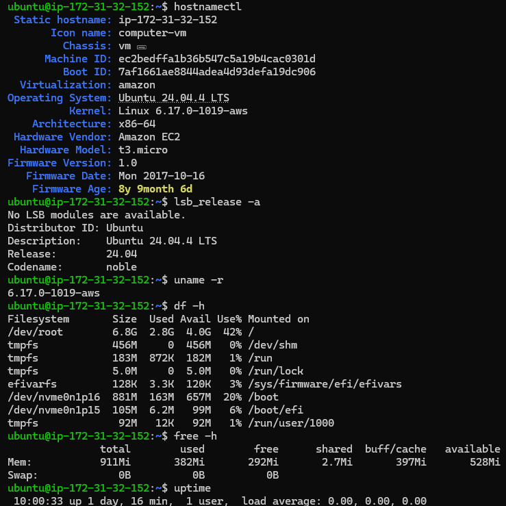
```

---

# Lab Summary

Pada LAB 1, telah berhasil dilakukan pemeriksaan kondisi awal server sebelum proses instalasi package.

Seluruh parameter utama—meliputi sistem operasi, kernel, kapasitas penyimpanan, penggunaan memori, dan beban server—menunjukkan kondisi yang sehat. Dengan demikian, server dinyatakan siap untuk melanjutkan ke proses pembaruan metadata repository pada LAB 2.


---

# LAB 2 — Update Repository Metadata

## Lab Information

| Item | Value |
|------|-------|
| Lab Number | 02 |
| Lab Name | Update Repository Metadata |
| Difficulty | Beginner |
| Estimated Time | 10 Minutes |
| Environment | Ubuntu Server 24.04.4 LTS (AWS EC2) |
| Objective | Memperbarui metadata package dari repository resmi Ubuntu sebelum melakukan instalasi software. |

---

# Background

Salah satu kesalahan yang sering dilakukan oleh administrator pemula adalah langsung menginstal package tanpa memperbarui metadata repository terlebih dahulu.

Pada lingkungan production, tindakan tersebut dapat menyebabkan:

- Package yang diinstal bukan versi terbaru.
- Dependency gagal ditemukan.
- Patch keamanan terbaru tidak tersedia.
- Metadata repository menjadi tidak sinkron.

Karena itu, hampir seluruh SOP perusahaan mewajibkan administrator menjalankan **`apt update`** sebelum melakukan instalasi package baru.

Perlu dipahami bahwa **`apt update` tidak menginstal ataupun memperbarui software**. Command ini hanya memperbarui informasi mengenai package yang tersedia pada repository.

---

# Learning Objectives

Setelah menyelesaikan LAB 2, Anda diharapkan mampu:

- Memahami fungsi `apt update`.
- Menjelaskan proses pembaruan metadata repository.
- Memahami hubungan antara APT dan repository Ubuntu.
- Menjelaskan mengapa `apt update` harus dilakukan sebelum instalasi package.
- Menganalisis output dari proses update repository.

---

# Enterprise Scenario

Tim Infrastructure menerima jadwal **Monthly Security Maintenance** untuk seluruh server Ubuntu.

Sebelum melakukan instalasi package atau security patch, administrator diwajibkan menyinkronkan metadata repository agar daftar package yang tersedia selalu menggunakan informasi terbaru dari Ubuntu Official Repository.

Sebagai Junior Linux Administrator, Anda bertugas memastikan metadata repository berhasil diperbarui tanpa error sebelum proses deployment dimulai.

---

# Command

Jalankan perintah berikut:

```bash
sudo apt update
```

---

# Command Explanation

## sudo

Menjalankan command menggunakan hak akses administrator.

Repository system hanya dapat diperbarui oleh user yang memiliki hak administratif.

---

## apt

APT (**Advanced Package Tool**) merupakan package manager tingkat tinggi pada distribusi Linux berbasis Debian.

APT bertugas:

- Menghubungi repository.
- Mengunduh metadata package.
- Menyelesaikan dependency.
- Mengelola instalasi software.

---

## update

Subcommand `update` digunakan untuk memperbarui **metadata repository**, bukan menginstal package.

Metadata tersebut berisi informasi seperti:

- Nama package
- Versi package
- Dependency
- Arsitektur
- Repository asal package

---

# Output Analysis

Berdasarkan hasil yang diperoleh selama praktikum, APT berhasil menghubungi beberapa repository resmi Ubuntu, di antaranya:

```text
noble
noble-updates
noble-backports
noble-security
```

Output juga menunjukkan proses:

```text
Hit:
```

Artinya metadata lokal sudah sesuai dengan repository dan tidak perlu diunduh kembali.

Sedangkan:

```text
Get:
```

Menunjukkan bahwa APT mengunduh metadata baru dari repository.

Pada akhir proses muncul informasi:

```text
Reading package lists... Done
```

Artinya metadata repository telah berhasil diproses dan disimpan pada sistem lokal.

Selain itu terdapat informasi:

```text
19 packages can be upgraded.
```

Hal ini menunjukkan terdapat 19 package yang memiliki versi lebih baru dan siap diperbarui apabila administrator menjalankan proses upgrade.

---

# Behind The Scenes

Ketika menjalankan:

```bash
sudo apt update
```

APT melakukan serangkaian proses internal seperti berikut:

```text
Administrator
        │
        ▼
sudo apt update
        │
        ▼
Membaca konfigurasi repository
(/etc/apt/sources.list)

        │
        ▼
Menghubungi Ubuntu Repository

        │
        ▼
Mengunduh file metadata

• InRelease
• Release
• Packages.gz

        │
        ▼
Memverifikasi GPG Signature

        │
        ▼
Memperbarui Local Package Cache

        │
        ▼
/var/lib/apt/lists/

        │
        ▼
Repository Metadata Updated
```

---

# Repository yang Digunakan

Pada server AWS EC2 ini, repository yang digunakan berasal dari regional **Asia Pacific (Singapore)**.

Contohnya:

```text
http://ap-southeast-1.ec2.archive.ubuntu.com/ubuntu
```

Pemilihan mirror regional bertujuan untuk:

- Mengurangi latency.
- Mempercepat proses download package.
- Mengurangi beban jaringan internasional.

---

# Package Cache

Metadata yang berhasil diunduh tidak langsung disimpan di memori.

APT menyimpannya ke direktori:

```text
/var/lib/apt/lists/
```

Direktori ini berisi daftar package yang digunakan APT ketika melakukan pencarian maupun instalasi software.

Untuk melihat isinya:

```bash
ls -lh /var/lib/apt/lists/
```

> **Catatan:** Perintah di atas bersifat opsional dan tidak wajib dilakukan pada lab ini, tetapi sangat disarankan untuk memahami lokasi penyimpanan metadata repository.

---

# Security Perspective

Sebelum metadata digunakan, Ubuntu melakukan proses verifikasi menggunakan **GPG Signature**.

Tujuannya adalah memastikan bahwa metadata benar-benar berasal dari repository resmi dan tidak dimodifikasi oleh pihak lain.

Jika proses verifikasi gagal, APT akan menampilkan peringatan seperti:

```text
The repository is not signed.
```

Dalam kondisi tersebut, administrator **tidak boleh melanjutkan instalasi package** sebelum penyebabnya diketahui.

---

# Enterprise Best Practice

Pada lingkungan enterprise, administrator biasanya:

- Selalu menjalankan `apt update` sebelum instalasi package.
- Menggunakan repository resmi atau internal mirror.
- Menjadwalkan update metadata secara berkala.
- Memastikan tidak ada error repository sebelum maintenance dimulai.
- Mencatat hasil update sebagai bagian dari Change Management.

---

# Common Errors

## Temporary failure resolving

Penyebab:

- DNS bermasalah.
- Tidak ada koneksi internet.

Langkah pengecekan:

```bash
ping google.com
```

atau

```bash
cat /etc/resolv.conf
```

---

## Repository not signed

Penyebab:

- Repository tidak valid.
- GPG Key hilang.
- Repository pihak ketiga tidak terpercaya.

Administrator harus memverifikasi sumber repository sebelum melanjutkan.

---

# Screenshot

**Filename**

```text
assets/screenshots/hands-on-lab/02-apt-update.png
```

Contoh penyisipan gambar pada GitHub:

```markdown
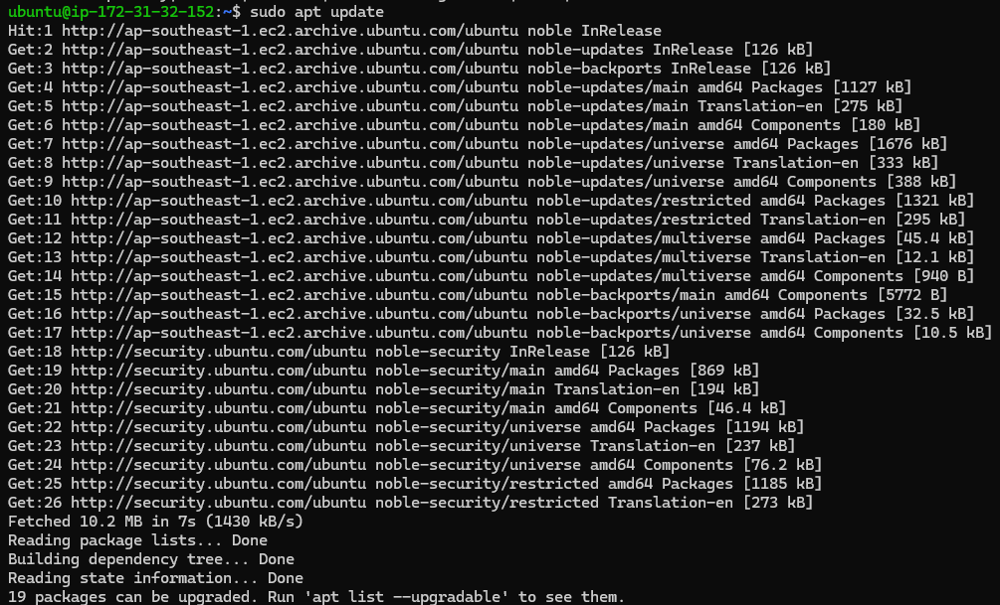
```

---

# Lab Summary

Pada LAB 2 telah berhasil dilakukan pembaruan metadata repository menggunakan `apt update`.

APT berhasil menghubungi Ubuntu Official Repository, mengunduh metadata terbaru, memverifikasi integritas menggunakan GPG Signature, dan memperbarui cache package lokal. Hasil pemeriksaan menunjukkan terdapat **19 package** yang dapat diperbarui, menandakan bahwa metadata repository telah sinkron dengan server resmi Ubuntu.

Dengan selesainya proses ini, server siap melanjutkan ke tahap berikutnya, yaitu instalasi package menggunakan APT.

---

# LAB 3 — Package Installation

## Lab Information

| Item | Value |
|------|-------|
| Lab Number | 03 |
| Lab Name | Package Installation |
| Difficulty | Beginner → Intermediate |
| Estimated Time | 20–30 Minutes |
| Environment | Ubuntu Server 24.04.4 LTS (AWS EC2) |
| Objective | Menginstal package menggunakan APT dan memahami proses instalasi software pada sistem Linux. |

---

# Background

Setelah metadata repository berhasil diperbarui pada LAB 2, administrator dapat mulai melakukan instalasi software yang dibutuhkan oleh server.

Pada lingkungan enterprise, proses instalasi package bukan sekadar menjalankan perintah `apt install`, tetapi merupakan bagian dari proses **Software Deployment** yang harus memperhatikan kompatibilitas, dependency, keamanan, dan dampaknya terhadap sistem yang sedang berjalan.

Pada lab ini akan dilakukan instalasi tiga package yang sangat umum digunakan oleh Linux Administrator, DevOps Engineer, dan Cloud Engineer:

- Nginx
- Git
- Curl

Ketiga package tersebut hampir selalu ditemukan pada server Linux modern.

---

# Learning Objectives

Setelah menyelesaikan LAB 3, Anda diharapkan mampu:

- Menginstal package menggunakan APT.
- Memahami proses Dependency Resolution.
- Memahami hubungan antara APT dan dpkg.
- Memahami bagaimana package didaftarkan ke system.
- Memahami bagaimana package tertentu membuat systemd service.
- Melakukan verifikasi bahwa instalasi berhasil.

---

# Enterprise Scenario

Perusahaan akan melakukan deployment aplikasi web baru.

Sebagai Junior Linux Administrator, Anda diminta menyiapkan server Ubuntu yang nantinya akan digunakan oleh tim Developer.

Software yang harus tersedia adalah:

- Nginx sebagai Web Server
- Git sebagai Version Control Client
- Curl sebagai HTTP Client

Administrator harus memastikan seluruh software berhasil diinstal tanpa error.

---

# Pre-Installation Checklist

Sebelum melakukan instalasi, administrator melakukan pemeriksaan berikut:

- [x] Server dapat mengakses internet.
- [x] Repository berhasil diperbarui.
- [x] User memiliki hak sudo.
- [x] Tidak terdapat broken package.
- [x] Ruang penyimpanan masih mencukupi.
- [x] Sistem berada dalam kondisi normal.

---

# Package 1 — Install Nginx

## Objective

Menginstal web server Nginx.

---

## Command

```bash
sudo apt install nginx -y
```

---

## Command Explanation

### sudo

Menjalankan command dengan hak administrator.

---

### apt

APT akan mengelola seluruh proses instalasi package.

---

### install

Memberitahu APT untuk melakukan instalasi package.

---

### nginx

Nama package yang akan diinstal.

---

### -y

Secara otomatis menjawab **Yes** pada konfirmasi instalasi.

Parameter ini umum digunakan pada automation script maupun CI/CD Pipeline.

---

# Output Analysis

Berdasarkan hasil praktikum, APT menampilkan informasi berikut:

```text
The following NEW packages will be installed:

nginx
nginx-common
```

Hal ini menunjukkan bahwa selain package utama (`nginx`), APT juga menginstal package pendukung (`nginx-common`) yang berisi konfigurasi dan file umum yang dibutuhkan oleh Nginx.

Kemudian muncul informasi:

```text
Need to get 568 kB of archives.
```

Artinya APT akan mengunduh total 568 KB package dari repository.

Selanjutnya:

```text
After this operation,
1602 kB of additional disk space will be used.
```

APT juga memperkirakan penggunaan storage setelah instalasi selesai.

---

# Behind The Scenes

Saat command berikut dijalankan:

```bash
sudo apt install nginx
```

APT melakukan proses internal berikut:

```text
Administrator
        │
        ▼
sudo apt install nginx
        │
        ▼
Membaca Metadata Repository
        │
        ▼
Mengecek Dependency
        │
        ▼
Mengunduh Package
        │
        ▼
Verifikasi GPG Signature
        │
        ▼
Menjalankan dpkg
        │
        ▼
Extract File
        │
        ▼
Menyalin Binary
        │
        ▼
Membuat Konfigurasi
        │
        ▼
Register Systemd Service
        │
        ▼
Installation Complete
```

---

# Important Installation Events

Selama instalasi muncul output berikut:

```text
Created symlink

/etc/systemd/system/multi-user.target.wants/nginx.service

↓

/usr/lib/systemd/system/nginx.service
```

Ini menunjukkan bahwa installer Nginx secara otomatis:

- mendaftarkan service ke systemd,
- membuat symbolic link,
- sehingga service dapat dijalankan saat proses boot.

Inilah salah satu alasan mengapa Package Management memiliki hubungan erat dengan materi **Process Management** yang telah dipelajari pada Hari 5.

---

# Post Installation Verification

Setelah instalasi selesai, administrator perlu memastikan bahwa package benar-benar berhasil dipasang.

Verifikasi detail akan dilakukan pada LAB 4.

---

# Security Consideration

Pada server production, administrator hanya menginstal software yang benar-benar dibutuhkan.

Semakin banyak package yang terpasang, semakin besar pula:

- attack surface,
- kemungkinan munculnya vulnerability,
- beban maintenance,
- kebutuhan patch keamanan.

Prinsip yang digunakan adalah:

> Install only what you need.

---

# Enterprise Best Practice

Sebelum menginstal package baru:

- Pastikan repository telah diperbarui.
- Pastikan package berasal dari repository terpercaya.
- Catat perubahan pada Change Log.
- Lakukan instalasi pada maintenance window apabila server sedang digunakan oleh pengguna.

---

# Screenshot

**Filename**

```text
assets/screenshots/hands-on-lab/03-install-nginx.png
```

Contoh penyisipan gambar:


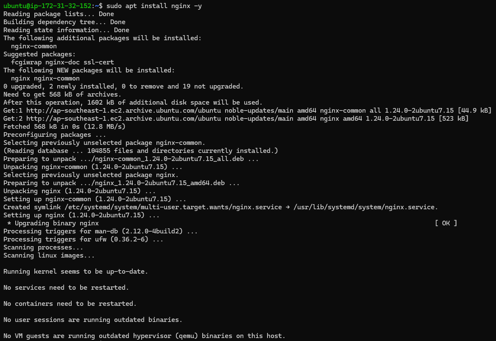
```

---

# Lab Summary

Pada tahap ini berhasil dilakukan instalasi package **Nginx** menggunakan APT.

APT secara otomatis mengunduh package beserta dependency yang diperlukan, memverifikasi integritas package, menjalankan `dpkg`, menyalin file ke sistem, serta mendaftarkan service Nginx ke `systemd`.

Dengan demikian, server telah memiliki web server yang siap digunakan pada tahap konfigurasi berikutnya.

---

---

# LAB 3.1 — Install Git

## Tujuan

Menginstal **Git**, sebuah Distributed Version Control System (DVCS) yang digunakan untuk mengelola perubahan source code dan berkolaborasi dalam pengembangan perangkat lunak.

Git merupakan salah satu tools yang wajib dikuasai oleh:

- Linux Administrator
- Cloud Engineer
- DevOps Engineer
- Site Reliability Engineer (SRE)
- Software Developer

Hampir seluruh konfigurasi Infrastructure as Code (IaC), Automation Script, Kubernetes Manifest, hingga Terraform Configuration disimpan menggunakan Git Repository.

---

## Command

```bash
sudo apt install git -y
```

---

## Penjelasan Command

| Bagian | Penjelasan |
|---------|------------|
| `sudo` | Menjalankan command sebagai Super User. |
| `apt` | Package Manager Ubuntu. |
| `install` | Menginstal package. |
| `git` | Nama package yang akan diinstal. |
| `-y` | Menjawab otomatis konfirmasi instalasi. |

---

## Output yang Diharapkan

Pada praktikum ini muncul output:

```text
git is already the newest version (1:2.43.0-1ubuntu7.3).

git set to manually installed.
```

---

## Analisis

Output tersebut menunjukkan bahwa:

- Git **sudah terinstal sebelumnya** pada sistem.
- APT mendeteksi tidak diperlukan proses download maupun instalasi ulang.
- Package ditandai sebagai **manually installed**, artinya package tersebut dianggap memang dibutuhkan oleh administrator dan tidak akan dihapus oleh `apt autoremove`.

Hal ini berbeda dengan package yang terpasang sebagai dependency, yang dapat dihapus secara otomatis apabila sudah tidak digunakan.

---

## Enterprise Insight

Pada lingkungan enterprise, Git digunakan untuk:

- menyimpan Infrastructure as Code (Terraform),
- menyimpan Ansible Playbook,
- menyimpan Bash Script,
- menyimpan Dockerfile,
- menyimpan Kubernetes Manifest,
- mengelola CI/CD Pipeline,
- versioning konfigurasi server.

Git merupakan fondasi utama dalam praktik DevOps modern.

---

## Dokumentasi GitHub

Screenshot:

```text
04-install-git.png
```

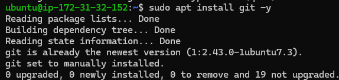

Analisis yang disertakan:

- Git telah tersedia pada sistem.
- Tidak diperlukan instalasi ulang.
- Package berada pada versi terbaru yang tersedia di repository.

---

# LAB 3.2 — Install Curl

## Tujuan

Menginstal **Curl**, yaitu command-line tool yang digunakan untuk melakukan transfer data menggunakan berbagai protokol jaringan seperti HTTP, HTTPS, FTP, dan lainnya.

Curl merupakan salah satu utilitas yang paling sering digunakan oleh Linux Administrator dan DevOps Engineer untuk melakukan pengujian konektivitas, API Testing, maupun proses otomatisasi.

---

## Command

```bash
sudo apt install curl -y
```
---

## Penjelasan Command

| Bagian | Penjelasan |
|---------|------------|
| `sudo` | Menjalankan command sebagai Super User. |
| `apt` | Package Manager Ubuntu. |
| `install` | Menginstal package. |
| `curl` | Nama package yang akan diinstal. |
| `-y` | Menjawab otomatis konfirmasi instalasi. |

---

## Output yang Diharapkan

Hasil praktikum menunjukkan:

```text
curl is already the newest version (8.5.0-2ubuntu10.11).

curl set to manually installed.
```

---

## Analisis

Output tersebut menunjukkan bahwa:

- Curl telah tersedia pada sistem.
- Tidak diperlukan proses download tambahan.
- Package berada pada versi terbaru yang tersedia di repository.
- Package ditandai sebagai **manually installed** sehingga tidak dianggap sebagai dependency yang dapat dihapus otomatis.

---

## Enterprise Insight

Curl banyak digunakan untuk:

- menguji REST API,
- menguji Web Server,
- memeriksa Health Check Endpoint,
- mengunduh file melalui script,
- melakukan automation deployment,
- integrasi dengan CI/CD Pipeline.

Pada lingkungan Cloud Computing, Curl hampir selalu tersedia pada server Linux karena perannya yang sangat penting dalam proses troubleshooting dan automation.

---

## Dokumentasi GitHub

Screenshot:

```text
05-install-curl.png
```
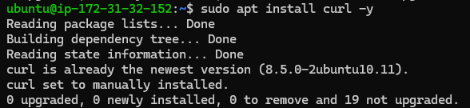

Analisis yang disertakan:

- Curl telah terinstal.
- Tidak diperlukan instalasi ulang.
- Package berada pada versi terbaru yang tersedia di repository.

---

# LAB 3 Summary

Pada LAB 3 berhasil dilakukan verifikasi instalasi tiga package utama yang umum digunakan pada lingkungan Linux Server.

| Package | Status | Keterangan |
|----------|--------|------------|
| Nginx | ✅ Installed | Berhasil diinstal menggunakan APT beserta dependency-nya. |
| Git | ✅ Available | Sudah terinstal pada sistem dan berada pada versi terbaru. |
| Curl | ✅ Available | Sudah terinstal pada sistem dan berada pada versi terbaru. |

Ketiga package tersebut menjadi fondasi penting dalam administrasi server Linux modern:

- **Nginx** menyediakan layanan web server dan reverse proxy.
- **Git** mendukung version control dan kolaborasi pengembangan.
- **Curl** mempermudah pengujian jaringan serta otomatisasi komunikasi berbasis HTTP/HTTPS.

Dengan selesainya LAB 3, server telah memiliki software dasar yang dibutuhkan untuk melanjutkan proses verifikasi package pada LAB 4.

---

# LAB 4 — Package Verification

## Lab Information

| Item | Value |
|------|-------|
| Lab Number | 04 |
| Lab Name | Package Verification |
| Difficulty | Beginner → Intermediate |
| Estimated Time | 20 Minutes |
| Environment | Ubuntu Server 24.04.4 LTS (AWS EC2) |
| Objective | Memverifikasi bahwa package berhasil terinstal menggunakan berbagai tools bawaan Linux. |

---

# Background

Pada lingkungan production, proses instalasi software tidak berhenti setelah command `apt install` selesai dijalankan.

Administrator harus melakukan **verifikasi** untuk memastikan bahwa:

- Package benar-benar telah terinstal.
- Database package telah diperbarui.
- Binary tersedia pada lokasi yang benar.
- Dependency berhasil dipasang.
- Software siap digunakan oleh sistem.

Verifikasi ini menjadi bagian penting dari **Change Management** dan **Deployment Validation**.

---

# Learning Objectives

Setelah menyelesaikan LAB 4, Anda diharapkan mampu:

- Memverifikasi package menggunakan `dpkg`.
- Memahami status package pada database Debian.
- Menggunakan `apt list --installed`.
- Mengetahui lokasi database package.
- Menganalisis hasil instalasi package.

---

# Enterprise Scenario

Tim Infrastructure telah selesai menginstal beberapa software baru pada server production.

Sebelum server diserahkan kepada tim Developer, administrator diwajibkan melakukan audit untuk memastikan seluruh software telah terinstal dengan benar dan tidak terdapat package yang gagal dipasang.

---

# Verification Tool 1 — dpkg

## Tujuan

Memverifikasi status package menggunakan database Debian Package Manager.

---

## Command

```bash
dpkg -l | grep nginx

dpkg -l | grep git

dpkg -l | grep curl
```

---

## Penjelasan Command

| Command | Fungsi |
|---------|--------|
| `dpkg -l` | Menampilkan seluruh package yang terdaftar pada database Debian. |
| `grep nginx` | Menyaring hasil agar hanya menampilkan package Nginx. |
| `grep git` | Menampilkan package Git. |
| `grep curl` | Menampilkan package Curl. |

---

# Output Analysis

Hasil praktikum menunjukkan:

```text
ii nginx
ii nginx-common

ii git
ii git-man

ii curl
ii libcurl4
```

Perhatikan dua karakter pertama:

```text
ii
```

Kode tersebut memiliki arti:

| Karakter | Arti |
|----------|------|
| i | Desired State = Install |
| i | Current State = Installed |

Artinya package telah berhasil dipasang dan berada dalam kondisi normal.

---

# Behind The Scenes

Saat menjalankan:

```bash
dpkg -l
```

Linux **tidak menghubungi internet** maupun repository.

Sebaliknya, `dpkg` membaca database lokal yang berada pada:

```text
/var/lib/dpkg/status
```

Alur kerjanya:

```text
Administrator
        │
        ▼
dpkg -l
        │
        ▼
Membaca Database Package

/var/lib/dpkg/status

        │
        ▼
Menampilkan Status Package
```

Karena seluruh informasi berada di database lokal, proses ini berlangsung sangat cepat.

---

# Memahami Status Package

Selain `ii`, terdapat beberapa kode status lain yang perlu diketahui administrator.

| Status | Arti |
|---------|------|
| ii | Installed |
| rc | Removed, configuration masih tersisa |
| un | Package belum pernah diinstal |
| hi | Half Installed |
| pn | Purged / Not Installed |

Memahami status ini sangat penting ketika melakukan troubleshooting package pada server production.

---

# Verification Tool 2 — apt

Selain menggunakan `dpkg`, administrator juga dapat menggunakan APT.

## Command

```bash
apt list --installed | grep nginx
```

atau

```bash
apt list --installed | grep git
```

atau

```bash
apt list --installed | grep curl
```

---

## Penjelasan

Perintah ini membaca daftar package yang dianggap telah terinstal oleh APT.

Output biasanya menampilkan:

- nama package,
- versi,
- repository asal package.

---

# Perbedaan dpkg dan apt

| dpkg | apt |
|------|-----|
| Low Level Package Manager | High Level Package Manager |
| Membaca database Debian | Mengelola repository dan dependency |
| Tidak mengunduh package | Dapat mengunduh package |
| Tidak menangani dependency | Menangani dependency secara otomatis |

APT menggunakan `dpkg` sebagai backend saat melakukan instalasi package.

---

# Enterprise Insight

Administrator production biasanya menggunakan kombinasi:

```bash
dpkg -l
```

untuk memastikan status package,

kemudian:

```bash
apt list --installed
```

untuk melakukan audit software yang terpasang.

Kombinasi kedua command tersebut membantu memastikan bahwa proses deployment berjalan sesuai prosedur.

---

# Common Mistakes

Kesalahan yang sering dilakukan administrator pemula:

- Menganggap instalasi berhasil tanpa melakukan verifikasi.
- Tidak memahami arti status `ii`, `rc`, atau `hi`.
- Menghapus package tanpa memeriksa dependency yang terkait.
- Mengandalkan satu tool verifikasi saja.

---

# Screenshot

**Filename**

```text
assets/screenshots/hands-on-lab/06-package-verification.png
```

Contoh penyisipan gambar:


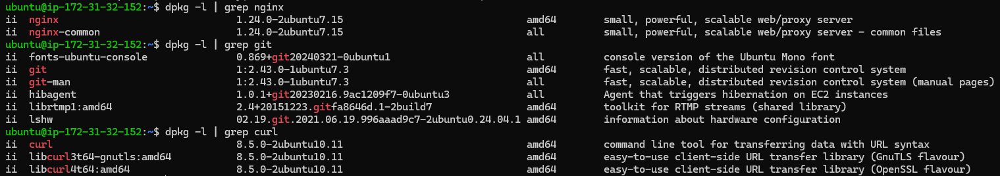
```

---

# Lab Summary

Pada LAB 4 telah dilakukan proses verifikasi package menggunakan `dpkg` dan `apt`.

Hasil pemeriksaan menunjukkan bahwa package **Nginx**, **Git**, dan **Curl** berhasil terdaftar pada database package Ubuntu dengan status **ii (Installed)**. Verifikasi ini memastikan bahwa proses instalasi sebelumnya telah berjalan dengan sukses dan software siap digunakan oleh sistem maupun administrator.

---

# LAB 5 — Binary Verification

## Lab Information

| Item | Value |
|------|-------|
| Lab Number | 05 |
| Lab Name | Binary Verification |
| Difficulty | Beginner → Intermediate |
| Estimated Time | 15 Minutes |
| Environment | Ubuntu Server 24.04.4 LTS (AWS EC2) |
| Objective | Memverifikasi lokasi binary executable dan memahami bagaimana Linux menemukan sebuah command. |

---

# Background

Setelah package berhasil diinstal, langkah berikutnya adalah memastikan bahwa **binary executable** tersedia dan dapat dijalankan oleh sistem.

Pada lingkungan production, administrator sering melakukan verifikasi lokasi binary untuk:

- memastikan instalasi berhasil,
- mengetahui lokasi executable,
- melakukan troubleshooting PATH,
- memverifikasi hasil deployment aplikasi.

---

# Learning Objectives

Setelah menyelesaikan LAB ini, Anda diharapkan mampu:

- menggunakan `which`,
- menggunakan `whereis`,
- memahami perbedaan keduanya,
- memahami konsep executable,
- memahami bagaimana Shell menemukan command.

---

# Enterprise Scenario

Administrator baru saja menginstal beberapa software pada server Ubuntu.

Sebelum software digunakan oleh tim Developer, administrator harus memastikan bahwa binary executable tersedia dan dapat dipanggil melalui terminal.

---

# Verification Tool 1 — which

## Tujuan

Mengetahui lokasi executable yang digunakan Shell ketika sebuah command dijalankan.

---

## Command

```bash
which nginx

which git

which curl
```

---

## Penjelasan Command

| Command | Fungsi |
|---------|--------|
| `which nginx` | Menampilkan lokasi executable Nginx. |
| `which git` | Menampilkan lokasi executable Git. |
| `which curl` | Menampilkan lokasi executable Curl. |

---

## Output Hasil Praktikum

```text
/usr/sbin/nginx
/usr/bin/git
/usr/bin/curl
```

---

## Analisis

Hasil tersebut menunjukkan bahwa:

- Binary **Nginx** berada pada:

```text
/usr/sbin/nginx
```

Karena Nginx merupakan software administrasi sistem.

Sedangkan:

```text
/usr/bin/git
/usr/bin/curl
```

berada pada direktori:

```text
/usr/bin
```

yang merupakan lokasi umum executable yang dapat dijalankan oleh seluruh user.

---

# Behind The Scenes

Saat menjalankan:

```bash
which nginx
```

Shell **tidak mencari seluruh filesystem**.

Shell hanya membaca environment variable:

```bash
echo $PATH
```

Kemudian melakukan pencarian secara berurutan.

Diagram prosesnya:

```text
User

   │

   ▼

Menjalankan:

which nginx

   │

   ▼

Shell membaca PATH

   │

   ▼

/usr/local/bin

   │

   ▼

/usr/bin

   │

   ▼

/usr/sbin

   │

   ▼

Binary ditemukan

   │

   ▼

Menampilkan lokasi executable
```

Karena hanya memeriksa direktori pada `$PATH`, proses ini berlangsung sangat cepat.

---

# Verification Tool 2 — whereis

## Tujuan

Menampilkan lokasi berbagai komponen yang berkaitan dengan suatu software.

---

## Command

```bash
whereis nginx

whereis git

whereis curl
```

---

## Output Hasil Praktikum

```text
nginx:
/usr/sbin/nginx
/etc/nginx
/usr/share/nginx
/usr/share/man/man8/nginx.8.gz

git:
/usr/bin/git
/usr/share/man/man1/git.1.gz

curl:
/usr/bin/curl
/usr/share/man/man1/curl.1.gz
```

---

## Analisis

Berbeda dengan `which`, command `whereis` memberikan informasi yang lebih lengkap.

Contohnya pada Nginx:

| Lokasi | Fungsi |
|---------|--------|
| `/usr/sbin/nginx` | Binary executable. |
| `/etc/nginx` | File konfigurasi. |
| `/usr/share/nginx` | Resource tambahan. |
| `/usr/share/man` | Manual page. |

Dengan demikian administrator dapat mengetahui seluruh lokasi penting yang berkaitan dengan software tersebut.

---

# Perbedaan which dan whereis

| which | whereis |
|--------|----------|
| Menampilkan executable yang digunakan Shell | Menampilkan binary, konfigurasi, dokumentasi, dan resource lain |
| Menggunakan variabel `$PATH` | Menggunakan database lokasi standar Linux |
| Fokus pada executable | Fokus pada seluruh komponen software |

---

# Enterprise Insight

Dalam lingkungan production:

- `which` digunakan ketika administrator ingin memastikan executable yang akan dijalankan.
- `whereis` digunakan saat melakukan audit software atau mencari lokasi konfigurasi dan dokumentasi.

Kedua command ini sering digunakan saat troubleshooting maupun deployment aplikasi.

---

# Common Mistakes

Beberapa kesalahan yang sering dilakukan:

- Menganggap `which` dapat menemukan file konfigurasi.
- Mengira `whereis` hanya menampilkan executable.
- Tidak memahami bahwa `which` bergantung pada variabel lingkungan `$PATH`.
- Mengubah isi `$PATH` tanpa memahami dampaknya terhadap sistem.

---

# Screenshot

**Filename**

```text
assets/screenshots/hands-on-lab/07-binary-location.png
```

Contoh penyisipan gambar:


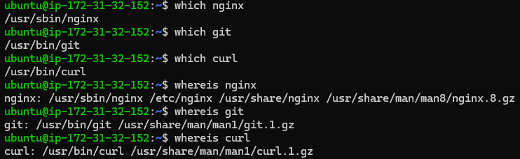
```

---

# Lab Summary

Pada LAB 5 telah dilakukan verifikasi lokasi binary menggunakan `which` dan `whereis`.

Hasil menunjukkan bahwa executable **Nginx**, **Git**, dan **Curl** berada pada direktori yang sesuai dengan standar Filesystem Hierarchy Standard (FHS). Selain itu, administrator juga berhasil mengidentifikasi lokasi file konfigurasi, resource tambahan, dan manual page dari setiap software.

Pemahaman mengenai lokasi binary sangat penting untuk proses troubleshooting, deployment, audit software, dan administrasi server Linux di lingkungan enterprise.


---

# LAB 6 — Hubungan Package dan Service

## Lab Information

| Item | Value |
|------|-------|
| Lab Number | 06 |
| Lab Name | Package and Service Integration |
| Difficulty | Intermediate |
| Estimated Time | 20 Minutes |
| Environment | Ubuntu Server 24.04.4 LTS (AWS EC2) |
| Objective | Memahami hubungan antara package, systemd, service, process, dan port setelah proses instalasi software. |

---

# Background

Menginstal sebuah package di Linux tidak selalu berarti hanya menyalin file ke dalam filesystem.

Beberapa package, seperti **Nginx**, **Apache**, **MySQL**, atau **Docker**, merupakan software yang menyediakan layanan (*service*) sehingga setelah proses instalasi selesai, package tersebut akan terintegrasi dengan **systemd**.

Administrator harus memahami hubungan ini agar mampu melakukan:

- monitoring service,
- troubleshooting startup,
- restart service,
- enable/disable service,
- analisis proses yang berjalan.

---

# Learning Objectives

Setelah menyelesaikan LAB ini, Anda diharapkan mampu:

- memverifikasi status service,
- memahami hubungan package dengan systemd,
- memahami status service,
- membedakan service aktif dan nonaktif,
- memahami proses yang dijalankan oleh service.

---

# Enterprise Scenario

Tim Infrastructure baru saja menginstal **Nginx** pada sebuah Ubuntu Server.

Sebelum server digunakan oleh tim Developer, administrator harus memastikan bahwa:

- service berhasil dibuat,
- service aktif,
- service otomatis berjalan saat boot,
- process Nginx benar-benar berjalan.

---

# Verifikasi Status Service

## Tujuan

Memastikan bahwa service Nginx berhasil dijalankan oleh systemd.

---

## Command

```bash
systemctl status nginx
```

---

## Penjelasan Command

| Command | Fungsi |
|---------|--------|
| `systemctl` | Utility untuk mengelola service yang dikendalikan oleh systemd. |
| `status` | Menampilkan status service secara lengkap. |
| `nginx` | Nama service yang akan diperiksa. |

---

## Output Hasil Praktikum

Output menunjukkan bahwa:

```text
Active: active (running)
```

Artinya service berhasil dijalankan.

Selain itu terlihat informasi:

- Main PID
- Process Tree
- Memory Usage
- CPU Usage
- Log Startup

---

## Analisis

Dari hasil praktikum dapat disimpulkan bahwa:

- Package berhasil membuat systemd unit.
- systemd berhasil menjalankan service.
- Nginx memiliki Main Process (Master Process).
- Worker Process berhasil dibuat.
- Service berjalan tanpa error.

---

# Verifikasi Status Aktif

## Command

```bash
systemctl is-active nginx
```

---

## Output

```text
active
```

---

## Analisis

Output **active** menunjukkan bahwa service sedang berjalan dan siap menerima request.

Jika output menjadi:

```text
inactive
```

atau

```text
failed
```

maka administrator perlu melakukan proses troubleshooting.

---

# Verifikasi Startup Otomatis

## Command

```bash
systemctl is-enabled nginx
```

---

## Output

```text
enabled
```

---

## Analisis

Status **enabled** menunjukkan bahwa service akan dijalankan secara otomatis setiap kali server melakukan booting.

Status lain yang mungkin ditemui antara lain:

| Status | Arti |
|---------|------|
| enabled | Otomatis berjalan saat boot |
| disabled | Tidak otomatis berjalan |
| masked | Tidak dapat dijalankan karena diblokir oleh systemd |

---

# Behind The Scenes

Saat menjalankan:

```bash
sudo apt install nginx
```

APT tidak hanya menyalin file ke sistem.

Berikut alur lengkap yang terjadi:

```text
Administrator

        │

        ▼

sudo apt install nginx

        │

        ▼

APT

        │

        ▼

Dependency Resolution

        │

        ▼

dpkg

        │

        ▼

Binary disalin ke:

/usr/sbin/nginx

        │

        ▼

Konfigurasi dibuat:

/etc/nginx/

        │

        ▼

systemd Unit

/usr/lib/systemd/system/nginx.service

        │

        ▼

systemctl enable

        │

        ▼

systemctl start

        │

        ▼

Nginx Master Process

        │

        ▼

Worker Process

        │

        ▼

Listening Port 80
```

---

# Hubungan Hari 5 dan Hari 6

Materi Hari 5 dan Hari 6 sebenarnya saling berkaitan.

Diagram hubungan:

```text
Repository

        │

        ▼

APT

        │

        ▼

Package

        │

        ▼

dpkg

        │

        ▼

Binary

        │

        ▼

systemd

        │

        ▼

Service

        │

        ▼

Process

        │

        ▼

Listening Port

        │

        ▼

Client Request
```

Dengan memahami alur ini, seorang Linux Administrator dapat melakukan troubleshooting dari level package hingga service yang berjalan.

---

# Enterprise Insight

Dalam lingkungan production, administrator biasanya melakukan verifikasi berikut setelah instalasi service:

- memastikan package berhasil diinstal,
- memastikan service aktif,
- memastikan service otomatis berjalan saat boot,
- memastikan process berjalan normal,
- memastikan port layanan terbuka,
- memastikan log service tidak menunjukkan error.

Langkah-langkah ini merupakan bagian dari **Post Deployment Verification** sebelum server diserahkan kepada tim Developer atau Application Owner.

---

# Common Mistakes

Beberapa kesalahan yang sering dilakukan administrator pemula:

- Menganggap package otomatis berjalan setelah diinstal.
- Tidak memeriksa status service setelah instalasi.
- Tidak memverifikasi apakah service aktif saat boot.
- Mengabaikan log ketika service gagal dijalankan.
- Tidak memahami hubungan antara package, service, dan process.

---

# Screenshot

**Filename**

```text
assets/screenshots/hands-on-lab/08-systemctl-nginx.png
```

Contoh penyisipan gambar:


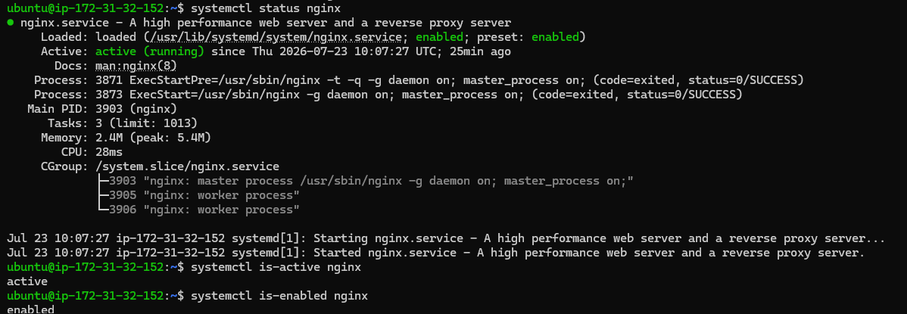
```

---

# Lab Summary

Pada LAB 6 telah dilakukan verifikasi hubungan antara package dan service menggunakan `systemctl`.

Hasil menunjukkan bahwa package **Nginx** tidak hanya berhasil diinstal, tetapi juga terintegrasi dengan **systemd**, sehingga service dapat dijalankan, dipantau, dan dikelola menggunakan utilitas `systemctl`.

Pemahaman mengenai hubungan **Package → systemd → Service → Process** merupakan dasar penting dalam administrasi server Linux, deployment aplikasi, dan troubleshooting pada lingkungan enterprise.


---

# LAB 7 — Package Removal

## Lab Information

| Item | Value |
|------|-------|
| Lab Number | 07 |
| Lab Name | Package Removal |
| Difficulty | Intermediate |
| Estimated Time | 20 Minutes |
| Environment | Ubuntu Server 24.04.4 LTS (AWS EC2) |
| Objective | Memahami cara menghapus package menggunakan APT serta menganalisis dampaknya terhadap binary, konfigurasi, dan service. |

---

# Background

Pada lingkungan enterprise, administrator tidak hanya bertugas menginstal software, tetapi juga melakukan proses **uninstall** ketika software sudah tidak diperlukan.

Contoh kasus:

- aplikasi dimigrasikan ke server lain,
- rollback deployment,
- software diganti dengan versi baru,
- mengurangi attack surface,
- membersihkan server production.

Ubuntu menyediakan beberapa metode penghapusan package, salah satunya adalah `apt remove`.

---

# Learning Objectives

Setelah menyelesaikan LAB ini, Anda diharapkan mampu:

- menghapus package menggunakan `apt remove`,
- memahami perbedaan remove dan purge,
- menganalisis perubahan pada package,
- memverifikasi binary yang telah dihapus,
- memahami mengapa konfigurasi masih tersisa.

---

# Enterprise Scenario

Administrator diminta menghapus Web Server Nginx dari server production karena aplikasi akan dipindahkan ke platform lain.

Sebelum melakukan migrasi penuh, perusahaan masih ingin mempertahankan konfigurasi Nginx apabila sewaktu-waktu diperlukan proses instalasi ulang.

Dalam kondisi seperti ini, administrator memilih menggunakan **apt remove**, bukan **apt purge**.

---

# Remove Package

## Tujuan

Menghapus package utama tanpa menghapus file konfigurasi.

---

## Command

```bash
sudo apt remove nginx
```

---

## Penjelasan Command

| Command | Fungsi |
|---------|--------|
| `sudo` | Menjalankan command sebagai Super User. |
| `apt` | Package Manager Ubuntu. |
| `remove` | Menghapus package namun mempertahankan konfigurasi. |
| `nginx` | Package yang akan dihapus. |

---

# Output Hasil Praktikum

Selama proses penghapusan muncul informasi:

```text
The following package was automatically installed and is no longer required:

nginx-common
```

Kemudian:

```text
The following packages will be REMOVED:

nginx
```

APT juga menampilkan estimasi ruang disk yang akan dibebaskan setelah package dihapus.

---

# Analisis

Hasil praktikum menunjukkan bahwa:

- package **nginx** berhasil dihapus,
- binary executable telah hilang,
- package **nginx-common** masih tersedia,
- file konfigurasi masih dipertahankan.

Hal ini merupakan perilaku normal dari `apt remove`.

Administrator masih dapat memasang kembali package Nginx tanpa kehilangan konfigurasi sebelumnya.

---

# Verifikasi Setelah Remove

## Command

```bash
dpkg -l | grep nginx
```

---

## Output

```text
ii nginx-common
```

---

## Analisis

Hasil tersebut menunjukkan bahwa package utama telah dihapus, namun package pendukung (`nginx-common`) masih berada pada sistem.

Package ini berisi berbagai file bersama seperti konfigurasi default, dokumentasi, maupun resource yang belum dihapus.

---

# Verifikasi Binary

## Command

```bash
which nginx
```

---

## Output

Tidak menghasilkan output.

---

## Analisis

Binary executable telah berhasil dihapus sehingga Shell tidak lagi dapat menemukan command `nginx`.

Ini membuktikan bahwa proses uninstall terhadap executable berhasil dilakukan.

---

# Verifikasi Service

## Command

```bash
systemctl status nginx
```

---

## Output Hasil Praktikum

Status menunjukkan:

```text
Active: inactive (dead)
```

---

## Analisis

Walaupun executable telah dihapus, systemd masih mengenali unit service karena file konfigurasi dan metadata service belum sepenuhnya dibersihkan.

Service berada pada status **inactive**, bukan **active**, karena binary yang diperlukan untuk menjalankan service sudah tidak tersedia.

---

# Verifikasi Konfigurasi

## Command

```bash
whereis nginx
```

---

## Output

```text
/etc/nginx

/usr/share/nginx
```

---

## Analisis

Hasil ini menunjukkan bahwa direktori konfigurasi masih tersimpan.

Inilah perbedaan utama antara:

- `apt remove`
- `apt purge`

`apt remove` hanya menghapus package utama, sedangkan file konfigurasi tetap dipertahankan.

---

# Behind The Scenes

Alur kerja ketika menjalankan:

```bash
sudo apt remove nginx
```

```text
Administrator

        │

        ▼

APT

        │

        ▼

Dependency Check

        │

        ▼

dpkg

        │

        ▼

Binary dihapus

/usr/sbin/nginx

        │

        ▼

Service dihentikan

        │

        ▼

Package nginx dihapus

        │

        ▼

Konfigurasi dipertahankan

/etc/nginx

        │

        ▼

nginx-common tetap tersedia
```

---

# Enterprise Insight

Pada lingkungan production, `apt remove` sering digunakan ketika:

- melakukan rollback deployment,
- melakukan upgrade aplikasi secara bertahap,
- mempertahankan konfigurasi untuk proses reinstall,
- migrasi software.

Pendekatan ini mempermudah administrator mengembalikan layanan apabila terjadi kegagalan setelah migrasi.

---

# Common Mistakes

Kesalahan yang sering dilakukan administrator:

- Mengira `apt remove` akan menghapus seluruh file.
- Tidak melakukan verifikasi setelah uninstall.
- Tidak memahami bahwa konfigurasi masih dipertahankan.
- Langsung menjalankan `purge` tanpa memastikan backup konfigurasi tersedia.

---

# Screenshot

**Filename**

```text
assets/screenshots/hands-on-lab/09-remove-nginx.png
```

Contoh penyisipan gambar:


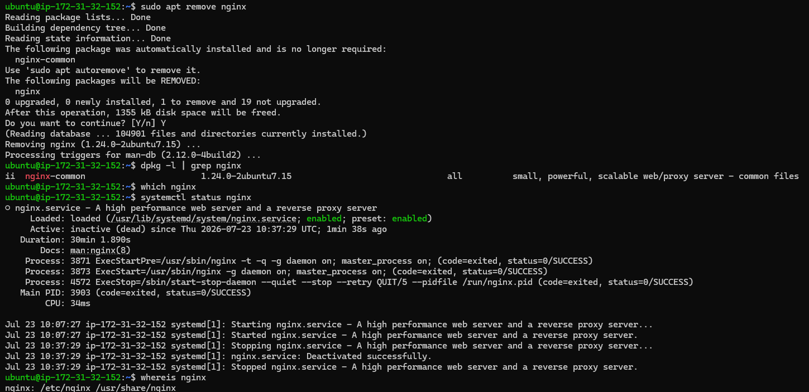
```

---

# Lab Summary

Pada LAB 7 telah dilakukan proses penghapusan package **Nginx** menggunakan `apt remove`.

Hasil praktikum menunjukkan bahwa package utama berhasil dihapus, binary executable tidak lagi tersedia, dan service telah berhenti. Namun, file konfigurasi serta package pendukung (`nginx-common`) masih dipertahankan.

Perilaku ini menunjukkan bahwa `apt remove` dirancang untuk menghapus software tanpa menghilangkan konfigurasi, sehingga proses instalasi ulang dapat dilakukan dengan lebih mudah apabila diperlukan.


---

# LAB 8 — Package Purge

## Lab Information

| Item | Value |
|------|-------|
| Lab Number | 08 |
| Lab Name | Package Purge |
| Difficulty | Intermediate |
| Estimated Time | 20 Minutes |
| Environment | Ubuntu Server 24.04.4 LTS (AWS EC2) |
| Objective | Menghapus package beserta seluruh file konfigurasi dan melakukan verifikasi hasil penghapusan secara menyeluruh. |

---

# Background

Pada LAB sebelumnya kita menggunakan:

```bash
sudo apt remove nginx
```

Command tersebut hanya menghapus package utama.

File konfigurasi dan package pendukung masih dipertahankan.

Pada LAB ini administrator akan melakukan **clean uninstall** menggunakan:

```bash
apt purge
```

Pendekatan ini umum digunakan ketika:

- server akan dipensiunkan,
- software tidak akan digunakan lagi,
- migrasi selesai,
- instalasi ulang harus benar-benar bersih,
- membersihkan konfigurasi lama sebelum deployment baru.

---

# Learning Objectives

Setelah menyelesaikan LAB ini Anda diharapkan mampu:

- memahami fungsi `apt purge`,
- membedakan remove dan purge,
- memverifikasi hasil purge,
- memahami perubahan pada package database,
- memahami perubahan pada systemd dan filesystem.

---

# Enterprise Scenario

Migrasi aplikasi telah selesai.

Tim Infrastructure memastikan bahwa seluruh komponen Nginx harus dihapus dari server agar:

- tidak ada konfigurasi lama,
- tidak ada service yang tertinggal,
- attack surface berkurang,
- server kembali dalam kondisi bersih.

---

# Purge Package

## Tujuan

Menghapus package beserta seluruh file konfigurasi.

---

## Command

```bash
sudo apt purge nginx nginx-common
```

---

## Penjelasan Command

| Command | Fungsi |
|---------|--------|
| `apt purge` | Menghapus package beserta file konfigurasi. |
| `nginx` | Package utama. |
| `nginx-common` | Package pendukung yang masih tersisa setelah proses remove. |

---

# Output Hasil Praktikum

Selama proses penghapusan terlihat:

```text
Removing nginx-common...
Purging configuration files...
```

APT tidak hanya menghapus package, tetapi juga membersihkan konfigurasi yang tersimpan pada sistem.

---

# Analisis

Hasil praktikum menunjukkan bahwa:

- package berhasil dihapus,
- konfigurasi berhasil dihapus,
- systemd unit ikut hilang,
- filesystem telah dibersihkan.

Server kini tidak lagi memiliki komponen yang berkaitan dengan Nginx.

---

# Verifikasi Package

## Command

```bash
dpkg -l | grep nginx
```

---

## Output

Tidak menghasilkan output.

---

## Analisis

Database package (`/var/lib/dpkg/status`) tidak lagi memiliki entri mengenai Nginx.

Artinya proses uninstall telah selesai dengan sukses.

---

# Verifikasi Binary

## Command

```bash
which nginx
```

---

## Output

Tidak menghasilkan output.

---

## Analisis

Binary executable telah sepenuhnya dihapus sehingga Shell tidak dapat lagi menemukan command `nginx`.

---

# Verifikasi Lokasi File

## Command

```bash
whereis nginx
```

---

## Output

```text
nginx:
```

---

## Analisis

Tidak ditemukan lagi:

- binary,
- konfigurasi,
- manual page,
- resource.

Ini menunjukkan bahwa proses purge telah berhasil membersihkan seluruh komponen utama Nginx.

---

# Verifikasi Directory

## Command

```bash
ls -ld /etc/nginx
```

---

## Output

```text
No such file or directory
```

---

## Analisis

Direktori konfigurasi telah dihapus dari filesystem.

Ini merupakan perbedaan utama dibandingkan `apt remove`, yang masih mempertahankan `/etc/nginx`.

---

# Verifikasi Service

## Command

```bash
systemctl status nginx
```

---

## Output

```text
Unit nginx.service could not be found.
```

---

## Analisis

File unit milik systemd telah dihapus sehingga systemd tidak lagi mengenali service Nginx.

Dengan demikian seluruh hubungan:

```text
Package
↓

Binary
↓

Configuration
↓

Service
```

telah benar-benar dihapus dari sistem.

---

# Behind The Scenes

Saat menjalankan:

```bash
sudo apt purge nginx nginx-common
```

Linux melakukan proses berikut:

```text
Administrator

        │

        ▼

APT

        │

        ▼

Dependency Check

        │

        ▼

dpkg

        │

        ▼

Remove Binary

        │

        ▼

Remove Configuration

        │

        ▼

Remove Package Database Entry

        │

        ▼

Remove systemd Unit

        │

        ▼

Filesystem Cleanup

        │

        ▼

Package Completely Removed
```

---

# Remove vs Purge

| apt remove | apt purge |
|-------------|-----------|
| Menghapus package | Menghapus package |
| Binary dihapus | Binary dihapus |
| Konfigurasi tetap ada | Konfigurasi ikut dihapus |
| Cocok untuk reinstall | Cocok untuk clean uninstall |

---

# Enterprise Insight

Administrator production biasanya menggunakan **apt purge** ketika:

- server akan dipensiunkan,
- melakukan clean reinstall,
- mengganti software dengan aplikasi lain,
- membersihkan konfigurasi lama,
- melakukan hardening server.

Pendekatan ini membantu mengurangi risiko konflik konfigurasi pada instalasi berikutnya.

---

# Common Mistakes

Kesalahan yang sering dilakukan:

- Menjalankan `purge` tanpa melakukan backup konfigurasi.
- Tidak memverifikasi hasil uninstall.
- Menghapus service production tanpa maintenance window.
- Tidak memahami bahwa konfigurasi akan hilang permanen.

---

# Screenshot

**Filename**

```text
assets/screenshots/hands-on-lab/10-purge-nginx.png
```

Contoh penyisipan gambar:


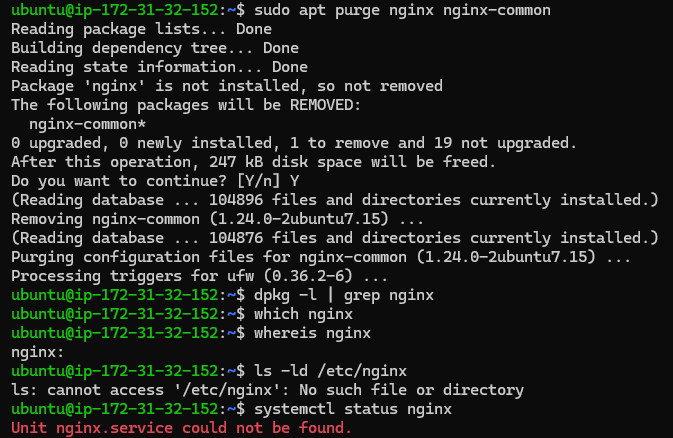
```

---

# Lab Summary

Pada LAB 8 telah dilakukan proses **clean uninstall** menggunakan `apt purge`.

Hasil praktikum menunjukkan bahwa package, binary, konfigurasi, serta systemd unit telah berhasil dihapus dari sistem. Verifikasi menggunakan `dpkg`, `which`, `whereis`, `ls`, dan `systemctl` membuktikan bahwa tidak ada lagi komponen Nginx yang tersisa.

Proses ini merupakan praktik yang umum dilakukan ketika administrator ingin menghapus software secara menyeluruh sebelum melakukan migrasi, instalasi ulang, atau proses dekomisioning server.


---

# LAB 9 — Cache & Dependency Management

## Lab Information

| Item | Value |
|------|-------|
| Lab Number | 09 |
| Lab Name | Cache & Dependency Management |
| Difficulty | Intermediate |
| Estimated Time | 15 Minutes |
| Environment | Ubuntu Server 24.04.4 LTS (AWS EC2) |
| Objective | Membersihkan dependency yang tidak digunakan serta mengelola cache APT agar sistem tetap optimal. |

---

# Background

Selama proses instalasi software, APT akan:

- mengunduh package,
- menyimpan cache package,
- menginstal dependency,
- menyimpan metadata instalasi.

Apabila tidak dikelola, cache dan dependency yang sudah tidak digunakan dapat memenuhi ruang penyimpanan server.

Karena itu administrator secara berkala melakukan proses pembersihan menggunakan utilitas bawaan APT.

---

# Learning Objectives

Setelah menyelesaikan LAB ini, Anda diharapkan mampu:

- memahami fungsi `apt autoremove`,
- memahami fungsi `apt clean`,
- memahami fungsi `apt autoclean`,
- menganalisis cache APT,
- menerapkan praktik pemeliharaan package pada server Linux.

---

# Enterprise Scenario

Setelah proses uninstall Nginx selesai, administrator ingin memastikan bahwa:

- tidak ada dependency yang tidak digunakan,
- cache package telah dibersihkan,
- server tetap dalam kondisi optimal.

Langkah ini merupakan bagian dari **Server Maintenance** pada lingkungan production.

---

# Step 1 — Remove Unused Dependencies

## Tujuan

Menghapus dependency yang tidak lagi digunakan oleh package lain.

---

## Command

```bash
sudo apt autoremove
```

---

## Penjelasan Command

| Command | Fungsi |
|---------|--------|
| `apt autoremove` | Menghapus package yang sebelumnya diinstal sebagai dependency tetapi sudah tidak lagi dibutuhkan. |

---

## Output Hasil Praktikum

```text
0 upgraded, 0 newly installed, 0 to remove and 19 not upgraded.
```

---

## Analisis

Pada server ini tidak terdapat dependency yang memenuhi syarat untuk dihapus.

Hal ini menunjukkan bahwa:

- dependency telah dikelola dengan baik,
- tidak ada package yatim (*orphan package*),
- kondisi package manager masih bersih.

---

# Step 2 — Membersihkan Seluruh Cache Package

## Tujuan

Menghapus seluruh file cache package yang telah diunduh.

---

## Command

```bash
sudo apt clean
```

---

## Verifikasi Cache

```bash
ls -lh /var/cache/apt/archives/
```

---

## Output Hasil Praktikum

```text
lock
partial/
```

---

## Analisis

Direktori cache hampir kosong.

APT hanya mempertahankan:

- file `lock`,
- direktori `partial`.

Keduanya diperlukan agar mekanisme download package tetap berjalan dengan aman.

---

# Step 3 — Membersihkan Cache Lama

## Tujuan

Menghapus cache package yang sudah tidak dapat digunakan lagi.

---

## Command

```bash
sudo apt autoclean
```

---

## Analisis

Pada praktikum ini tidak ada cache lama yang perlu dihapus.

Hal tersebut merupakan kondisi normal pada server yang baru digunakan.

---

# Step 4 — Verifikasi Ukuran Cache

## Command

```bash
sudo du -sh /var/cache/apt/archives
```

---

## Output Hasil Praktikum

```text
8.0K    /var/cache/apt/archives
```

---

## Analisis

Ukuran cache hanya sekitar **8 KB**, menunjukkan bahwa direktori cache telah berhasil dibersihkan dan hanya menyisakan struktur dasar yang dibutuhkan oleh APT.

---

# Perbedaan Autoremove, Clean, dan Autoclean

| Command | Fungsi |
|---------|--------|
| `apt autoremove` | Menghapus dependency yang tidak lagi digunakan. |
| `apt clean` | Menghapus seluruh cache package. |
| `apt autoclean` | Menghapus cache package lama yang sudah tidak dapat diunduh kembali. |

---

# Behind The Scenes

Saat menjalankan:

```bash
sudo apt clean
```

APT akan melakukan proses berikut:

```text
Administrator

        │

        ▼

APT

        │

        ▼

Membaca Direktori Cache

/var/cache/apt/archives/

        │

        ▼

Menghapus File .deb

        │

        ▼

Menyisakan

lock

partial/

        │

        ▼

Cache Bersih
```

---

# Enterprise Insight

Pada server production, administrator biasanya menjalankan proses pembersihan cache setelah:

- deployment aplikasi,
- upgrade package,
- patch management,
- maintenance bulanan.

Hal ini membantu:

- menghemat ruang disk,
- mengurangi file yang tidak diperlukan,
- menjaga performa sistem.

---

# Common Mistakes

Beberapa kesalahan yang sering dilakukan:

- Mengira `apt clean` menghapus package yang telah terinstal.
- Tidak memahami perbedaan antara `clean` dan `autoclean`.
- Menghapus cache secara manual menggunakan `rm`.
- Tidak memverifikasi hasil pembersihan cache.

---

# Screenshot

**Filename**

```text
assets/screenshots/hands-on-lab/11-autoremove-clean.png
```

Contoh penyisipan gambar:


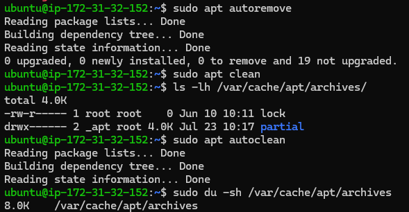
```

---

# Lab Summary

Pada LAB 9 telah dilakukan proses pemeliharaan package menggunakan `apt autoremove`, `apt clean`, dan `apt autoclean`.

Hasil praktikum menunjukkan bahwa tidak terdapat dependency yang perlu dihapus, sedangkan cache package berhasil dibersihkan sehingga ukuran direktori cache menjadi sangat kecil. Praktik ini merupakan bagian dari pemeliharaan rutin server Linux untuk menjaga penggunaan ruang penyimpanan tetap efisien dan memastikan sistem berada dalam kondisi optimal.


---

# LAB 10 — Enterprise Verification

## Lab Information

| Item | Value |
|------|-------|
| Lab Number | 10 |
| Lab Name | Enterprise Verification |
| Difficulty | Intermediate |
| Estimated Time | 20 Minutes |
| Environment | Ubuntu Server 24.04.4 LTS (AWS EC2) |
| Objective | Melakukan verifikasi akhir setelah seluruh aktivitas Package Management untuk memastikan server berada dalam kondisi sehat dan siap digunakan kembali. |

---

# Background

Dalam lingkungan enterprise, pekerjaan administrator tidak selesai setelah melakukan instalasi atau penghapusan software.

Setiap perubahan harus diakhiri dengan proses **Verification** agar dapat dipastikan bahwa:

- tidak ada package yang rusak,
- service berjalan sesuai harapan,
- repository tetap normal,
- package manager masih berfungsi,
- kondisi server tetap stabil.

Tahapan ini biasanya menjadi bagian dari proses **Post Change Validation** atau **Operational Verification**.

---

# Learning Objectives

Setelah menyelesaikan LAB ini, Anda diharapkan mampu:

- memverifikasi hasil instalasi dan penghapusan package,
- memastikan package manager tetap sehat,
- melakukan pengecekan broken package,
- memastikan repository masih dapat diakses,
- melakukan health check server setelah perubahan.

---

# Enterprise Scenario

Administrator telah menyelesaikan proses:

- update repository,
- instalasi package,
- verifikasi package,
- penghapusan package,
- pembersihan cache.

Sebelum Change Request dinyatakan selesai, seluruh perubahan harus diverifikasi untuk memastikan server tetap berada dalam kondisi stabil.

---

# Step 1 — Verifikasi Package

## Tujuan

Memastikan package Nginx telah benar-benar dihapus dari sistem.

---

## Command

```bash
apt list --installed | grep nginx
```

```bash
dpkg -l | grep nginx
```

---

## Output Hasil Praktikum

Tidak menghasilkan output.

---

## Analisis

Baik APT maupun DPKG tidak lagi menemukan package Nginx.

Hal ini membuktikan bahwa proses **purge** berhasil menghapus package dari database package Linux.

---

# Step 2 — Verifikasi Binary

## Command

```bash
which nginx
```

```bash
whereis nginx
```

---

## Output Hasil Praktikum

```text
which nginx
```

Tidak menghasilkan output.

```text
whereis nginx

nginx:
```

---

## Analisis

Binary executable telah hilang dan lokasi konfigurasi juga tidak lagi ditemukan.

Server tidak lagi memiliki komponen utama dari Nginx.

---

# Step 3 — Verifikasi Service

## Command

```bash
systemctl status nginx
```

---

## Output

```text
Unit nginx.service could not be found.
```

---

## Analisis

Unit service telah dihapus dari systemd sehingga service tidak lagi dikenali oleh sistem.

Hal ini menunjukkan bahwa proses `apt purge` berhasil membersihkan seluruh integrasi antara package dan systemd.

---

# Step 4 — Verifikasi Broken Package

## Tujuan

Memastikan tidak ada package yang rusak setelah proses uninstall.

---

## Command

```bash
sudo apt --fix-broken install
```

---

## Output Hasil Praktikum

```text
0 upgraded,
0 newly installed,
0 to remove
```

---

## Analisis

APT tidak menemukan package yang rusak (*broken package*).

Dependency sistem tetap konsisten sehingga package manager berada dalam kondisi sehat.

---

# Step 5 — Verifikasi Repository

## Tujuan

Memastikan repository Ubuntu masih dapat diakses.

---

## Command

```bash
sudo apt update
```

---

## Output Hasil Praktikum

Repository berhasil diakses dan metadata package berhasil diperbarui.

APT juga menampilkan informasi:

```text
19 packages can be upgraded.
```

---

## Analisis

Hal ini menunjukkan bahwa:

- koneksi internet normal,
- DNS bekerja dengan baik,
- repository Ubuntu dapat diakses,
- package manager masih berfungsi dengan benar.

---

# Step 6 — Health Check Server

## Tujuan

Memastikan kondisi server tetap stabil setelah seluruh perubahan dilakukan.

---

## Command

```bash
hostnamectl

df -h

free -h

uptime
```

---

## Analisis Hasil Praktikum

### Operating System

Ubuntu Server 24.04.4 LTS masih berjalan dengan baik.

---

### Kernel

Kernel AWS:

```text
6.17.0-1019-aws
```

berjalan normal.

---

### Disk Usage

```text
42%
```

Masih tersedia ruang kosong sekitar **4 GB**, sehingga tidak terdapat indikasi masalah kapasitas penyimpanan.

---

### Memory

RAM yang tersedia masih mencukupi dan tidak terdapat indikasi memory pressure.

---

### Uptime

Server telah berjalan lebih dari satu hari tanpa reboot, menunjukkan bahwa perubahan package tidak menyebabkan gangguan terhadap stabilitas sistem.

---

# Enterprise Verification Checklist

| Checklist | Status |
|-----------|--------|
| Repository berhasil diperbarui | ✅ |
| Package berhasil diinstal | ✅ |
| Package berhasil diverifikasi | ✅ |
| Binary berhasil diverifikasi | ✅ |
| Service berhasil diverifikasi | ✅ |
| Package berhasil dihapus | ✅ |
| Konfigurasi berhasil dihapus | ✅ |
| Cache berhasil dibersihkan | ✅ |
| Broken Package tidak ditemukan | ✅ |
| Repository tetap normal | ✅ |
| Server tetap stabil | ✅ |

---

# Behind The Scenes

Setelah seluruh perubahan selesai, administrator melakukan proses verifikasi sebagai berikut:

```text
Repository

        │

        ▼

Package Database

        │

        ▼

Binary

        │

        ▼

Configuration

        │

        ▼

systemd

        │

        ▼

Health Check

        │

        ▼

Server Ready
```

---

# Enterprise Insight

Pada perusahaan besar, tahapan ini merupakan bagian dari:

- Operational Validation
- Change Management
- Server Acceptance Test
- Post Deployment Verification
- Infrastructure Maintenance Checklist

Tanpa proses verifikasi ini, perubahan pada server dianggap belum selesai.

---

# Common Mistakes

Kesalahan yang sering dilakukan administrator:

- Tidak melakukan verifikasi setelah uninstall.
- Tidak memeriksa broken package.
- Tidak memastikan repository masih dapat diakses.
- Tidak melakukan health check setelah maintenance.
- Menutup tiket perubahan tanpa validasi.

---

# Screenshot

**Filename**

```text
assets/screenshots/hands-on-lab/12-enterprise-verification.png
```

Contoh penyisipan gambar:


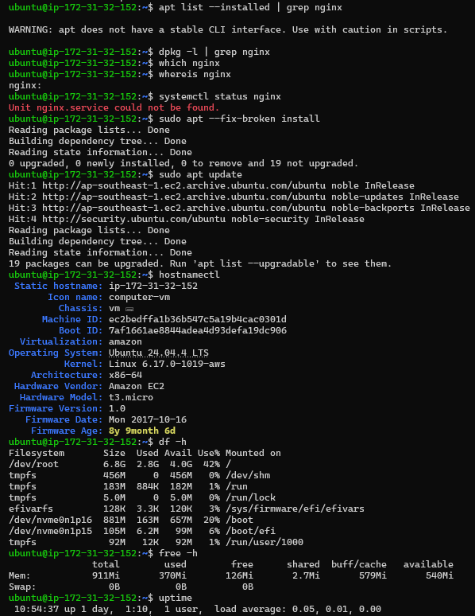
```

---

# Lab Summary

Pada LAB 10 telah dilakukan proses **Enterprise Verification** sebagai tahap akhir dari aktivitas Linux Package Management.

Seluruh hasil praktikum menunjukkan bahwa server berada dalam kondisi sehat setelah proses instalasi, penghapusan, dan pembersihan package. Repository tetap dapat diakses, package manager tidak memiliki broken package, serta sistem tetap stabil dengan penggunaan resource yang normal.

Tahapan verifikasi ini merupakan praktik standar yang dilakukan oleh Linux Administrator dan Cloud Engineer sebelum maintenance dinyatakan selesai dan server dikembalikan ke lingkungan production.

---

# Kesimpulan Hands-on Lab Hari 6

Selama Hands-on Lab Hari 6, telah dilakukan seluruh siklus pengelolaan package pada Ubuntu Server 24.04 LTS, mulai dari pembaruan repository, instalasi package, verifikasi instalasi, analisis binary dan service, penghapusan package, pembersihan dependency serta cache, hingga verifikasi akhir sistem.

Melalui praktikum ini, dipahami bahwa APT tidak hanya berfungsi sebagai alat instalasi software, tetapi juga menjadi komponen penting dalam pengelolaan software lifecycle pada sistem Linux. Hubungan antara **Repository → Package → Binary → systemd → Service → Process** menjadi dasar yang sangat penting sebelum mempelajari otomatisasi menggunakan Ansible, container menggunakan Docker, maupun deployment aplikasi pada Kubernetes.

Dokumentasi ini menjadi bukti bahwa seluruh proses Package Management telah berhasil dilakukan sesuai praktik yang umum diterapkan pada lingkungan enterprise.
